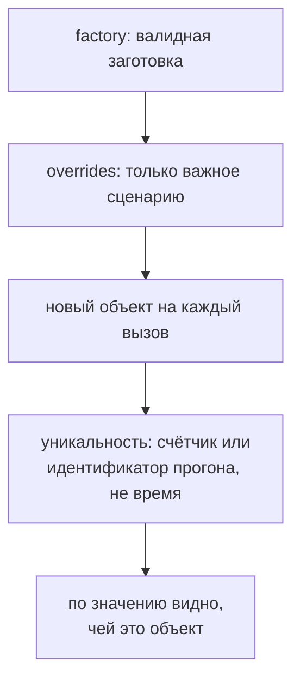

# Построители, фабрики и уникальные данные

## Связь с предыдущей главой

Глава 219 разделила категории тестовых данных. Для динамических сценарных данных повторение больших объектных литералов быстро скрывает важное отличие конкретного теста.

## Цель главы

Создавать валидные данные через Factory или Builder, сохраняя безопасные значения по умолчанию, точечные overrides, уникальность и воспроизводимость.

## Главный вопрос

> Как создавать валидные данные с минимальными изменениями для конкретного сценария?

## Мотивация

Если каждый тест собирает объект вручную, изменение обязательного поля затрагивает десятки файлов. Если значения по умолчанию случайны и скрыты, падение трудно повторить.

## Теория

### Фабрика и построитель решают одну задачу по-разному

Фабрика возвращает готовое значение из значений по умолчанию и переопределений. Построитель полезен, когда объект собирается несколькими осмысленными шагами.

Оба механизма должны создавать валидный объект по умолчанию и оставлять в тесте только важные отличия — в этом их общий смысл.

| | Factory | Builder |
| --- | --- | --- |
| форма вызова | один вызов с переопределениями | цепочка шагов и `build()` |
| когда удобнее | простая плоская модель | пошаговая сборка, варианты |
| риск | почти нет | цепочка вызовов ради самой цепочки |

Фабрика компактнее для простой формы. Построитель выразительнее для пошаговых вариантов, но лишняя цепочка вызовов может скрыть обычный объект без реальной пользы. Не каждой модели нужна отдельная фабрика или построитель.

### Каждый вызов создаёт новый объект

Фабрика хранит локальную последовательность одного сценария. Каждый вызов создаёт новый объект, затем применяет типизированные переопределения. Исходные значения по умолчанию и объект переопределений вызывающего кода не изменяются.

Последнее требование — не формальность. Фабрика, возвращающая ссылку на общий объект умолчаний, связывает все созданные значения между собой.

И здесь та же ловушка, что в главе 192: поверхностного копирования недостаточно. Проверено — при умолчаниях с вложенным массивом и фабрике на основе `{ ...defaults, ...over }` изменение массива в одном экземпляре видно во всех последующих:

```ts
const defaults = { title: "Задача", labels: ["base"] };
const make = (over = {}) => ({ ...defaults, ...over });

make().labels.push("мутация");
make().labels;   // ["base", "мутация"] — умолчание испорчено
```

Для моделей с вложенностью копировать нужно и вложенные структуры.

### `Date.now()` не даёт уникальности

Это утверждение стоит проверить, потому что интуиция говорит обратное.

Один `Date.now()` или `Math.random()` не объясняет источник значения и сам по себе не образует воспроизводимую стратегию. Но с `Date.now()` проблема ещё практичнее: его разрешение — миллисекунда, а современный процессор выполняет за это время очень много работы.

Измерено: тысяча последовательных вызовов `Date.now()` в цикле вернула **одно и то же** значение. Пять идентификаторов, построенных на нём подряд, дали **один** уникальный:

```ts
const ids = new Set();
for (let i = 0; i < 5; i++) ids.add("task-" + Date.now());
ids.size;   // 1
```

Фабрика, создающая несколько сущностей в одном тесте, получит коллизию сразу — и, если в базе есть ограничение уникальности, увидит `23505` из главы 215.

### Уникальность должна быть диагностируемой

Уникальное значение предотвращает коллизию, но должно оставаться диагностируемым.

Рабочая схема — составной идентификатор из нескольких частей:

- признак **проекта** — какой профиль запуска создал данные;
- индекс **повтора** — попытка при перезапуске;
- индекс **рабочего процесса** — какой процесс выполнял;
- локальная **последовательность** — номер вызова внутри сценария.

Зерно или явный префикс позволяет воспроизвести последовательность. В примере зерно учитывает имя проекта, индекс повтора и индекс рабочего процесса — все три доступны из сведений о тесте.

Результат вроде `task-local-r0-w2-003` одновременно уникален и объясняет своё происхождение. Строка `task-1727000000000` не даёт ни того, ни другого.

### Чего не должно быть в умолчаниях

Значения по умолчанию не должны содержать общие изменяемые идентификаторы или зависеть от порядка всего набора тестов.

Общий идентификатор в умолчаниях означает, что два теста создадут сущности, претендующие на один идентификатор, — конфликт гарантирован при параллельном запуске. Зависимость от глобального счётчика хуже: значение начинает зависеть от того, сколько тестов выполнилось раньше, и отдельный запуск одного теста даёт другие данные, чем запуск всего набора.

Локальная последовательность внутри сценария от этого свободна: она считает вызовы конкретного теста и не знает об остальных.

### Фабрика не ходит в сеть и не проверяет

Построитель и фабрика создают данные, но не отправляют запрос HTTP, не выполняют проверки и не владеют очисткой — эти побочные эффекты остаются видимыми.

Граница та же, что в главе 192, и по тем же причинам: слияние построения с отправкой делает невозможными негативные сценарии и скрывает от читателя, сколько запросов выполняет тест.

Построитель удобен для тела запроса, записей базы данных и сложных тестовых заготовок — то есть везде, где обязательных полей много, а отличается в сценарии одно-два.

Заготовка валидна, а изменения говорят о сценарии:



## Внутренний механизм

Фабрика хранит локальную последовательность одного сценария. Каждый вызов создаёт новый объект, затем применяет типизированные переопределения. Исходные значения по умолчанию и объект переопределений вызывающего кода не изменяются.

### Что создаётся заново, а что переиспользуется

```ts
const base = { title: "Задача", priority: "medium", labels: [] };

function workItem(overrides = {}) {
  return { ...base, ...overrides, labels: [...base.labels] };
}
```

Фабрика обязана вернуть значение, которым можно свободно распоряжаться. Без
последнего поля объект-результат делил бы массив `labels` со всеми остальными:
`push` в одном тесте появился бы в данных другого.

Ни исходные значения по умолчанию, ни объект переопределений при этом не
изменяются — вызывающий код вправе использовать их повторно.

### Почему время не годится как источник уникальности

```text
1000 вызовов Date.now() подряд → одно и то же значение
5 идентификаторов на его основе → 1 уникальный
```

Разрешение таймера грубее скорости выполнения кода. Поэтому «уникальный»
идентификатор на основе метки времени совпадает у записей, созданных в одном
цикле, и подготовка падает по нарушению уникальности.

| Источник | Уникален | Воспроизводим |
| --- | --- | --- |
| метка времени | нет | да |
| случайное число | практически да | нет |
| счётчик модуля | только внутри процесса | да |
| признаки прогона + счётчик | да | да |

Последняя строка — рабочая форма: идентификатор собирается из того, что
различает сталкивающиеся сущности (прогон, процесс, тест, номер), и потому
читается в отчёте как адрес данных.

## Главная ментальная модель

Фабрика — форма для валидной заготовки, а переопределения — только изменения, важные текущему сценарию.

## Практический пример

```text
examples/03-automation-qa/chapter-220/01-task-factory.execution.ts
```

Фабрика создаёт две независимые задачи с предсказуемыми идентификаторами; второй вызов меняет только `title` и `priority`.

## Automation QA

Построитель удобен для тела запроса, записей базы данных и сложных тестовых заготовок. Построитель и фабрика создают данные, но не отправляют запрос HTTP, не выполняют проверки и не владеют очисткой — эти побочные эффекты остаются видимыми.

## Компромиссы

Фабрика компактнее для простой формы. Построитель выразительнее для пошаговых вариантов, но лишняя цепочка вызовов может скрыть обычный объект без реальной пользы. Не каждой модели нужна отдельная фабрика или построитель.

## Распространённые мифы

**Миф: `Date.now()` обеспечивает уникальность.**
Его разрешение — миллисекунда. Тысяча последовательных вызовов возвращает одно значение, а пять идентификаторов подряд дают один уникальный.

**Миф: `Math.random()` — достаточная стратегия.**
Он не объясняет происхождение значения и не воспроизводится. Нужно зерно или явный составной префикс.

**Миф: `{ ...defaults }` достаточно для независимых экземпляров.**
Вложенные массивы и объекты остаются общими, и мутация в одном экземпляре портит умолчания.

**Миф: глобальный счётчик — хороший источник последовательности.**
Значение начинает зависеть от числа выполненных ранее тестов, и одиночный запуск даёт другие данные.

**Миф: фабрике удобно самой создавать сущность через API.**
Тогда построение и отправка сливаются, негативные сценарии становятся невозможны, а число запросов скрыто от читателя.

## Частые вопросы

**Что выбрать — фабрику или построитель?**
Фабрику для простой плоской модели, построитель для пошаговой сборки с вариантами. Цепочка вызовов без нужды только запутывает.

**Как сделать идентификатор одновременно уникальным и понятным?**
Составить его из признака проекта, индекса повтора, индекса рабочего процесса и локальной последовательности.

**Почему нельзя использовать глобальный счётчик?**
Он связывает данные с порядком всего набора, и отдельный запуск теста даст другие значения.

**Как защитить умолчания от мутаций?**
Копировать и вложенные структуры, а не только верхний уровень объекта.

**Нужна ли фабрика каждой модели?**
Нет. Для тела из двух полей обычный объект в тесте понятнее.

## Проверьте себя

1. Почему пять идентификаторов на `Date.now()` могут оказаться одинаковыми?
2. Из каких частей складывается диагностируемый уникальный идентификатор?
3. Что не так с поверхностной копией умолчаний?
4. Чем локальная последовательность лучше глобального счётчика?
5. Почему фабрика не должна отправлять запрос?

### Ответы

1. Разрешение таймера ограничено, и пять вызовов подряд укладываются в одну миллисекунду. Значения совпадут.
2. Понятный префикс с именем теста или сценария, метка времени и случайная часть. Первое нужно для диагностики, остальное — для уникальности.
3. Вложенные объекты остаются общими ссылками. Изменение в одном созданном объекте меняет данные всех остальных.
4. Локальная последовательность не разделяется между рабочими процессами. Глобальный счётчик в каждом процессе начинается заново и даёт совпадения.
5. Фабрика отвечает за форму данных. Смешав её с отправкой, нельзя ни собрать данные без запроса, ни понять при падении, что именно отказало.

## Распространённые ошибки

- Возвращать один изменяемый объект из фабрики — вызывающие получают общую ссылку, и правка в одном тесте меняет подготовку другого. Поверхностная копия при этом не защищает вложенные массивы.

- Скрывать сетевой запрос внутри `build()` — фабрика перестаёт быть чистой: её нельзя вызвать дважды, нельзя использовать в проверке и нельзя понять по имени, что она обращается к стенду.

- Использовать случайность без зерна или диагностического идентификатора — упавший прогон невозможно воспроизвести, потому что данные были другими и в отчёте их не видно.

- Разрешать переопределения, создающие заведомо невалидный сценарий по умолчанию — фабрика обязана давать корректную сущность; невалидные данные для негативного теста задают явно, чтобы это было видно в самом тесте.

## Краткие итоги

- Значения по умолчанию создают валидную базовую сущность.
- Переопределения показывают цель сценария.
- Фабрика возвращает новый объект при каждом вызове.
- Уникальность и воспроизводимость проектируются вместе.

## Практика

Практика встроена из соответствующего файла главы.

## Переход к следующей главе

Создание данных — только начало их области жизни. Глава 221 свяжет создание, использование и очистку.
