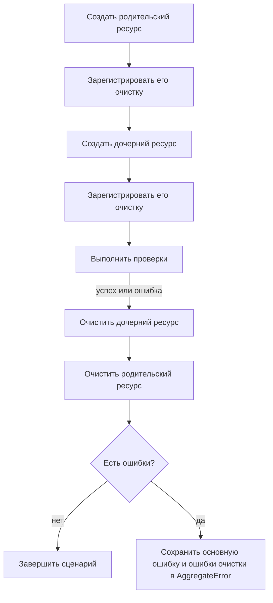

# Жизненный цикл тестовых данных

## Связь с предыдущей главой

Глава 220 дала фабрику валидных и уникальных значений. После отправки в API или базу данных эти значения становятся внешними ресурсами, которые переживают локальную переменную.

## Цель главы

Объединить владение подготовкой, регистрацию очистки, правильный порядок удаления и сохранение ошибок в безопасный жизненный цикл.

## Главный вопрос

> Как связать создание, использование и очистку данных в одну управляемую операцию?

## Мотивация

Если проверка падает до удаления, данные остаются и влияют на следующий запуск. Если ошибка очистки маскирует основную ошибку, диагностика указывает не на первопричину.

## Теория

Код, создавший ресурс, сразу регистрирует его очистку. Зависимые сущности удаляются в обратном порядке: дочерняя сущность до родительской. `finally` гарантирует попытку очистки, но сам по себе не решает, как сохранить одновременно основную ошибку и ошибки очистки.

Очистка через API и базу данных может использовать разные границы, однако удалять следует только принадлежащие сценарию данные. Безопасный для параллельного запуска жизненный цикл не опирается на «последнюю запись» или общий префикс.

## Внутренний механизм



Стек очистки выполняется в обратном порядке и продолжает работу после отдельной ошибки. Если операция или одна из функций очистки завершились ошибкой, `AggregateError` сохраняет все причины.

## Главная ментальная модель

Создание ресурса выдаёт обязательство: владелец сразу записывает, как и в каком порядке вернуть систему в исходное состояние.

## Практический пример

```text
examples/03-automation-qa/chapter-221/01-data-lifecycle.execution.ts
```

Локальный `ResourceScope` регистрирует очистку родительского и дочернего ресурсов, подтверждает обратный порядок, однократное закрытие и сохранение нескольких ошибок. Повторный `close()` безопасен и не вызывает функции очистки снова; это не означает, что любая внешняя операция удаления автоматически идемпотентна.

## Automation QA

После подготовки через API тест регистрирует очистку через API; после подготовки в базе данных — точное удаление строки или принадлежащей сценарию схемы. Очистка не должна удалять данные другого worker.

## Компромиссы

Централизованный scope упрощает ветку ошибки, но не должен скрывать владельца и способ удаления. Для одного ресурса обычный `try/finally` может быть понятнее.

## Распространённые ошибки

- Регистрировать очистку только после завершения всей подготовки.
- Удалять родительский ресурс раньше дочернего.
- Заменять основную ошибку ошибкой очистки.
- Использовать широкую очистку общего окружения.

## Краткие итоги

- Создание и очистка принадлежат одному сценарию.
- Очистка регистрируется сразу после создания.
- Зависимости удаляются в обратном порядке.
- Ошибки сценария и очистки сохраняются вместе.

## Практика

Практика встроена из соответствующего файла главы.

## Переход к следующей главе

Повторяющийся код жизненного цикла может стать вспомогательной функцией, но не всякое повторение заслуживает общей абстракции. Эту границу определит глава 222.
