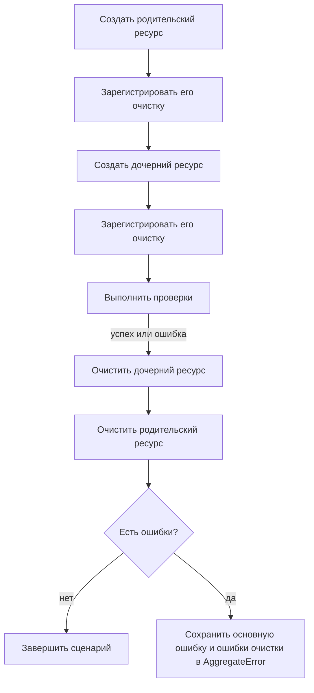

# Жизненный цикл тестовых данных

## Связь с предыдущей главой

Глава 220 дала фабрику валидных и уникальных значений. После отправки в API или базу данных эти значения становятся внешними ресурсами, которые переживают локальную переменную.

## Цель главы

Объединить владение подготовкой, регистрацию очистки, правильный порядок удаления и сохранение ошибок в безопасный жизненный цикл.

## Главный вопрос

> Как связать создание, использование и очистку данных в одну управляемую операцию?

## Мотивация

Если проверка падает до удаления, данные остаются и влияют на следующий запуск. Если ошибка очистки маскирует основную ошибку, диагностика указывает не на первопричину.

## Теория

### Создание выдаёт обязательство

Код, создавший ресурс, сразу регистрирует его очистку. Не «в конце теста», не «в общем teardown», а в той же строке, где ресурс появился.

Причина в том, что между созданием и концом сценария может произойти что угодно: падение проверки, исключение в подготовке, отмена по таймауту. Регистрация сразу превращает очистку из намерения в обязательство.



### Обратный порядок и продолжение после ошибки

Зависимые сущности удаляются в обратном порядке: дочерняя сущность до родительской. Стек очистки выполняется в обратном порядке и продолжает работу после отдельной ошибки.

Оба свойства проверяются на простом стеке из трёх зарегистрированных операций, где средняя падает:

```text
порядок очистки: внук → дочерний(ошибка) → родитель
```

Ошибка в середине не остановила остальные шаги — и это принципиально. Прерывание на первой неудаче оставило бы родительский ресурс висеть только потому, что не удалился дочерний.

Повторный `close()` при этом безопасен и не вызывает функции очистки снова. Но идемпотентность самого scope не означает, что любая внешняя операция удаления автоматически идемпотентна: за это отвечает конкретная функция очистки — как `DELETE ... WHERE id = $1` из главы 211.

### `finally` гарантирует попытку, но не диагностику

`finally` гарантирует попытку очистки, но сам по себе не решает, как сохранить одновременно основную ошибку и ошибки очистки.

Наивная запись теряет исходную причину: исключение из `finally` вытесняет ошибку сценария, и в отчёте остаётся «не удалось удалить строку» вместо настоящего падения.

Если операция или одна из функций очистки завершились ошибкой, `AggregateError` сохраняет все причины:

```ts
throw new AggregateError([scenarioError, ...cleanupErrors], "сценарий и очистка завершились ошибкой");
```

Поле `errors` содержит каждую причину отдельно, и отчёт показывает обе — а не одну вместо другой.

### Очистка удаляет только своё

Очистка через API и базу данных может использовать разные границы, однако удалять следует только принадлежащие сценарию данные.

Безопасный для параллельного запуска жизненный цикл не опирается на «последнюю запись» или общий префикс. Оба приёма ломаются одинаково: при параллельном запуске последней окажется чужая запись, а общий префикс совпадёт у нескольких тестов сразу.

Работают только точные ключи — те самые идентификаторы, которые вернула операция создания.

### Граница очистки соответствует границе подготовки

Правило простое: чем создали, тем и убираем.

| Подготовка | Очистка |
| --- | --- |
| через API | вызов удаления через API |
| прямым `INSERT` | точное удаление строки по идентификатору |
| созданием схемы | удаление принадлежащей сценарию схемы |
| через UI | обычно через API — интерфейс здесь не предмет проверки |

Последняя строка не противоречие: очистка не является проверяемым сценарием, поэтому выполнять её быстрым и устойчивым способом допустимо, даже если данные создавались иначе.

Очистка не должна удалять данные другого worker — это относится ко всем четырём строкам таблицы.

### Централизованный scope и его цена

Централизованный scope упрощает ветку ошибки: регистрация в одну строку, гарантированный порядок, собранные ошибки.

Но он не должен скрывать владельца и способ удаления. Если из кода теста не видно, что именно будет удалено и каким запросом, отладка очистки превращается в чтение инфраструктуры.

Для одного ресурса обычный `try/finally` может быть понятнее: три строки против подключения общего механизма. Scope окупается там, где ресурсов несколько и между ними есть зависимости.

### Где живёт очистка в Playwright Test

Регистрация в момент создания хорошо ложится на fixture с teardown: часть после `use()` выполняется всегда, в том числе после падения теста, и получает собственный бюджет времени — как показано в главе 173.

Это делает fixture естественным местом для ресурсов, которые нужны нескольким тестам, а `try/finally` внутри теста — для того, что создал сам сценарий.

## Внутренний механизм


Стек очистки выполняется в обратном порядке и продолжает работу после отдельной ошибки. Если операция или одна из функций очистки завершились ошибкой, `AggregateError` сохраняет все причины.

## Главная ментальная модель

Создание ресурса выдаёт обязательство: владелец сразу записывает, как и в каком порядке вернуть систему в исходное состояние.

## Практический пример

```text
examples/03-automation-qa/chapter-221/01-data-lifecycle.execution.ts
```

Локальный `ResourceScope` регистрирует очистку родительского и дочернего ресурсов, подтверждает обратный порядок, однократное закрытие и сохранение нескольких ошибок. Повторный `close()` безопасен и не вызывает функции очистки снова; это не означает, что любая внешняя операция удаления автоматически идемпотентна.

## Automation QA

После подготовки через API тест регистрирует очистку через API; после подготовки в базе данных — точное удаление строки или принадлежащей сценарию схемы. Очистка не должна удалять данные другого worker.

## Компромиссы

Централизованный scope упрощает ветку ошибки, но не должен скрывать владельца и способ удаления. Для одного ресурса обычный `try/finally` может быть понятнее.

## Распространённые мифы

**Миф: достаточно собрать всю очистку в конце теста.**
Между созданием и концом может произойти падение. Очистка регистрируется в момент создания.

**Миф: ошибка в одной функции очистки должна остановить остальные.**
Тогда родительский ресурс останется висеть из-за неудачи с дочерним. Стек продолжает работу и собирает ошибки.

**Миф: `finally` достаточно для правильной диагностики.**
Он гарантирует попытку, но исключение из него вытесняет исходную ошибку. Нужен `AggregateError`.

**Миф: удалить «последнюю созданную запись» безопасно.**
При параллельном запуске последней окажется чужая. Очистка идёт по точным ключам.

**Миф: идемпотентный scope делает идемпотентными сами удаления.**
Повторный `close()` безопасен, но за идемпотентность внешней операции отвечает конкретная функция очистки.

## Частые вопросы

**Когда регистрировать очистку?**
Сразу после создания ресурса, в той же части кода. Позже может не быть возможности.

**В каком порядке удалять?**
В обратном порядку создания: дочерние раньше родительских.

**Как не потерять исходную ошибку?**
Собрать её вместе с ошибками очистки в `AggregateError` — поле `errors` сохранит все причины.

**Можно ли убирать через API то, что создано через UI?**
Да. Очистка не является предметом проверки, и быстрый устойчивый способ здесь уместен.

**Когда нужен централизованный scope?**
Когда ресурсов несколько и между ними есть зависимости. Для одного ресурса `try/finally` понятнее.

## Проверьте себя

1. Почему очистка регистрируется в момент создания, а не в конце теста?
2. В каком порядке выполняется стек очистки и что происходит при ошибке в середине?
3. Что теряется при наивном `try/finally` и чем это исправляется?
4. Почему нельзя опираться на «последнюю запись» или общий префикс?
5. Когда обычный `try/finally` предпочтительнее общего scope?

## Распространённые ошибки

- Регистрировать очистку только после завершения всей подготовки.
- Удалять родительский ресурс раньше дочернего.
- Заменять основную ошибку ошибкой очистки.
- Использовать широкую очистку общего окружения.

## Краткие итоги

- Создание и очистка принадлежат одному сценарию.
- Очистка регистрируется сразу после создания.
- Зависимости удаляются в обратном порядке.
- Ошибки сценария и очистки сохраняются вместе.

## Практика

Практика встроена из соответствующего файла главы.

## Переход к следующей главе

Повторяющийся код жизненного цикла может стать вспомогательной функцией, но не всякое повторение заслуживает общей абстракции. Эту границу определит глава 222.
