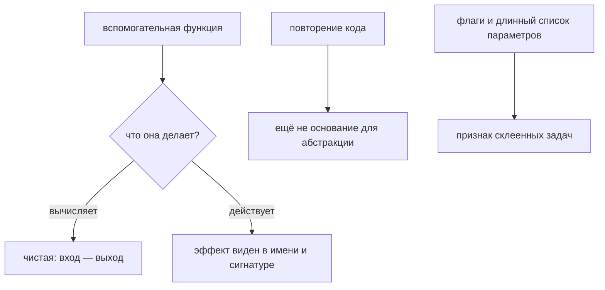

# Вспомогательные функции и границы повторного использования

## Связь с предыдущей главой

Глава 221 показала повторяемый жизненный цикл ресурсов. Общий код полезен только тогда, когда у повторения есть стабильная ответственность и понятные зависимости.

## Цель главы

Отличать предметную вспомогательную функцию от технической и проектировать узкий public API с видимыми побочными эффектами и зависимостями.

## Главный вопрос

> Какие операции действительно должны становиться общими вспомогательными функциями?

## Мотивация

Файл `helpers.ts` быстро превращается в свалку несвязанных функций. Такая общность уменьшает дублирование строк, но увеличивает неявную связанность всего проекта.

## Теория

### Два вида вспомогательных функций

Предметная вспомогательная функция выражает устойчивую операцию предметной области: например, построить параметры поиска задачи.

Техническая вспомогательная функция решает ограниченную инфраструктурную задачу: например, маскирование секрета.

| | Предметная | Техническая |
| --- | --- | --- |
| язык | задачи бизнеса | инфраструктуры |
| причина изменения | изменился контракт поиска | изменился формат вывода |
| пример | `buildTaskSearchParams()` | `maskSecret()` |

Смешивать их в одном модуле «утилит» вредно именно потому, что у них разные причины изменения: предметная функция меняется вместе с продуктом, техническая — вместе с инструментами.

Название и сигнатура должны показывать назначение. Функция `prepare()` не сообщает ничего; `buildTaskSearchParams(filter)` сообщает и что делает, и что принимает.

### Узкий открытый интерфейс и явные зависимости

Узкий открытый интерфейс принимает зависимости аргументами и не достаёт скрытый глобальный клиент.

Разница существенна для тестов. Функция, которая сама берёт клиент из модульной переменной, невозможна в двух вариантах — с разными учётными данными, против разных стендов, внутри транзакции. Функция, принимающая клиент аргументом, работает во всех этих случаях без изменений.

Вызывающий код передаёт типизированные входные данные. Вспомогательная функция выполняет одну трансформацию и возвращает наблюдаемый результат.

### Побочные эффекты должны быть видны

Сеть, база данных и файловая система не появляются неожиданно. Побочные эффекты должны быть видимы из имени или оставаться у вызывающего кода.

Это главное ограничение главы, и нарушается оно предсказуемо: функция `getTask(id)` звучит как чтение, а внутри создаёт задачу, если её нет. Тест, вызвавший её «чтобы посмотреть», оставил после себя данные — и не зарегистрировал очистку, потому что не знал о создании.

Если функция выполняет I/O, её зависимости и владение ресурсами должны оставаться явными: клиент приходит аргументом, а решение о закрытии принимает тот, кто его создал.

Предметная вспомогательная функция строит `URLSearchParams`, но не выполняет запрос. Транспортный побочный эффект и его жизненный цикл остаются у теста или клиента API.

### Повторение — ещё не основание

Повторение двух строк ещё не доказывает необходимость абстракции; важнее устойчивость причины изменения.

Полезный вопрос перед созданием функции: **изменятся ли эти места одновременно и по одной причине?**

- да — абстракция оправдана, она фиксирует одно правило;
- нет — совпадение случайно, и общая функция скоро обрастёт флагами.

Второй случай встречается чаще, чем кажется. Два теста готовят похожий объект, их объединяют, потом одному нужен другой статус — появляется параметр, потом ещё один, и через месяц функция принимает пять флагов и понятна только автору.

Локальный код предпочтительнее преждевременно общего API.

### Признаки плохой вспомогательной функции

Плохая вспомогательная функция одновременно авторизуется, создаёт данные, открывает страницу и выполняет проверку.

Каждый из этих признаков сам по себе — сигнал:

- функция делает больше одного логического шага;
- по имени нельзя предсказать, что изменится в системе;
- внутри неё есть `expect` — решение об успехе перешло из теста;
- она берёт зависимости из глобальной области;
- её нельзя вызвать дважды подряд без последствий.

Хорошие кандидаты — противоположные по свойствам: стабильная нормализация, маскирование секрета или построение предметного запроса.

### Цена абстракции

Абстракция уменьшает повторение, но добавляет переход между файлами и новый контракт.

Переход между файлами — реальная стоимость при расследовании: чтобы понять упавший тест, инженер открывает второй файл, потом третий. Новый контракт — обязательство поддерживать сигнатуру и поведение, даже когда исходная причина исчезла.

Поэтому вспомогательная функция — специализированный инструмент с одной подписанной ручкой, а не общий ящик для всего короткого кода. Модуль с именем `utils` почти всегда означает, что решение о границах отложено.

Вид помощника определяет требования к нему:



## Внутренний механизм

Вызывающий код передаёт типизированные входные данные. Вспомогательная функция выполняет одну трансформацию и возвращает наблюдаемый результат. Сеть, база данных и файловая система не появляются неожиданно. Если функция выполняет I/O, её зависимости и владение ресурсами должны оставаться явными.

### Три признака, по которым помощник остаётся помощником

```text
вход        │ явные типизированные параметры, без чтения глобального состояния
работа      │ одно преобразование, одно решение
выход       │ наблюдаемый результат, а не побочный эффект
```

Нарушение любого из трёх превращает вспомогательную функцию в скрытый сценарий:
она начинает знать про окружение, делать больше одного дела или менять
состояние, о котором вызывающий код не знает.

### Чистое преобразование против работы с ресурсом

| Свойство | Чистая функция | Функция с вводом-выводом |
| --- | --- | --- |
| зависимости | только параметры | клиент, пул, файловая система |
| можно вызвать дважды | да, результат тот же | нет, второй вызов меняет состояние |
| где живёт | обычный модуль | рядом с владельцем ресурса |
| как передаётся | импортом | параметром или фикстурой |

Смешение этих двух видов — причина, по которой помощник «внезапно ходит в сеть».
Если функция обращается наружу, её зависимости передаются явно, и по сигнатуре
видно, что она делает.

### Когда объединять, а когда нет

```text
одинаковый код, разный смысл   → не объединять: разойдутся при первой правке
разный код, одна ответственность → объединять: у изменения один повод
```

Длина функции и число строк дублирования критерием не являются. Критерий —
причина изменения: если два места будут меняться по разным поводам, общий
помощник с флагами окажется хуже повтора.

## Главная ментальная модель

Вспомогательная функция — специализированный инструмент с одной подписанной ручкой, а не общий ящик для всего короткого кода.

## Практический пример

```text
examples/03-automation-qa/chapter-222/01-helper-boundary.execution.ts
```

Предметная вспомогательная функция строит `URLSearchParams`, но не выполняет запрос. Транспортный побочный эффект и его жизненный цикл остаются у теста или клиента API.

## Automation QA

Подходящими кандидатами являются стабильная нормализация, маскирование секрета или построение предметного запроса. Плохая вспомогательная функция одновременно авторизуется, создаёт данные, открывает страницу и выполняет проверку.

## Компромиссы

Абстракция уменьшает повторение, но добавляет переход между файлами и новый контракт. Локальный код предпочтительнее преждевременно общего API.

## Распространённые мифы

**Миф: повторение двух строк требует общей функции.**
Значение имеет общая причина изменения. Случайное совпадение приводит к функции с флагами.

**Миф: вспомогательной функции удобно самой брать клиент из модуля.**
Тогда её нельзя использовать с другими учётными данными, стендом или внутри транзакции.

**Миф: скрытый побочный эффект — мелочь.**
`getTask()`, создающий задачу, оставляет данные без владельца очистки.

**Миф: проверку можно спрятать во вспомогательную функцию ради краткости теста.**
Тогда решение об успехе уходит из сценария, и падение перестаёт объяснять, что проверялось.

**Миф: модуль `utils` — нормальное место для общего кода.**
Обычно это отложенное решение о границах: в нём смешиваются предметное и техническое.

## Частые вопросы

**Как понять, что абстракция оправдана?**
Спросить, изменятся ли места вызова одновременно и по одной причине. Если нет — оставить локально.

**Где должны жить зависимости функции?**
В аргументах. Так она работает с разными клиентами и не владеет чужими ресурсами.

**Можно ли вспомогательной функции делать I/O?**
Да, если это видно из имени, зависимости явные, а владение ресурсом остаётся у вызывающего кода.

**Что делать с функцией, обросшей флагами?**
Разделить по причинам изменения: обычно внутри скрыты две разные операции.

**Чем отличаются предметные и технические функции?**
Языком и причиной изменения: одни меняются вместе с продуктом, другие — вместе с инструментами.

## Проверьте себя

1. Чем предметная вспомогательная функция отличается от технической?
2. Почему зависимости передаются аргументами, а не берутся из модуля?
3. Чем опасен скрытый побочный эффект в функции с «читающим» именем?
4. Какой вопрос помогает решить, нужна ли абстракция?
5. Назовите пять признаков плохой вспомогательной функции.

### Ответы

1. Предметная выражает шаг сценария на языке задачи. Техническая решает вспомогательную задачу — формат, преобразование, ожидание — и о предметной области ничего не знает.
2. Иначе функцию нельзя использовать с другим подключением, клиентом или окружением, и её невозможно проверить отдельно.
3. Вызывающий код не ожидает изменения состояния и не учитывает его при разборе падения. Ошибка обнаруживается далеко от места, где состояние изменили.
4. «Что изменится, если этого слоя не будет?» Если ответ — только меньше строк в двух местах, абстракция не нужна.
5. Логические параметры, имя с союзом «и», зависимость от глобального состояния, спрятанные проверки и необходимость открыть её, чтобы понять вызывающий код.

## Распространённые ошибки

- Создавать `CommonUtils` без предметной границы — такой модуль растёт без предела, его нельзя описать одним предложением, и в него начинают складывать всё подряд.

- Скрывать клиент или окружение в глобальном состоянии модуля — состояние оказывается общим для всех тестов процесса, а порядок запуска начинает влиять на результат. Зависимости передают явно, через фикстуры.

- Выполнять проверки внутри вспомогательной функции подготовки данных — падение приходит из шага, который назывался подготовкой, и отчёт указывает не на проверяемое поведение.

- Объединять функции только потому, что они короткие — общая функция с флагами читается хуже двух отдельных. Основание для объединения — общая ответственность, а не длина.

## Краткие итоги

- Вспомогательная функция имеет одну устойчивую ответственность.
- Предметные и технические функции называют по назначению.
- Зависимости и побочные эффекты остаются видимыми.
- Общий API появляется из стабильного повторения.

## Практика

Практика встроена из соответствующего файла главы.

## Переход к следующей главе

Вспомогательные функции могут подготовить данные для проверки. Глава 223 покажет, когда сама проверка требует пользовательского сопоставителя или `expect.soft()`.
