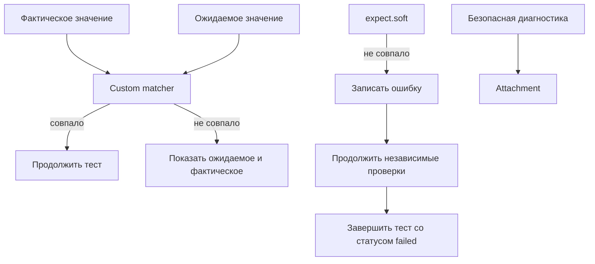

# Пользовательские проверки и soft assertions

## Связь с предыдущей главой

Глава 222 ограничила общие вспомогательные функции узкими обязанностями. Повторяющаяся проверка становится отдельной абстракцией только тогда, когда выражает устойчивое предметное правило и улучшает диагностику.

## Цель главы

Проектировать custom matcher и предметную проверку, применять `expect.soft()` осознанно и сохранять ожидаемое, фактическое, диагностическое сообщение и полезное attachment.

## Главный вопрос

> Когда базовых проверок недостаточно и как сохранить полезную диагностику?

## Мотивация

Десятки низкоуровневых `expect` скрывают смысл проверки и при падении не показывают целостное расхождение. Но слишком общий matcher превращает любую ошибку в одинаковое сообщение.

## Теория

### Когда нужен собственный matcher

Custom matcher оправдан повторяемым предметным правилом. Он принимает фактическое и ожидаемое значения, возвращает точный `pass` и формирует сообщение, полезное без чтения реализации.

Слово «повторяемым» здесь ключевое. Если правило встречается один раз, несколько обычных `expect` понятнее: они не требуют ни расширения API, ни перехода в другой файл при расследовании.

Предметная проверка может быть обычной функцией, если расширение `expect` не даёт дополнительной ясности. Выигрыш matcher — в отчёте, а не в коде теста.

### Форма `.not` требует отдельной формулировки

Это то место, которое чаще всего делают неправильно. Для `.not` требуется отдельная обратная формулировка: положительное сообщение не объясняет, почему запрещённое совпадение стало ошибкой.

Разница видна на реальном выводе одного и того же matcher:

```text
обычная форма: ожидалась задача t-1 в статусе DONE, получено t-1 в статусе NEW
форма .not   : задача t-1 не должна была совпасть со статусом NEW
```

Без отдельной ветки вторая строка сообщила бы «ожидалась задача t-1 в статусе NEW, получено t-1 в статусе NEW» — утверждение, которое выглядит как ошибка самого инструмента.

Внутри matcher направление проверки доступно через контекст: положительное и отрицательное сообщения формируются раздельно, а `pass` остаётся одинаковым.



### Что должно быть в сообщении

Сообщение обязано отвечать на три вопроса, не заставляя открывать код matcher: что ожидалось, что получено и по какому правилу сравнивалось.

Проверка — измерительный прибор: она должна назвать ожидаемое, фактическое и правило сравнения, не изменяя проверяемую систему. Последнее тоже существенно: matcher, который по пути дочитывает состояние или обновляет данные, превращает измерение в вмешательство.

### Мягкие проверки решают другую задачу

`expect.soft()` регистрирует расхождение и позволяет выполнить следующие проверки. Итоговый статус теста всё равно будет `failed`.

Custom matcher улучшает повторяемое правило сравнения, а мягкая проверка управляет продолжением выполнения: это разные задачи, и путать их не стоит. Matcher отвечает на вопрос «как сравнивать», soft — «продолжать ли после расхождения».

Режим полезен для независимых полей одного снимка данных: если в ответе разошлись три поля, разумнее увидеть все три сразу, чем чинить их по одному запуску.

### Где мягкая проверка опасна

Мягкий режим опасен, если следующая операция зависит от уже нарушенного условия.

`expect.soft()` накапливает ошибку, но не исправляет состояние и не делает дальнейшие действия безопасными. Типичный сбой выглядит так:

```ts
expect.soft(response.status()).toBe(201);   // пришёл 500
const body = await response.json();          // падение при разборе тела
```

Вторая строка выполнится и упадёт с невнятным сообщением о JSON. Настоящая причина — 500 — окажется в отчёте рядом, но внимание уйдёт на разбор.

Правило: мягкая проверка уместна там, где падение не делает следующие шаги бессмысленными. Проверки, от которых зависит продолжение, остаются обычными.

### Вложения и их границы

Attachment сохраняет диагностические данные, но не должен содержать секрет или персональную информацию.

Прикладывать к результату можно снимок сравниваемых данных, канонические модели обеих сторон, ответ сервиса — всё, что сокращает расследование. Вложение получает имя и тип содержимого и попадает в отчёт рядом с падением.

Ограничение то же, что в главе 217: отчёт живёт дольше кода и доступен шире. Токен, заменённый на `[REDACTED]`, остаётся полезным для понимания конфигурации и безопасным для хранения.

### Где остаётся решение об успехе

Предметная проверка полезна для статуса заказа, модели задачи или согласованности нескольких полей.

Page Object и API Client не должны решать, прошёл ли тест: ожидаемое значение остаётся в сценарии. Это то же правило, что для обёртки gRPC и репозитория, — инструмент сообщает факты, тест утверждает, что они означают.

Custom matcher делает отчёт предметным, но требует поддержки API. Несколько обычных `expect` лучше, если правило встречается один раз или поля имеют разные причины отказа.

## Внутренний механизм


Обычная проверка останавливает текущий поток теста при ошибке. `expect.soft()` накапливает ошибку, но не исправляет состояние и не делает дальнейшие действия безопасными. Custom matcher улучшает повторяемое правило сравнения, а мягкая проверка управляет продолжением выполнения: это разные задачи.

## Главная ментальная модель

Проверка — измерительный прибор: она должна назвать ожидаемое, фактическое и правило сравнения, не изменяя проверяемую систему.

## Практический пример

```text
examples/03-automation-qa/chapter-223/01-domain-assertion.execution.ts
```

Пример добавляет matcher для краткой модели задачи, проверяет положительную и обратную диагностику, выполняет независимую мягкую проверку и прикладывает безопасный JSON к результату теста.

## Automation QA

Предметная проверка полезна для статуса заказа, модели задачи или согласованности нескольких полей. Page Object и API Client не должны решать, прошёл ли тест: ожидаемое значение остаётся в сценарии.

## Компромиссы

Custom matcher делает отчёт предметным, но требует поддержки API. Несколько обычных `expect` лучше, если правило встречается один раз или поля имеют разные причины отказа.

## Распространённые мифы

**Миф: одного сообщения хватит и для `.not`.**
Тогда отрицательная форма сообщит «ожидалось X, получено X» — как ошибка инструмента. Нужна отдельная формулировка.

**Миф: `expect.soft` делает тест мягче.**
Итоговый статус всё равно `failed`. Он управляет только продолжением выполнения.

**Миф: мягкие проверки можно использовать везде.**
Если следующий шаг зависит от нарушенного условия, он упадёт с невнятным сообщением и уведёт внимание от причины.

**Миф: custom matcher нужен любой предметной проверке.**
Для правила, встречающегося один раз, несколько обычных `expect` понятнее.

**Миф: во вложение можно класть всё, что помогает расследованию.**
Отчёт живёт дольше кода. Секреты и персональные данные туда не попадают.

## Частые вопросы

**Когда писать свой matcher?**
Когда предметное правило повторяется и стандартное сообщение не объясняет нарушение.

**Что должно быть в сообщении?**
Ожидаемое, фактическое и правило сравнения — без необходимости открывать реализацию.

**Где уместна мягкая проверка?**
Для независимых полей одного снимка данных, когда расхождения не мешают друг другу.

**Почему matcher не должен читать состояние?**
Проверка — измерительный прибор. Дочитывание данных превращает измерение во вмешательство.

**Может ли Page Object решать, прошёл ли тест?**
Нет. Он сообщает факты, ожидаемое значение остаётся в сценарии.

## Проверьте себя

1. Почему `.not` требует отдельного сообщения и как выглядит ошибка без него?
2. Какие три вещи обязано называть сообщение проверки?
3. Чем задача custom matcher отличается от задачи `expect.soft`?
4. В каком случае мягкая проверка уводит расследование в сторону?
5. Что нельзя прикладывать к результату теста и почему?

## Распространённые ошибки

- Использовать `expect.soft()` перед зависимым действием.
- Возвращать непонятное `values differ` без ожидаемого и фактического значений.
- Скрывать запрос или изменение данных внутри matcher.
- Прикладывать token в attachment.

## Краткие итоги

- Custom matcher выражает повторяемое предметное правило.
- Диагностическое сообщение объясняет ожидаемое и фактическое значения.
- Ошибки `expect.soft()` не отменяются и приводят к падению теста.
- Attachments содержат только безопасную диагностику.

## Практика

Практика встроена из соответствующего файла главы.

## Переход к следующей главе

Предметная проверка сравнивает значения одной формы. Глава 224 сначала приведёт представления UI, API, gRPC и PostgreSQL к канонической модели.
