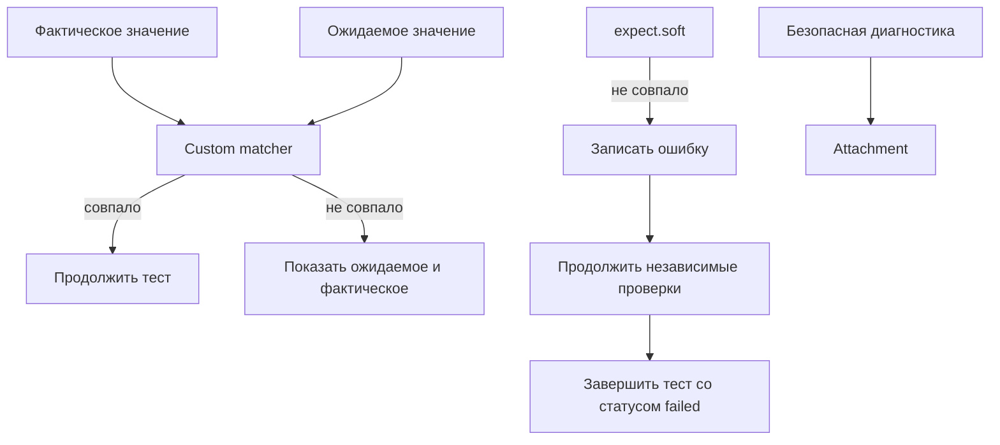

# Пользовательские проверки и soft assertions

## Связь с предыдущей главой

Глава 222 ограничила общие вспомогательные функции узкими обязанностями. Повторяющаяся проверка становится отдельной абстракцией только тогда, когда выражает устойчивое предметное правило и улучшает диагностику.

## Цель главы

Проектировать custom matcher и предметную проверку, применять `expect.soft()` осознанно и сохранять ожидаемое, фактическое, диагностическое сообщение и полезное attachment.

## Главный вопрос

> Когда базовых проверок недостаточно и как сохранить полезную диагностику?

## Мотивация

Десятки низкоуровневых `expect` скрывают смысл проверки и при падении не показывают целостное расхождение. Но слишком общий matcher превращает любую ошибку в одинаковое сообщение.

## Теория

Custom matcher оправдан повторяемым предметным правилом. Он принимает фактическое и ожидаемое значения, возвращает точный `pass` и формирует сообщение, полезное без чтения реализации. Для `.not` требуется отдельная обратная формулировка: положительное сообщение не объясняет, почему запрещённое совпадение стало ошибкой. Предметная проверка может быть обычной функцией, если расширение `expect` не даёт дополнительной ясности.

`expect.soft()` регистрирует расхождение и позволяет выполнить следующие проверки. Итоговый статус теста всё равно будет `failed`. Такой режим полезен для независимых полей одного снимка данных, но опасен, если следующая операция зависит от уже нарушенного условия.

Attachment сохраняет диагностические данные, но не должен содержать секрет или персональную информацию.

## Внутренний механизм



Обычная проверка останавливает текущий поток теста при ошибке. `expect.soft()` накапливает ошибку, но не исправляет состояние и не делает дальнейшие действия безопасными. Custom matcher улучшает повторяемое правило сравнения, а мягкая проверка управляет продолжением выполнения: это разные задачи.

## Главная ментальная модель

Проверка — измерительный прибор: она должна назвать ожидаемое, фактическое и правило сравнения, не изменяя проверяемую систему.

## Практический пример

```text
examples/03-automation-qa/chapter-223/01-domain-assertion.execution.ts
```

Пример добавляет matcher для краткой модели задачи, проверяет положительную и обратную диагностику, выполняет независимую мягкую проверку и прикладывает безопасный JSON к результату теста.

## Automation QA

Предметная проверка полезна для статуса заказа, модели задачи или согласованности нескольких полей. Page Object и API Client не должны решать, прошёл ли тест: ожидаемое значение остаётся в сценарии.

## Компромиссы

Custom matcher делает отчёт предметным, но требует поддержки API. Несколько обычных `expect` лучше, если правило встречается один раз или поля имеют разные причины отказа.

## Распространённые ошибки

- Использовать `expect.soft()` перед зависимым действием.
- Возвращать непонятное `values differ` без ожидаемого и фактического значений.
- Скрывать запрос или изменение данных внутри matcher.
- Прикладывать token в attachment.

## Краткие итоги

- Custom matcher выражает повторяемое предметное правило.
- Диагностическое сообщение объясняет ожидаемое и фактическое значения.
- Ошибки `expect.soft()` не отменяются и приводят к падению теста.
- Attachments содержат только безопасную диагностику.

## Практика

Практика встроена из соответствующего файла главы.

## Переход к следующей главе

Предметная проверка сравнивает значения одной формы. Глава 224 сначала приведёт представления UI, API, gRPC и PostgreSQL к канонической модели.
