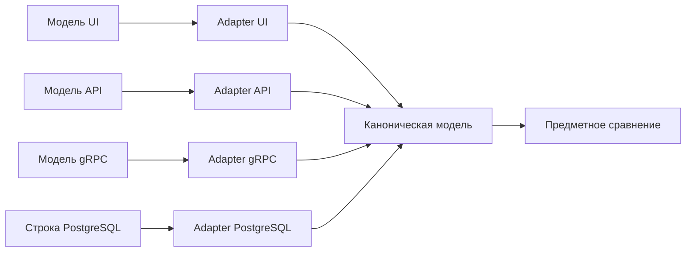

# Нормализация и проверки между слоями

## Связь с предыдущей главой

Глава 223 построила диагностируемые предметные проверки. Перед такой проверкой представления разных слоёв нужно привести к общей форме сравнения.

## Цель главы

Создать каноническую модель и явные преобразования для UI, API, gRPC и базы данных, нормализуя даты, числа и необязательные значения без потери владельца полей.

## Главный вопрос

> Как сравнивать одну бизнес-сущность, представленную разными моделями UI, API, gRPC и базы данных?

## Мотивация

PostgreSQL может вернуть `numeric` строкой, API — числом, UI — форматированным текстом, а gRPC — другой формой времени. Прямое сравнение либо падает на представлении, либо маскирует важное различие чрезмерным преобразованием.

## Теория

Каноническая модель содержит только бизнес-поля, которыми владеет сравниваемый контракт. Отдельный adapter каждого источника сначала выполняет runtime validation внешних данных, затем явное преобразование и нормализацию.

Даты приводятся к согласованной UTC-форме, числа проверяются через `Number.isFinite`, а отсутствующее значение, `null` и пустая строка не смешиваются без правила предметной области. Status или enum переводится явно для каждого источника. Порядок элементов нормализуется только тогда, когда он не является частью контракта.

## Внутренний механизм



Каноническая модель не становится новым транспортным DTO или универсальной моделью приложения. Она существует для конкретного сравнения между слоями.

## Главная ментальная модель

Каждый слой говорит на своём диалекте; adapters переводят их в один ограниченный язык сравнения.

## Практический пример

```text
examples/03-automation-qa/chapter-224/01-cross-layer-normalization.execution.ts
```

Число API и строка PostgreSQL `numeric`, строка времени и `Date`, а также разные коды статуса преобразуются в одну проверенную каноническую модель. Отсутствующий owner, `owner: null` и пустая строка сохраняются как разные маркированные состояния.

## Automation QA

Проверка между слоями полезна для подтверждения одной бизнес-сущности после действия. Она не должна сравнивать все колонки, заголовки и значения protobuf по умолчанию одновременно: каждый слой сохраняет собственный контракт.

## Компромиссы

Каноническая модель уменьшает ложные расхождения, но может скрыть дефект, если нормализация слишком агрессивна. Каждое преобразование должно иметь бизнес-основание.

## Распространённые ошибки

- Сравнивать исходную строку базы данных с ответом API.
- Преобразовывать некорректное число в `NaN` и продолжать проверку.
- Считать отсутствующее значение и `null` одинаковыми без контракта.
- Включать технические поля всех слоёв в одну чрезмерно широкую модель.

## Краткие итоги

- Каждый слой имеет собственное представление.
- Runtime validation предшествует преобразованию.
- Каноническая модель содержит выбранные бизнес-поля.
- Нормализация должна быть явной и обоснованной.

## Практика

Практика встроена из соответствующего файла главы.

## Переход к следующей главе

Раздел конфигурации, тестовых данных и общей инфраструктуры завершён. Глава 225 начнёт отдельный раздел о расследовании падения автотеста; здесь этот процесс только обозначен как следующий шаг.
