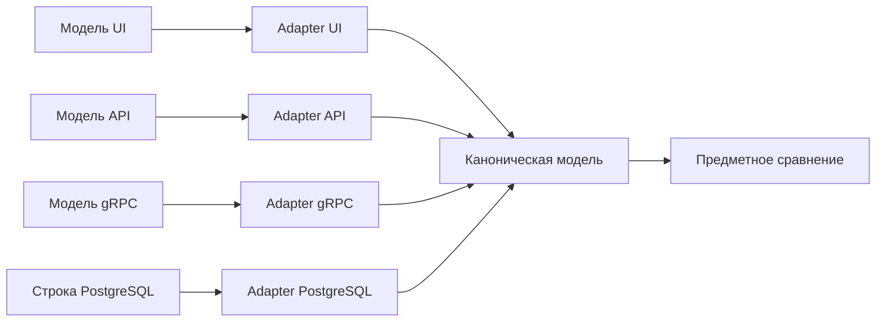

# Нормализация и проверки между слоями

## Связь с предыдущей главой

Глава 223 построила диагностируемые предметные проверки. Перед такой проверкой представления разных слоёв нужно привести к общей форме сравнения.

## Цель главы

Создать каноническую модель и явные преобразования для UI, API, gRPC и базы данных, нормализуя даты, числа и необязательные значения без потери владельца полей.

## Главный вопрос

> Как сравнивать одну бизнес-сущность, представленную разными моделями UI, API, gRPC и базы данных?

## Мотивация

PostgreSQL может вернуть `numeric` строкой, API — числом, UI — форматированным текстом, а gRPC — другой формой времени. Прямое сравнение либо падает на представлении, либо маскирует важное различие чрезмерным преобразованием.

## Теория

### Каноническая модель и адаптеры

Каноническая модель содержит только бизнес-поля, которыми владеет сравниваемый контракт.

Отдельный адаптер каждого источника сначала выполняет проверку внешних данных во время выполнения, затем явное преобразование и нормализацию. Порядок важен: проверять нужно то, что пришло, а не то, что получилось после преобразования, — иначе неверное значение молча превратится в правдоподобное.


```mermaid
flowchart LR
    U[Модель UI] --> UA[Adapter UI]
    A[Модель API] --> AA[Adapter API]
    G[Модель gRPC] --> GA[Adapter gRPC]
    D[Строка PostgreSQL] --> DA[Adapter PostgreSQL]
    UA --> C[Каноническая модель]
    AA --> C
    GA --> C
    DA --> C
    C --> X[Предметное сравнение]
```

Каноническая модель не становится новым транспортным объектом или универсальной моделью приложения. Она существует для конкретного сравнения между слоями — и живёт ровно столько, сколько это сравнение нужно.

### Числа: `Number.isFinite` вместо `isFinite`

Числа проверяются через `Number.isFinite`, и выбор именно этой функции не случаен.

Глобальный `isFinite` сначала приводит аргумент к числу, поэтому `isFinite("2.5")` истинно. `Number.isFinite("2.5")` — ложно, потому что строка числом не является. Для проверки внешних данных нужна вторая: она отвечает на вопрос «это уже число?», а не «это можно попытаться превратить в число?».

Вторая ловушка опаснее. Приведение пустых значений даёт правдоподобный результат:

```ts
Number("");           // 0
Number(null);         // 0
Number(undefined);    // NaN
```

Пустая строка и `null` молча становятся нулём, и `Number.isFinite` после такого преобразования вернёт `true`. Поле «сумма не указана» превратится в «сумма равна нулю» — и сравнение слоёв это подтвердит.

Отсюда правило: сначала проверить, что значение вообще есть и имеет ожидаемый вид, и только потом преобразовывать.

### Отсутствие, `null` и пустая строка — три разных состояния

Отсутствующее значение, `null` и пустая строка не смешиваются без правила предметной области.

Это три разных факта: поля нет в ответе, поле есть и явно пусто, поле есть и содержит пустую строку. В JavaScript они различимы:

```ts
"owner" in row;        // есть ли поле вообще
row.owner === null;    // явное отсутствие значения
row.owner === "";      // пустое значение
```

Слои выражают отсутствие по-разному: в базе это `NULL`, в JSON поля может не быть, в protobuf — значение по умолчанию. Адаптер обязан перевести все эти формы в **одно** канонически маркированное состояние, а не считать их одинаковыми по умолчанию.

### Даты: приведение к UTC

Даты приводятся к согласованной UTC-форме.

Две текстовые записи одного момента выглядят по-разному и сравниваются как разные строки, но после нормализации совпадают:

```ts
new Date("2026-09-22T10:00:00Z").toISOString();       // 2026-09-22T10:00:00.000Z
new Date("2026-09-22T13:00:00+03:00").toISOString();  // 2026-09-22T10:00:00.000Z
```

Проверять корректность даты нужно до преобразования: `new Date("не дата")` даёт `Invalid Date`, а `getTime()` — `NaN`. Без проверки такое значение пройдёт дальше и сломает сравнение уже в непонятном месте.

### Статусы и порядок элементов

Статус или перечисление переводится явно для каждого источника. Совпадение написания — не повод считать значения одинаковыми: API может отдавать `"in_progress"`, gRPC — `IN_PROGRESS`, база — код `2`. Таблица соответствия пишется явно, по одной на источник.

Порядок элементов нормализуется только тогда, когда он не является частью контракта. Если порядок обещан — сортировать нельзя, иначе тест перестанет замечать его нарушение. Если не обещан — сравнение упорядоченных списков даст ложные расхождения.

### Нормализация не должна прятать дефекты

Каноническая модель уменьшает ложные расхождения, но может скрыть дефект, если нормализация слишком агрессивна.

Каждое преобразование должно иметь бизнес-основание. Приведение регистра, обрезка пробелов, округление чисел — всё это способно скрыть настоящее расхождение между слоями. Округление до двух знаков спрячет ошибку в третьем; `trim()` спрячет лишний пробел, который увидит пользователь.

Полезная проверка: если преобразование нельзя объяснить правилом предметной области, оно, скорее всего, маскирует дефект.

### Границы межслойной проверки

Проверка между слоями полезна для подтверждения одной бизнес-сущности после действия.

Она не должна сравнивать все колонки, заголовки и значения protobuf по умолчанию одновременно: каждый слой сохраняет собственный контракт. Поле, существующее только в базе, не является нарушением контракта API; значение по умолчанию protobuf не означает, что сервис его отправил.

Сравнивать имеет смысл только то, что обещано **обоими** контрактами, — и только там, где сохранение данных действительно является предметом сценария.

## Внутренний механизм


```mermaid
flowchart LR
    U[Модель UI] --> UA[Adapter UI]
    A[Модель API] --> AA[Adapter API]
    G[Модель gRPC] --> GA[Adapter gRPC]
    D[Строка PostgreSQL] --> DA[Adapter PostgreSQL]
    UA --> C[Каноническая модель]
    AA --> C
    GA --> C
    DA --> C
    C --> X[Предметное сравнение]
```

Каноническая модель не становится новым транспортным объектом или универсальной моделью приложения. Она существует для конкретного сравнения между слоями.

### Адаптер на каждый слой, модель одна

```text
UI     → adapter → ┐
REST   → adapter → ├→ каноническая модель → сравнение
gRPC   → adapter → │
база   → adapter → ┘
```

Адаптеров столько, сколько слоёв: каждый знает особенности своего транспорта и
больше ничего. Сравнение же выполняется один раз и в одном виде — иначе правила
приведения расползаются по тестам и расходятся между собой.

### Что входит в каноническую модель

| Входит | Не входит |
| --- | --- |
| поля, о которых утверждает тест | служебные признаки транспорта |
| приведённые типы (число, момент времени) | версии, идентификаторы запросов |
| явное решение про `null` и отсутствие | поля «на будущее» |

Правый столбец — граница, за которой модель перестаёт быть инструментом
сравнения и становится второй моделью приложения. Такая модель меняется от
любой правки любого слоя и требует сопровождения сама по себе.

### Ошибка нормализации — это тоже результат

```text
NormalizationError: слой "database", поле "total": ожидалось число, получено ""
```

Нормализация не подставляет значения по умолчанию: пустая строка, превращённая
в ноль, проходит сравнение и скрывает расхождение. Она сообщает **слой и поле** —
этого достаточно, чтобы понять, какой адаптер и какой контракт разошлись.

## Главная ментальная модель

Каждый слой говорит на своём диалекте; адаптеры переводят их в один ограниченный язык сравнения.

## Практический пример

```text
examples/03-automation-qa/chapter-224/01-cross-layer-normalization.execution.ts
```

Число из API и строка PostgreSQL `numeric`, строка времени и `Date`, а также разные коды статуса преобразуются в одну проверенную каноническую модель. Отсутствующий владелец, `owner: null` и пустая строка сохраняются как разные маркированные состояния.

## Automation QA

Проверка между слоями полезна для подтверждения одной бизнес-сущности после действия. Она не должна сравнивать все колонки, заголовки и значения protobuf по умолчанию одновременно: каждый слой сохраняет собственный контракт.

## Компромиссы

Каноническая модель уменьшает ложные расхождения, но может скрыть дефект, если нормализация слишком агрессивна. Каждое преобразование должно иметь бизнес-основание.

## Распространённые мифы

**Миф: `isFinite` и `Number.isFinite` взаимозаменяемы.**
Глобальный `isFinite` приводит аргумент к числу, поэтому `isFinite("2.5")` истинно. Для внешних данных нужен `Number.isFinite`.

**Миф: приведение к числу безопасно, если потом проверить результат.**
`Number("")` и `Number(null)` дают 0, и проверка его примет. Проверять нужно исходное значение.

**Миф: отсутствие поля и `null` — одно и то же.**
Это три разных состояния вместе с пустой строкой. Правило их объединения задаёт предметная область.

**Миф: одинаково выглядящие статусы можно сравнивать напрямую.**
`in_progress`, `IN_PROGRESS` и код `2` требуют явной таблицы соответствия для каждого источника.

**Миф: чем агрессивнее нормализация, тем меньше ложных падений.**
Округление и обрезка пробелов прячут настоящие расхождения. Каждое преобразование нуждается в обосновании.

## Частые вопросы

**Почему проверять надо до преобразования?**
Иначе неверное значение молча станет правдоподобным: пустая строка превратится в ноль.

**Как сравнивать даты из разных слоёв?**
Приводить к UTC через `toISOString`, предварительно убедившись, что дата корректна.

**Нужно ли сортировать списки перед сравнением?**
Только если порядок не является частью контракта. Иначе сортировка скроет его нарушение.

**Можно ли переиспользовать каноническую модель как транспортный объект приложения?**
Нет. Она существует для конкретного сравнения и не должна превращаться в общую модель.

**Что делать с полем, которое есть только в базе?**
Не включать в сравнение: каждый слой сохраняет собственный контракт.

## Проверьте себя

1. Чем `Number.isFinite` отличается от глобального `isFinite` и почему это важно?
2. Во что превращаются `""` и `null` при приведении к числу?
3. Какие три состояния нужно различать и как они выражены в разных слоях?
4. Почему дату проверяют до нормализации?
5. Когда сортировка перед сравнением недопустима?

### Ответы

1. `Number.isFinite` не приводит аргумент к числу и потому возвращает `false` для строк. Глобальный вариант сначала приводит, и `'10'` проходит как число.
2. Оба превращаются в `0`. Поэтому проверять на число нужно до приведения, а не после.
3. Значение есть, значение отсутствует и значение не задано. В базе это `null`, в JSON — отсутствие поля или `null`, в protobuf — значение по умолчанию или признак присутствия.
4. После нормализации неверная дата превращается в `Invalid Date` или в строку, и причина расхождения теряется. Проверка до нормализации указывает на сам источник.
5. Когда порядок является частью контракта: сортировка скроет дефект в нём.

## Распространённые ошибки

- Сравнивать исходную строку базы данных с ответом API — драйвер отдаёт `numeric` и `bigint` строками, а `timestamptz` объектом `Date`. Сравнение без нормализации падает на верных данных.

- Преобразовывать некорректное число в `NaN` и продолжать проверку — `NaN` не равен ничему, включая себя, поэтому сообщение об ошибке говорит о несовпадении вместо «значение не число». Отдельно: `Number("")` и `Number(null)` дают ноль.

- Считать отсутствующее значение и `null` одинаковыми без контракта — API может не прислать поле, а база вернёт ключ со значением `null`. Правило сведения этих состояний фиксируют явно.

- Включать технические поля всех слоёв в одну чрезмерно широкую модель — общая модель начинает зависеть от внутренних деталей каждого слоя и меняется при любой их правке. Нормализуют только то, что сравнивается.

## Краткие итоги

- Каждый слой имеет собственное представление.
- Проверка во время выполнения предшествует преобразованию.
- Каноническая модель содержит выбранные бизнес-поля.
- Нормализация должна быть явной и обоснованной.

## Практика

Практика встроена из соответствующего файла главы.

## Переход к следующей главе

Раздел конфигурации, тестовых данных и общей инфраструктуры завершён. Глава 225 начнёт отдельный раздел о расследовании падения автотеста; здесь этот процесс только обозначен как следующий шаг.
