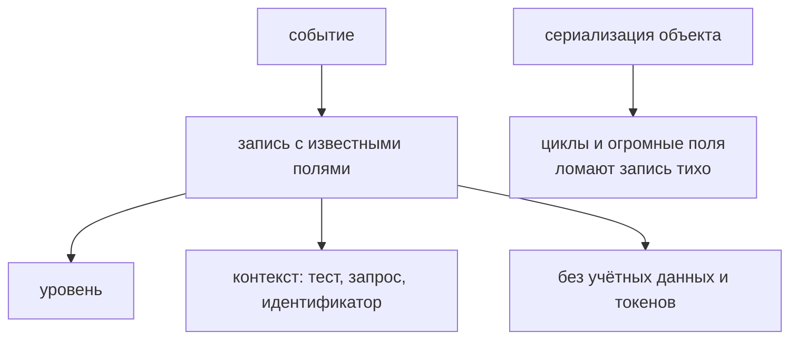

# Структурированное логирование

## Связь с предыдущей главой

Глава 225 определила доказательства как основу расследования. Журналы полезны только тогда, когда сохраняют значимые события в сопоставимой структуре.

## Цель главы

Проектировать безопасные события журнала с уровнями, идентификатором сценария, структурированными полями и явной границей logger.

## Главный вопрос

> Какие события нужно логировать, чтобы восстановить ход теста без информационного шума?

## Мотивация

Строки `request sent` и `something failed` не связывают событие со сценарием и не позволяют фильтровать данные. Полная запись запроса может раскрыть секрет, но не объяснить проблему.

## Теория

### Событие — это запись с известными полями

Событие журнала содержит стабильное имя, level, идентификатор сценария, нормализованный timestamp и ограниченный набор полей.

Структурированная запись похожа на строку таблицы расследования: каждое поле имеет известный смысл и может быть найдено без разбора произвольного текста. Свободный текст `"Создал задачу 42 за 120 мс"` читается человеком и не поддаётся фильтрации; та же информация в полях `event`, `taskId`, `durationMs` — поддаётся.

Timestamp определяет порядок, а идентификатор сценария связывает события без разбора свободного текста. Именно идентификатор делает журнал пригодным при параллельном запуске: без него записи разных worker перемешаны и неразделимы.

### Уровни и их смысл

| Level | Когда использовать |
| --- | --- |
| `debug` | помогает локальному расследованию |
| `info` | фиксирует значимые этапы |
| `warn` | отклонение, после которого работа может продолжиться |
| `error` | произошедшая ошибка |

Граница между `warn` и `error` практическая: если сценарий продолжается — это `warn`; если нет — `error`. Журнал, где всё записано как `info`, не даёт фильтровать, а где всё `error` — обесценивает сам уровень.

### Что можно записывать о запросах

Metadata запроса и ответа обычно ограничиваются method, безопасным path, status, duration и размером.

Token, cookie, password, connection string и storage state маскируются до передачи logger — именно до, а не внутри него. Маскирование на входе означает, что чувствительное значение не попадёт в журнал даже при ошибке в самом logger.

Отдельного внимания требуют составные ключи: `headers.authorization`, `config.db.password`, `auth.storageState`. Маскирование по точному имени поля их пропустит.

### Сериализация ломается тише, чем кажется

Диагностическая сериализация ограничивает размер, преобразует `BigInt` и обрабатывает циклические объекты, не изменяя исходные данные.

Часть проблем шумная — они бросают исключение:

```text
JSON.stringify({ size: 10n })   → TypeError: Do not know how to serialize a BigInt
JSON.stringify(циклический)     → TypeError: Converting circular structure to JSON
```

Но опаснее тихие. Проверено: `JSON.stringify(new Error("упало"))` возвращает `{}` — ошибка исчезает полностью. `Map` и `Set` тоже превращаются в `{}`, а поля со значением `undefined` пропадают.

То есть logger, который просто сериализует переданный объект, может записать пустые фигурные скобки вместо ошибки — и это обнаружится только при расследовании, когда журнал уже нужен.

Собственные поля ошибки доступны, если запросить их явно: `JSON.stringify(error, Object.getOwnPropertyNames(error))` сохранит `message` и `stack`.

### Обработка выброшенного значения

Значение, выброшенное через `throw`, сначала проверяется как `unknown`: для `Error` сохраняются stack и `cause`, а для другого значения создаётся явное безопасное описание.

Причина та же, что в главе 101: выбросить в JavaScript можно что угодно — строку, число, объект. Обращение к `error.message` без проверки даст `undefined` в журнале именно там, где нужна причина.

Глубина цепочки `cause` ограничивается, чтобы цикл не привёл к бесконечному обходу. Цепочка вида «сценарий не выполнен → не удалось прочитать задачу → соединение отклонено» полезна, но ничто не мешает двум ошибкам ссылаться друг на друга — и тогда обход без счётчика не завершится.

### Logger записывает, но не решает

Logger записывает событие, но не принимает бизнес-решения и не проглатывает исходную ошибку.

Типичное нарушение выглядит так: функция ловит исключение, аккуратно пишет `error`-событие и возвращает `null`. Журнал в порядке, а тест проходит, потому что вызывающий код не узнал об ошибке.

Правильная форма — записать и пробросить дальше. Решение о том, считается ли это падением, принимает сценарий.

### Что записывать и сколько

Полезные события: начало setup, создание сущности, завершение запроса, регистрация очистки и итог проверки. Большие тела ответов прикладываются отдельно и только после фильтрации.

Слишком мало событий оставляет пробелы, слишком много создаёт шум и расходует место хранения. Политика должна исходить из вопросов расследования, а не из желания записать всё.

Полезный критерий: если по журналу нельзя восстановить последовательность «что тест сделал и что получил», событий мало; если для этого приходится пролистывать сотни строк — много.

Временные отладочные записи удаляются после расследования, а постоянный журнал framework следует стабильной схеме: поля не переименовываются между запусками, иначе фильтры и сопоставление с прошлыми прогонами перестают работать.

Запись журнала — строка таблицы, а не свободный текст:



## Внутренний механизм

Сначала вызывающий код формирует разрешённый контекст. Затем маскирование заменяет чувствительные значения, после чего logger сериализует событие. Идентификатор сценария связывает записи одного запуска между действиями UI, API и database.

## Главная ментальная модель

Структурированная запись журнала похожа на строку таблицы расследования: каждое поле имеет известный смысл и может быть найдено без разбора произвольного текста.

## Практический пример

```text
examples/03-automation-qa/chapter-226/01-structured-logging.diagnostics.ts
```

Пример создаёт событие API с детерминированным timestamp, маскирует составные чувствительные ключи и безопасно сериализует циклические и слишком большие данные.

## Automation QA

Полезные события: начало setup, создание сущности, завершение запроса, регистрация очистки и итог проверки. Большие тела ответов прикладываются отдельно и только после фильтрации.

## Компромиссы

Слишком мало событий оставляет пробелы, слишком много создаёт шум и расходует место хранения. Политика должна исходить из вопросов расследования, а не из желания записать всё.

## Распространённые мифы

**Миф: `JSON.stringify(error)` сохранит ошибку в журнал.**
Он вернёт `{}` — ошибка исчезнет молча. Нужны собственные поля через `Object.getOwnPropertyNames`.

**Миф: сериализация упадёт, если что-то пойдёт не так.**
`BigInt` и циклы действительно бросают исключение, а `Map`, `Set` и `undefined` теряются тихо.

**Миф: маскировать можно внутри logger.**
Маскирование выполняется до передачи значения, чтобы секрет не попал в журнал даже при ошибке самого logger.

**Миф: записать ошибку — значит обработать её.**
Logger не принимает решений. Проглоченное исключение делает тест зелёным при сломанном сценарии.

**Миф: чем больше записей, тем лучше расследование.**
Шум расходует хранилище и прячет полезное. Политика исходит из вопросов расследования.

## Частые вопросы

**Зачем идентификатор сценария в каждом событии?**
При параллельном запуске записи разных worker перемешаны, и без него их нельзя разделить.

**Как отличить `warn` от `error`?**
По тому, продолжается ли работа: продолжается — `warn`, нет — `error`.

**Что делать с выброшенной строкой вместо `Error`?**
Проверить значение как `unknown` и сформировать явное безопасное описание, а не читать `message`.

**Почему цепочку `cause` нужно ограничивать?**
Две ошибки могут ссылаться друг на друга, и обход без счётчика не завершится.

**Какие поля безопасны для записи о запросе?**
Method, безопасный path, status, duration, размер. Заголовки авторизации и тела — после маскирования и фильтрации.

## Проверьте себя

1. Что вернёт `JSON.stringify` для объекта `Error` и почему это опасно?
2. Какие структуры теряются при сериализации тихо, а какие бросают исключение?
3. Почему маскирование выполняется до вызова logger?
4. Почему logger не должен проглатывать исходную ошибку?
5. Зачем ограничивать глубину цепочки `cause`?

## Распространённые ошибки

- Записывать весь запрос вместе с authorization.
- Использовать разные имена одного события.
- Подменять исключение записью `error` и продолжать тест.
- Глобально перехватывать console без последующего восстановления.

## Краткие итоги

- Событие журнала имеет level, имя, идентификатор сценария и поля.
- Metadata предпочтительнее бесконтрольной записи payload.
- Маскирование выполняется до записи.
- Logger не владеет бизнес-решениями и ошибками.

## Практика

Практика встроена из соответствующего файла главы.

## Переход к следующей главе

Журналы восстанавливают события, но не показывают изменение UI во времени. Глава 227 сравнит screenshot, video и Playwright Trace.
