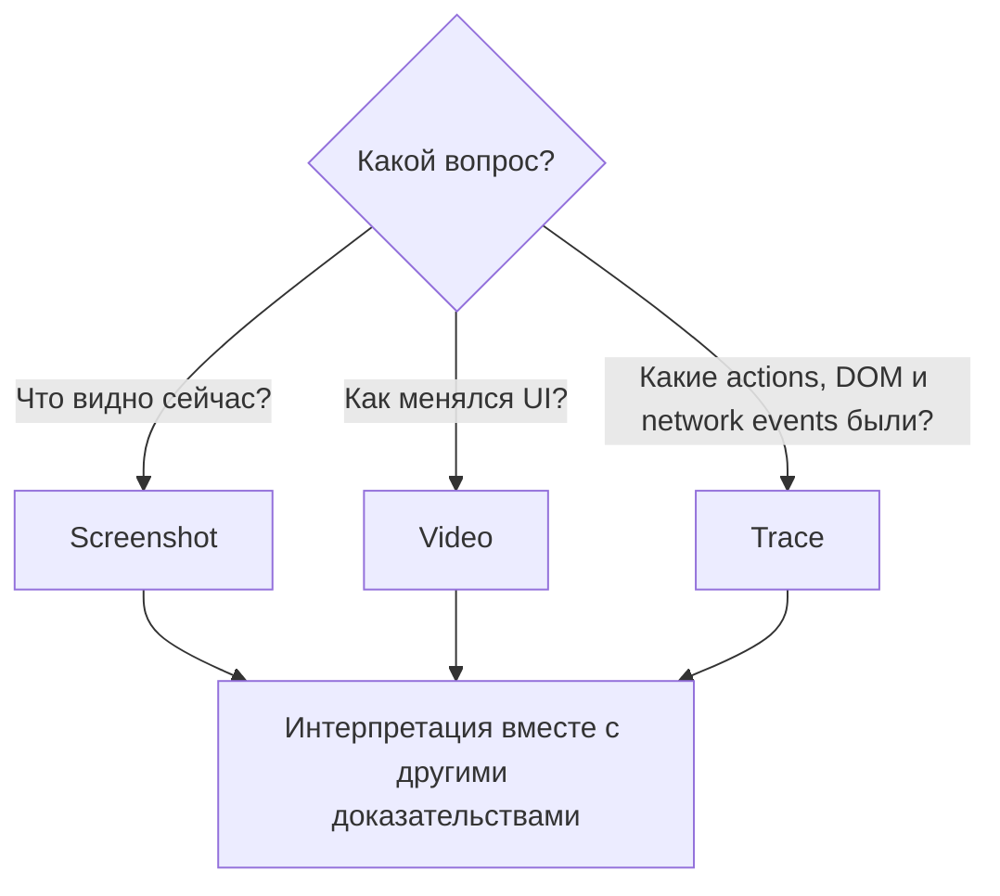

# Screenshots, videos и Playwright Trace

## Связь с предыдущей главой

Структурированные журналы описывают события. Для падения UI-теста часто нужны визуальное состояние, последовательность действий, DOM snapshot и network timeline.

## Цель главы

Выбирать screenshot, video или trace по диагностическому вопросу и сохранять доказательства по ограниченной политике.

## Главный вопрос

> Какой вид evidence отвечает на какой вопрос при UI-падении?

## Мотивация

Screenshot показывает один момент, но не объясняет, как страница к нему пришла. Video показывает последовательность кадров, но не раскрывает DOM и подробности сетевых событий. Trace объединяет больше сигналов, но всё равно требует интерпретации.

## Теория

### Три камеры, три вопроса

Screenshot отвечает на вопрос о видимом UI в конкретный момент. Video помогает увидеть последовательность пользовательских изменений. Playwright Trace связывает действия, assertions, DOM snapshots, console и network timeline в пределах записанного запуска.



Каждая камера видит только часть запуска. Trace — самая полная из трёх, потому что содержит и снимки DOM, и сетевые события, и журнал действий; screenshot — самая дешёвая и самая узкая.

### Что артефакты не показывают

Запись trace создаёт артефакт, а Trace Viewer читает его. Ни запись, ни просмотр автоматически не определяют первопричину.

Границы стоит знать точно:

| Артефакт | Чего в нём нет |
| --- | --- |
| screenshot | всего, что не отрисовано на экране |
| video | полных тел запроса и ответа |
| trace | внутреннего состояния внешнего сервиса, если оно не попало в записанные события |

Состояние backend нельзя доказать изображением страницы. Пустой список на скриншоте одинаково выглядит при ошибке сервиса, пустой выдаче, сломанном фильтре и не дождавшемся рендере. Артефакт сужает поиск, но проверку гипотезы из главы 225 не заменяет.

### Артефакты живут внутри жизненного цикла контекста

Screenshot, video и trace создаются внутри жизненного цикла browser context; после теста context должен закрыться, чтобы video и trace были завершены корректно.

Это практическое следствие правила владения ресурсами: незакрытый контекст оставляет незавершённый файл видео, который может не открыться. Для тестов, использующих встроенную `page`, контекст закрывает раннер; для созданного вручную — тот, кто его создал.

### Политика сбора и её эффект

Политика `only-on-failure` или `retain-on-failure` ограничивает объём хранения.

Эффект проверяется прямо: при такой политике успешные тесты не оставляют файлов вовсе, а упавший тест получает каталог со своим именем и полным набором доказательств:

```text
demo-падение-порождает-артефакты/test-failed-1.png
demo-падение-порождает-артефакты/video.webm
demo-падение-порождает-артефакты/trace.zip
demo-падение-порождает-артефакты/error-context.md
```

Именно поэтому общая политика обычно сохраняет полные артефакты только при падении: зелёный прогон из сотен тестов не занимает места, а каждое падение приходит с доказательствами.

Постоянная запись оправдана для узкой диагностики — когда расследуется конкретный нестабильный тест и нужно сравнить успешный запуск с неуспешным.

### Где хранятся и кому принадлежат

Созданные артефакты принадлежат результату теста и хранятся в выделенном для модуля `outputDir`; их не нужно коммитить.

Каталог каждого теста именуется по самому тесту, поэтому артефакты не смешиваются между сценариями и не требуют ручного именования. При повторном запуске каталог теста очищается — это ещё одна причина не хранить там ничего ценного вручную.

### Безопасность диагностики

Диагностические данные не должны содержать tokens, персональные данные или содержимое production.

Здесь риск выше, чем в журналах: скриншот и видео записывают **всё, что отрисовано**, включая поля формы, заполненные учётными данными, и персональные данные на экране. Trace дополнительно содержит сетевые события — то есть заголовки и тела.

Отсюда два правила. Тесты работают с синтетическими данными на контролируемом стенде. А артефакты, снятые против окружения с настоящими данными, обращаются как с чувствительными: ограниченный доступ и ограниченный срок хранения.

### Цена хранения

Trace и video повышают стоимость хранения. Их размер несопоставим со скриншотом, а в CI они умножаются на число упавших тестов и на число повторов.

Разумный порядок выбора: сначала скриншот и структурированный журнал, затем trace для сложных UI-сценариев, видео — когда важна именно последовательность изменений. Включать всё сразу и навсегда — самый дорогой и наименее осмысленный вариант.

## Внутренний механизм


Политика `only-on-failure` или `retain-on-failure` ограничивает объём хранения. Созданные артефакты принадлежат результату теста и хранятся в выделенном для модуля `outputDir`; их не нужно коммитить.

## Главная ментальная модель

Screenshot, video и trace — разные камеры наблюдения. Каждая видит только часть запуска и не заменяет причинный анализ.

## Практический пример

```text
examples/03-automation-qa/chapter-227/01-ui-evidence.diagnostics.ts
```

Успешный пример прикладывает ограниченный screenshot локальной страницы, созданной через `page.setContent()`. Отдельное контролируемое падение создаёт screenshot, video и trace с ожидаемым exit code `1`.

## Automation QA

Диагностические данные не должны содержать tokens, персональные данные или содержимое production. В примере тест использует синтетические данные и локальную страницу.

## Компромиссы

Trace и video повышают стоимость хранения. Постоянная запись оправдана для узкой диагностики, а общая политика обычно сохраняет полные артефакты только при падении.

## Распространённые мифы

**Миф: trace показывает первопричину.**
Он показывает действия, DOM и сетевые события. Причина подтверждается проверкой гипотезы.

**Миф: скриншот доказывает состояние backend.**
Пустой список одинаково выглядит при ошибке сервиса, пустой выдаче и не дождавшемся рендере.

**Миф: видео содержит запросы и ответы.**
Оно записывает только изображение. Тела запросов есть в trace, и то не всегда.

**Миф: артефакты можно собирать всегда — место дешёвое.**
Trace и video умножаются на число падений и повторов. Общая политика сохраняет их при падении.

**Миф: артефакты безопаснее журналов.**
Они записывают всё, что на экране, включая заполненные поля и персональные данные.

## Частые вопросы

**Что выбрать для расследования UI-падения?**
Сначала скриншот и журнал, затем trace. Видео — когда важна последовательность изменений.

**Почему видео не открывается?**
Частая причина — незакрытый browser context: файл остался незавершённым.

**Остаются ли артефакты у успешных тестов?**
При политике `only-on-failure` и `retain-on-failure` — нет, файлы не сохраняются.

**Нужно ли коммитить артефакты?**
Нет. Это результаты запуска, они принадлежат `outputDir` и очищаются при повторе.

**Когда включать запись постоянно?**
Для узкой диагностики конкретного нестабильного теста, чтобы сравнить успешный запуск с неуспешным.

## Проверьте себя

1. На какие три разных вопроса отвечают screenshot, video и trace?
2. Чего нет в каждом из трёх артефактов?
3. Почему незакрытый контекст ломает видео?
4. Что появится в каталоге упавшего теста при политике `only-on-failure`?
5. Почему артефакты требуют не меньшей осторожности, чем журналы?

## Распространённые ошибки

- Считать screenshot доказательством backend состояния.
- Утверждать, что trace автоматически нашёл причину.
- Записывать video каждого успешного теста без политики хранения.
- Коммитить созданные traces.

## Краткие итоги

- Screenshot фиксирует видимый момент.
- Video показывает визуальную последовательность.
- Trace объединяет actions, snapshots и timeline.
- Доказательства требуют интерпретации и безопасной политики хранения.

## Практика

Практика встроена из соответствующего файла главы.

## Переход к следующей главе

Артефакты UI дополняются предметными данными. Глава 228 покажет attachments и их lifecycle.
