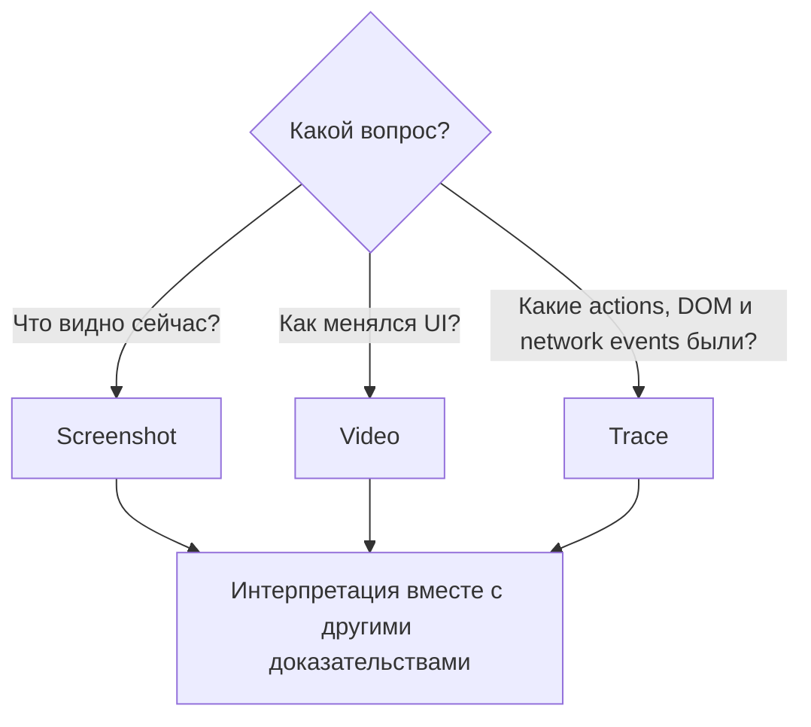

# Screenshots, videos и Playwright Trace

## Связь с предыдущей главой

Структурированные журналы описывают события. Для падения UI-теста часто нужны визуальное состояние, последовательность действий, DOM snapshot и network timeline.

## Цель главы

Выбирать screenshot, video или trace по диагностическому вопросу и сохранять доказательства по ограниченной политике.

## Главный вопрос

> Какой вид evidence отвечает на какой вопрос при UI-падении?

## Мотивация

Screenshot показывает один момент, но не объясняет, как страница к нему пришла. Video показывает последовательность кадров, но не раскрывает DOM и подробности сетевых событий. Trace объединяет больше сигналов, но всё равно требует интерпретации.

## Теория

Screenshot отвечает на вопрос о видимом UI в конкретный момент. Video помогает увидеть последовательность пользовательских изменений. Playwright Trace связывает действия, assertions, DOM snapshots, console и network timeline в пределах записанного запуска.

Запись trace создаёт артефакт, а Trace Viewer читает его. Ни запись, ни просмотр автоматически не определяют первопричину. Trace не показывает внутреннее состояние внешнего сервиса, если оно не представлено в записанных событиях browser или network; video не содержит полные тела запроса и ответа. Состояние backend нельзя доказать изображением страницы. Screenshot, video и trace создаются внутри жизненного цикла browser context; после теста context должен закрыться, чтобы video и trace были завершены корректно.

## Внутренний механизм



Политика `only-on-failure` или `retain-on-failure` ограничивает объём хранения. Созданные артефакты принадлежат результату теста и хранятся в выделенном для модуля `outputDir`; их не нужно коммитить.

## Главная ментальная модель

Screenshot, video и trace — разные камеры наблюдения. Каждая видит только часть запуска и не заменяет причинный анализ.

## Практический пример

```text
examples/03-automation-qa/chapter-227/01-ui-evidence.diagnostics.ts
```

Успешный пример прикладывает ограниченный screenshot локальной страницы, созданной через `page.setContent()`. Отдельное контролируемое падение создаёт screenshot, video и trace с ожидаемым exit code `1`.

## Automation QA

Диагностические данные не должны содержать tokens, персональные данные или содержимое production. В примере тест использует синтетические данные и локальную страницу.

## Компромиссы

Trace и video повышают стоимость хранения. Постоянная запись оправдана для узкой диагностики, а общая политика обычно сохраняет полные артефакты только при падении.

## Распространённые ошибки

- Считать screenshot доказательством backend состояния.
- Утверждать, что trace автоматически нашёл причину.
- Записывать video каждого успешного теста без политики хранения.
- Коммитить созданные traces.

## Краткие итоги

- Screenshot фиксирует видимый момент.
- Video показывает визуальную последовательность.
- Trace объединяет actions, snapshots и timeline.
- Доказательства требуют интерпретации и безопасной политики хранения.

## Практика

Практика встроена из соответствующего файла главы.

## Переход к следующей главе

Артефакты UI дополняются предметными данными. Глава 228 покажет attachments и их lifecycle.
