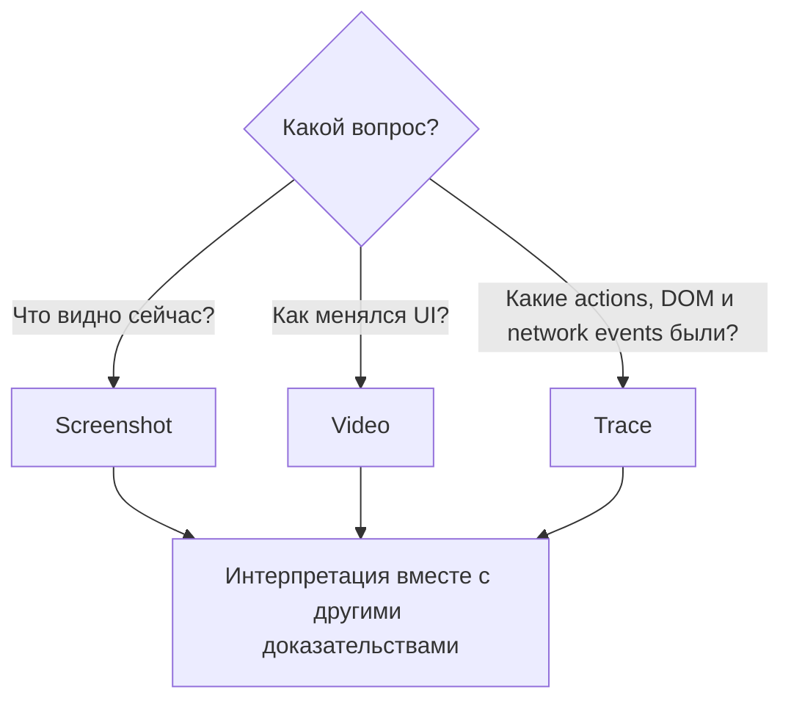

# Снимки экрана, видеозаписи и трассировка Playwright

## Связь с предыдущей главой

Структурированные журналы описывают события. Для падения UI-теста часто нужны визуальное состояние, последовательность действий, DOM snapshot и network timeline.

## Цель главы

Выбирать screenshot, video или trace по диагностическому вопросу и сохранять доказательства по ограниченной политике.

## Главный вопрос

> Какой вид свидетельства отвечает на какой вопрос при падении в интерфейсе?

## Мотивация

Screenshot показывает один момент, но не объясняет, как страница к нему пришла. Video показывает последовательность кадров, но не раскрывает DOM и подробности сетевых событий. Trace объединяет больше сигналов, но всё равно требует интерпретации.

## Теория

### Три камеры, три вопроса

Снимок экрана отвечает на вопрос о видимом интерфейсе в конкретный момент. Видеозапись помогает увидеть последовательность пользовательских изменений. Трассировка Playwright связывает действия, проверки, снимки DOM, вывод консоли и сетевую шкалу времени в пределах записанного запуска.


```mermaid
flowchart TD
    Q{Какой вопрос?}
    Q -->|Что видно сейчас?| S[Screenshot]
    Q -->|Как менялся UI?| V[Video]
    Q -->|Какие actions, DOM и network events были?| T[Trace]
    S --> I[Интерпретация вместе с другими доказательствами]
    V --> I
    T --> I
```

Каждая камера видит только часть запуска. Трассировка — самая полная из трёх, потому что содержит и снимки DOM, и сетевые события, и журнал действий; снимок экрана — самый дешёвый и самый узкий.

### Что артефакты не показывают

Запись трассировки создаёт артефакт, а программа просмотра его читает. Ни запись, ни просмотр автоматически не определяют первопричину.

Границы стоит знать точно:

| Артефакт | Чего в нём нет |
| --- | --- |
| снимок экрана | всего, что не отрисовано на экране |
| видеозапись | полных тел запроса и ответа |
| трассировка | внутреннего состояния внешнего сервиса, если оно не попало в записанные события |

Состояние серверной части нельзя доказать изображением страницы. Пустой список на снимке экрана одинаково выглядит при ошибке сервиса, пустой выдаче, сломанном фильтре и не дождавшейся отрисовке. Артефакт сужает поиск, но проверку гипотезы из главы 225 не заменяет.

### Артефакты живут внутри жизненного цикла контекста

Снимок экрана, видеозапись и трассировка создаются внутри жизненного цикла браузерного контекста; после теста контекст должен закрыться, чтобы видеозапись и трассировка были завершены корректно.

Это практическое следствие правила владения ресурсами: незакрытый контекст оставляет незавершённый файл видео, который может не открыться. Для тестов, использующих встроенную `page`, контекст закрывает раннер; для созданного вручную — тот, кто его создал.

### Политика сбора и её эффект

Политика `only-on-failure` или `retain-on-failure` ограничивает объём хранения.

Эффект проверяется прямо: при такой политике успешные тесты не оставляют файлов вовсе, а упавший тест получает каталог со своим именем и полным набором доказательств:

```text
demo-падение-порождает-артефакты/test-failed-1.png
demo-падение-порождает-артефакты/video.webm
demo-падение-порождает-артефакты/trace.zip
demo-падение-порождает-артефакты/error-context.md
```

Именно поэтому общая политика обычно сохраняет полные артефакты только при падении: зелёный прогон из сотен тестов не занимает места, а каждое падение приходит с доказательствами.

Постоянная запись оправдана для узкой диагностики — когда расследуется конкретный нестабильный тест и нужно сравнить успешный запуск с неуспешным.

### Где хранятся и кому принадлежат

Созданные артефакты принадлежат результату теста и хранятся в выделенном для модуля `outputDir`; их не нужно коммитить.

Каталог каждого теста именуется по самому тесту, поэтому артефакты не смешиваются между сценариями и не требуют ручного именования. При повторном запуске каталог теста очищается — это ещё одна причина не хранить там ничего ценного вручную.

### Безопасность диагностики

Диагностические данные не должны содержать токены, персональные данные или содержимое промышленной среды.

Здесь риск выше, чем в журналах: снимок экрана и видеозапись записывают **всё, что отрисовано**, включая поля формы, заполненные учётными данными, и персональные данные на экране. Трассировка дополнительно содержит сетевые события — то есть заголовки и тела.

Отсюда два правила. Тесты работают с синтетическими данными на контролируемом стенде. А артефакты, снятые против окружения с настоящими данными, обращаются как с чувствительными: ограниченный доступ и ограниченный срок хранения.

### Цена хранения

Трассировка и видеозапись повышают стоимость хранения. Их размер несопоставим со снимком экрана, а в CI они умножаются на число упавших тестов и на число повторов.

Разумный порядок выбора: сначала снимок экрана и структурированный журнал, затем трассировка для сложных сценариев интерфейса, видеозапись — когда важна именно последовательность изменений. Включать всё сразу и навсегда — самый дорогой и наименее осмысленный вариант.

## Внутренний механизм


```mermaid
flowchart TD
    Q{Какой вопрос?}
    Q -->|Что видно сейчас?| S[Screenshot]
    Q -->|Как менялся UI?| V[Video]
    Q -->|Какие actions, DOM и network events были?| T[Trace]
    S --> I[Интерпретация вместе с другими доказательствами]
    V --> I
    T --> I
```

Политика `only-on-failure` или `retain-on-failure` ограничивает объём хранения. Созданные артефакты принадлежат результату теста и хранятся в выделенном для модуля `outputDir`; их не нужно коммитить.

### Что остаётся после прогона

```text
успешный тест при only-on-failure / retain-on-failure
   → файлов нет вовсе

упавший тест
   → каталог по имени теста:
       test-failed-1.png    снимок в момент падения
       video.webm           запись всего теста
       trace.zip            действия, DOM, сетевые события
       error-context.md     описание состояния страницы
```

Настройка хранения решает не «делать или не делать», а «оставлять или удалять»:
запись ведётся всё равно, и на времени прогона это сказывается. Зато артефакты
успешных тестов не заполняют хранилище CI.

### На какой вопрос отвечает каждое доказательство

| Доказательство | Вопрос | Чего не покажет |
| --- | --- | --- |
| снимок | что было видно в этот момент | как к этому пришли |
| видео | как менялся интерфейс | что уходило в сеть |
| трассировка | действия, DOM, запросы, снимки по шагам | состояние базы |

Ни одно из них не видит серверную сторону. Поэтому к ним добавляют ответ API или
строку таблицы — иначе расследование останавливается на границе браузера.

Трассировка не называет причину: она сокращает путь к ней, показывая
последовательность. Вывод по-прежнему делает человек.

## Главная ментальная модель

Снимок экрана, видеозапись и трассировка — разные камеры наблюдения. Каждая видит только часть запуска и не заменяет причинный анализ.

## Практический пример

```text
examples/03-automation-qa/chapter-227/01-ui-evidence.diagnostics.ts
```

Успешный пример прикладывает ограниченный снимок локальной страницы, созданной через `page.setContent()`. Отдельное контролируемое падение создаёт снимок экрана, видеозапись и трассировку с ожидаемым кодом выхода `1`.

## Automation QA

Диагностические данные не должны содержать токены, персональные данные или содержимое промышленной среды. В примере тест использует синтетические данные и локальную страницу.

## Компромиссы

Трассировка и видеозапись повышают стоимость хранения. Постоянная запись оправдана для узкой диагностики, а общая политика обычно сохраняет полные артефакты только при падении.

## Распространённые мифы

**Миф: трассировка показывает первопричину.**
Он показывает действия, DOM и сетевые события. Причина подтверждается проверкой гипотезы.

**Миф: снимок экрана доказывает состояние серверной части.**
Пустой список одинаково выглядит при ошибке сервиса, пустой выдаче и не дождавшемся рендере.

**Миф: видео содержит запросы и ответы.**
Она записывает только изображение. Тела запросов есть в трассировке, и то не всегда.

**Миф: артефакты можно собирать всегда — место дешёвое.**
Трассировка и видеозапись умножаются на число падений и повторов. Общая политика сохраняет их при падении.

**Миф: артефакты безопаснее журналов.**
Они записывают всё, что на экране, включая заполненные поля и персональные данные.

## Частые вопросы

**Что выбрать для расследования UI-падения?**
Сначала снимок экрана и журнал, затем трассировка. Видеозапись — когда важна последовательность изменений.

**Почему видео не открывается?**
Частая причина — незакрытый браузерный контекст: файл остался незавершённым.

**Остаются ли артефакты у успешных тестов?**
При политике `only-on-failure` и `retain-on-failure` — нет, файлы не сохраняются.

**Нужно ли коммитить артефакты?**
Нет. Это результаты запуска, они принадлежат `outputDir` и очищаются при повторе.

**Когда включать запись постоянно?**
Для узкой диагностики конкретного нестабильного теста, чтобы сравнить успешный запуск с неуспешным.

## Проверьте себя

1. На какие три разных вопроса отвечают снимок экрана, видеозапись и трассировка?
2. Чего нет в каждом из трёх артефактов?
3. Почему незакрытый контекст ломает видео?
4. Что появится в каталоге упавшего теста при политике `only-on-failure`?
5. Почему артефакты требуют не меньшей осторожности, чем журналы?

### Ответы

1. Снимок отвечает, как выглядела страница в момент отказа. Видео — что происходило до него. Трассировка — что именно делал тест: действия, запросы, состояние DOM по шагам.
2. В снимке нет предыстории, в видео нет данных о запросах и состоянии DOM, в трассировке нет того, что происходило вне браузера: запросов к API из теста, работы с базой.
3. Запись завершается при закрытии контекста. Без него файл остаётся недописанным или отсутствует.
4. Снимок момента падения, видео теста и трассировка — в зависимости от настроек. Успешные тесты артефактов не оставляют.
5. На них видно содержимое экрана и переданные данные: токены в полях, персональные данные, внутренние адреса. Хранятся они дольше и доступны шире, чем стенд.

## Распространённые ошибки

- Считать снимок экрана доказательством состояния серверной части — он показывает разметку в момент падения. Что записано на стенде, видно только из ответа API или из таблицы.

- Утверждать, что трассировка автоматически нашла причину — она даёт последовательность действий, запросов и снимков. Вывод делает человек; трассировка лишь сокращает путь к нему.

- Записывать видео каждого успешного теста без политики хранения — артефакты растут на каждый прогон и заполняют хранилище CI. Настройки вида `only-on-failure` и `retain-on-failure` оставляют файлы только у упавших тестов.

- Фиксировать созданные трассировки в репозитории — это двоичные артефакты одного прогона: они раздувают историю и через день не нужны никому.

## Краткие итоги

- Снимок экрана фиксирует видимый момент.
- Видеозапись показывает визуальную последовательность.
- Трассировка объединяет действия, снимки и шкалу времени.
- Доказательства требуют интерпретации и безопасной политики хранения.

## Практика

Практика встроена из соответствующего файла главы.

## Переход к следующей главе

Артефакты интерфейса дополняются предметными данными. Глава 228 покажет вложения и их жизненный цикл.
