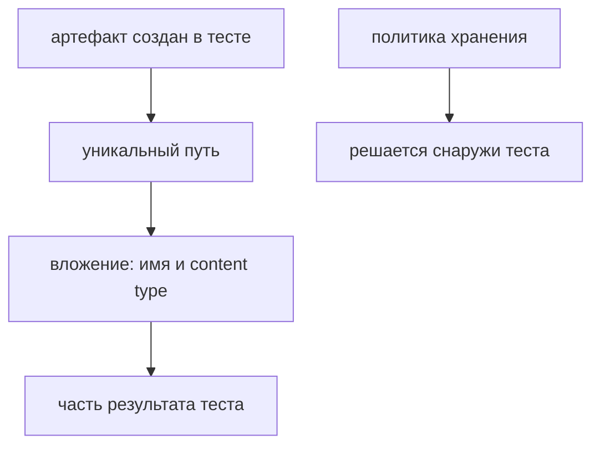

# Attachments и lifecycle артефактов

## Связь с предыдущей главой

Глава 227 рассмотрела автоматически создаваемые артефакты UI. Для JSON, текстовых доказательств и выбранных payload нужен явный контракт вложения.

## Цель главы

Прикреплять ограниченные диагностические данные через `test.info()` и управлять именами, размером, чувствительными данными и временными файлами.

## Главный вопрос

> Как прикреплять полезные данные к test result и управлять их размером и сроком хранения?

## Мотивация

Путь к временному JSON не помогает читателю отчёта, если файл уже удалён или принадлежит другому запуску. Вложение должно стать частью конкретного результата теста.

## Теория

### Вложение — часть результата теста

`testInfo.attach()` принимает body или path и content type. Вложение становится частью результата теста и попадает в отчёт рядом с падением.

Это существенное отличие от файла, просто записанного на диск: вложение — подписанный пакет доказательств внутри результата теста, а не ссылка на случайный файл рабочей машины. Reporter получает собственную копию, связанную с результатом теста, и она доживает до чтения отчёта в CI.

### Передача по пути копирует файл

При передаче path Playwright копирует файл в управляемое место, поэтому временный исходный файл можно удалить после завершения `attach()`.

Проверено: после вызова путь вложения отличается от исходного, и удаление исходника не влияет на вложение — копия остаётся на месте и открывается из отчёта.

Отсюда рабочая схема: тест формирует безопасные данные, записывает временный исходный файл по пути, принадлежащему тесту, ожидает копирования вложения и удаляет исходный файл в `finally`.

Ключевое слово — «ожидает»: `attach()` асинхронный, и удаление исходника без `await` может обогнать копирование.

### Уникальный путь внутри теста

`testInfo.outputPath()` создаёт уникальный путь внутри output конкретного теста.

Он решает две задачи сразу: имя не пересекается с другими тестами при параллельном запуске, и файл попадает в каталог, который раннер сам очищает при повторе. Собственный путь вида `/tmp/data.json` не даёт ни того, ни другого.

### Имена и содержимое

Имена должны отражать сущность и назначение: `task-228-response` полезнее `data`.

В отчёте вложения видны списком, и имя — единственное, по чему их различают. Три вложения с именами `data`, `data-2`, `json` заставляют открывать каждое.

Payload ограничивается полями расследования. Для запроса и ответа полезны method, path, status и выбранные поля body. Полные тела допустимы только при ограниченном размере и после маскирования.

Чувствительные данные маскируются до записи — до формирования файла, а не при чтении отчёта. Как и в главе 226, маскирование на входе означает, что секрет не окажется в артефакте даже при ошибке в коде вложения.

### Content type определяет читаемость

Правильный тип содержимого делает вложение просматриваемым прямо в отчёте: JSON форматируется, изображение показывается, текст открывается.

| Данные | Тип |
| --- | --- |
| диагностический объект | `application/json` |
| текстовый журнал | `text/plain` |
| скриншот | `image/png` |

Неверный тип не ломает вложение, но превращает его в файл для скачивания — лишний шаг при каждом расследовании.

### Политика хранения — не забота теста

Политика хранения определяет, сколько артефактов остаётся после запуска; её не следует реализовывать внутри каждого теста случайными правилами.

Нарушение выглядит безобидно: тест «на всякий случай» удаляет старые файлы, проверяет размер каталога или пропускает вложение при большом объёме. В сумме такие правила дают непредсказуемое поведение — часть падений приходит с доказательствами, часть без, и понять закономерность нельзя.

Тест отвечает за безопасное и ограниченное содержание вложения. Сколько времени оно хранится — решение владельца хранилища.

### Баланс

Вложение ускоряет расследование, но увеличивает отчёт.

Отсутствие данных и бесконтрольная запись одинаково вредны: в первом случае падение не объясняет себя, во втором — отчёт становится нечитаемым, а хранилище дорогим.

Политика выбирает минимально достаточный набор, и проверяется он тем же вопросом, что в главе 225: хватает ли этих данных, чтобы сузить область поиска и проверить гипотезу.

Артефакт становится доказательством, когда у него есть владелец:



## Внутренний механизм

Тест формирует безопасные данные, записывает временный исходный файл по пути, принадлежащему тесту, ожидает копирования вложения и удаляет исходный файл в `finally`. Reporter получает собственную копию, связанную с результатом теста.

## Главная ментальная модель

Вложение — подписанный пакет доказательств внутри результата теста, а не ссылка на случайный файл рабочей машины.

## Практический пример

```text
examples/03-automation-qa/chapter-228/01-attachment-lifecycle.diagnostics.ts
```

Пример прикладывает JSON с корректным content type и подтверждает удаление временного исходного файла.

## Automation QA

Для запроса и ответа полезны method, path, status и выбранные поля body. Полные тела допустимы только при ограниченном размере и после маскирования.

## Компромиссы

Вложение ускоряет расследование, но увеличивает отчёт. Отсутствие данных и бесконтрольная запись одинаково вредны; политика выбирает минимально достаточный набор.

## Распространённые мифы

**Миф: вложение по пути — это ссылка на файл.**
Playwright копирует файл в управляемое место. Исходник после этого можно удалить.

**Миф: исходный файл можно удалять сразу после вызова `attach()`.**
Вызов асинхронный. Без `await` удаление может обогнать копирование.

**Миф: путь для временного файла не важен.**
`outputPath()` даёт уникальное имя внутри каталога теста, который раннер очищает при повторе.

**Миф: content type — необязательная деталь.**
С ним вложение просматривается в отчёте; без него — только скачивается.

**Миф: тест должен сам заботиться о размере хранилища.**
Политику хранения задаёт владелец хранилища. Тест отвечает за безопасное и ограниченное содержание.

## Частые вопросы

**Что прикладывать для API-падения?**
Method, path, status и выбранные поля тела. Полные тела — только ограниченного размера и после маскирования.

**Как назвать вложение?**
По сущности и назначению: в отчёте имя — единственный способ различить вложения.

**Где брать путь для временного файла?**
Из `testInfo.outputPath()`: он уникален и принадлежит каталогу теста.

**Когда маскировать чувствительные данные?**
До записи файла. Маскирование при чтении отчёта уже поздно.

**Сколько вложений считается нормой?**
Минимально достаточное число, чтобы сузить поиск и проверить гипотезу.

## Проверьте себя

1. Чем вложение отличается от файла, записанного на диск?
2. Что происходит с файлом при передаче `path` и когда безопасно удалять исходник?
3. Зачем нужен `outputPath()` вместо произвольного временного пути?
4. Что даёт корректный content type?
5. Почему политика хранения не реализуется внутри тестов?

## Распространённые ошибки

- Прикладывать token или cookie.
- Использовать общий фиксированный путь.
- Не ожидать завершения `attach()` перед удалением файла.
- Прикладывать многомегабайтный payload без ограничения.

## Краткие итоги

- Вложение принадлежит конкретному результату теста.
- Content type и имя описывают данные.
- `outputPath()` даёт путь, принадлежащий конкретному тесту.
- Временный исходный файл удаляется после копирования.

## Практика

Практика встроена из соответствующего файла главы.

## Переход к следующей главе

Отдельные вложения полезны только внутри понятного отчёта. Его информационный контракт рассматривает глава 229.
