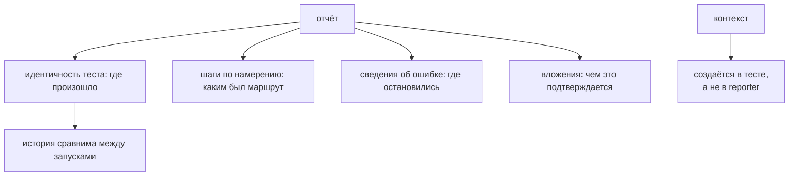

# Принципы тестовой отчётности

## Связь с предыдущей главой

Глава 228 связала доказательства с результатом теста. Теперь нужно определить, какая структура отчёта помогает разным участникам понять результат.

## Цель главы

Сформировать контракт отчёта из идентичности теста, status, duration, steps, сведений об ошибке, контекста окружения, links и владельца.

## Главный вопрос

> Какая информация делает отчёт полезным для разработки, QA и CI?

## Мотивация

Список `passed/failed` не отвечает, какой сценарий запускался, в каком окружении, кто владеет тестом и где искать доказательства. Но отчёт, перегруженный внутренними вызовами helper, скрывает бизнес-поток.

## Теория

### Отчёт как карта расследования

Отчёт похож на карту расследования: идентичность теста показывает место, шаги — маршрут, сведения об ошибке — точку остановки, вложения — доказательства, а владелец — следующего участника.

Эта метафора задаёт и критерий полноты: если по отчёту нельзя понять, где произошёл отказ, каким путём к нему пришли и к кому идти дальше, отчёт неполон — независимо от того, насколько он красив.

### Из чего состоит контракт отчёта

| Часть | Что даёт | Чего не даёт |
| --- | --- | --- |
| идентичность теста | стабильное имя, ссылка на тест-кейс | — |
| итог и длительность | результат запуска | причину |
| шаги | значимые этапы маршрута | детали реализации |
| сведения об ошибке | исходные трассировку и сообщение | интерпретацию |
| контекст окружения | имя, проект, версия приложения | секреты |
| владелец | ответственную команду | само исправление |
| ссылки | связь с тест-кейсом, дефектом, требованием | — |
| история | тенденцию между запусками | первопричину |

Итог и длительность дают результат запуска, но не объясняют причину — и это самая частая иллюзия: красная строка в отчёте сообщает факт, а не механизм.

История сопоставляет стабильную идентичность теста между запусками и показывает тенденцию, но не устанавливает первопричину. Её ценность в другом: она отличает новое падение от давно нестабильного теста.

### Стабильная идентичность — условие для истории

Идентичность теста включает стабильное название сценария и при необходимости ссылку на тест-кейс.

Слово «стабильное» здесь техническое требование, а не пожелание. История строится сопоставлением идентичности между запусками: переименовали тест — история оборвалась, и нестабильный сценарий выглядит как новый.

Отсюда и практическое следствие для названий: они описывают проверяемое поведение, а не текущую реализацию. `создаёт заказ с валидными данными` переживёт рефакторинг; `проверяет POST /api/v1/orders через TasksClient` — нет.

### Шаги называют по намерению

Шаги показывают значимые этапы. Шаги называют по намерению: «Создать задачу через API», а не «Вызвать вспомогательную функцию».

Граница подробности определяется просто: шаг отвечает на вопрос «что делал сценарий», а не «какой код выполнялся». Подробность отчёта полезна до определённой границы — повторение каждой операции локатора и каждого вызова вспомогательной функции делает основной сценарий нечитаемым.

Хороший ориентир — пять-семь шагов на сценарий. Если их тридцать, шаги описывают реализацию; если один, маршрут не виден.

### Контекст создаётся в тесте, а не в средстве отчёта

Playwright Test собирает идентичность теста, длительность, шаги, ошибки и вложения в результат теста. Средство отчёта преобразует эти данные в представление.

Поэтому предметные названия и доказательства создаются в тестовом потоке, а средство отчёта не должно изобретать отсутствующий контекст. Оно — переводчик результата, а не второй источник смысла: оно не может добавить шаг, которого не было, или объяснить ошибку, о которой ему не сообщили.

Практическое следствие: улучшать отчёт нужно в тестах — названиями, шагами, вложениями, аннотациями. Смена средства отчёта меняет вид, но не содержание.

### Связь отчёта с журналами

Сведения о падении сохраняют исходную ошибку и идентификатор сценария для поиска записей журнала.

Идентификатор сценария из главы 226 — то, что соединяет два мира: в отчёте видно, какой тест упал и на каком шаге, в журнале — что происходило между шагами. Без общего идентификатора связать их при параллельном запуске невозможно.

Контекст окружения содержит его безопасное имя, проект и версию приложения без секретов. Этого достаточно, чтобы ответить на первый вопрос расследования — против чего вообще шёл запуск.

### Отчёт должен быть полезен локально

CI может опубликовать отчёт, однако не определяет его смысл: контракт должен быть полезен и при локальном запуске.

Проверка простая: запустите упавший тест у себя и посмотрите, объясняет ли вывод, что произошло. Если для понимания нужен веб-интерфейс CI, контракт выстроен вокруг инструмента, а не вокруг расследования.

Созданные средством отчёта файлы являются результатами запуска, а не исходным кодом проекта — их не фиксируют в репозитории, как и артефакты из главы 227.

Отчёт отвечает на вопросы расследования:



## Внутренний механизм

Playwright Test собирает идентичность теста, длительность, шаги, ошибки и вложения в результат теста. Средство отчёта преобразует эти данные в представление. Поэтому предметные названия и доказательства создаются в тестовом потоке, а средство отчёта не должно изобретать отсутствующий контекст.

### Отчёт показывает только то, что записал тест

```text
тест           │ название, шаги, ошибки, вложения
     ▼
результат      │ идентичность, длительность, статус, артефакты
     ▼
средство       │ группировка, история, представление
отчёта         │ ничего НЕ добавляет от себя
```

Средство отчёта — преобразователь, а не источник. Отсюда практическое следствие:
«в отчёте не видно, на каком шаге упало» решается в коде теста (шаги и
сообщения), а не настройкой отчёта.

### Что делает падение понятным

| Элемент | Что даёт читателю |
| --- | --- |
| название на языке продукта | можно ли отпускать релиз |
| шаги сценария | где именно прервалось |
| сообщение проверки с контекстом | что и с чем сравнивалось |
| цепочка `cause` | исходная причина под обёрткой |
| вложения | доказательства, а не пересказ |

Четвёртая строка теряется чаще всего: обёртка вида
`new Error("подготовка не удалась")` без `{ cause }` стирает код состояния,
тело ответа и место возникновения. Сообщение становится понятнее, а расследование — дороже.

## Главная ментальная модель

Отчёт похож на карту расследования: идентичность теста показывает место, шаги — маршрут, сведения об ошибке — точку остановки, вложения — доказательства, а владелец — следующего участника.

## Практический пример

```text
examples/03-automation-qa/chapter-229/01-report-contract.diagnostics.ts
```

Пример добавляет безопасные аннотации и предметные `test.step()`, не превращая каждую строку кода в отдельный шаг.

## Automation QA

Шаги называют по намерению: «Создать задачу через API», а не «Вызвать вспомогательную функцию». Сведения о падении сохраняют исходную ошибку и идентификатор сценария для поиска записей журнала. Созданные средством отчёта файлы являются результатами запуска, а не исходным кодом проекта.

## Компромиссы

Подробность отчёта полезна до определённой границы. Повторение каждой операции локатора и каждого вызова вспомогательной функции делает основной сценарий нечитаемым.

## Распространённые мифы

**Миф: красный статус объясняет причину.**
Он сообщает итог. Причина восстанавливается по шагам, ошибке и доказательствам.

**Миф: история падений указывает на первопричину.**
Она показывает тенденцию и отличает новое падение от давно нестабильного теста.

**Миф: отчёт можно улучшить сменой средства отчёта.**
Средство отчёта переводит результат. Названия, шаги и доказательства создаются в тестах.

**Миф: чем больше шагов, тем понятнее маршрут.**
Шаг на каждый вызов локатора делает сценарий нечитаемым. Шаги описывают намерение.

**Миф: переименование теста безобидно.**
История строится по стабильной идентичности: после переименования она обрывается.

## Частые вопросы

**Сколько шагов должно быть в сценарии?**
Обычно пять-семь. Тридцать описывают реализацию, один не показывает маршрут.

**Как связать отчёт с журналами?**
Общим идентификатором сценария: при параллельном запуске это единственный надёжный способ.

**Что входит в безопасный контекст окружения?**
Имя окружения, проект и версия приложения. Учётные данные — нет.

**Зачем указывать владельца?**
Он определяет, к кому идёт результат: без этого падение остаётся ничьим.

**Как проверить качество контракта отчёта?**
Запустить упавший тест локально: если вывод не объясняет отказ, контракт выстроен вокруг инструмента.

## Проверьте себя

1. Какие части контракта отчёта отвечают за место, маршрут, точку остановки и доказательства?
2. Почему история требует стабильной идентичности теста?
3. Чем отличается шаг, названный по намерению, от шага по реализации?
4. Почему средство отчёта не может улучшить содержание отчёта?
5. Что связывает отчёт со структурированными журналами?

### Ответы

1. Имя теста и проекта — место. Шаги — маршрут. Сообщение упавшей проверки — точка остановки. Вложения и артефакты — доказательства.
2. История собирается по идентичности теста. Если имя меняется от прогона к прогону или зависит от данных, каждый запуск выглядит новым тестом, и тенденцию увидеть нельзя.
3. Шаг по намерению говорит, что делает пользователь или сценарий. Шаг по реализации повторяет вызовы инструмента и в отчёте ничего не объясняет.
4. Инструмент вывода показывает то, что записал тест. Понятность имён, шагов и сообщений задаётся в коде теста, а не в средстве отображения.
5. Общий идентификатор прогона и запроса: по нему запись в отчёте сопоставляется с записями в журналах и в логах сервиса.

## Распространённые ошибки

- Использовать технические названия вместо бизнес-намерения — по строке отчёта нельзя понять, что сломалось для пользователя, и падение невозможно приоритизировать.

- Терять исходную трассировку при оборачивании `Error` — обёртка без `cause` стирает статус, тело ответа и место возникновения. Расследование начинается с нуля.

- Добавлять секреты в контекст окружения — блок «окружение» в отчёте читают все, включая тех, у кого нет доступа к стенду.

- Ожидать, что средство отчёта восстановит отсутствующие шаги — отчёт показывает только то, что тест записал. Шаги и вложения появляются в коде, а не в настройках отчёта.

## Краткие итоги

- Отчёт объединяет идентичность теста, результат, контекст и доказательства.
- Шаги отражают бизнес-этапы.
- Сведения о падении сохраняют исходную ошибку.
- Владелец и ссылки ускоряют передачу результата.

## Практика

Практика встроена из соответствующего файла главы.

## Переход к следующей главе

Глава 230 применит этот контракт через адаптер Allure.
