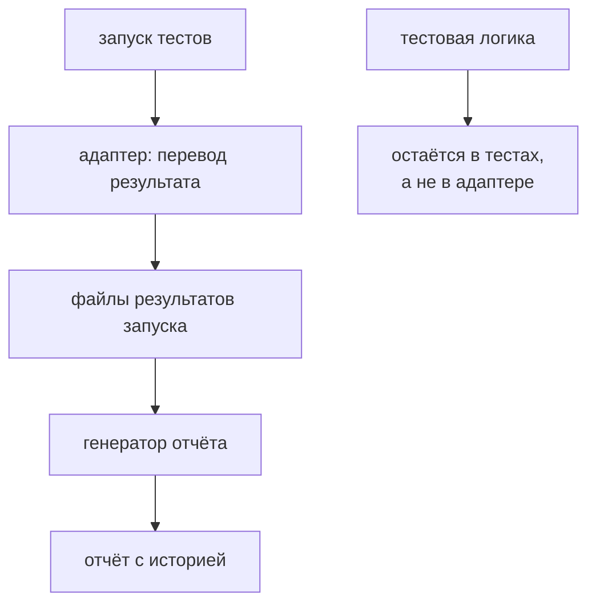

# Отчётность в Allure

## Связь с предыдущей главой

Глава 229 определила содержание полезного отчёта. Адаптер Allure переносит результаты Playwright и metadata в формат Allure, не меняя бизнес-логику теста.

## Цель главы

Использовать адаптер Allure для steps, labels, links, attachments, контекста окружения и history без дублирования сценария.

## Главный вопрос

> Как представить test results и evidence в Allure без дублирования логики теста?

## Мотивация

Ручное повторение steps и assertions ради отчёта создаёт вторую версию теста. Адаптер должен наблюдать уже существующий результат Playwright и дополнять его metadata.

## Теория

### Адаптер — переводчик, а не исполнитель

`allure-playwright` подключается как reporter. Он преобразует Playwright tests, steps, errors и attachments в файлы результатов Allure.

Тест выполняется в Playwright Test, адаптер получает события reporter API и записывает результаты. Адаптер Allure — переводчик результата запуска, а не второй исполнитель тестовой логики: он не выполняет проверок, не влияет на статус и не может добавить данные, которых в результате нет.

Из этого следует то же правило, что в главе 229: бизнес-шаги остаются в `test.step()`, а labels и links только классифицируют результат.

### Два инструмента, а не один

Здесь стоит быть точным, потому что путаница стоит времени при настройке.

Для построения HTML-отчёта нужен отдельный инструмент Allure, тогда как адаптер создаёт только файлы результатов. Подключение `allure-playwright` само по себе не устанавливает и не настраивает Allure CLI.

| Шаг | Кто выполняет | Что получается |
| --- | --- | --- |
| запуск тестов | Playwright Test | результат теста |
| запись результатов | `allure-playwright` | файлы результатов в каталоге |
| построение отчёта | Allure CLI | HTML-отчёт |
| публикация | CI | доступная ссылка |

Типичный симптом непонимания: каталог с результатами есть, отчёта нет — и это ожидаемо, потому что второй шаг выполнен, а третий нет.

### Labels и links классифицируют

Labels задают owner, feature или другие признаки классификации. Links связывают test case и defect.

Labels должны быть стабильными и полезными для фильтрации. Критерий полезности прямой: по метке кто-то должен реально отбирать результаты — команда-владелец, функциональная область, уровень критичности. Метка, по которой никто не фильтрует, добавляет шум в отчёт и работу при поддержке.

Links выполняют другую задачу — соединяют результат с внешним контекстом: требованием, дефектом, тест-кейсом. Они полезны ровно настолько, насколько актуальны: ссылка на закрытую задачу вводит в заблуждение.

### Контекст окружения и его границы

Контекст окружения описывает безопасные условия запуска: имя окружения, project, версию приложения.

Контекст окружения не включает tokens, cookies или connection strings. Ограничение здесь строже, чем для локального вывода: отчёт Allure обычно публикуется и доступен шире, чем репозиторий, а история хранится долго.

### История показывает тенденцию

History сопоставляет стабильную идентичность теста между запусками; он показывает тенденцию, но не доказывает первопричину.

Практическая ценность истории в Allure — отделить новое падение от давнего. Тест, падавший в каждом третьем запуске последний месяц, и тест, упавший впервые сегодня, требуют разной реакции, хотя в текущем отчёте выглядят одинаково.

Работает это только при стабильной идентичности: переименование теста обрывает историю так же, как и в главе 229.

### Изоляция результатов запуска

Результаты Allure — такие же результаты запуска, как артефакты из главы 227: они принадлежат каталогу, их не коммитят, и перед новым запуском старые результаты удаляются.

Последнее требует аккуратности. Очистка должна затрагивать только каталог результатов этого модуля и ничего вокруг: широкая очистка «всего временного» однажды удалит чужие данные. Чистка выполняется в `globalSetup` — один раз на запуск, а не в каждом тесте.

### Чего Allure не делает

Allure улучшает навигацию и history, но требует адаптера и места для хранения.

Он не исправляет неудачные названия тестов, отсутствующие steps или небезопасные attachments. Подключение отчётной системы к набору без предметных названий и шагов даёт красивую оболочку вокруг тех же нечитаемых результатов.

Отдельное правило против дублирования: одно доказательство не следует без причины дублировать через несколько API. Один и тот же JSON, приложенный и как вложение Playwright, и как вложение Allure, и как текст в шаге, утраивает размер отчёта, не добавляя информации.

Адаптер переводит результат, а не выполняет тесты:



## Внутренний механизм

Тест выполняется в Playwright Test, адаптер получает события reporter API и записывает результаты Allure. Бизнес-шаги остаются в `test.step()`, а labels и links только классифицируют результат.

## Главная ментальная модель

Адаптер Allure — переводчик результата запуска, а не второй исполнитель тестовой логики.

## Практический пример

```text
examples/03-automation-qa/chapter-230/01-allure-reporting.diagnostics.ts
```

Пример добавляет owner, feature, ссылку на test case и безопасный JSON attachment. Изолированный config сохраняет результаты Allure в каталоге, принадлежащем модулю. `globalSetup` удаляет из него результаты предыдущего запуска, не затрагивая другие каталоги.

## Automation QA

Labels должны быть стабильными и полезными для фильтрации. Контекст окружения не включает tokens, cookies или connection strings. Одно доказательство не следует без причины дублировать через несколько API.

## Компромиссы

Allure улучшает навигацию и history, но требует адаптера и места для хранения. Он не исправляет неудачные названия тестов, отсутствующие steps или небезопасные attachments.

## Распространённые мифы

**Миф: подключение адаптера даёт HTML-отчёт.**
Адаптер записывает файлы результатов. Отчёт строит отдельный инструмент Allure.

**Миф: адаптер может дополнить результат.**
Он переводит то, что сообщил раннер. Шаги и доказательства создаются в тестах.

**Миф: чем больше labels, тем лучше классификация.**
Метка, по которой никто не фильтрует, добавляет шум и работу при поддержке.

**Миф: контекст окружения — безопасное место для деталей подключения.**
Отчёт публикуется и хранится долго. Connection strings и токены туда не попадают.

**Миф: Allure улучшает плохой набор тестов.**
Он даёт навигацию и историю поверх существующих названий, шагов и доказательств.

## Частые вопросы

**Почему нет HTML-отчёта, хотя адаптер подключён?**
Выполнен только этап записи результатов. Построение отчёта — отдельный шаг Allure CLI.

**Какие labels заводить?**
Те, по которым действительно отбирают результаты: владелец, функциональная область, критичность.

**Где чистить результаты предыдущего запуска?**
В `globalSetup`, и только каталог результатов этого модуля.

**Почему история теста оборвалась?**
Скорее всего, изменилась идентичность: тест переименовали или перенесли.

**Стоит ли дублировать вложение в двух системах?**
Нет. Это утраивает размер отчёта, не добавляя информации.

## Проверьте себя

1. Какие четыре шага отделяют запуск тестов от опубликованного отчёта?
2. Почему адаптер не может добавить недостающий контекст?
3. Чем labels отличаются от links по назначению?
4. Что нельзя включать в контекст окружения и почему именно в Allure это важнее?
5. Что Allure не исправляет в наборе тестов?

## Распространённые ошибки

- Переписывать сценарий через отдельные Allure steps.
- Считать history доказательством причины нестабильности.
- Добавлять секреты в свойства окружения.
- Повторно добавлять одинаковые labels и получать дублирующую metadata.
- Путать Allure results и готовый HTML report.

## Краткие итоги

- Адаптер преобразует результат Playwright в результаты Allure.
- Labels и links классифицируют, а не исполняют тест.
- Attachments остаются ограниченными и безопасными.
- History показывает тенденцию, но требует интерпретации.

## Практика

Практика встроена из соответствующего файла главы.

## Переход к следующей главе

Последняя глава раздела объединит журналы, доказательства Playwright, attachments и отчёт в один диагностический поток.
