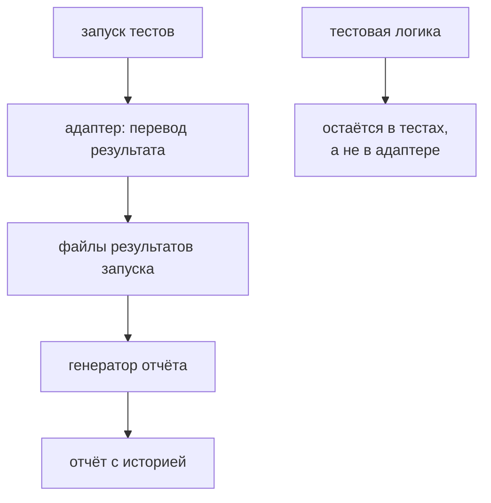

# Отчётность в Allure

## Связь с предыдущей главой

Глава 229 определила содержание полезного отчёта. Адаптер Allure переносит результаты Playwright и metadata в формат Allure, не меняя бизнес-логику теста.

## Цель главы

Использовать адаптер Allure для steps, labels, links, attachments, контекста окружения и history без дублирования сценария.

## Главный вопрос

> Как представить результаты тестов и доказательства в Allure без дублирования логики теста?

## Мотивация

Ручное повторение steps и assertions ради отчёта создаёт вторую версию теста. Адаптер должен наблюдать уже существующий результат Playwright и дополнять его metadata.

## Теория

### Адаптер — переводчик, а не исполнитель

`allure-playwright` подключается как средство отчёта. Он преобразует тесты, шаги, ошибки и вложения Playwright в файлы результатов Allure.

Тест выполняется в Playwright Test, адаптер получает события интерфейса отчётов и записывает результаты. Адаптер Allure — переводчик результата запуска, а не второй исполнитель тестовой логики: он не выполняет проверок, не влияет на итог и не может добавить данные, которых в результате нет.

Из этого следует то же правило, что в главе 229: бизнес-шаги остаются в `test.step()`, а метки и ссылки только классифицируют результат.

### Два инструмента, а не один

Здесь стоит быть точным, потому что путаница стоит времени при настройке.

Для построения HTML-отчёта нужен отдельный инструмент Allure, тогда как адаптер создаёт только файлы результатов. Подключение `allure-playwright` само по себе не устанавливает и не настраивает Allure CLI.

| Шаг | Кто выполняет | Что получается |
| --- | --- | --- |
| запуск тестов | Playwright Test | результат теста |
| запись результатов | `allure-playwright` | файлы результатов в каталоге |
| построение отчёта | Allure CLI | HTML-отчёт |
| публикация | CI | доступная ссылка |

Типичный симптом непонимания: каталог с результатами есть, отчёта нет — и это ожидаемо, потому что второй шаг выполнен, а третий нет.

### Метки и ссылки классифицируют

Метки задают владельца, функциональную область или другие признаки классификации. Ссылки связывают тест-кейс и дефект.

Метки должны быть стабильными и полезными для фильтрации. Критерий полезности прямой: по метке кто-то должен реально отбирать результаты — команда-владелец, функциональная область, уровень критичности. Метка, по которой никто не фильтрует, добавляет шум в отчёт и работу при поддержке.

Ссылки выполняют другую задачу — соединяют результат с внешним контекстом: требованием, дефектом, тест-кейсом. Они полезны ровно настолько, насколько актуальны: ссылка на закрытую задачу вводит в заблуждение.

### Контекст окружения и его границы

Контекст окружения описывает безопасные условия запуска: имя окружения, проект, версию приложения.

Контекст окружения не включает токены, куки или строки подключения. Ограничение здесь строже, чем для локального вывода: отчёт Allure обычно публикуется и доступен шире, чем репозиторий, а история хранится долго.

### История показывает тенденцию

История сопоставляет стабильную идентичность теста между запусками; она показывает тенденцию, но не доказывает первопричину.

Практическая ценность истории в Allure — отделить новое падение от давнего. Тест, падавший в каждом третьем запуске последний месяц, и тест, упавший впервые сегодня, требуют разной реакции, хотя в текущем отчёте выглядят одинаково.

Работает это только при стабильной идентичности: переименование теста обрывает историю так же, как и в главе 229.

### Изоляция результатов запуска

Результаты Allure — такие же результаты запуска, как артефакты из главы 227: они принадлежат каталогу, их не коммитят, и перед новым запуском старые результаты удаляются.

Последнее требует аккуратности. Очистка должна затрагивать только каталог результатов этого модуля и ничего вокруг: широкая очистка «всего временного» однажды удалит чужие данные. Чистка выполняется в `globalSetup` — один раз на запуск, а не в каждом тесте.

### Чего Allure не делает

Allure улучшает навигацию и историю, но требует адаптера и места для хранения.

Он не исправляет неудачные названия тестов, отсутствующие шаги или небезопасные вложения. Подключение отчётной системы к набору без предметных названий и шагов даёт красивую оболочку вокруг тех же нечитаемых результатов.

Отдельное правило против дублирования: одно доказательство не следует без причины дублировать через несколько API. Один и тот же JSON, приложенный и как вложение Playwright, и как вложение Allure, и как текст в шаге, утраивает размер отчёта, не добавляя информации.

Адаптер переводит результат, а не выполняет тесты:


```mermaid
flowchart TD
    A["запуск тестов"] --> B["адаптер: перевод результата"]
    B --> C["файлы результатов запуска"]
    C --> D["генератор отчёта"]
    D --> E["отчёт с историей"]
    F["тестовая логика"] --> G["остаётся в тестах,<br/>а не в адаптере"]
```

## Внутренний механизм

Тест выполняется в Playwright Test, адаптер получает события интерфейса отчётов и записывает результаты Allure. Бизнес-шаги остаются в `test.step()`, а метки и ссылки только классифицируют результат.

### Два артефакта, а не один

```text
прогон тестов → каталог результатов (JSON на каждый тест, вложения)
                       │ отдельная команда сборки
                       ▼
                 готовый отчёт HTML
```

Промежуточные результаты пишет адаптер во время прогона; отчёт собирается из них
после. Пропущенный второй шаг даёт пустую страницу — самый частый вопрос при
первом подключении.

Из этого же следует, как отчёт собирают при шардинге: каталоги результатов всех
сегментов складывают вместе, и только потом вызывают сборку.

### Шаги, метки и ссылки решают разные задачи

| Элемент | Задача | Чем не является |
| --- | --- | --- |
| `test.step()` | показать ход сценария | не управляет выполнением |
| метка (владелец, слой, критичность) | классификация и фильтры | не отбирает тесты при запуске |
| ссылка на задачу или требование | связь с внешней системой | не заменяет название теста |

Шаги описывают уже существующий сценарий. Если их структура расходится с кодом,
отчёт начинает лгать при первой же правке теста — поэтому шаги выражают
бизнес-действия, а не внутренние вызовы.

Повторно добавленная одинаковая метка даёт дублирующие признаки в отчёте, и
фильтрация по ним перестаёт быть предсказуемой.

## Главная ментальная модель

Адаптер Allure — переводчик результата запуска, а не второй исполнитель тестовой логики.

## Практический пример

```text
examples/03-automation-qa/chapter-230/01-allure-reporting.diagnostics.ts
```

Пример добавляет владельца, функциональную область, ссылку на тест-кейс и безопасное вложение JSON. Изолированная конфигурация сохраняет результаты Allure в каталоге, принадлежащем модулю. `globalSetup` удаляет из него результаты предыдущего запуска, не затрагивая другие каталоги.

## Automation QA

Метки должны быть стабильными и полезными для фильтрации. Контекст окружения не включает токены, куки или строки подключения. Одно доказательство не следует без причины дублировать несколькими способами.

## Компромиссы

Allure улучшает навигацию и историю, но требует адаптера и места для хранения. Он не исправляет неудачные названия тестов, отсутствующие шаги или небезопасные вложения.

## Распространённые мифы

**Миф: подключение адаптера даёт HTML-отчёт.**
Адаптер записывает файлы результатов. Отчёт строит отдельный инструмент Allure.

**Миф: адаптер может дополнить результат.**
Он переводит то, что сообщил раннер. Шаги и доказательства создаются в тестах.

**Миф: чем больше меток, тем лучше классификация.**
Метка, по которой никто не фильтрует, добавляет шум и работу при поддержке.

**Миф: контекст окружения — безопасное место для деталей подключения.**
Отчёт публикуется и хранится долго. Строки подключения и токены туда не попадают.

**Миф: Allure улучшает плохой набор тестов.**
Он даёт навигацию и историю поверх существующих названий, шагов и доказательств.

## Частые вопросы

**Почему нет HTML-отчёта, хотя адаптер подключён?**
Выполнен только этап записи результатов. Построение отчёта — отдельный шаг Allure CLI.

**Какие метки заводить?**
Те, по которым действительно отбирают результаты: владелец, функциональная область, критичность.

**Где чистить результаты предыдущего запуска?**
В `globalSetup`, и только каталог результатов этого модуля.

**Почему история теста оборвалась?**
Скорее всего, изменилась идентичность: тест переименовали или перенесли.

**Стоит ли дублировать вложение в двух системах?**
Нет. Это утраивает размер отчёта, не добавляя информации.

## Проверьте себя

1. Какие четыре шага отделяют запуск тестов от опубликованного отчёта?
2. Почему адаптер не может добавить недостающий контекст?
3. Чем метки отличаются от ссылок по назначению?
4. Что нельзя включать в контекст окружения и почему именно в Allure это важнее?
5. Что Allure не исправляет в наборе тестов?

### Ответы

1. Прогон с адаптером, который пишет сырые результаты; сбор этих результатов; генерация отчёта; публикация в доступное место.
2. Адаптер переносит то, что записал тест. Отсутствующие шаги, имена и вложения ему взять неоткуда.
3. Метки классифицируют тест: набор, слой, важность, владелец. Ссылки связывают его с внешними сущностями — требованием, задачей, дефектом.
4. Секреты и персональные данные: токены, пароли, учётные записи. В Allure это важнее, потому что отчёт публикуется и доступен шире, чем стенд.
5. Плохие имена, спрятанные проверки, нестабильность и отсутствие изоляции. Он показывает набор тестов таким, какой он есть.

## Распространённые ошибки

- Переписывать сценарий через отдельные шаги Allure — шаги описывают уже существующий сценарий. Если структура шагов расходится с кодом, отчёт начинает лгать при первой же правке теста.

- Считать историю доказательством причины нестабильности — история показывает частоту падений, а не причину. Причину дают артефакты конкретного прогона.

- Добавлять секреты в свойства окружения — свойства попадают в отчёт целиком и остаются в нём.

- Повторно добавлять одинаковые метки и получать дублирующие метаданные — в отчёте появляется несколько одинаковых признаков, и фильтрация по ним перестаёт работать предсказуемо.

- Путать результаты Allure и готовый отчёт HTML — прогон оставляет промежуточные файлы результатов, отчёт собирается из них отдельной командой. Без этого шага отчёт окажется пустым.

## Краткие итоги

- Адаптер преобразует результат Playwright в результаты Allure.
- Метки и ссылки классифицируют, а не исполняют тест.
- Вложения остаются ограниченными и безопасными.
- История показывает тенденцию, но требует интерпретации.

## Практика

Практика встроена из соответствующего файла главы.

## Переход к следующей главе

Последняя глава раздела объединит журналы, доказательства Playwright, вложения и отчёт в один диагностический поток.
