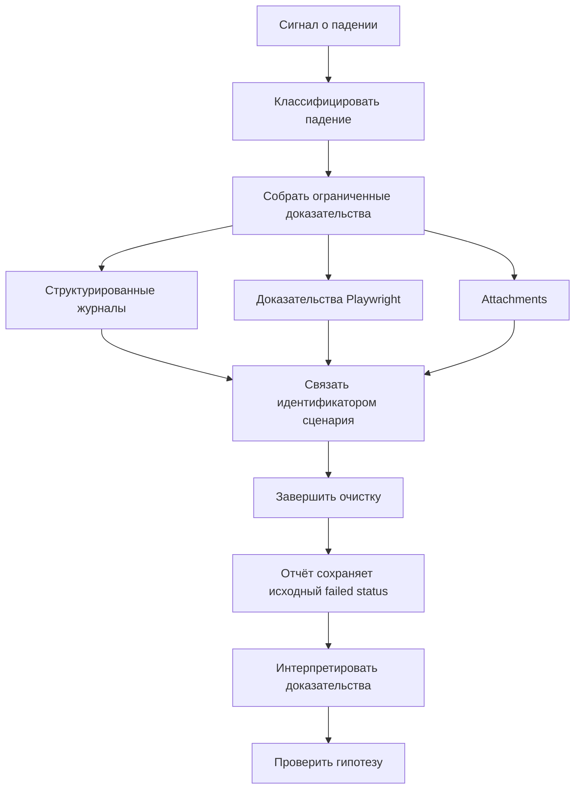

# Диагностический поток Framework

## Связь с предыдущей главой

Главы 225–230 рассмотрели расследование, журналы, доказательства UI, attachments и отчёты по отдельности. Теперь их нужно связать единым идентификатором сценария и общей границей хранения.

## Цель главы

Связать политику сбора доказательств, failure hooks, идентификатор сценария, интеграцию с отчётом и хранение в проверяемый диагностический поток.

## Главный вопрос

> Как logs, Playwright evidence, attachments и report образуют единый путь расследования?

## Мотивация

Набор артефактов бесполезен, если screenshot, metadata запроса и отчёт невозможно связать с одним запуском. Сбор всего подряд создаёт дорогой архив, но не гарантирует достаточной диагностики.

## Теория

Политика сбора доказательств определяет обязательные данные для каждого типа падения и условия сохранения тяжёлых артефактов. Идентификатор сценария связывает журналы и attachments. Перед сохранением данные ограничиваются по размеру и проходят маскирование секретов. Failure hook добавляет ограниченный безопасный контекст, но не заменяет предметные steps теста и не проглатывает ошибку.

Граница хранения разделяет временный output запуска, результаты reporter и опубликованный отчёт. Политикой срока хранения управляет владелец хранилища, а тест отвечает за безопасное содержание. Достаточность проверяется вопросом: можно ли воспроизвести отказ, сузить область поиска и проверить гипотезу без раскрытия секретов.

## Внутренний механизм



Failure hook работает после сценария и прикладывает данные только при расхождении status и expected status. Исходное падение по-прежнему определяет итоговый failed status.

## Главная ментальная модель

Диагностический поток — цепочка сохранения контекста: каждый артефакт отвечает на свой вопрос и связан с одним результатом теста.

## Практический пример

```text
examples/03-automation-qa/chapter-231/01-diagnostic-flow.diagnostics.ts
```

Пример связывает безопасное событие журнала и ограниченную цепочку `Error.cause` одним идентификатором сценария, обрабатывает значение, не являющееся `Error`, и прикладывает ограниченный JSON с защитой от циклов. Набор с контролируемым падением демонстрирует failure hook, удаление временного исходного файла и автоматические артефакты UI.

## Automation QA

Минимальная политика сохраняет идентичность теста, project, имя окружения, seed, идентификатор сценария, исходную ошибку и релевантные доказательства. Tokens и полные чувствительные payload исключаются до сохранения.

## Компромиссы

Единая политика повышает предсказуемость, но не должна превращаться в окончательную сборку framework. Текущий раздел задаёт поток и границы, а не собирает весь промышленный проект.

## Распространённые ошибки

- Сохранять артефакты без общего идентификатора сценария.
- Маскировать исходную ошибку ошибкой failure hook.
- Считать большой объём доказательств достаточной диагностикой.
- Реализовывать срок хранения случайно внутри каждого теста.

## Краткие итоги

- Политика определяет, какие доказательства и когда собирать.
- Идентификатор сценария связывает источники.
- Failure hook дополняет, но не заменяет исходную ошибку.
- Граница хранения отделяет output, results и report.

## Практика

Практика встроена из соответствующего файла главы.

## Переход к следующей главе

Раздел диагностики завершён. Глава 232 начнёт отдельное исследование причин flaky tests; retry и масштабирование здесь не реализуются.
