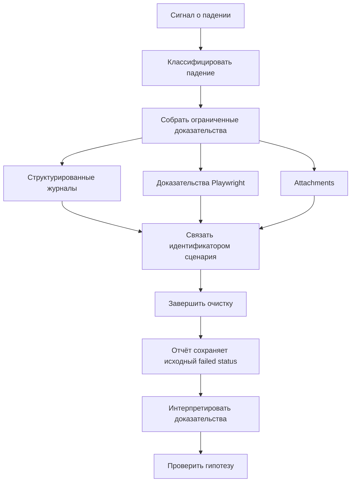

# Диагностический поток Framework

## Связь с предыдущей главой

Главы 225–230 рассмотрели расследование, журналы, доказательства UI, attachments и отчёты по отдельности. Теперь их нужно связать единым идентификатором сценария и общей границей хранения.

## Цель главы

Связать политику сбора доказательств, failure hooks, идентификатор сценария, интеграцию с отчётом и хранение в проверяемый диагностический поток.

## Главный вопрос

> Как logs, Playwright evidence, attachments и report образуют единый путь расследования?

## Мотивация

Набор артефактов бесполезен, если screenshot, metadata запроса и отчёт невозможно связать с одним запуском. Сбор всего подряд создаёт дорогой архив, но не гарантирует достаточной диагностики.

## Теория

### Поток, а не набор инструментов

Диагностический поток — цепочка сохранения контекста: каждый артефакт отвечает на свой вопрос и связан с одним результатом теста.



Предыдущие пять глав дали инструменты по отдельности: журналы, артефакты браузера, вложения, контракт отчёта, систему отчётности. Эта глава соединяет их в один поток, у которого есть вход (сигнал о падении) и выход (проверенная гипотеза).

### Политика определяется классом падения

Политика сбора доказательств определяет обязательные данные для каждого типа падения и условия сохранения тяжёлых артефактов.

Классы те же, что в главе 225, и каждому нужен свой минимум:

| Класс падения | Что обязательно собрать |
| --- | --- |
| UI-сценарий | screenshot, trace, идентификатор сценария |
| API или gRPC | запрос и ответ после маскирования, код статуса |
| данные | идентификаторы созданных сущностей, seed |
| окружение | имя окружения, project, версия приложения |
| инфраструктура | сообщение об отказе подключения, адрес без секретов |

Тяжёлые артефакты — trace и video — сохраняются по условию, а не всегда: это прямое следствие стоимости хранения из главы 227.

### Идентификатор связывает всё

Идентификатор сценария связывает журналы и attachments.

Это несущая конструкция потока. Отчёт сообщает, какой тест упал; журнал — что происходило между шагами; вложения — с какими данными. При параллельном запуске соединить три источника можно только по общему идентификатору, потому что времени и имени теста недостаточно.

Минимальная политика сохраняет идентичность теста, project, имя окружения, seed, идентификатор сценария, исходную ошибку и релевантные доказательства.

### Ограничение и маскирование до сохранения

Перед сохранением данные ограничиваются по размеру и проходят маскирование секретов.

Порядок именно такой: ограничить, замаскировать, сохранить. Tokens и полные чувствительные payload исключаются до сохранения — не при публикации отчёта и не при чтении.

К ограничению относится и защита от структур, которые ломают сериализацию: циклы, `BigInt`, значения, не являющиеся `Error`. Цепочка `Error.cause` обходится с ограничением глубины — как показано в главе 226, две ошибки могут ссылаться друг на друга.

### Failure hook дополняет, но не подменяет

Failure hook добавляет ограниченный безопасный контекст, но не заменяет предметные steps теста и не проглатывает ошибку.

Работает он после сценария и прикладывает данные только при расхождении status и expected status — то есть не тратит ресурсы на успешные прогоны.

Два ограничения, которые нарушаются чаще всего:

- **hook не отменяет падение.** Исходное падение по-прежнему определяет итоговый failed status; hook, который «починил» результат, скрыл дефект;
- **hook не заменяет шаги.** Контекст, собранный после сценария, показывает состояние в конце, а маршрут дают предметные `test.step()` из главы 229.

### Три границы хранения

Граница хранения разделяет временный output запуска, результаты reporter и опубликованный отчёт.

| Уровень | Что это | Срок жизни |
| --- | --- | --- |
| временный output | каталог теста, очищается при повторе | один запуск |
| результаты reporter | файлы для построения отчёта | до сборки отчёта |
| опубликованный отчёт | доступное представление | по политике хранилища |

Политикой срока хранения управляет владелец хранилища, а тест отвечает за безопасное содержание. Разделение ответственности здесь то же, что в главе 228: тест не решает, сколько хранить, но полностью отвечает за то, что именно сохраняется.

### Критерий достаточности

Достаточность проверяется вопросом: можно ли воспроизвести отказ, сузить область поиска и проверить гипотезу без раскрытия секретов.

Три части вопроса соответствуют трём видам недостатков. Нельзя воспроизвести — не хватает config, project, seed. Нельзя сузить поиск — не хватает журналов и артефактов. Нельзя проверить гипотезу — не хватает данных о состоянии системы. Четвёртая часть — про секреты — ограничивает все три.

Единая политика повышает предсказуемость, но не должна превращаться в окончательную сборку framework. Текущий раздел задаёт поток и границы, а не собирает весь промышленный проект: следующие разделы добавят стабильность, параллельность и CI.

## Внутренний механизм


Failure hook работает после сценария и прикладывает данные только при расхождении status и expected status. Исходное падение по-прежнему определяет итоговый failed status.

## Главная ментальная модель

Диагностический поток — цепочка сохранения контекста: каждый артефакт отвечает на свой вопрос и связан с одним результатом теста.

## Практический пример

```text
examples/03-automation-qa/chapter-231/01-diagnostic-flow.diagnostics.ts
```

Пример связывает безопасное событие журнала и ограниченную цепочку `Error.cause` одним идентификатором сценария, обрабатывает значение, не являющееся `Error`, и прикладывает ограниченный JSON с защитой от циклов. Набор с контролируемым падением демонстрирует failure hook, удаление временного исходного файла и автоматические артефакты UI.

## Automation QA

Минимальная политика сохраняет идентичность теста, project, имя окружения, seed, идентификатор сценария, исходную ошибку и релевантные доказательства. Tokens и полные чувствительные payload исключаются до сохранения.

## Компромиссы

Единая политика повышает предсказуемость, но не должна превращаться в окончательную сборку framework. Текущий раздел задаёт поток и границы, а не собирает весь промышленный проект.

## Распространённые мифы

**Миф: достаточно включить все артефакты, и диагностика готова.**
Артефакты без общего идентификатора и политики не складываются в поток: их нельзя связать между собой.

**Миф: failure hook может исправить результат.**
Исходное падение определяет итоговый статус. Hook, меняющий его, скрывает дефект.

**Миф: hook заменяет предметные шаги.**
Он показывает состояние в конце сценария, а маршрут дают шаги.

**Миф: маскировать можно при публикации отчёта.**
Секрет не должен попадать в артефакт вовсе: ограничение и маскирование выполняются до сохранения.

**Миф: срок хранения — задача тестового проекта.**
Им управляет владелец хранилища. Тест отвечает за содержание.

## Частые вопросы

**Что входит в минимальную политику?**
Идентичность теста, project, имя окружения, seed, идентификатор сценария, исходная ошибка и релевантные доказательства.

**Как связать журнал, отчёт и вложения?**
Общим идентификатором сценария: при параллельном запуске это единственный надёжный способ.

**Когда срабатывает failure hook?**
При расхождении фактического и ожидаемого статуса — успешные прогоны он не нагружает.

**Почему цепочку `cause` нужно ограничивать при сохранении?**
Ошибки могут ссылаться друг на друга, и обход без предела не завершится.

**Как понять, что доказательств достаточно?**
Проверить, можно ли воспроизвести отказ, сузить поиск и проверить гипотезу — не раскрывая секретов.

## Проверьте себя

1. Из каких шагов состоит диагностический поток от сигнала о падении до проверки гипотезы?
2. Какие данные обязательны для каждого класса падения?
3. Что связывает журналы, артефакты и отчёт при параллельном запуске?
4. Какие два ограничения действуют на failure hook?
5. Какие три границы хранения различаются и кто управляет сроком?

## Распространённые ошибки

- Сохранять артефакты без общего идентификатора сценария.
- Маскировать исходную ошибку ошибкой failure hook.
- Считать большой объём доказательств достаточной диагностикой.
- Реализовывать срок хранения случайно внутри каждого теста.

## Краткие итоги

- Политика определяет, какие доказательства и когда собирать.
- Идентификатор сценария связывает источники.
- Failure hook дополняет, но не заменяет исходную ошибку.
- Граница хранения отделяет output, results и report.

## Практика

Практика встроена из соответствующего файла главы.

## Переход к следующей главе

Раздел диагностики завершён. Глава 232 начнёт отдельное исследование причин flaky tests; retry и масштабирование здесь не реализуются.
