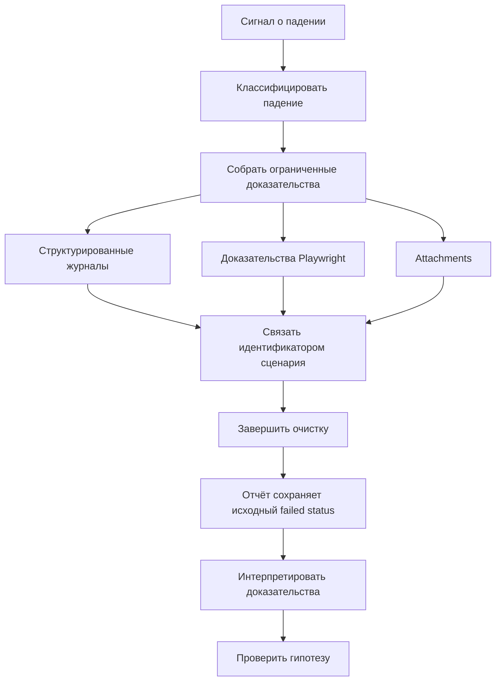

# Диагностический поток фреймворка

## Связь с предыдущей главой

Главы 225–230 рассмотрели расследование, журналы, доказательства UI, attachments и отчёты по отдельности. Теперь их нужно связать единым идентификатором сценария и общей границей хранения.

## Цель главы

Связать политику сбора доказательств, failure hooks, идентификатор сценария, интеграцию с отчётом и хранение в проверяемый диагностический поток.

## Главный вопрос

> Как журналы, доказательства Playwright, вложения и отчёт образуют единый путь расследования?

## Мотивация

Набор артефактов бесполезен, если screenshot, metadata запроса и отчёт невозможно связать с одним запуском. Сбор всего подряд создаёт дорогой архив, но не гарантирует достаточной диагностики.

## Теория

### Поток, а не набор инструментов

Диагностический поток — цепочка сохранения контекста: каждый артефакт отвечает на свой вопрос и связан с одним результатом теста.


```mermaid
flowchart TD
    F[Сигнал о падении] --> K[Классифицировать падение]
    K --> E[Собрать ограниченные доказательства]
    E --> L[Структурированные журналы]
    E --> P[Доказательства Playwright]
    E --> A[Attachments]
    L --> C[Связать идентификатором сценария]
    P --> C
    A --> C
    C --> X[Завершить очистку]
    X --> R[Отчёт сохраняет исходный failed status]
    R --> I[Интерпретировать доказательства]
    I --> V[Проверить гипотезу]
```

Предыдущие пять глав дали инструменты по отдельности: журналы, артефакты браузера, вложения, контракт отчёта, систему отчётности. Эта глава соединяет их в один поток, у которого есть вход (сигнал о падении) и выход (проверенная гипотеза).

### Политика определяется классом падения

Политика сбора доказательств определяет обязательные данные для каждого типа падения и условия сохранения тяжёлых артефактов.

Классы те же, что в главе 225, и каждому нужен свой минимум:

| Класс падения | Что обязательно собрать |
| --- | --- |
| сценарий интерфейса | снимок экрана, трассировка, идентификатор сценария |
| API или gRPC | запрос и ответ после маскирования, код статуса |
| данные | идентификаторы созданных сущностей, зерно |
| окружение | имя окружения, проект, версия приложения |
| инфраструктура | сообщение об отказе подключения, адрес без секретов |

Тяжёлые артефакты — трассировка и видеозапись — сохраняются по условию, а не всегда: это прямое следствие стоимости хранения из главы 227.

### Идентификатор связывает всё

Идентификатор сценария связывает журналы и вложения.

Это несущая конструкция потока. Отчёт сообщает, какой тест упал; журнал — что происходило между шагами; вложения — с какими данными. При параллельном запуске соединить три источника можно только по общему идентификатору, потому что времени и имени теста недостаточно.

Минимальная политика сохраняет идентичность теста, проект, имя окружения, зерно, идентификатор сценария, исходную ошибку и относящиеся к делу доказательства.

### Ограничение и маскирование до сохранения

Перед сохранением данные ограничиваются по размеру и проходят маскирование секретов.

Порядок именно такой: ограничить, замаскировать, сохранить. Токены и полные чувствительные тела исключаются до сохранения — не при публикации отчёта и не при чтении.

К ограничению относится и защита от структур, которые ломают сериализацию: циклы, `BigInt`, значения, не являющиеся `Error`. Цепочка `Error.cause` обходится с ограничением глубины — как показано в главе 226, две ошибки могут ссылаться друг на друга.

### Хук на падение дополняет, но не подменяет

Хук на падение добавляет ограниченный безопасный контекст, но не заменяет предметные шаги теста и не проглатывает ошибку.

Работает он после сценария и прикладывает данные только при расхождении фактического и ожидаемого итога — то есть не тратит ресурсы на успешные прогоны.

Два ограничения, которые нарушаются чаще всего:

- **хук не отменяет падение.** Исходное падение по-прежнему определяет итоговый неуспешный результат; хук, который «починил» результат, скрыл дефект;
- **хук не заменяет шаги.** Контекст, собранный после сценария, показывает состояние в конце, а маршрут дают предметные `test.step()` из главы 229.

### Три границы хранения

Граница хранения разделяет временную выходную директорию запуска, результаты средства отчёта и опубликованный отчёт.

| Уровень | Что это | Срок жизни |
| --- | --- | --- |
| временная выходная директория | каталог теста, очищается при повторе | один запуск |
| результаты средства отчёта | файлы для построения отчёта | до сборки отчёта |
| опубликованный отчёт | доступное представление | по политике хранилища |

Политикой срока хранения управляет владелец хранилища, а тест отвечает за безопасное содержание. Разделение ответственности здесь то же, что в главе 228: тест не решает, сколько хранить, но полностью отвечает за то, что именно сохраняется.

### Критерий достаточности

Достаточность проверяется вопросом: можно ли воспроизвести отказ, сузить область поиска и проверить гипотезу без раскрытия секретов.

Три части вопроса соответствуют трём видам недостатков. Нельзя воспроизвести — не хватает конфигурации, проекта, зерна. Нельзя сузить поиск — не хватает журналов и артефактов. Нельзя проверить гипотезу — не хватает данных о состоянии системы. Четвёртая часть — про секреты — ограничивает все три.

Единая политика повышает предсказуемость, но не должна превращаться в окончательную сборку фреймворка. Текущий раздел задаёт поток и границы, а не собирает весь промышленный проект: следующие разделы добавят стабильность, параллельность и CI.

## Внутренний механизм


```mermaid
flowchart TD
    F[Сигнал о падении] --> K[Классифицировать падение]
    K --> E[Собрать ограниченные доказательства]
    E --> L[Структурированные журналы]
    E --> P[Доказательства Playwright]
    E --> A[Attachments]
    L --> C[Связать идентификатором сценария]
    P --> C
    A --> C
    C --> X[Завершить очистку]
    X --> R[Отчёт сохраняет исходный failed status]
    R --> I[Интерпретировать доказательства]
    I --> V[Проверить гипотезу]
```

Хук на падение работает после сценария и прикладывает данные только при расхождении фактического и ожидаемого итога. Исходное падение по-прежнему определяет итоговый неуспешный результат.

### Хук диагностики и почему он не срабатывает на ожидаемом падении

```ts
test.afterEach(async ({ }, testInfo) => {
  if (testInfo.status !== testInfo.expectedStatus) {
    await attachEvidence(testInfo);
  }
});
```

Сравниваются **фактический** и **ожидаемый** итог, а не «упал или нет». Поэтому
тест, помеченный `test.fail()`, при падении считается прошедшим по плану, и
доказательства не собираются — что правильно: собирать их незачем.

Такой хук не меняет результат: исходное падение остаётся падением, а ошибка
внутри самого хука не должна его подменять.

### Порядок сбора и связывания

```text
падение
  ├─ классифицировать: дефект / окружение / нестабильность
  ├─ собрать ограниченный набор: журнал сценария, артефакты, ответ сервиса
  ├─ связать всё идентификатором сценария
  └─ завершить очистку — она выполняется В ЛЮБОМ случае
```

Сбор идёт **до** очистки: удалённая запись уже ничего не покажет. Очистка при
этом всё равно выполняется — иначе диагностика начинает оставлять мусор.

Объём доказательств ценности не добавляет: сто несвязанных вложений хуже пяти,
собранных под одним идентификатором. Срок хранения задаётся в конфигурации и в
CI, а не в каждом тесте по отдельности.

## Главная ментальная модель

Диагностический поток — цепочка сохранения контекста: каждый артефакт отвечает на свой вопрос и связан с одним результатом теста.

## Практический пример

```text
examples/03-automation-qa/chapter-231/01-diagnostic-flow.diagnostics.ts
```

Пример связывает безопасное событие журнала и ограниченную цепочку `Error.cause` одним идентификатором сценария, обрабатывает значение, не являющееся `Error`, и прикладывает ограниченный JSON с защитой от циклов. Набор с контролируемым падением демонстрирует хук на падение, удаление временного исходного файла и автоматические артефакты интерфейса.

## Automation QA

Минимальная политика сохраняет идентичность теста, проект, имя окружения, зерно, идентификатор сценария, исходную ошибку и относящиеся к делу доказательства. Токены и полные чувствительные тела исключаются до сохранения.

## Компромиссы

Единая политика повышает предсказуемость, но не должна превращаться в окончательную сборку фреймворка. Текущий раздел задаёт поток и границы, а не собирает весь промышленный проект.

## Распространённые мифы

**Миф: достаточно включить все артефакты, и диагностика готова.**
Артефакты без общего идентификатора и политики не складываются в поток: их нельзя связать между собой.

**Миф: хук на падение может исправить результат.**
Исходное падение определяет итоговый статус. Хук, меняющий его, скрывает дефект.

**Миф: хук заменяет предметные шаги.**
Он показывает состояние в конце сценария, а маршрут дают шаги.

**Миф: маскировать можно при публикации отчёта.**
Секрет не должен попадать в артефакт вовсе: ограничение и маскирование выполняются до сохранения.

**Миф: срок хранения — задача тестового проекта.**
Им управляет владелец хранилища. Тест отвечает за содержание.

## Частые вопросы

**Что входит в минимальную политику?**
Идентичность теста, проект, имя окружения, зерно, идентификатор сценария, исходная ошибка и относящиеся к делу доказательства.

**Как связать журнал, отчёт и вложения?**
Общим идентификатором сценария: при параллельном запуске это единственный надёжный способ.

**Когда срабатывает хук на падение?**
При расхождении фактического и ожидаемого статуса — успешные прогоны он не нагружает.

**Почему цепочку `cause` нужно ограничивать при сохранении?**
Ошибки могут ссылаться друг на друга, и обход без предела не завершится.

**Как понять, что доказательств достаточно?**
Проверить, можно ли воспроизвести отказ, сузить поиск и проверить гипотезу — не раскрывая секретов.

## Проверьте себя

1. Из каких шагов состоит диагностический поток от сигнала о падении до проверки гипотезы?
2. Какие данные обязательны для каждого класса падения?
3. Что связывает журналы, артефакты и отчёт при параллельном запуске?
4. Какие два ограничения действуют на хук на падение?
5. Какие три границы хранения различаются и кто управляет сроком?

### Ответы

1. Сигнал о падении, определение класса отказа, сбор данных по этому классу, воспроизведение, гипотеза и проверка гипотезы одним изменением.
2. Для дефекта приложения — шаги и состояние данных; для ошибки теста — код и его ожидания; для проблемы данных — идентификаторы записей; для сбоя окружения — состояние стенда и версия; для нестабильности — история запусков.
3. Общий идентификатор прогона и теста, включая номер попытки и рабочего процесса. Без него записи параллельных тестов перемешиваются.
4. Он выполняется в ограниченное время и не должен падать сам: его ошибка подменит настоящую причину.
5. Каталог результатов прогона, хранилище артефактов CI и долговременное хранилище отчётов. Сроком управляет CI и политика хранения, а не тест.

## Распространённые ошибки

- Сохранять артефакты без общего идентификатора сценария — снимок, журнал и трассировка лежат отдельно, и связать их с записью в журнале сервиса нечем.

- Маскировать исходную ошибку ошибкой самого хука — падение диагностики заменит причину падения теста, и в отчёте останется проблема сбора доказательств.

- Считать большой объём доказательств достаточной диагностикой — сто вложений без идентификатора и порядка хуже пяти связанных. Ценность даёт связность, а не объём.

- Реализовывать срок хранения случайно внутри каждого теста — правила хранения принадлежат конфигурации и CI. Разложенные по тестам, они расходятся и перестают действовать.

## Краткие итоги

- Политика определяет, какие доказательства и когда собирать.
- Идентификатор сценария связывает источники.
- Хук на падение дополняет, но не заменяет исходную ошибку.
- Граница хранения отделяет выходную директорию, результаты и отчёт.

## Практика

Практика встроена из соответствующего файла главы.

## Переход к следующей главе

Раздел диагностики завершён. Глава 232 начнёт отдельное исследование причин нестабильных тестов; повторы и масштабирование здесь не реализуются.
