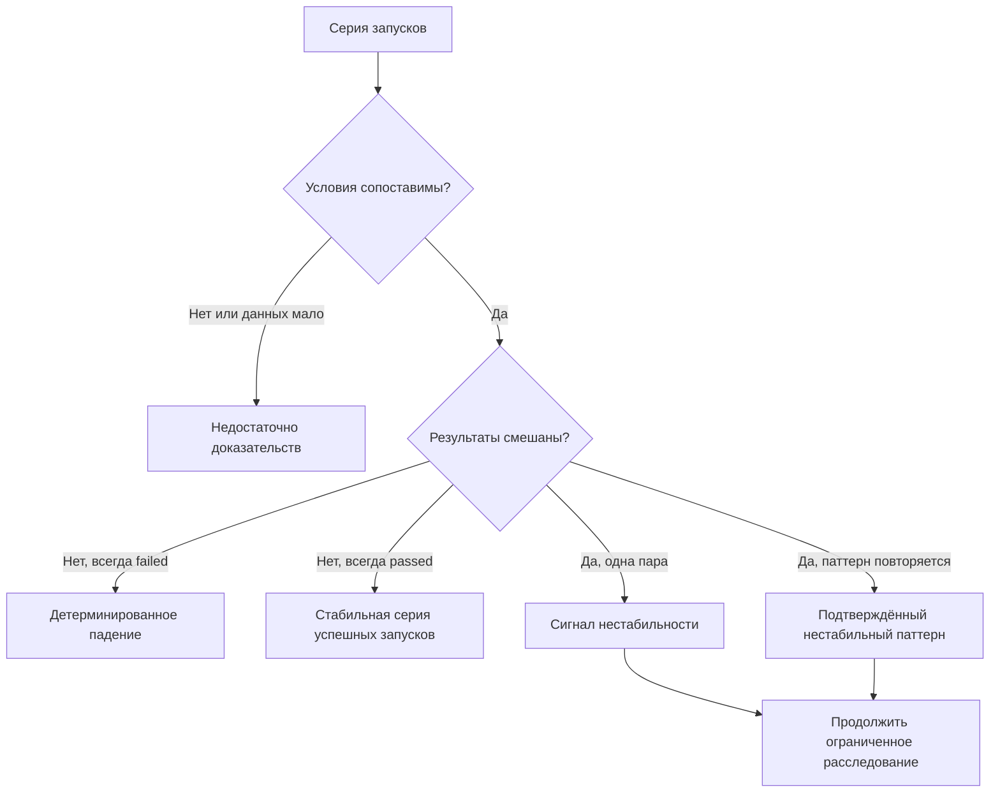

# Причины flaky tests

## Связь с предыдущей главой

Главы 225–231 построили диагностический поток. Теперь этот поток нужен, чтобы отличать единичное падение от повторяемого нарушения детерминированности.

## Цель главы

Научиться классифицировать нестабильный результат по доказательствам и искать источник изменяющихся условий.

## Главный вопрос

> Какие нарушения детерминированности делают результат теста нестабильным?

## Мотивация

Одно падение не делает тест flaky. Даже один успешный повторный запуск даёт только сигнал нестабильности, который нужно подтвердить сопоставимой серией. Причиной может быть детерминированный дефект продукта, ошибка теста, недоступная инфраструктура или недостаток данных для вывода.

## Теория

Детерминированный тест при одинаковых входных данных и существенных условиях даёт одинаковый результат. Нарушить это свойство могут неправильные ожидания, общий изменяемый ресурс, неуправляемые данные, внешняя зависимость, race condition или исчерпание ресурса.

Нестабильный locator, eventual consistency, конфликт данных, зависимость от порядка, изменяющееся окружение и остаточное состояние после очистки — возможные источники изменяющегося условия, но не готовые диагнозы. Каждый из них нужно подтвердить отдельными доказательствами.

Классификация следует за сбором доказательств. Сравниваются конфигурация, project, исходное значение генератора данных, состояние данных и диагностические события. Ошибка запуска браузера в ограниченном sandbox относится к инфраструктуре и сама по себе ничего не говорит о стабильности тестовой логики. Playwright присваивает последовательности `failed → passed on retry` статус flaky, но этот статус Playwright Test не указывает коренную причину и не завершает расследование.

## Внутренний механизм



## Главная ментальная модель

Flaky — подтверждённый паттерн разных результатов, а не вывод из одного успешного повторного запуска и не удобное название для неизвестной причины.

## Практический пример

```text
examples/03-automation-qa/chapter-232/01-flaky-classification.stability.ts
```

Пример отделяет инфраструктурное падение, несопоставимый контекст, единичный сигнал и подтверждённый паттерн без случайности и таймеров. Минимум три запуска в примере — локальное учебное правило для фиксации повторения, а не универсальный порог Playwright.

## Automation QA

При первичном анализе отдельно рассматривают дефект продукта, дефект теста, конфликт данных, нестабильность окружения и инфраструктурное падение. Для каждого варианта нужны собственные доказательства.

## Компромиссы

Повторение запуска увеличивает объём наблюдений, но не заменяет анализ условий. Слишком ранний ярлык flaky останавливает расследование.

## Распространённые ошибки

- Называть тест flaky после одного падения.
- Завершать классификацию после одного успешного повторного запуска.
- Считать тайм-аут доказательством race condition.
- Использовать случайное падение как учебный пример.
- Смешивать инфраструктурный отказ с дефектом тестовой логики.

## Краткие итоги

- Flaky требует повторяемых разных результатов в сопоставимых условиях.
- Детерминированное падение не является flaky.
- Причина находится среди изменяющихся условий и ресурсов.
- Недостаток доказательств остаётся отдельной классификацией.

## Практика

Практика встроена из соответствующего файла главы.

## Переход к следующей главе

После корректной классификации нужно воспроизвести паттерн и временно защитить основной сигнал. Этому посвящена глава 233.
