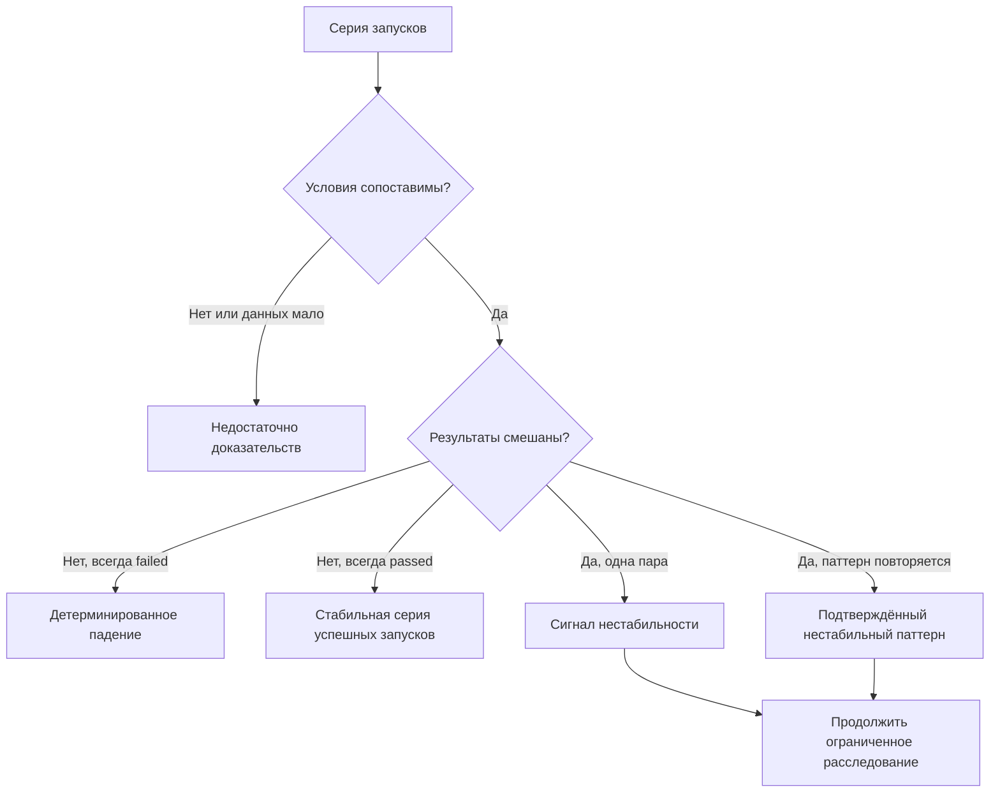

# Причины flaky tests

## Связь с предыдущей главой

Главы 225–231 построили диагностический поток. Теперь этот поток нужен, чтобы отличать единичное падение от повторяемого нарушения детерминированности.

## Цель главы

Научиться классифицировать нестабильный результат по доказательствам и искать источник изменяющихся условий.

## Главный вопрос

> Какие нарушения детерминированности делают результат теста нестабильным?

## Мотивация

Одно падение не делает тест flaky. Даже один успешный повторный запуск даёт только сигнал нестабильности, который нужно подтвердить сопоставимой серией. Причиной может быть детерминированный дефект продукта, ошибка теста, недоступная инфраструктура или недостаток данных для вывода.

## Теория

### Детерминированность — это свойство, а не пожелание

Тест детерминирован, если при одинаковых входных данных и одинаковых **существенных условиях** он даёт одинаковый результат.

Вся тяжесть определения лежит на словах «существенные условия». Условий у запуска бесконечно много: температура процессора, точное время, порядок ответов сети. Существенными называются те, от которых результат зависит по замыслу. Если результат изменился, а все существенные условия совпадали, значит либо изменилось что-то ещё, либо это «что-то ещё» и было существенным, а мы об этом не знали.

Именно поэтому расследование нестабильности — это почти всегда поиск незамеченного условия, а не поиск ошибки в строке кода.

### Почему одного падения недостаточно

Одно падение — это одно наблюдение. Из него нельзя отличить четыре разные ситуации:

| Что произошло на самом деле | Как выглядит по одному падению |
| --- | --- |
| Детерминированный дефект продукта | Тест упал |
| Дефект теста: неверное ожидание | Тест упал |
| Инфраструктура не дала запуститься | Тест упал |
| Нарушение детерминированности | Тест упал |

Различить их может только серия сопоставимых запусков. Поэтому первый шаг расследования — не гипотеза о причине, а сбор наблюдений.

### Что считать сопоставимыми условиями

Два запуска сопоставимы, если совпадают:

- конфигурация и project, включая браузер и его версию;
- исходное значение генератора тестовых данных;
- состояние данных на момент старта;
- режим параллельности: число workers и признак полной параллельности;
- окружение и версия продукта;
- признак повторной попытки: первая попытка и retry сравниваются отдельно.

Если хотя бы одно из этих условий различается, серия не даёт вывода о стабильности. Это отдельная классификация — **недостаточно доказательств**, а не «скорее всего flaky».

### Шесть источников изменяющегося условия

Ниже — не готовые диагнозы, а направления поиска. Каждое требует собственных доказательств.

**1. Неверное ожидание.** Locator совпадает более чем с одним элементом, проверка опирается на порядок, который сервер не гарантирует, или тест ждёт не тот признак готовности. Подтверждается тем, что при падении нужное состояние в продукте уже наступило.

**2. Общий изменяемый ресурс.** Одна учётная запись, одна запись в базе, один файл или один порт на несколько тестов. Подтверждается связью падений с одновременным выполнением конкретных тестов.

**3. Неуправляемые данные.** Тест опирается на данные, которые создал не он: остатки прошлого запуска, записи соседнего теста, зависимость от текущей даты. Подтверждается тем, что результат меняется вместе с составом данных, а не с кодом.

**4. Внешняя зависимость.** Сторонний сервис, сеть, системные часы, разрешение имён. Подтверждается диагностическими событиями на границе, а не догадкой.

**5. Race condition и зависимость от порядка.** Асинхронная операция, результат которой не дождались; eventual consistency между слоями; тест, работающий только после соседнего. Подтверждается изменением результата при изменении порядка или задержек.

**6. Исчерпание ресурса.** Под нагрузкой не хватает времени, соединений в пуле, памяти или свободных портов. Подтверждается связью падений с уровнем параллельности, а не с логикой теста.

### Что означает статус flaky в Playwright

Playwright присваивает статус `flaky` последовательности «упал, затем прошёл на retry».

Этот статус доказывает ровно одно: **результаты попыток различались**. Он не указывает коренную причину, не говорит, что дефект находится в тесте, и не подтверждает корректность продукта. Статус — это вход в расследование, а не его итог.

### Классификация идёт за доказательствами

Порядок действий обратный привычному: сначала наблюдения, потом ярлык.

1. Собрать серию запусков и зафиксировать контекст каждого.
2. Проверить сопоставимость условий.
3. Классифицировать результат серии.
4. И только затем выдвигать гипотезу о причине.

Инфраструктурное падение выделяется отдельно и рассматривается первым: ошибка запуска браузера в ограниченном sandbox ничего не говорит о стабильности тестовой логики.

## Внутренний механизм



## Главная ментальная модель

Flaky — подтверждённый паттерн разных результатов, а не вывод из одного успешного повторного запуска и не удобное название для неизвестной причины.

## Практический пример

```text
examples/03-automation-qa/chapter-232/01-flaky-classification.stability.ts
```

Пример отделяет инфраструктурное падение, несопоставимый контекст, единичный сигнал и подтверждённый паттерн без случайности и таймеров. Минимум три запуска в примере — локальное учебное правило для фиксации повторения, а не универсальный порог Playwright.

## Automation QA

При первичном анализе отдельно рассматривают дефект продукта, дефект теста, конфликт данных, нестабильность окружения и инфраструктурное падение. Для каждого варианта нужны собственные доказательства.

Практический приём: прежде чем менять код теста, сформулируйте, **какое наблюдение опровергнет вашу гипотезу**. Если такого наблюдения не существует, гипотеза бесполезна и расследование пойдёт по кругу.

Второй приём: фиксируйте отпечаток контекста вместе с результатом каждого запуска. Без него через день невозможно понять, сопоставимы ли два падения, и серия наблюдений превращается в набор слухов.

## Компромиссы

Повторение запуска увеличивает объём наблюдений, но не заменяет анализ условий. Слишком ранний ярлык flaky останавливает расследование.

Длинная серия запусков даёт более уверенный вывод, но стоит времени и занимает исполнителей. Разумная граница задаётся заранее: сколько запусков команда готова потратить на подтверждение паттерна, решается до начала расследования, а не в процессе.

## Распространённые мифы

**Миф: тест упал один раз — значит он flaky.**
Одно падение не отличает нестабильность от детерминированного дефекта. Пока серии нет, корректная классификация — «недостаточно доказательств».

**Миф: retry прошёл — значит проблема в тесте, а не в продукте.**
Разные результаты попыток означают, что изменилось какое-то условие. Этим условием может быть состояние продукта: например, вторая попытка застала систему уже согласованной.

**Миф: тайм-аут доказывает race condition.**
Тайм-аут доказывает только, что ожидаемое состояние не наступило за отведённое время. Причиной может быть неверный признак готовности, нехватка ресурсов или настоящий дефект продукта.

**Миф: flaky — это всегда вина автоматизатора.**
Нарушение детерминированности часто живёт в продукте: несогласованные реплики, недетерминированный порядок выдачи, гонка на стороне сервера. Тест только делает её видимой.

**Миф: добавим ожидание — и починится.**
Ожидание устраняет симптом и скрывает источник. Если признак готовности выбран неверно, более длинное ожидание лишь отодвигает падение и делает набор медленнее.

## Частые вопросы

**Сколько запусков нужно для вывода?**
Универсального числа нет: оно зависит от частоты проявления. Полезное правило — договориться о границе заранее и записать её вместе с результатом, чтобы вывод можно было перепроверить.

**Тест падает раз в пятьдесят запусков. Это flaky?**
Да, если условия сопоставимы и разные результаты воспроизводятся. Редкость влияет на приоритет исправления, но не на классификацию.

**Воспроизводится только в CI. Что делать?**
Считать различие сред частью улики. Сравните то, что отличается: уровень параллельности, ресурсы, сетевые задержки, состояние данных. Чаще всего дело в них, а не в самом факте «другая машина».

**Браузер не запустился. Это flaky?**
Нет. Это инфраструктурное падение. Оно классифицируется отдельно и не участвует в оценке стабильности тестовой логики.

**Обязательно ли исправлять причину до возврата теста?**
Да. Возврат без исправления означает, что паттерн вернётся вместе с тестом, а доверие к набору снизится ещё раз.

## Распространённые ошибки

- Называть тест flaky после одного падения.
- Завершать классификацию после одного успешного повторного запуска.
- Считать тайм-аут доказательством race condition.
- Использовать случайное падение как учебный пример.
- Смешивать инфраструктурный отказ с дефектом тестовой логики.
- Сравнивать запуски, выполненные при разном уровне параллельности.
- Менять код теста до того, как собрана серия наблюдений.

## Проверьте себя

1. Почему определение детерминированности опирается на «существенные условия», а не на «все условия»?
2. Какие четыре ситуации невозможно различить по одному падению?
3. Перечислите условия, которые должны совпадать, чтобы два запуска считались сопоставимыми.
4. Что именно доказывает статус `flaky` в Playwright и чего он не доказывает?
5. Почему инфраструктурное падение рассматривается раньше остальных вариантов?

## Краткие итоги

- Flaky требует повторяемых разных результатов в сопоставимых условиях.
- Детерминированное падение не является flaky.
- Причина находится среди изменяющихся условий и ресурсов.
- Недостаток доказательств остаётся отдельной классификацией.
- Статус инструмента — вход в расследование, а не его результат.

## Практика

Практика встроена из соответствующего файла главы.

## Переход к следующей главе

После корректной классификации нужно воспроизвести паттерн и временно защитить основной сигнал. Этому посвящена глава 233.
