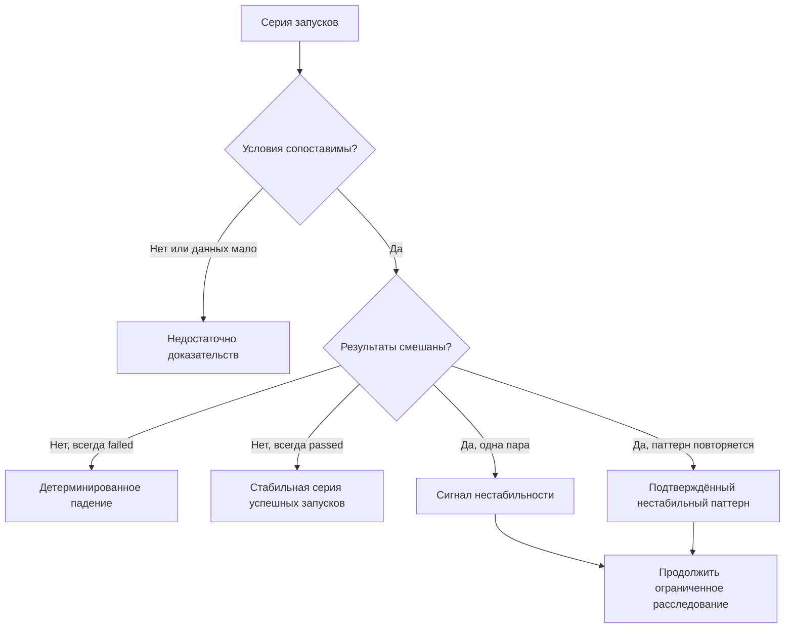

# Причины нестабильных тестов

## Связь с предыдущей главой

Главы 225–231 построили диагностический поток. Теперь этот поток нужен, чтобы отличать единичное падение от повторяемого нарушения детерминированности.

## Цель главы

Научиться классифицировать нестабильный результат по доказательствам и искать источник изменяющихся условий.

## Главный вопрос

> Какие нарушения детерминированности делают результат теста нестабильным?

## Мотивация

Одно падение не делает тест flaky. Даже один успешный повторный запуск даёт только сигнал нестабильности, который нужно подтвердить сопоставимой серией. Причиной может быть детерминированный дефект продукта, ошибка теста, недоступная инфраструктура или недостаток данных для вывода.

## Теория

### Детерминированность — это свойство, а не пожелание

Тест детерминирован, если при одинаковых входных данных и одинаковых **существенных условиях** он даёт одинаковый результат.

Вся тяжесть определения лежит на словах «существенные условия». Условий у запуска бесконечно много: температура процессора, точное время, порядок ответов сети. Существенными называются те, от которых результат зависит по замыслу. Если результат изменился, а все существенные условия совпадали, значит либо изменилось что-то ещё, либо это «что-то ещё» и было существенным, а мы об этом не знали.

Именно поэтому расследование нестабильности — это почти всегда поиск незамеченного условия, а не поиск ошибки в строке кода.

### Почему одного падения недостаточно

Одно падение — это одно наблюдение. Из него нельзя отличить четыре разные ситуации:

| Что произошло на самом деле | Как выглядит по одному падению |
| --- | --- |
| Детерминированный дефект продукта | Тест упал |
| Дефект теста: неверное ожидание | Тест упал |
| Инфраструктура не дала запуститься | Тест упал |
| Нарушение детерминированности | Тест упал |

Различить их может только серия сопоставимых запусков. Поэтому первый шаг расследования — не гипотеза о причине, а сбор наблюдений.

### Что считать сопоставимыми условиями

Два запуска сопоставимы, если совпадают:

- конфигурация и проект, включая браузер и его версию;
- исходное значение генератора тестовых данных;
- состояние данных на момент старта;
- режим параллельности: число рабочих процессов и признак полной параллельности;
- окружение и версия продукта;
- признак повторной попытки: первая попытка и повтор сравниваются отдельно.

Если хотя бы одно из этих условий различается, серия не даёт вывода о стабильности. Это отдельная классификация — **недостаточно доказательств**, а не «скорее всего нестабильный».

### Шесть источников изменяющегося условия

Ниже — не готовые диагнозы, а направления поиска. Каждое требует собственных доказательств.

**1. Неверное ожидание.** Locator совпадает более чем с одним элементом, проверка опирается на порядок, который сервер не гарантирует, или тест ждёт не тот признак готовности. Подтверждается тем, что при падении нужное состояние в продукте уже наступило.

**2. Общий изменяемый ресурс.** Одна учётная запись, одна запись в базе, один файл или один порт на несколько тестов. Подтверждается связью падений с одновременным выполнением конкретных тестов.

**3. Неуправляемые данные.** Тест опирается на данные, которые создал не он: остатки прошлого запуска, записи соседнего теста, зависимость от текущей даты. Подтверждается тем, что результат меняется вместе с составом данных, а не с кодом.

**4. Внешняя зависимость.** Сторонний сервис, сеть, системные часы, разрешение имён. Подтверждается диагностическими событиями на границе, а не догадкой.

**5. Состояние гонки и зависимость от порядка.** Асинхронная операция, результат которой не дождались; согласованность в конечном счёте между слоями; тест, работающий только после соседнего. Подтверждается изменением результата при изменении порядка или задержек.

**6. Исчерпание ресурса.** Под нагрузкой не хватает времени, соединений в пуле, памяти или свободных портов. Подтверждается связью падений с уровнем параллельности, а не с логикой теста.

### Что означает статус `flaky` в Playwright

Playwright присваивает статус `flaky` последовательности «упал, затем прошёл на повторе».

Этот статус доказывает ровно одно: **результаты попыток различались**. Он не указывает коренную причину, не говорит, что дефект находится в тесте, и не подтверждает корректность продукта. Статус — это вход в расследование, а не его итог.

### Классификация идёт за доказательствами

Порядок действий обратный привычному: сначала наблюдения, потом ярлык.

1. Собрать серию запусков и зафиксировать контекст каждого.
2. Проверить сопоставимость условий.
3. Классифицировать результат серии.
4. И только затем выдвигать гипотезу о причине.

Инфраструктурное падение выделяется отдельно и рассматривается первым: ошибка запуска браузера в ограниченной песочнице ничего не говорит о стабильности тестовой логики.

## Внутренний механизм


```mermaid
flowchart TD
    R[Серия запусков] --> C{Условия сопоставимы?}
    C -->|Нет или данных мало| U[Недостаточно доказательств]
    C -->|Да| S{Результаты смешаны?}
    S -->|Нет, всегда failed| D[Детерминированное падение]
    S -->|Нет, всегда passed| P[Стабильная серия успешных запусков]
    S -->|Да, одна пара| I[Сигнал нестабильности]
    S -->|Да, паттерн повторяется| F[Подтверждённый нестабильный паттерн]
    I --> A[Продолжить ограниченное расследование]
    F --> A
```

### Откуда берётся недетерминированность

| Источник | Как проявляется |
| --- | --- |
| время: пауза вместо условия | падает под нагрузкой, то есть в CI |
| общие данные | падает тот тест, который пришёл вторым |
| порядок тестов | падает при запуске по тегу или в другом сегменте |
| состояние браузера или процесса | падает второй тест в файле, но не первый |
| внешняя система | падает пачками, вместе с соседними тестами |

Все пять объединяет одно: результат зависит от чего-то, что тест не
контролирует. Поэтому первый вопрос расследования — не «где ошибка в коде», а
«что здесь не принадлежит тесту».

### Серия наблюдений вместо одного падения

```text
1 падение                 → скорее всего настоящий дефект
5 из 20 при одинаковых
   условиях               → сигнал нестабильности
5 из 20, но условия
   разные (workers, шард) → сравнивать нельзя, данных нет
```

Условия обязаны быть сопоставимы: число рабочих процессов меняет и нагрузку, и
конкуренцию за данные, поэтому прогоны с разным параллелизмом — это два разных
эксперимента.

Падение по таймауту при этом ничего не доказывает само по себе. Оно означает
лишь «условие не наступило вовремя», а причиной может быть и медленный стенд, и
неверное ожидание, и отсутствующие данные.

## Главная ментальная модель

Нестабильность — подтверждённый образец разных результатов, а не вывод из одного успешного повторного запуска и не удобное название для неизвестной причины.

## Практический пример

```text
examples/03-automation-qa/chapter-232/01-flaky-classification.stability.ts
```

Пример отделяет инфраструктурное падение, несопоставимый контекст, единичный сигнал и подтверждённый паттерн без случайности и таймеров. Минимум три запуска в примере — локальное учебное правило для фиксации повторения, а не универсальный порог Playwright.

## Automation QA

При первичном анализе отдельно рассматривают дефект продукта, дефект теста, конфликт данных, нестабильность окружения и инфраструктурное падение. Для каждого варианта нужны собственные доказательства.

Практический приём: прежде чем менять код теста, сформулируйте, **какое наблюдение опровергнет вашу гипотезу**. Если такого наблюдения не существует, гипотеза бесполезна и расследование пойдёт по кругу.

Второй приём: фиксируйте отпечаток контекста вместе с результатом каждого запуска. Без него через день невозможно понять, сопоставимы ли два падения, и серия наблюдений превращается в набор слухов.

## Компромиссы

Повторение запуска увеличивает объём наблюдений, но не заменяет анализ условий. Слишком ранний ярлык «нестабильный» останавливает расследование.

Длинная серия запусков даёт более уверенный вывод, но стоит времени и занимает исполнителей. Разумная граница задаётся заранее: сколько запусков команда готова потратить на подтверждение паттерна, решается до начала расследования, а не в процессе.

## Распространённые мифы

**Миф: тест упал один раз — значит он нестабильный.**
Одно падение не отличает нестабильность от детерминированного дефекта. Пока серии нет, корректная классификация — «недостаточно доказательств».

**Миф: повтор прошёл — значит проблема в тесте, а не в продукте.**
Разные результаты попыток означают, что изменилось какое-то условие. Этим условием может быть состояние продукта: например, вторая попытка застала систему уже согласованной.

**Миф: истечение срока ожидания доказывает состояние гонки.**
Истечение срока доказывает только, что ожидаемое состояние не наступило за отведённое время. Причиной может быть неверный признак готовности, нехватка ресурсов или настоящий дефект продукта.

**Миф: нестабильность — это всегда вина автоматизатора.**
Нарушение детерминированности часто живёт в продукте: несогласованные реплики, недетерминированный порядок выдачи, гонка на стороне сервера. Тест только делает её видимой.

**Миф: добавим ожидание — и починится.**
Ожидание устраняет симптом и скрывает источник. Если признак готовности выбран неверно, более длинное ожидание лишь отодвигает падение и делает набор медленнее.

## Частые вопросы

**Сколько запусков нужно для вывода?**
Универсального числа нет: оно зависит от частоты проявления. Полезное правило — договориться о границе заранее и записать её вместе с результатом, чтобы вывод можно было перепроверить.

**Тест падает раз в пятьдесят запусков. Это нестабильность?**
Да, если условия сопоставимы и разные результаты воспроизводятся. Редкость влияет на приоритет исправления, но не на классификацию.

**Воспроизводится только в CI. Что делать?**
Считать различие сред частью улики. Сравните то, что отличается: уровень параллельности, ресурсы, сетевые задержки, состояние данных. Чаще всего дело в них, а не в самом факте «другая машина».

**Браузер не запустился. Это нестабильность?**
Нет. Это инфраструктурное падение. Оно классифицируется отдельно и не участвует в оценке стабильности тестовой логики.

**Обязательно ли исправлять причину до возврата теста?**
Да. Возврат без исправления означает, что паттерн вернётся вместе с тестом, а доверие к набору снизится ещё раз.

## Распространённые ошибки

- Называть тест нестабильным после одного падения — однократное падение чаще означает настоящий дефект. Нестабильность — это разный результат при неизменном коде и окружении.

- Завершать классификацию после одного успешного повторного запуска — нестабильный тест проходит и без правок, поэтому один зелёный прогон не отличает исправление от совпадения.

- Считать истечение срока ожидания доказательством состояния гонки — таймаут означает лишь, что условие не наступило вовремя. Причиной может быть медленный стенд, неверное условие или отсутствующие данные.

- Использовать случайное падение как учебный пример — невоспроизводимый случай ничего не показывает. Разбирают тот, для которого известны условия.

- Смешивать инфраструктурный отказ с дефектом тестовой логики — недоступный стенд и неверное ожидание требуют разных действий, а в отчёте выглядят одинаково красными.

- Сравнивать запуски, выполненные при разном уровне параллельности — число рабочих процессов меняет и нагрузку, и конкуренцию за данные. Сравнение имеет смысл при одинаковых условиях.

- Менять код теста до того, как собрана серия наблюдений — правка по догадке уничтожает возможность увидеть закономерность, а падение возвращается позже и уже без свидетелей.

## Проверьте себя

1. Почему определение детерминированности опирается на «существенные условия», а не на «все условия»?
2. Какие четыре ситуации невозможно различить по одному падению?
3. Перечислите условия, которые должны совпадать, чтобы два запуска считались сопоставимыми.
4. Что именно доказывает статус `flaky` в Playwright и чего он не доказывает?
5. Почему инфраструктурное падение рассматривается раньше остальных вариантов?

### Ответы

1. Все условия совпасть не могут: время, порядок, состояние окружения меняются всегда. Детерминированность означает, что результат зависит только от тех условий, которые тест намеренно контролирует.
2. Нестабильность теста, плавающий дефект приложения, сбой окружения и конфликт данных с другим тестом.
3. Версия приложения, версия тестов, состояние данных, набор одновременно выполняемых тестов и конфигурация окружения.
4. Что тест упал и прошёл при повторе в том же прогоне. Он не доказывает, что дело в тесте: плавающий дефект приложения выглядит точно так же.
5. Оно объясняет сразу много падений и не требует разбора кода. Если стенд был недоступен, разбирать отдельные тесты бессмысленно.

## Краткие итоги

- Нестабильность требует повторяемых разных результатов в сопоставимых условиях.
- Детерминированное падение не является нестабильностью.
- Причина находится среди изменяющихся условий и ресурсов.
- Недостаток доказательств остаётся отдельной классификацией.
- Статус инструмента — вход в расследование, а не его результат.

## Практика

Практика встроена из соответствующего файла главы.

## Переход к следующей главе

После корректной классификации нужно воспроизвести паттерн и временно защитить основной сигнал. Этому посвящена глава 233.
