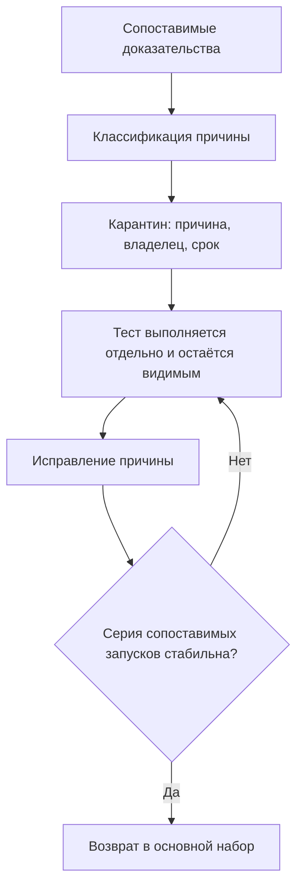

# Расследование и карантин нестабильных тестов

## Связь с предыдущей главой

Глава 232 определила flaky как подтверждённый паттерн. Теперь нужно доказать изменяющуюся причину и управлять тестом до исправления.

## Цель главы

Проектировать воспроизведение, карантин и проверку стабилизации с владельцем и конечным сроком.

## Главный вопрос

> Как доказать причину нестабильности и временно защитить основной сигнал тестового запуска?

## Мотивация

Нестабильный тест искажает сигнал всего набора, но удаление проверки создаёт слепую зону. Карантин сохраняет наблюдаемость, если имеет причину, владельца, срок и отдельный результат выполнения.

## Теория

### Расследование — это сужение множества условий

Подтверждённый паттерн говорит, что какое-то условие меняется. Расследование не угадывает причину, а последовательно исключает условия, пока не останется одно.

Работающий приём — двигаться от самого дешёвого исключения к самому дорогому:

1. Зафиксировать всё, что можно зафиксировать: зерно генератора, состояние данных, один рабочий процесс, один проект.
2. Проверить, сохраняется ли нестабильность. Если исчезла — причина среди зафиксированного.
3. Возвращать условия по одному, пока паттерн не вернётся.

Условие, возврат которого воскрешает паттерн, и есть кандидат на причину. Это не доказательство, но сильная улика, которую уже можно проверять прицельно.

### Стратегия воспроизведения задаётся заранее

До первого запуска нужно записать: сколько повторений выполняем, какие условия фиксируем, какие доказательства сохраняем и что будет считаться подтверждением.

Без такой записи расследование растягивается бесконечно: каждый новый запуск порождает соблазн «ещё разок», а накопленные наблюдения оказываются несопоставимыми между собой.

Доказательства каждого запуска должны содержать идентификаторы рабочего процесса, номер прогона и номер повтора. Без них две записи о падении невозможно сравнить, а значит невозможно использовать.

### Что такое карантин и чем он не является

Карантин — **временное отделение подтверждённо нестабильного теста от основного сигнала**, при котором тест продолжает выполняться и остаётся видимым.

Чем карантин не является:

- не удалением теста: удаление создаёт слепую зону, о которой никто не вспомнит;
- не `skip` без записи: пропуск без причины и срока становится вечным;
- не способом сделать запуск зелёным: цель — вернуть доверие к сигналу, а не покрасить отчёт.

Разница между карантином и пропуском ровно одна: у карантина есть срок и владелец.

### Обязательные поля записи карантина

Запись без любого из этих полей превращается в забытый пропуск:

| Поле | Зачем оно |
| --- | --- |
| Идентификатор теста | Однозначно связывает запись и проверку |
| Классификация | Отделяет дефект теста от дефекта продукта, данных, окружения |
| Причина | Формулирует текущую гипотезу, которую предстоит подтвердить |
| Отпечаток контекста | Позволяет позже понять, сопоставимы ли наблюдения |
| Доказательства | Делают вывод перепроверяемым другим человеком |
| Ссылка на задачу | Связывает карантин с работой по исправлению |
| Владелец | Отвечает за исправление; без него запись ничья |
| Дата пересмотра | Не даёт карантину стать постоянным |
| Условие возврата | Заранее определяет, что считать стабилизацией |

### Проверка стабилизации

Возврат из карантина требует не одного зелёного запуска, а серии сопоставимых запусков **после устранения причины**.

Логика та же, что при классификации: один успешный запуск отличает стабильный тест от нестабильного не лучше, чем одно падение отличало дефект от случайности. Дополнительно нужна регрессия, связанная с исправлением: она фиксирует, что именно было починено.

## Внутренний механизм


```mermaid
flowchart TD
    E[Сопоставимые доказательства] --> K[Классификация причины]
    K --> Q[Карантин: причина, владелец, срок]
    Q --> R[Тест выполняется отдельно и остаётся видимым]
    R --> FIX[Исправление причины]
    FIX --> S{Серия сопоставимых запусков стабильна?}
    S -->|Нет| R
    S -->|Да| BACK[Возврат в основной набор]
```

### Карантин — это отложенный долг, а не удаление

```text
тест нестабилен
   ├─ причина классифицирована      (дефект / окружение / тест)
   ├─ карточка: причина, владелец, срок
   ├─ тест выполняется ОТДЕЛЬНО и остаётся видимым
   └─ возврат после серии стабильных прогонов
```

Отличие карантина от `skip` — в трёх последних строках. Отключённый без
владельца и срока тест исчезает из внимания и остаётся отключённым годами;
карантин держит его в поле зрения и имеет условие выхода.

### Почему возврат подтверждают серией

| Наблюдение | Что доказывает |
| --- | --- |
| один зелёный прогон | ничего: нестабильный тест проходит и без правок |
| серия в прежних условиях | причина устранена в этих условиях |
| серия при параллельном запуске | устранена и конкуренция за ресурсы |

Условия серии должны совпадать с теми, в которых тест падал. Прогон одного теста
на свободной машине не воспроизводит ни нагрузку, ни соседей.

Размер карантина ограничивают сознательно: без предела набор отключённых тестов
растёт, и зелёный прогон перестаёт что-либо означать. Предел превращает
незаметный долг в видимое число.

## Главная ментальная модель

Карантин — временный договор об исправлении, а не способ сделать основной запуск зелёным.

## Практический пример

```text
examples/03-automation-qa/chapter-233/01-quarantine-record.stability.ts
```

Пример проверяет запись карантина и не допускает её без причины, сопоставимого контекста, доказательств, задачи, владельца или срока.

## Automation QA

Команда запускает тесты из карантина отдельно и продолжает сохранять результаты каждой попытки, поэтому история падений остаётся видимой. Возврат требует проверенного исправления, а не одного успешного запуска.

Полезная практика — ограничить размер карантина числом, а не здравым смыслом. Когда в карантине больше согласованного предела, команда останавливает добавление новых тестов и разбирает накопленные. Без такого предела карантин медленно превращается в свалку, а слепая зона растёт незаметно.

Вторая практика — регулярный пересмотр по дате, а не по случаю. Записи с истёкшим сроком должны попадать в обзор автоматически, иначе срок не выполняет свою функцию.

## Компромиссы

Карантин защищает основной сигнал, но уменьшает немедленную защиту продукта. Поэтому владелец и срок обязательны.

Строгие требования к записи замедляют помещение теста в карантин. Это осознанная цена: лёгкий карантин со временем поглощает набор, а трудоёмкий заставляет сначала подумать, действительно ли паттерн подтверждён.

## Распространённые мифы

**Миф: карантин — это цивилизованный способ отключить неудобный тест.**
Отличие в обязательствах. Запись с владельцем, сроком и условием возврата — это план работ; те же действия без записи — потеря проверки.

**Миф: если тест в карантине, его можно не запускать.**
Тест в карантине продолжает выполняться, просто его результат не влияет на основной сигнал. Переставший выполняться тест перестаёт накапливать доказательства, и расследование останавливается.

**Миф: чем больше повторений, тем ближе к причине.**
Повторения увеличивают объём наблюдений, но не сужают множество условий. Сужает его только изменение одного условия за раз.

**Миф: после исправления достаточно одного зелёного запуска.**
Один запуск не отличает исправленный тест от тесту повезло. Нужна серия в сопоставимых условиях.

## Частые вопросы

**Кто должен быть владельцем: автор теста или владелец продукта?**
Тот, кто может устранить причину. Если классификация указывает на продукт, владелец — команда продукта; если на тест — автоматизатор. Неопределённый владелец означает, что классификация не доведена до конца.

**Что делать, если срок истёк, а причина не найдена?**
Пересмотреть запись явно: продлить с новой датой и обоснованием либо признать, что проверка не окупает вложений, и удалить её осознанно. Молчаливое продление — худший вариант.

**Можно ли помещать в карантин целый набор?**
Можно, если классификация относится ко всему набору: например, общее окружение. Но карантин набора маскирует больше, поэтому срок должен быть короче.

**Как отличить карантин от технического долга?**
Карантин ограничен по времени и связан с конкретным исправлением. Если у записи нет условия возврата, это уже не карантин, а решение отказаться от проверки.

## Распространённые ошибки

- Использовать `skip` без владельца и срока — отключённый тест исчезает из внимания и остаётся отключённым годами. В карточке карантина фиксируют, кто отвечает и до какой даты.

- Удалять нестабильный тест — вместе с ним исчезает проверка поведения, а причина нестабильности (обычно общие данные или неверное ожидание) остаётся и проявится в другом тесте.

- Считать много повторений доказательством конкретной причины — серия показывает частоту, а не механизм. Причину подтверждает воспроизведение при управляемом условии.

- Возвращать тест после одного успешного запуска — нестабильный тест проходит и без исправления. Возврат подтверждают серией прогонов в условиях, где он падал.

- Менять несколько условий одновременно при воспроизведении — становится неизвестно, какое из них влияет, и наблюдение приходится начинать заново.

- Оставлять карантин без предела по размеру — набор отключённых тестов растёт, и в какой-то момент зелёный прогон перестаёт что-либо значить. Предел делает долг видимым.

## Проверьте себя

1. Почему при воспроизведении условия возвращают по одному, а не все сразу?
2. Что отличает карантин от обычного пропуска теста?
3. Какие поля записи карантина не дают ей стать вечной?
4. Почему тест в карантине продолжают запускать?
5. Что требуется для возврата теста в основной набор, кроме зелёного запуска?

### Ответы

1. Иначе непонятно, какое именно условие вызывает падение. По одному — и первое же воспроизведение указывает на причину.
2. У карантина есть владелец, срок и причина, а тест продолжает запускаться. Пропуск просто убирает тест из набора и не обязывает ни к чему.
3. Владелец, дата помещения и срок пересмотра, а также ссылка на задачу расследования.
4. Чтобы видеть, изменилось ли поведение, и собирать историю для расследования. Невыполняемый тест перестаёт давать данные.
5. Понятая и устранённая причина. Серия зелёных запусков без объяснения означает лишь, что условие пока не совпало.

## Краткие итоги

- Расследование сужает множество условий, а не угадывает причину.
- Стратегия воспроизведения фиксируется до запусков.
- Карантин сохраняет отдельный сигнал и остаётся видимым.
- Владелец и срок предотвращают постоянную изоляцию.
- Возврат требует проверки стабильности и связанной регрессии.

## Практика

Практика встроена из соответствующего файла главы.

## Переход к следующей главе

Повторный запуск может дать дополнительный сигнал, но требует строгой политики. Её рассматривает глава 234.
