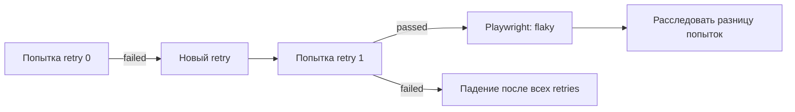

# Retry policy

## Связь с предыдущей главой

Глава 233 отделила расследование от временного карантина. Retry также не исправляет причину: он лишь создаёт следующую попытку после падения.

## Цель главы

Понимать жизненный цикл retry, различать попытки и использовать retry только как ограниченный диагностический и операционный механизм.

## Главный вопрос

> Когда повторный запуск даёт диагностический сигнал, а когда скрывает дефект?

## Мотивация

Успешный retry получает в Playwright статус flaky и показывает, что результаты попыток различаются. Он не доказывает, что коренная причина находится в самом тесте, не подтверждает корректность продукта и не объясняет первое падение.

## Теория

Playwright повторяет упавший тест до настроенного числа retries. `testInfo.retry` равен `0` для первой попытки и увеличивается при повторных. После падения теста Playwright завершает процесс worker; retry получает новый `workerIndex`, а его `parallelIndex` сохраняет тот же слот параллельного выполнения. Поэтому состояние модуля нельзя считать общим между попытками.

Retry отличается от `--repeat-each`: retry следует за падением, а повторение набора запускает тест независимо от результата и использует `repeatEachIndex`. Retry не заменяет polling, автоматические ожидания, изоляцию или очистку. Доказательства первой и следующих попыток должны различаться по идентификатору выполнения.

## Внутренний механизм



## Главная ментальная модель

Retry — ещё одно измерение, а не лечение нестабильности.

## Практический пример

```text
examples/03-automation-qa/controlled-instability/01-retry-signal.controlled.ts
```

Изолированный пример детерминированно падает при `retry === 0` и проходит при `retry === 1`. В этом сценарии `repeatEachIndex` остаётся равным `0`. Доказательства каждой попытки прикладываются отдельно, а локальное состояние попытки удаляется через `finally`; основной набор этот файл не обнаруживает.

С одним retry Playwright сообщает `1 flaky` и завершает процесс с кодом `0`; с `--retries=0` та же исходная попытка остаётся failed и даёт код `1`. Конкретные значения `workerIndex` можно наблюдать в доказательствах, но логика теста не должна зависеть от самих чисел.

## Automation QA

Доказательства включают индекс retry, идентификатор worker и безопасный контекст. Метрика flaky-результатов помогает приоритизировать исправления, но не заменяет анализ коренной причины.

## Компромиссы

Retry уменьшает число красных запусков из-за подтверждённой внешней нестабильности, но увеличивает время выполнения и может скрывать детерминированный дефект.

## Распространённые ошибки

- Включать неограниченные retries.
- Называть успешный retry исправлением.
- Путать retry с polling.
- Разделять изменяемое состояние между попытками.

## Краткие итоги

- Retry запускается только после падения.
- `retry` и `repeatEachIndex` описывают разные оси.
- Успешный retry получает статус flaky в Playwright и требует расследовать различие попыток.
- Причину всё равно нужно устранить.

## Практика

Практика встроена из соответствующего файла главы.

## Переход к следующей главе

Retry выполняется в новом процессе worker. Глава 235 объяснит жизненный цикл worker и общие внешние ресурсы.
