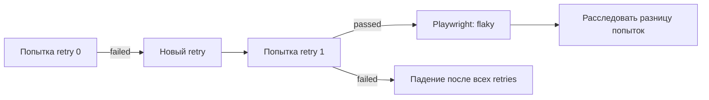

# Retry policy

## Связь с предыдущей главой

Глава 233 отделила расследование от временного карантина. Retry также не исправляет причину: он лишь создаёт следующую попытку после падения.

## Цель главы

Понимать жизненный цикл retry, различать попытки и использовать retry только как ограниченный диагностический и операционный механизм.

## Главный вопрос

> Когда повторный запуск даёт диагностический сигнал, а когда скрывает дефект?

## Мотивация

Успешный retry получает в Playwright статус flaky и показывает, что результаты попыток различаются. Он не доказывает, что коренная причина находится в самом тесте, не подтверждает корректность продукта и не объясняет первое падение.

## Теория

### Что происходит при retry

Playwright повторяет упавший тест до настроенного числа retries. Ключевые свойства попытки:

- `testInfo.retry` равен `0` для первой попытки и увеличивается при повторных;
- после падения теста Playwright завершает процесс worker;
- retry получает новый `workerIndex`, а его `parallelIndex` сохраняет тот же слот параллельного выполнения.

Из завершения worker следует практический вывод: **состояние модуля не переживает падение**. Переменная верхнего уровня, кэш, счётчик и любое «запомним между тестами» на retry начинаются заново. Тест, который на это опирался, будет вести себя по-разному в первой и последующих попытках — и это выглядит как нестабильность продукта, хотя причина в тесте.

### Retry и repeat — разные оси

Эти два механизма часто путают, потому что оба «запускают тест ещё раз».

| | retry | `--repeat-each` |
| --- | --- | --- |
| Когда запускается | Только после падения | Всегда, независимо от результата |
| Что означает | Ещё одна попытка того же теста | Независимый повторный запуск |
| Идентификатор | `testInfo.retry` | `testInfo.repeatEachIndex` |
| Для чего нужен | Операционная устойчивость, доказательства | Поиск нестабильности, накопление серии |

Для расследования из главы 232 нужен именно repeat: он даёт сопоставимую серию. Retry для этой цели не подходит, потому что запускается только после падения и потому смещает выборку.

### Чего retry не заменяет

Retry не является заменой:

- **автоматическим ожиданиям** — если ожидание выбрано неверно, вторая попытка просто повторит ошибку чаще;
- **polling для eventual consistency** — согласованности нужно дождаться внутри теста, а не за счёт повторного прогона целиком;
- **изоляции данных** — конфликт между тестами повторится, пока ресурс общий;
- **очистке** — остаточное состояние после первой попытки может сделать вторую попытку «успешной» по неверной причине.

Последний пункт — самый коварный: retry иногда проходит именно потому, что первая попытка оставила после себя данные, которых изначально не было.

### Когда retry оправдан

Retry уместен, когда выполнены два условия одновременно:

1. Источник нестабильности подтверждён и находится **вне** контроля теста — например, известная нестабильность внешней среды.
2. Количество retries ограничено и зафиксировано в конфигурации.

Во всех остальных случаях retry откладывает расследование и покупает зелёный отчёт ценой доверия к нему.

### Retry как источник доказательств

Даже когда retry включён операционно, у него есть диагностическая ценность: различие между попытками — это улика.

Чтобы улика была пригодной, доказательства попыток должны различаться по идентификатору выполнения. Если трассировки, скриншоты и логи обеих попыток пишутся в одно место, различие теряется, и главный вопрос — «что изменилось между попытками» — остаётся без ответа.

## Внутренний механизм



## Главная ментальная модель

Retry — ещё одно измерение, а не лечение нестабильности.

## Практический пример

```text
examples/03-automation-qa/controlled-instability/01-retry-signal.controlled.ts
```

Изолированный пример детерминированно падает при `retry === 0` и проходит при `retry === 1`. В этом сценарии `repeatEachIndex` остаётся равным `0`. Доказательства каждой попытки прикладываются отдельно, а локальное состояние попытки удаляется через `finally`; основной набор этот файл не обнаруживает.

С одним retry Playwright сообщает `1 flaky` и завершает процесс с кодом `0`; с `--retries=0` та же исходная попытка остаётся failed и даёт код `1`. Конкретные значения `workerIndex` можно наблюдать в доказательствах, но логика теста не должна зависеть от самих чисел.

```text
examples/03-automation-qa/chapter-234/01-retry-and-repeat-identity.stability.ts
```

Второй пример показывает, что идентификатор выполнения содержит обе оси сразу: номер повторения и номер попытки. Именно поэтому доказательства двух попыток не смешиваются.

## Automation QA

Доказательства включают индекс retry, идентификатор worker и безопасный контекст. Метрика flaky-результатов помогает приоритизировать исправления, но не заменяет анализ коренной причины.

Разумная операционная политика выглядит так: retries включены в CI и выключены локально. В CI они гасят известную внешнюю нестабильность, а локально автор сразу видит настоящий результат своего теста и не привыкает к зелёному отчёту, который получен со второй попытки.

Отдельно стоит следить за долей flaky-результатов во времени. Растущая доля означает, что retry используется как обезболивающее: набор остаётся зелёным, а нестабильность накапливается.

## Компромиссы

Retry уменьшает число красных запусков из-за подтверждённой внешней нестабильности, но увеличивает время выполнения и может скрывать детерминированный дефект.

Чем больше retries, тем выше вероятность, что случайно пройдёт даже настоящий дефект продукта. Поэтому число попыток — это не настройка удобства, а решение о том, какую долю ложно-зелёных результатов команда готова принять.

## Распространённые мифы

**Миф: успешный retry означает, что тест починился.**
Он означает, что две попытки дали разные результаты. Причина не устранена и проявится снова.

**Миф: retry — это то же самое, что ожидание.**
Ожидание работает внутри теста и дожидается конкретного состояния. Retry перезапускает тест целиком и ничего не дожидается.

**Миф: включить retries — безопасное решение по умолчанию.**
Retries меняют смысл отчёта: часть падений перестаёт быть видимой сразу. Это решение с последствиями, а не нейтральная настройка.

**Миф: retry воспроизводит условия первой попытки.**
Retry выполняется в новом процессе worker, поэтому состояние модуля сбрасывается, а окружение может отличаться. Это другая попытка, а не та же самая.

## Частые вопросы

**Сколько retries ставить?**
Начните с нуля и повышайте только под подтверждённую внешнюю нестабильность. Практический ориентир — один retry: он даёт различие попыток для диагностики, но почти не маскирует детерминированные дефекты.

**Почему retry проходит, а локально тест стабилен?**
Чаще всего различаются уровень параллельности и состояние данных. Сравните эти два условия прежде, чем искать причину в коде.

**Можно ли включить retries только для части тестов?**
Да, через отдельный project или конфигурацию запуска. Это честнее глобального значения: видно, какие именно проверки опираются на повторную попытку.

**Retry прошёл — нужно ли заводить issue?**
Да, если паттерн подтверждён. Статус flaky без задачи на исправление означает, что нестабильность принята молча.

## Распространённые ошибки

- Включать неограниченные retries.
- Называть успешный retry исправлением.
- Путать retry с polling.
- Разделять изменяемое состояние между попытками.
- Писать доказательства обеих попыток в одно место.
- Использовать retry вместо изоляции данных.

## Проверьте себя

1. Что происходит с процессом worker после падения теста и почему это важно для состояния модуля?
2. Чем `testInfo.retry` отличается от `repeatEachIndex` по смыслу и по моменту запуска?
3. Почему для расследования нестабильности нужен repeat, а не retry?
4. При каких двух условиях retry оправдан?
5. Почему доказательства разных попыток должны различаться по идентификатору?

## Краткие итоги

- Retry запускается только после падения.
- `retry` и `repeatEachIndex` описывают разные оси.
- Успешный retry получает статус flaky в Playwright и требует расследовать различие попыток.
- Состояние модуля не переживает падение: worker завершается.
- Причину всё равно нужно устранить.

## Практика

Практика встроена из соответствующего файла главы.

## Переход к следующей главе

Retry выполняется в новом процессе worker. Глава 235 объяснит жизненный цикл worker и общие внешние ресурсы.
