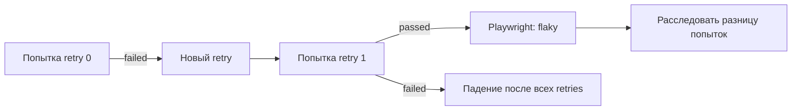

# Политика повторов

## Связь с предыдущей главой

Глава 233 отделила расследование от временного карантина. Retry также не исправляет причину: он лишь создаёт следующую попытку после падения.

## Цель главы

Понимать жизненный цикл retry, различать попытки и использовать retry только как ограниченный диагностический и операционный механизм.

## Главный вопрос

> Когда повторный запуск даёт диагностический сигнал, а когда скрывает дефект?

## Мотивация

Успешный retry получает в Playwright статус flaky и показывает, что результаты попыток различаются. Он не доказывает, что коренная причина находится в самом тесте, не подтверждает корректность продукта и не объясняет первое падение.

## Теория

### Что происходит при повторе

Playwright повторяет упавший тест до настроенного числа попыток. Ключевые свойства попытки:

- `testInfo.retry` равен `0` для первой попытки и увеличивается при повторных;
- после падения теста Playwright завершает рабочий процесс;
- повтор получает новый `workerIndex`, а его `parallelIndex` сохраняет тот же слот параллельного выполнения.

Из завершения рабочего процесса следует практический вывод: **состояние модуля не переживает падение**. Переменная верхнего уровня, кэш, счётчик и любое «запомним между тестами» при повторе начинаются заново. Тест, который на это опирался, будет вести себя по-разному в первой и последующих попытках — и это выглядит как нестабильность продукта, хотя причина в тесте.

### Повтор после падения и повторный прогон — разные оси

Эти два механизма часто путают, потому что оба «запускают тест ещё раз».

| | retry | `--repeat-each` |
| --- | --- | --- |
| Когда запускается | Только после падения | Всегда, независимо от результата |
| Что означает | Ещё одна попытка того же теста | Независимый повторный запуск |
| Идентификатор | `testInfo.retry` | `testInfo.repeatEachIndex` |
| Для чего нужен | Операционная устойчивость, доказательства | Поиск нестабильности, накопление серии |

Для расследования из главы 232 нужен именно повторный прогон: он даёт сопоставимую серию. Повтор после падения для этой цели не подходит, потому что запускается только после падения и потому смещает выборку.

### Чего повтор не заменяет

Повтор не является заменой:

- **автоматическим ожиданиям** — если ожидание выбрано неверно, вторая попытка просто повторит ошибку чаще;
- **опроса при согласованности в конечном счёте** — согласованности нужно дождаться внутри теста, а не за счёт повторного прогона целиком;
- **изоляции данных** — конфликт между тестами повторится, пока ресурс общий;
- **очистке** — остаточное состояние после первой попытки может сделать вторую попытку «успешной» по неверной причине.

Последний пункт — самый коварный: повтор иногда проходит именно потому, что первая попытка оставила после себя данные, которых изначально не было.

### Когда повтор оправдан

Повтор уместен, когда выполнены два условия одновременно:

1. Источник нестабильности подтверждён и находится **вне** контроля теста — например, известная нестабильность внешней среды.
2. Количество попыток ограничено и зафиксировано в конфигурации.

Во всех остальных случаях повтор откладывает расследование и покупает зелёный отчёт ценой доверия к нему.

### Повтор как источник доказательств

Даже когда повтор включён операционно, у него есть диагностическая ценность: различие между попытками — это улика.

Чтобы улика была пригодной, доказательства попыток должны различаться по идентификатору выполнения. Если трассировки, скриншоты и логи обеих попыток пишутся в одно место, различие теряется, и главный вопрос — «что изменилось между попытками» — остаётся без ответа.

## Внутренний механизм


```mermaid
flowchart LR
    A[Попытка retry 0] -->|failed| B[Новый retry]
    B --> C[Попытка retry 1]
    C -->|passed| F[Playwright: flaky]
    C -->|failed| D[Падение после всех retries]
    F --> I[Расследовать разницу попыток]
```

### Что происходит при повторе

```text
попытка 0 упала
   ├─ рабочий процесс ЗАМЕНЯЕТСЯ новым
   ├─ файл загружается заново, beforeAll выполняется снова
   ├─ фикстуры создаются с нуля
   └─ артефакты попытки складываются в СВОЙ каталог (retry-1)
```

Повтор — это не повторный вызов тела теста, а новый прогон теста в чистом
процессе. Поэтому состояние в памяти не переносится, а всё, что лежало на
верхнем уровне модуля, создаётся заново.

Данные на стенде при этом не обнуляются: если первая попытка что-то создала и не
убрала, вторая начнётся на её остатках.

### Итоговый статус и что он значит

| Попытка 0 | Попытка 1 | Итог в отчёте |
| --- | --- | --- |
| упала | прошла | `flaky` |
| упала | упала | `failed` |
| прошла | — | `passed` |

Строка `flaky` — это не «успех»: прогон сообщает, что тест дал разный результат
при неизменном коде. Её место — в списке долга, а не в списке прошедших.

Повтор и опрос при этом решают разные задачи: опрос ждёт наступления условия
**внутри** теста, повтор запускает тест целиком. Конкуренцию за общие данные
повтор не лечит — он воспроизводит её с той же вероятностью.

## Главная ментальная модель

Повтор — ещё одно измерение, а не лечение нестабильности.

## Практический пример

```text
examples/03-automation-qa/controlled-instability/01-retry-signal.controlled.ts
```

Изолированный пример детерминированно падает при `retry === 0` и проходит при `retry === 1`. В этом сценарии `repeatEachIndex` остаётся равным `0`. Доказательства каждой попытки прикладываются отдельно, а локальное состояние попытки удаляется через `finally`; основной набор этот файл не обнаруживает.

С одним повтором Playwright сообщает `1 flaky` и завершает процесс с кодом `0`; с `--retries=0` та же исходная попытка остаётся неуспешной и даёт код `1`. Конкретные значения `workerIndex` можно наблюдать в доказательствах, но логика теста не должна зависеть от самих чисел.

```text
examples/03-automation-qa/chapter-234/01-retry-and-repeat-identity.stability.ts
```

Второй пример показывает, что идентификатор выполнения содержит обе оси сразу: номер повторения и номер попытки. Именно поэтому доказательства двух попыток не смешиваются.

## Automation QA

Доказательства включают номер повтора, идентификатор рабочего процесса и безопасный контекст. Доля нестабильных результатов помогает приоритизировать исправления, но не заменяет анализ коренной причины.

Разумная операционная политика выглядит так: повторы включены в CI и выключены локально. В CI они гасят известную внешнюю нестабильность, а локально автор сразу видит настоящий результат своего теста и не привыкает к зелёному отчёту, который получен со второй попытки.

Отдельно стоит следить за долей нестабильных результатов во времени. Растущая доля означает, что повтор используется как обезболивающее: набор остаётся зелёным, а нестабильность накапливается.

## Компромиссы

Повтор уменьшает число красных запусков из-за подтверждённой внешней нестабильности, но увеличивает время выполнения и может скрывать детерминированный дефект.

Чем больше попыток, тем выше вероятность, что случайно пройдёт даже настоящий дефект продукта. Поэтому число попыток — это не настройка удобства, а решение о том, какую долю ложно-зелёных результатов команда готова принять.

## Распространённые мифы

**Миф: успешный повтор означает, что тест починился.**
Он означает, что две попытки дали разные результаты. Причина не устранена и проявится снова.

**Миф: повтор — это то же самое, что ожидание.**
Ожидание работает внутри теста и дожидается конкретного состояния. Повтор перезапускает тест целиком и ничего не дожидается.

**Миф: включить повторы — безопасное решение по умолчанию.**
Повторы меняют смысл отчёта: часть падений перестаёт быть видимой сразу. Это решение с последствиями, а не нейтральная настройка.

**Миф: повтор воспроизводит условия первой попытки.**
Повтор выполняется в новом рабочем процессе, поэтому состояние модуля сбрасывается, а окружение может отличаться. Это другая попытка, а не та же самая.

## Частые вопросы

**Сколько повторов ставить?**
Начните с нуля и повышайте только под подтверждённую внешнюю нестабильность. Практический ориентир — один повтор: он даёт различие попыток для диагностики, но почти не маскирует детерминированные дефекты.

**Почему повтор проходит, а локально тест стабилен?**
Чаще всего различаются уровень параллельности и состояние данных. Сравните эти два условия прежде, чем искать причину в коде.

**Можно ли включить повторы только для части тестов?**
Да, через отдельный проект или конфигурацию запуска. Это честнее общего значения: видно, какие именно проверки опираются на повторную попытку.

**Повтор прошёл — нужно ли заводить задачу?**
Да, если образец подтверждён. Статус `flaky` без задачи на исправление означает, что нестабильность принята молча.

## Распространённые ошибки

- Включать неограниченное число повторов — прогон становится непредсказуемым по времени, а настоящий дефект прячется за очередной попыткой.

- Называть успешный повтор исправлением — повтор скрывает симптом, не меняя причину. В отчёте такой тест помечен как нестабильный, и это пометка о долге.

- Путать повтор с опросом — опрос ждёт наступления условия внутри одного теста, повтор запускает тест целиком заново. Опрос уместен, повтор — компромисс.

- Разделять изменяемое состояние между попытками — вторая попытка начинается на данных, оставленных первой, и падает по другой причине. Каждая попытка обязана готовить своё состояние.

- Писать доказательства обеих попыток в одно место — артефакты перетирают друг друга, и в отчёте остаётся картина последней попытки. Путь включает номер попытки.

- Использовать повтор вместо изоляции данных — конфликт за общую запись повтором не лечится: он повторится с той же вероятностью.

## Проверьте себя

1. Что происходит с рабочим процессом после падения теста и почему это важно для состояния модуля?
2. Чем `testInfo.retry` отличается от `repeatEachIndex` по смыслу и по моменту запуска?
3. Почему для расследования нестабильности нужен повторный прогон, а не повтор после падения?
4. При каких двух условиях повтор оправдан?
5. Почему доказательства разных попыток должны различаться по идентификатору?

### Ответы

1. Процесс завершается и создаётся новый. Состояние модулей — кэши, счётчики, соединения — обнуляется, поэтому повтор идёт не в том же окружении, что первая попытка.
2. `testInfo.retry` — номер повторной попытки после падения, повтор запускается только при отказе. `repeatEachIndex` — номер запуска при намеренном многократном прогоне, он выполняется независимо от результата.
3. Повтор при падении запускается только после отказа и в новом процессе. Для сбора статистики нужен одинаковый многократный запуск, дающий сопоставимые результаты.
4. Когда причина действительно временная и внешняя по отношению к тесту, и когда каждая попытка сохраняет свои доказательства для последующего разбора.
5. Иначе артефакты попыток перезаписывают друг друга, и от упавшей попытки не остаётся ничего — именно от той, которую нужно разбирать.

## Краткие итоги

- Повтор запускается только после падения.
- `retry` и `repeatEachIndex` описывают разные оси.
- Успешный повтор получает статус `flaky` в Playwright и требует расследовать различие попыток.
- Состояние модуля не переживает падение: рабочий процесс завершается.
- Причину всё равно нужно устранить.

## Практика

Практика встроена из соответствующего файла главы.

## Переход к следующей главе

Повтор выполняется в новом рабочем процессе. Глава 235 объяснит жизненный цикл рабочего процесса и общие внешние ресурсы.
