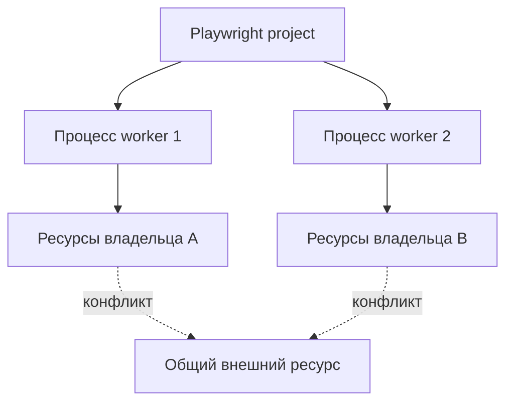

# Workers и shared resources

## Связь с предыдущей главой

Глава 234 показала, что разные попытки не обязаны выполняться в одном процессе. Теперь нужно понять, как Playwright распределяет тесты между workers.

## Цель главы

Различать worker, project и попытку, а также назначать явного владельца каждому внешнему ресурсу.

## Главный вопрос

> Как Playwright Test распределяет работу и какие ресурсы нельзя разделять между workers без координации?

## Мотивация

Два независимых теста могут конфликтовать, если используют одну учётную запись, запись базы данных, файл или лимит внешнего сервиса. Уменьшение числа workers скрывает конфликт, но не устраняет общее изменяемое состояние.

## Теория

Worker — отдельный процесс Playwright. Fixture уровня worker создаётся один раз для процесса и очищается при его завершении. `workerIndex` уникален для созданного процесса worker; при замене worker он меняется. `parallelIndex` обозначает слот параллельного выполнения и сохраняется при такой замене, поэтому эти индексы нельзя смешивать.

Project задаёт набор настроек и умножает запуски, но не является worker. Число workers не гарантирует изоляцию данных. Общие учётные записи, записи базы данных и внешние лимиты требуют разделения ресурсов, координатора или полностью независимых данных.

Идентификатор выполнения разделяет project и shard, слот `parallelIndex`, процесс `workerIndex`, повторение `repeatEachIndex` и попытку `retry`. Короткое название помогает читать имя ресурса, а хеш полного `titlePath` различает одинаковые названия во вложенных группах и сохраняет ограниченную длину. Это локальный идентификатор учебного запуска, а не универсальный распределённый ID: в него нельзя включать секреты или приватные пути, а очистка должна использовать сохранённый точный путь собственного ресурса.

## Внутренний механизм



## Главная ментальная модель

Worker исполняет тесты, но изоляция появляется только у ресурсов с явным владельцем.

## Практический пример

```text
examples/03-automation-qa/chapter-235/01-worker-owned-resource.stability.ts
```

Пример строит ограниченный идентификатор ресурса из project, shard, `parallelIndex`, `workerIndex`, `repeatEachIndex`, `retry` и хеша полного `titlePath`.

## Automation QA

Для общей учётной записи используют заранее выделенный пул; для записи базы данных — уникальное пространство имён; для файлов — `testInfo.outputPath()`. Очистка удаляет только ресурс текущего владельца.

## Компромиссы

Разделение ресурсов требует дополнительной конфигурации и доступных данных. Один worker проще, но снижает скорость и может скрыть архитектурный конфликт.

## Распространённые ошибки

- Считать project и worker одним понятием.
- Использовать `workerIndex` как глобально стабильный идентификатор между запусками.
- Удалять данные другого worker при очистке.
- Считать `workers: 1` окончательным исправлением.

## Краткие итоги

- Worker — отдельный процесс.
- Project не является worker.
- Идентификатор worker помогает разделять ресурсы, но сам по себе не создаёт изоляцию.
- Каждый общий ресурс требует владельца и точной очистки.

## Практика

Практика встроена из соответствующего файла главы.

## Переход к следующей главе

Когда у ресурсов появились явные владельцы, набор тестов можно безопасно ускорять. Режимы параллельного выполнения рассматривает глава 236.
