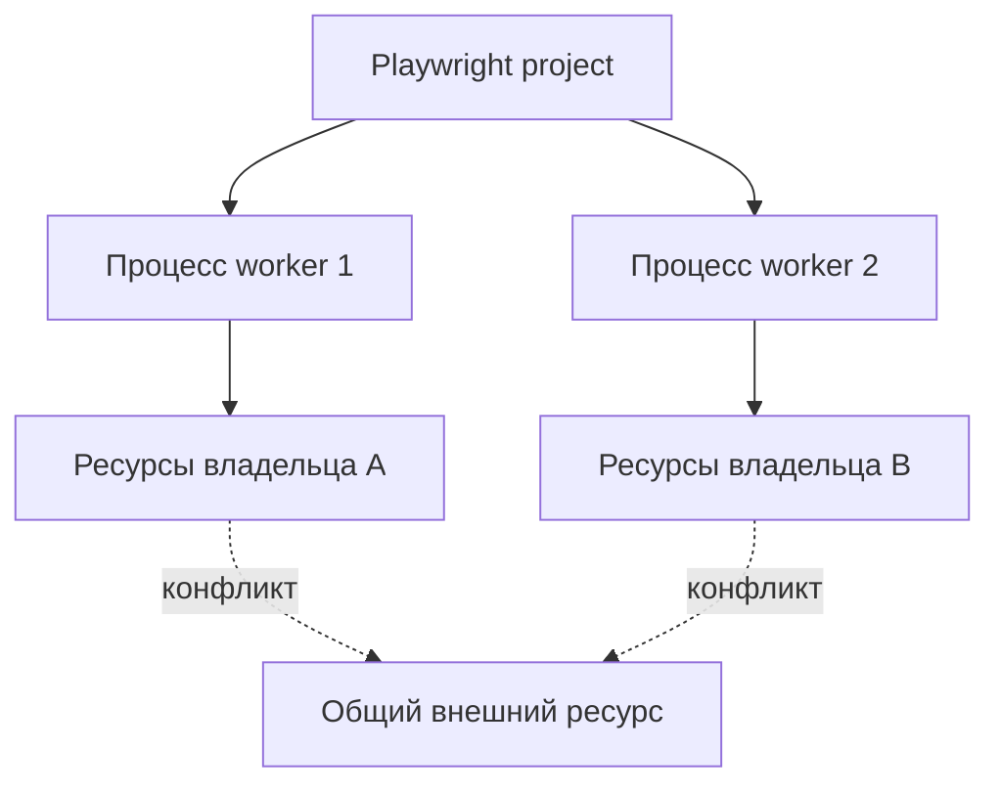

# Workers и общие ресурсы

## Связь с предыдущей главой

Глава 234 показала, что retry выполняется в новом процессе worker. Теперь нужно понять сам процесс и то, какие ресурсы он не может делить с соседями.

## Цель главы

Разделять понятия worker, project и слот выполнения, находить общее изменяемое состояние и давать каждому ресурсу явного владельца.

## Главный вопрос

> Как Playwright Test распределяет работу и какие ресурсы нельзя разделять между рабочими процессами без координации?

## Мотивация

Два независимых теста могут конфликтовать, если используют одну учётную запись, запись базы данных, файл или лимит внешнего сервиса. Уменьшение числа workers скрывает конфликт, но не устраняет общее изменяемое состояние.

## Теория

### Worker — это процесс

Worker — отдельный процесс операционной системы, в котором Playwright выполняет тесты.

Из этого следует всё остальное поведение:

- память не разделяется между процессами: переменная модуля в одном процессе невидима другому;
- фикстура уровня рабочего процесса создаётся один раз на процесс и очищается при его завершении;
- падение теста завершает процесс, и следующая попытка получает новый рабочий процесс.

Процессы изолируют **память**. Они не изолируют ничего за пределами процесса: базу данных, файловую систему, учётные записи, внешние сервисы.

### `workerIndex` и `parallelIndex` — разные вещи

Два индекса легко перепутать, и эта путаница приводит к конфликтам данных.

| | `workerIndex` | `parallelIndex` |
| --- | --- | --- |
| Что обозначает | Конкретный созданный процесс | Слот параллельного выполнения |
| При замене процесса | Меняется | Сохраняется |
| Диапазон | Растёт за время запуска | От 0 до числа процессов минус один |
| Для чего подходит | Диагностика: какой процесс что делал | Привязка к ограниченному пулу ресурсов |

Практическое следствие: если учётных записей ровно столько же, сколько рабочих процессов, привязывать их нужно к `parallelIndex`. При использовании `workerIndex` после первого же падения индекс вырастет и выйдет за пределы пула.

### Проект — не рабочий процесс

Проект задаёт набор настроек: браузер, `baseURL`, сохранённое состояние, сроки ожидания. Один и тот же тест может выполняться в нескольких проектах и тогда запустится несколько раз.

Проект умножает **количество запусков**, а рабочий процесс определяет, **в каком процессе** запуск произойдёт. Это независимые измерения: два теста из разных проектов могут выполняться в одном процессе, а два теста одного проекта — в разных.

### Что делает ресурс общим

Ресурс является общим, если два параллельных теста могут одновременно его изменять. Типичные кандидаты:

- одна учётная запись, у которой есть состояние: корзина, активная сессия, лимит попыток входа;
- строка или таблица базы данных, которую тесты читают и меняют;
- файл с фиксированным именем;
- внешний сервис с лимитом запросов;
- порт, каталог, глобальная настройка окружения.

Признак, по которому это распознаётся заранее: **у ресурса есть имя, которое тест не выбирал сам**. Если имя фиксировано в коде, рано или поздно два теста встретятся на нём одновременно.

### Три способа дать ресурсу владельца

**Пул по слоту.** Ресурсов ровно столько, сколько слотов параллельного выполнения; тест берёт свой по `parallelIndex`. Подходит для учётных записей и других заранее созданных сущностей.

**Уникальное пространство имён.** Тест создаёт данные с идентификатором, который никто больше не использует: собственный номер запуска, уникальный префикс, отдельная схема. Подходит для записей базы данных.

**Ресурс, выданный фреймворком.** Для файлов это `testInfo.outputPath()`: путь гарантированно принадлежит конкретному тесту и не пересекается с соседями.

### Очистка удаляет только своё

Очистка, написанная как «удалить всё лишнее», в параллельном запуске удаляет данные соседнего теста — и порождает нестабильность, которую потом ищут неделями.

Правило простое: **удалять по сохранённому точному идентификатору собственного ресурса**, а не по маске, дате или признаку «похоже на тестовые данные».

## Внутренний механизм


```mermaid
flowchart TD
    P[Playwright project] --> W1[Процесс worker 1]
    P --> W2[Процесс worker 2]
    W1 --> R1[Ресурсы владельца A]
    W2 --> R2[Ресурсы владельца B]
    R1 -. конфликт .-> X[Общий внешний ресурс]
    R2 -. конфликт .-> X
```

### Два индекса, и они разные

```text
workerIndex    0, 1, 2, 3, 4 …   растёт весь прогон, новый при каждом перезапуске
parallelIndex  0, 1, 2, 3        от 0 до (workers − 1), ПЕРЕИСПОЛЬЗУЕТСЯ
```

Рабочий процесс заменяется после неуспешного теста, и тогда появляется новый
`workerIndex`. Значит, число различных значений за прогон заранее неизвестно и
может превысить число одновременно работающих процессов.

| Для чего | Какой индекс |
| --- | --- |
| пул заранее созданных учётных записей или схем | `parallelIndex` — их ровно `workers` |
| уникальное имя артефакта или записи | `workerIndex` вместе с идентификатором теста |

Привязка пула к `workerIndex` даёт запросы к несуществующему элементу: индекс
вырастет за размер пула ровно в том прогоне, где были падения.

### Что действительно общее

```text
внутри процесса   │ объект Browser, модули, переменные верхнего уровня
между процессами  │ НИЧЕГО в памяти
снаружи           │ стенд, база, файловая система, лимиты внешних систем
```

Средняя строка объясняет, почему счётчик на уровне модуля не считает: в каждом
процессе он свой. Нижняя — почему изоляции в памяти недостаточно: конкуренция
переносится наружу, и решается она владением данными, а не настройками раннера.

## Главная ментальная модель

Worker исполняет тесты, но изоляция появляется только у ресурсов с явным владельцем.

## Практический пример

```text
examples/03-automation-qa/chapter-235/01-worker-owned-resource.stability.ts
```

Пример строит ограниченный идентификатор ресурса из проекта, сегмента, `parallelIndex`, `workerIndex`, `repeatEachIndex`, `retry` и хеша полного `titlePath`.

Идентификатор разделяет все оси выполнения сразу, поэтому два одинаково названных теста во вложенных группах не получат одно имя ресурса. Это локальный идентификатор учебного запуска: в него нельзя включать секреты или приватные пути.

## Automation QA

Для общей учётной записи используют заранее выделенный пул; для записи базы данных — уникальное пространство имён; для файлов — `testInfo.outputPath()`. Очистка удаляет только ресурс текущего владельца.

Полезная проверка при разборе конфликта: попробуйте описать ресурс фразой «этот объект принадлежит …». Если предложение невозможно закончить конкретным тестом, слотом или запуском, у ресурса нет владельца — и это корень проблемы.

## Компромиссы

Разделение ресурсов требует дополнительной конфигурации и доступных данных. Один рабочий процесс проще, но снижает скорость и может скрыть архитектурный конфликт.

Пул по слотам ограничивает максимальную параллельность числом заготовленных ресурсов. Уникальные пространства имён снимают это ограничение, но требуют, чтобы система позволяла создавать данные на лету и чтобы очистка была точной.

## Распространённые мифы

**Миф: `workers: 1` исправляет конфликт данных.**
Он делает конфликт невидимым при текущей конфигурации. Общий ресурс остаётся общим, и проблема вернётся при первом же ускорении набора или в CI с другими настройками.

**Миф: рабочий процесс изолирует тесты.**
Worker изолирует память процесса. База данных, файлы и учётные записи находятся снаружи и остаются общими.

**Миф: `workerIndex` можно использовать как стабильный номер от запуска к запуску.**
Он меняется при замене процесса и не совпадает между запусками. Для привязки к пулу предназначен `parallelIndex`.

**Миф: если тесты в разных проектах, они не конфликтуют.**
Проекты различают настройки, а не данные. Два проекта легко обращаются к одной учётной записи одновременно.

## Частые вопросы

**Сколько рабочих процессов ставить?**
Столько, сколько выдерживают внешние системы и сколько готовы обслужить выделенные ресурсы. Упираться нужно в лимит среды, а не в число ядер само по себе.

**Что делать, если учётная запись только одна?**
Либо выполнять эти тесты последовательно в отдельном проекте, либо добиваться создания учётных записей на лету. Промежуточный вариант — очередь на один ресурс, но она снижает параллельность до единицы для всех, кто её ждёт.

**Как понять, что конфликт именно в общем ресурсе?**
Признак — зависимость падений от уровня параллельности и от того, какие тесты шли одновременно. При одном рабочем процессе падения исчезают, при увеличении их числа учащаются.

**Нужно ли чистить данные, если окружение пересоздаётся?**
Да, если окружение живёт дольше одного запуска. Опора на пересоздание делает набор зависимым от внешнего расписания, которое тест не контролирует.

## Распространённые ошибки

- Считать проект и рабочий процесс одним понятием — проект это конфигурация запуска, рабочий процесс — операционная система выполнения. Один проект выполняется многими процессами, и наоборот.

- Использовать `workerIndex` как глобально стабильный идентификатор между запусками — он назначается в пределах прогона и при повторах и шардинге даёт другие значения.

- Удалять данные другого рабочего процесса при очистке — очистка по широкому признаку роняет соседний тест, и причина падения окажется в чужом коде.

- Считать `workers: 1` окончательным исправлением — последовательный запуск скрывает конкуренцию за данные, но она остаётся и вернётся при первой попытке ускорить прогон.

- Привязывать пул ресурсов к `workerIndex` вместо `parallelIndex` — индекс процесса растёт с каждым перезапуском после падения, а число одновременно работающих процессов ограничено `parallelIndex`. По первому пул будет расти без границы.

- Задавать файлам фиксированные имена вместо пути от фреймворка — процессы пишут в один файл. Каталог для артефактов выдаёт сам раннер, и он уникален для теста.

## Проверьте себя

1. Что именно изолирует рабочий процесс и что остаётся общим?
2. Чем `workerIndex` отличается от `parallelIndex` и какой из них подходит для пула учётных записей?
3. Почему проект нельзя считать рабочим процессом?
4. По какому признаку можно заранее распознать общий ресурс?
5. Почему очистка по маске опасна в параллельном запуске?

### Ответы

1. Процесс изолирует память: модули, кэши, переменные. Общим остаётся всё внешнее — стенд, база, учётные записи, файловая система.
2. `workerIndex` уникален в пределах прогона и растёт при перезапусках процессов. `parallelIndex` — номер параллельного слота и не превышает числа процессов, поэтому для пула учётных записей подходит именно он.
3. Проект — это ось запуска: одни и те же тесты выполняются в разных настройках. Распределением по процессам он не управляет.
4. Если у ресурса есть имя, которое тесты не выбирают сами: учётная запись, файл, очередь, запись справочника.
5. Маска захватывает данные параллельных тестов, и очистка одного теста удаляет то, с чем работает другой.

## Краткие итоги

- Worker — отдельный процесс.
- Проект не является рабочим процессом.
- Идентификатор рабочего процесса помогает разделять ресурсы, но сам по себе не создаёт изоляцию.
- Каждый общий ресурс требует владельца и точной очистки.
- Процесс изолирует память, но не внешние системы.

## Практика

Практика встроена из соответствующего файла главы.

## Переход к следующей главе

Когда у ресурсов появились явные владельцы, набор тестов можно безопасно ускорять. Режимы параллельного выполнения рассматривает глава 236.
