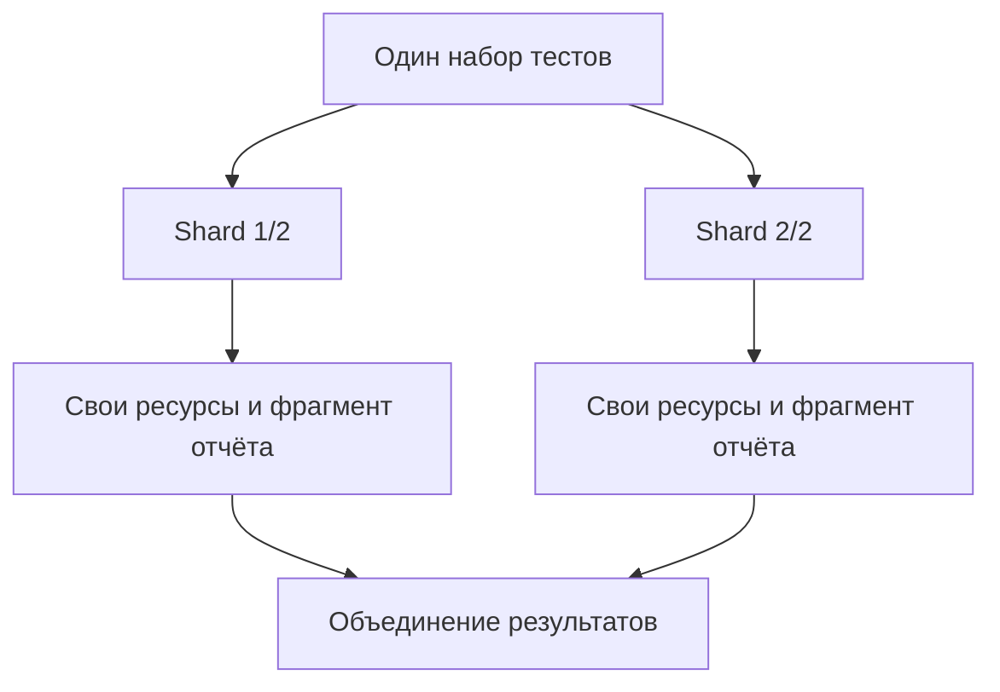

# Sharding

## Связь с предыдущей главой

Глава 236 ускорила набор внутри одной команды запуска. Дальше предел упирается в одну машину, и набор нужно разделить между независимыми процессами.

## Цель главы

Понимать, как набор делится на части, что обязано остаться независимым и как собрать результат, не потеряв упавший сегмент.

## Главный вопрос

> Как разделить suite между независимыми процессами или CI jobs?

## Мотивация

Одна команда запуска имеет предел масштабирования. Сегменты могут выполняться независимо, если каждый тест владеет своими данными и артефактами.

## Теория

### Что делает `--shard=X/Y`

Команда `--shard=X/Y` выбирает часть набора: `Y` задаёт общее число частей, `X` — номер текущей, начиная с **единицы**, а не с нуля.

Каждый сегмент выполняется как самостоятельный запуск: собственный процесс, собственные workers, собственный отчёт. Сегменты не обмениваются данными и не ждут друг друга.

Важное следствие: `--shard=1/3` не «первая треть по порядку в файле». Playwright сам решает, что попадёт в сегмент, и полагаться на конкретный состав нельзя.

### Единица распределения зависит от режима

Что именно раскладывается по сегментам, определяется настройкой параллельности:

| Режим | Единица распределения |
| --- | --- |
| `fullyParallel: true` | Отдельные тесты |
| Без него | Файл с тестами |

Это напрямую влияет на баланс. Если распределяются файлы, а один файл содержит половину набора, сегменты получатся неравными независимо от их количества. Разделение файлов помогает балансу сильнее, чем увеличение числа сегментов.

### Независимость сегментов — обязательное условие

Каждый shard должен давать осмысленный результат **без результата любого другого shard**.

Нарушения, которые встречаются чаще всего:

- сегмент рассчитывает на данные, созданные другим сегментом;
- сегменты пишут отчёт или артефакты в файл с одним и тем же именем;
- сегменты используют одну учётную запись или одну запись в базе;
- порядок сегментов считается гарантированным.

Ни одно из этих нарушений не проявится, пока сегменты случайно выполняются по очереди. Все они проявятся, когда CI запустит их одновременно.

### Sharding не создаёт изоляцию

Это продолжение правила из главы 235, но на новом уровне: сегменты изолируют **выполнение**, а не внешние системы.

Поэтому идентификаторы, учётные записи, имена файлов и фрагменты отчёта должны включать идентификатор сегмента или другое уникальное пространство имён. Один и тот же тест в разных сегментах не выполняется, но соседние тесты из разных сегментов легко встретятся на одном ресурсе.

### Объединение результатов

После выполнения фрагменты отчётов сводятся в общее представление средствами отчётности.

Ключевое требование к объединению: **упавший сегмент не должен исчезнуть**. Итоговый статус запуска считается успешным только если успешны все сегменты. Сегмент, который не завершился или не отдал фрагмент отчёта, считается упавшим, а не отсутствующим.

### Как выбирать число сегментов

Разумный порядок рассуждения:

1. Оценить, сколько единиц распределения есть на самом деле — тестов или файлов.
2. Убедиться, что их заметно больше числа сегментов, иначе баланс невозможен.
3. Проверить, выдержат ли внешние системы одновременную нагрузку всех сегментов.
4. Сравнить выигрыш во времени со стоимостью запуска и хранения результатов.

Число сегментов, при котором время перестаёт падать, — это предел полезности, даже если ресурсы формально позволяют больше.

## Внутренний механизм



## Главная ментальная модель

Shard — самостоятельная часть одного набора, а не стадия, ожидающая предыдущую часть.

## Практический пример

```text
examples/03-automation-qa/chapter-237/01-shard-independence.stability.ts
```

Пример состоит из четырёх независимых тестов. Запуск `--shard=1/2` выбирает два теста, а `--shard=2/2` — два оставшихся; вместе сегменты покрывают четыре уникальных теста без пересечений и пропусков.

Проверяются именно два свойства разбиения: отсутствие пересечений и отсутствие пропусков. Конкретный состав каждого сегмента в проверку не входит — он относится к реализации распределения, а не к контракту.

## Automation QA

Объединение отчётов сводит представление результатов, но не должно скрывать упавший shard. Общие внешние лимиты планируются отдельно от распределения файлов с тестами.

Практическое правило проверки конфигурации: запустите все сегменты и сложите числа выполненных тестов. Сумма обязана совпасть с числом тестов в наборе. Расхождение означает потерю или дублирование, и его нужно разобрать до того, как на результат начнут опираться.

## Компромиссы

Большее число shards уменьшает время при достаточном количестве тестов, но увеличивает стоимость запуска и сложность хранения результатов.

Дополнительная цена — диагностика. Расследовать падение в наборе из десяти сегментов труднее: доказательства разложены по разным запускам, и связать их можно только через общий идентификатор. Чем больше сегментов, тем важнее дисциплина в именовании артефактов.

## Распространённые мифы

**Миф: shard — это то же самое, что worker.**
Worker — процесс внутри одного запуска. Shard — отдельный запуск, часто на другой машине. Worker'ы делят один отчёт, сегменты — нет.

**Миф: `--shard=1/3` берёт первую треть тестов по порядку.**
Состав сегмента определяет Playwright. Полагаться на конкретные тесты внутри сегмента нельзя.

**Миф: больше сегментов — всегда быстрее.**
Если единиц распределения мало или внешняя система насыщена, время перестаёт падать, а стоимость продолжает расти.

**Миф: если объединённый отчёт зелёный, запуск успешен.**
Только при условии, что все сегменты завершились и отдали результат. Пропавший сегмент в наивном объединении выглядит как отсутствие проблем.

## Частые вопросы

**Сегменты получаются неравными по времени. Что делать?**
Проверьте единицу распределения. При распределении файлов один крупный файл перекашивает баланс — его стоит разделить или включить параллельность внутри файла.

**Можно ли запускать сегменты на одной машине?**
Можно, но выигрыш будет ограничен теми же ресурсами. Обычно сегменты имеют смысл там, где машин несколько.

**Как связать доказательства из разных сегментов?**
Через общий идентификатор запуска, включённый в имена артефактов, плюс идентификатор сегмента. Без этого объединённый отчёт неудобно расследовать.

**Что считать результатом, если один сегмент не запустился?**
Падением всего запуска. Незавершённый сегмент — это неизвестный результат, а неизвестный результат не может считаться успехом.

## Распространённые ошибки

- Делать shard зависимым от данных другого shard.
- Считать shard заменой worker.
- Использовать общее имя выходного файла.
- Объявлять успех при падении одного из сегментов.
- Наращивать число сегментов при малом числе единиц распределения.
- Считать состав конкретного сегмента стабильным.

## Проверьте себя

1. С какого числа начинается `X` в `--shard=X/Y` и что означает `Y`?
2. Как настройка `fullyParallel` меняет единицу распределения между сегментами?
3. Почему сегменты не должны зависеть от данных друг друга и когда это нарушение проявится?
4. Какое требование предъявляется к объединению результатов?
5. Как проверить, что разбиение не потеряло и не продублировало тесты?

## Краткие итоги

- `X/Y` определяет номер и общее количество shards.
- Shards должны быть независимыми.
- Внешние ресурсы всё ещё требуют изоляции.
- Упавший или незавершённый сегмент делает весь запуск неуспешным.
- Реализация CI остаётся следующему разделу.

## Практика

Практика встроена из соответствующего файла главы.

## Переход к следующей главе

После масштабирования нужен управляемый выбор тестов. Tags, annotations и способы выбора рассматривает глава 238.
