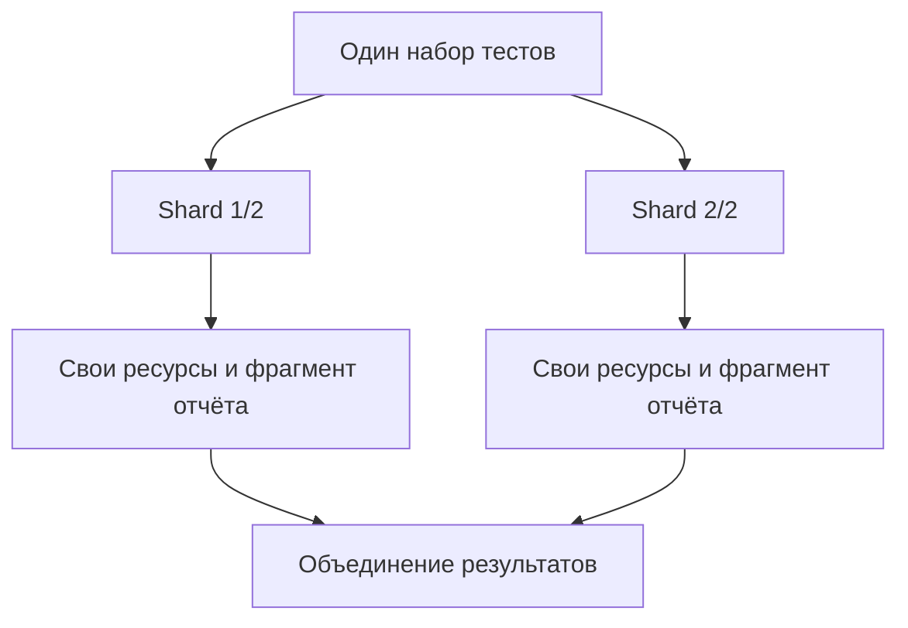

# Sharding

## Связь с предыдущей главой

Глава 236 распределила тесты между локальными workers. Sharding делит весь набор между независимыми командами запуска.

## Цель главы

Понимать идентификатор сегмента запуска, независимость частей, баланс и последующее объединение результатов.

## Главный вопрос

> Как разделить suite между независимыми процессами или CI jobs?

## Мотивация

Одна команда запуска имеет предел масштабирования. Сегменты могут выполняться независимо, если каждый тест владеет своими данными и артефактами.

## Теория

Команда `--shard=X/Y` выбирает часть набора: `X` начинается с 1, `Y` задаёт общее число частей. При `fullyParallel: true` Playwright распределяет отдельные тесты; без него единицей распределения обычно становится файл с тестами. Каждый shard должен работать без результата другого shard. Баланс зависит от количества и длительности распределяемых групп тестов.

Sharding не создаёт изоляцию внешних ресурсов. Идентификаторы, учётные записи, файлы и фрагменты отчёта включают идентификатор shard или другое уникальное пространство имён. После выполнения результаты можно объединить средствами отчётности; реализация CI и публикации принадлежит следующему модулю.

## Внутренний механизм



## Главная ментальная модель

Shard — самостоятельная часть одного набора, а не стадия, ожидающая предыдущую часть.

## Практический пример

```text
examples/03-automation-qa/chapter-237/01-shard-independence.stability.ts
```

Пример состоит из четырёх независимых тестов. Запуск `--shard=1/2` выбирает два теста, а `--shard=2/2` — два оставшихся; вместе сегменты покрывают четыре уникальных теста без пересечений и пропусков.

## Automation QA

Объединение отчётов сводит представление результатов, но не должно скрывать упавший shard. Общие внешние лимиты планируются отдельно от распределения файлов с тестами.

## Компромиссы

Большее число shards уменьшает время при достаточном количестве тестов, но увеличивает стоимость запуска и сложность хранения результатов.

## Распространённые ошибки

- Делать shard зависимым от данных другого shard.
- Считать shard заменой worker.
- Использовать общее имя выходного файла.
- Объявлять успех при падении одного из сегментов.

## Краткие итоги

- `X/Y` определяет номер и общее количество shards.
- Shards должны быть независимыми.
- Внешние ресурсы всё ещё требуют изоляции.
- Реализация CI остаётся следующему разделу.

## Практика

Практика встроена из соответствующего файла главы.

## Переход к следующей главе

После масштабирования нужен управляемый выбор тестов. Tags, annotations и способы выбора рассматривает глава 238.
