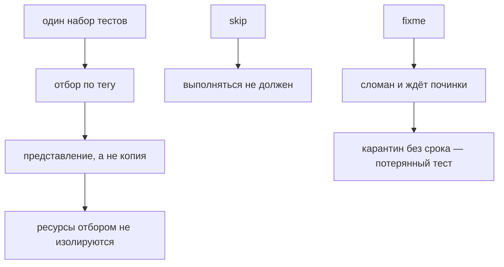

# Tags, annotations и test selection

## Связь с предыдущей главой

Sharding делит весь набор. Выбор тестов отвечает на другой вопрос: какие проверки вообще входят в конкретный запуск.

## Цель главы

Использовать tags, annotations, `--grep` и projects для явного выбора тестов без копирования наборов.

## Главный вопрос

> Как выбирать нужный набор тестов без копирования suites и скрытых условий?

## Мотивация

Отдельные копии smoke- и regression-тестов быстро расходятся. Явные метаданные позволяют одному тесту участвовать в разных осмысленных наборах.

## Теория

### Выбор создаёт представление, а не копию

Tags и annotations добавляют метаданные к единственному набору тестов. Команда запуска применяет `--grep`, `--grep-invert`, выбор файла или `--project` и получает нужное представление набора, не создавая его копию.

Это главная мысль главы. «Smoke-набор» — не отдельная папка и не отдельный проект, а результат применения фильтра к тому же набору. Поэтому тест не нужно дублировать, чтобы он попал и в быстрый, и в широкий прогон.

Tags могут пересекаться: критический тест одновременно входит в smoke- и regression-наборы.

### Как работает отбор по тегам

Tag является частью метаданных теста и участвует в выборе через `--grep` и `--grep-invert`. Проверено на наборе из пяти тестов:

| Команда | Что выбрано |
| --- | --- |
| `--grep @smoke` | только тесты с этим тегом |
| `--grep @regression` | более широкий набор, включая помеченные обоими |
| `--grep-invert @smoke` | всё, кроме smoke |

Полезный приём: `--list` показывает выбранное **до** запуска. Если команда отбирает не то, это видно за секунду, а не после десяти минут прогона.

### Разные оси отбора

Projects выбирают конфигурации запуска, но не заменяют предметные tags — это разные оси, как браузер и окружение в главе 216.

- **tag** отвечает на вопрос «какие сценарии» — smoke, regression, критичность;
- **project** — «в каком варианте выполнения»;
- **путь к файлу** — «какая часть кодовой базы».

Смешивать их не нужно: тег `@chromium` дублирует проект, а проект `smoke` подменяет собой фильтр и лишает возможности пересекать наборы.

### Выбор не изолирует ресурсы

Такой выбор не изолирует данные и внешние ресурсы.

Формулировка важна, потому что «запустим только smoke» часто воспринимается как способ избежать конфликтов. Отобранные тесты работают против того же стенда, создают те же данные и подчиняются тем же правилам изоляции из главы 215. Фильтр меняет состав запуска, а не свойства данных.

### `skip` и `fixme` выглядят одинаково, означают разное

`test.skip()` не выполняет тест, неприменимый при заданном условии или согласно явной политике. `test.fixme()` также не выполняет тест и отмечает известную поломку или незавершённое состояние.

Оба результата видимы как skipped — проверено, в выводе они неразличимы:

```text
  -  3 demo.spec.ts:5:1 › пропущен по условию
  -  4 demo.spec.ts:6:6 › известная поломка
  2 skipped
```

Но инженерный смысл разный. `skip` означает «здесь проверять нечего»: функциональность недоступна в этом окружении, сценарий неприменим к этому проекту. `fixme` означает «проверять нужно, но сейчас не работает» — и это долг, у которого должен быть владелец.

Поскольку в отчёте они неразличимы, различие существует только в коде и в дисциплине команды. Отсюда следующее требование.

### Карантин без срока — это потеря теста

Эти механизмы не должны становиться бессрочным карантином без владельца и срока.

Тест, помеченный `fixme` полгода назад, не проверяет ничего и при этом создаёт иллюзию покрытия: он есть в наборе, он «зелёный» в смысле отсутствия падений. Хуже того, продукт мог за это время измениться так, что тест уже неверен.

Рабочая дисциплина: у каждого отключённого теста есть аннотация владельца и ссылка на задачу, а список отключённых регулярно пересматривается. Это та же идея карантина, что в главе 233.

Annotations владельца и issue помогают маршрутизации, но не изменяют проверки — они попадают в результат и делают отключение адресным.

### Держать систему тегов маленькой

Слишком много tags создаёт новую систему классификации без владельца. Набор тегов должен быть небольшим и связанным с понятными командами запуска.

Практический критерий: у каждого тега есть команда, которой его действительно отбирают, и человек, который знает, что этот тег означает. Тег, придуманный «на будущее», через месяц проставлен наполовину и не отбирает ничего осмысленного.

Smoke-набор содержит быстрый критический сигнал, regression-набор — более широкий охват. Стабильные названия тестов делают команды выбора предсказуемыми: переименование ломает не только историю из главы 229, но и фильтры, если отбор идёт по части названия.

Отбор создаёт представление одного набора:



## Внутренний механизм

Tags и annotations добавляют метаданные к единственному набору тестов. Команда запуска применяет `--grep`, `--grep-invert`, выбор файла или `--project` и получает нужное представление набора, не создавая его копию. Такой выбор не изолирует данные и внешние ресурсы.

## Главная ментальная модель

Выбор создаёт представление одного набора тестов, а не его копию.

## Практический пример

```text
examples/03-automation-qa/chapter-238/01-tags-and-selection.stability.ts
```

Пример содержит пересекающиеся `@smoke` и `@regression` tags, а также статические annotations владельца и issue. `--grep @smoke` выбирает один тест, `--grep @regression` — два, а `--grep-invert @smoke` оставляет один. Выбор файла и `--project` решают другие задачи и в этом примере выбирают оба теста.

## Automation QA

Smoke-набор содержит быстрый критический сигнал, regression-набор — более широкий охват. Annotations владельца и issue помогают маршрутизации, но не изменяют проверки. Стабильные названия тестов делают команды выбора предсказуемыми.

## Компромиссы

Слишком много tags создаёт новую систему классификации без владельца. Набор тегов должен быть небольшим и связанным с понятными командами запуска.

## Распространённые мифы

**Миф: smoke-набор — это отдельная копия тестов.**
Это представление одного набора, полученное фильтром. Дублировать тесты не нужно.

**Миф: запуск только части набора убирает конфликты данных.**
Фильтр меняет состав запуска, а не изоляцию. Данные и стенд остаются общими.

**Миф: `skip` и `fixme` — одно и то же.**
В отчёте они неразличимы, но означают «проверять нечего» и «проверять нужно, но сломано».

**Миф: отключённый тест безвреден.**
Он создаёт иллюзию покрытия и со временем расходится с продуктом. Нужны владелец и срок.

**Миф: чем больше тегов, тем гибче отбор.**
Тег без команды и владельца проставляется наполовину и не отбирает ничего осмысленного.

## Частые вопросы

**Как проверить, что команда отбирает нужное?**
Запустить её с `--list`: выбранные тесты видны до выполнения.

**Может ли тест иметь несколько тегов?**
Да, и это нормально: критический сценарий входит и в smoke, и в regression.

**Когда использовать `fixme` вместо `skip`?**
Когда тест должен работать, но сейчас сломан. `skip` — для неприменимых сценариев.

**Чем тег отличается от проекта?**
Тег отбирает сценарии, проект задаёт вариант выполнения. Это разные оси.

**Что делать с давно отключёнными тестами?**
Пересматривать по списку: у каждого должны быть владелец и ссылка на задачу.

## Проверьте себя

1. Почему отбор не требует копии набора тестов?
2. Что показывает `--list` и зачем он нужен перед долгим прогоном?
3. Чем `skip` отличается от `fixme` по смыслу, если в отчёте они одинаковы?
4. Почему фильтр не решает проблему конфликтов данных?
5. По какому критерию тег заслуживает существования?

## Распространённые ошибки

- Копировать тест в отдельный smoke-каталог.
- Использовать project как предметный tag.
- Скрывать выбор в условии helper.
- Оставлять `skip` или `fixme` без контроля.

## Краткие итоги

- Tags поддерживают выбор через `--grep`.
- Annotations добавляют контекст результата.
- Projects и tags решают разные задачи.
- `test.skip` и `test.fixme` требуют явной политики.

## Практика

Практика встроена из соответствующего файла главы.

## Переход к следующей главе

Локальный запуск теперь стабилен, масштабируем и управляем. Глава 239 начнёт отдельный раздел о воспроизводимой CI-среде.
