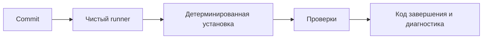

# CI fundamentals для Automation QA

## Связь с предыдущей главой

Глава 238 завершила построение управляемого локального запуска. CI переносит тот же контракт в чистое окружение, где нельзя полагаться на состояние машины разработчика.

## Цель главы

Определить условия воспроизводимого тестового запуска в CI и научиться читать его результат по этапам и коду завершения.

## Главный вопрос

> Какие условия делают тестовый запуск воспроизводимым в чистом CI environment?

## Мотивация

Локально могут незаметно помогать ранее установленные зависимости, браузеры, переменные и оставшиеся файлы. Чистый runner выявляет такие скрытые предпосылки. Его задача не исправить тест, а повторить явно описанную процедуру и сохранить её результат.

## Теория

Непрерывная интеграция проверяет объединяемые изменения общей воспроизводимой командой. Она отличается от непрерывной доставки и непрерывного развёртывания: CI формирует проверяемый сигнал, но сама по себе не доставляет и не развёртывает продукт.

Контракт запуска состоит из версии runtime, lockfile, детерминированной установки, проверяемой конфигурации, команды тестов, ограничения времени и сохранённого кода завершения. `npm ci` устанавливает зависимости строго по lockfile и сообщает о расхождении между ним и manifest. Cache может ускорить установку, но не заменяет lockfile и не должен влиять на корректность.

Зелёный pipeline подтверждает только выполнение заданных проверок. Он не доказывает отсутствие всех дефектов. Красный результат тоже требует классификации: причиной может быть продукт, тест, конфигурация или инфраструктура.

## Внутренний механизм

Runner получает чистую файловую систему, извлекает отслеживаемое содержимое commit без локальных неотслеживаемых файлов и использует cache только тогда, когда workflow подключает его явно. Затем runner устанавливает заявленные зависимости и последовательно запускает команды. Ненулевой код завершения останавливает успешный путь. Ограничение времени job ограничивает весь процесс, но не объясняет причину превышения времени. Диагностические материалы job принадлежат конкретному запуску workflow, а за поддержку pipeline отвечает команда проекта.

## Главная ментальная модель



CI воспроизводит явный контракт запуска, а не состояние локальной машины.

## Практический пример

```text
examples/03-automation-qa/chapter-239/01-ci-run-contract.ci.ts
```

Пример фиксирует чистый runner, версию runtime, ограниченный timeout и этапы CI, а затем сохраняет первый ненулевой код завершения и имя упавшего этапа. Он показывает, почему pipeline нельзя помечать успешным после упавшей обязательной проверки.

## Automation QA

Для Automation QA воспроизводимость означает одинаковые команды тестов, project, контракт окружения и правила работы с данными. Браузеры и внешние сервисы готовятся явно. Диагностика из глав 225–231 помогает объяснить падение, а механизмы стабильности из глав 232–238 нельзя заменить retries в CI.

## Компромиссы

Чистый запуск дольше локального, зато обнаруживает скрытые зависимости. Cache сокращает время, но усложняет диагностику, поэтому промах cache обязан оставаться корректным сценарием.

## Распространённые ошибки

- Считать локальный успех гарантией CI.
- Использовать `npm install` при авторитетном lockfile без причины.
- Игнорировать ненулевой код завершения.
- Увеличивать timeout вместо расследования причины.
- Считать зелёный pipeline доказательством отсутствия дефектов.

## Краткие итоги

- CI начинается с явного контракта чистого запуска.
- `npm ci` проверяет согласованность dependency graph с lockfile.
- Код завершения сохраняет результат обязательной команды.
- Timeout ограничивает работу, но не диагностирует причину.

## Практика

Практика встроена из соответствующего файла главы.

## Переход к следующей главе

Контракт определён. Глава 240 выразит его как GitHub Actions workflow для `push` и `pull_request`.
