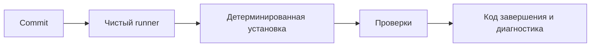

# CI fundamentals для Automation QA

## Связь с предыдущей главой

Глава 238 завершила построение управляемого локального запуска. CI переносит тот же контракт в чистое окружение, где нельзя полагаться на состояние машины разработчика.

## Цель главы

Определить условия воспроизводимого тестового запуска в CI и научиться читать его результат по этапам и коду завершения.

## Главный вопрос

> Какие условия делают тестовый запуск воспроизводимым в чистом CI environment?

## Мотивация

Локально могут незаметно помогать ранее установленные зависимости, браузеры, переменные и оставшиеся файлы. Чистый runner выявляет такие скрытые предпосылки. Его задача не исправить тест, а повторить явно описанную процедуру и сохранить её результат.

## Теория

### Что такое CI и чем она не является

Непрерывная интеграция проверяет объединяемые изменения общей воспроизводимой командой.

Она отличается от непрерывной доставки и непрерывного развёртывания: CI формирует проверяемый сигнал, но сама по себе не доставляет и не развёртывает продукт.

| Практика | Что делает |
| --- | --- |
| непрерывная интеграция | проверяет изменение общей командой |
| непрерывная доставка | готовит изменение к выпуску |
| непрерывное развёртывание | выпускает автоматически |

Для инженера автоматизации различие практическое: задача CI — дать честный сигнал о состоянии изменения, а не «выкатить». Всё остальное строится поверх этого сигнала.

### Контракт запуска

Контракт запуска состоит из версии runtime, lockfile, детерминированной установки, проверяемой конфигурации, команды тестов, ограничения времени и сохранённого кода завершения.

CI воспроизводит явный контракт запуска, а не состояние локальной машины.



Runner получает чистую файловую систему, извлекает отслеживаемое содержимое commit без локальных неотслеживаемых файлов и использует cache только тогда, когда workflow подключает его явно.

Последнее объясняет классическую ситуацию «локально работает, в CI падает»: локально в каталоге лежат файлы, которых нет в репозитории, — сгенерированный код, скачанные данные, забытый файл окружения. Чистый запуск дольше локального, зато обнаруживает скрытые зависимости.

### `npm ci` против обычной установки

`npm ci` устанавливает зависимости строго по lockfile и сообщает о расхождении между ним и manifest.

Разница с обычной установкой в том, что вторая вправе обновить lockfile, чтобы удовлетворить диапазоны версий. В CI это недопустимо: прогон перестаёт быть воспроизводимым, а причина падения может оказаться в версии зависимости, о которой никто не знал.

Cache может ускорить установку, но не заменяет lockfile и не должен влиять на корректность. Промах cache обязан оставаться корректным сценарием — то есть при пустом кеше pipeline просто выполняется дольше, но с тем же результатом. Cache сокращает время, но усложняет диагностику.

### Код завершения — единственный надёжный сигнал

Ненулевой код завершения останавливает успешный путь.

Это то же правило, что в главе 167, но в CI оно решает исход. Вывод в журнале помогает расследовать; решение о статусе pipeline принимается по коду завершения. Шаг, который «залогировал ошибку» и вернул ноль, делает красное зелёным.

Ограничение времени job ограничивает весь процесс, но не объясняет причину превышения времени. Job, упавший по timeout, требует расследования: зависший тест, недоступный сервис и медленная установка выглядят одинаково.

### Зелёный и красный требуют одинаковой честности

Зелёный pipeline подтверждает только выполнение заданных проверок. Он не доказывает отсутствие всех дефектов — он доказывает, что то, что проверяли, прошло.

Красный результат тоже требует классификации: причиной может быть продукт, тест, конфигурация или инфраструктура. Это те же классы, что в главе 225, и перезапуск до зелёного заменяет классификацию видимостью успеха.

Механизмы стабильности из глав 232–238 нельзя заменить retries в CI: повтор скрывает нестабильность, но не устраняет её причину и переносит стоимость на каждый следующий запуск.

### Что означает воспроизводимость для автотестов

Для Automation QA воспроизводимость означает одинаковые команды тестов, project, контракт окружения и правила работы с данными.

Практический список того, что должно совпадать между локальным запуском и CI:

- команда запуска и выбранный project;
- версия Node.js и зависимостей из lockfile;
- имена и правила проверки переменных окружения из главы 218;
- стратегия уникальности тестовых данных из главы 215.

Браузеры и внешние сервисы готовятся явно — это тема следующей главы. Диагностика из глав 225–231 помогает объяснить падение: без сохранённых артефактов красный pipeline сообщает только факт.

### Кто отвечает за pipeline

Диагностические материалы job принадлежат конкретному запуску workflow, а за поддержку pipeline отвечает команда проекта.

Второе часто упускают: pipeline — такой же код, как тесты, и он так же устаревает. Незакреплённые версии, отключённые проверки, накопившиеся `continue-on-error` превращают сигнал в декорацию.

## Внутренний механизм

Runner получает чистую файловую систему, извлекает отслеживаемое содержимое commit без локальных неотслеживаемых файлов и использует cache только тогда, когда workflow подключает его явно. Затем runner устанавливает заявленные зависимости и последовательно запускает команды. Ненулевой код завершения останавливает успешный путь. Ограничение времени job ограничивает весь процесс, но не объясняет причину превышения времени. Диагностические материалы job принадлежат конкретному запуску workflow, а за поддержку pipeline отвечает команда проекта.

## Главная ментальная модель


CI воспроизводит явный контракт запуска, а не состояние локальной машины.

## Практический пример

```text
examples/03-automation-qa/chapter-239/01-ci-run-contract.ci.ts
```

Пример фиксирует чистый runner, версию runtime, ограниченный timeout и этапы CI, а затем сохраняет первый ненулевой код завершения и имя упавшего этапа. Он показывает, почему pipeline нельзя помечать успешным после упавшей обязательной проверки.

## Automation QA

Для Automation QA воспроизводимость означает одинаковые команды тестов, project, контракт окружения и правила работы с данными. Браузеры и внешние сервисы готовятся явно. Диагностика из глав 225–231 помогает объяснить падение, а механизмы стабильности из глав 232–238 нельзя заменить retries в CI.

## Компромиссы

Чистый запуск дольше локального, зато обнаруживает скрытые зависимости. Cache сокращает время, но усложняет диагностику, поэтому промах cache обязан оставаться корректным сценарием.

## Распространённые мифы

**Миф: CI разворачивает продукт.**
Она формирует сигнал о состоянии изменения. Доставка и развёртывание — отдельные практики.

**Миф: зелёный pipeline означает отсутствие дефектов.**
Он означает, что заданные проверки прошли. Непроверенное остаётся неизвестным.

**Миф: обычная установка зависимостей в CI эквивалентна `npm ci`.**
Она вправе обновить lockfile, и прогон перестаёт быть воспроизводимым.

**Миф: промах cache — сбой pipeline.**
Это нормальный сценарий: дольше, но с тем же результатом. Cache не влияет на корректность.

**Миф: retries в CI решают проблему нестабильных тестов.**
Они скрывают её и переносят стоимость на каждый следующий запуск.

## Частые вопросы

**Почему локально проходит, а в CI падает?**
Частая причина — файлы, которых нет в репозитории: сгенерированный код, данные, файл окружения.

**Что делать при падении job по timeout?**
Классифицировать: зависший тест, недоступный сервис и медленная установка выглядят одинаково.

**Почему решение принимается по коду завершения?**
Вывод помогает расследовать, но статус pipeline определяет именно код: шаг, вернувший ноль, делает красное зелёным.

**Что должно совпадать между локальным запуском и CI?**
Команда и project, версии из lockfile, контракт переменных окружения, правила уникальности данных.

**Кто поддерживает pipeline?**
Команда проекта. Это такой же код, и он так же устаревает.

## Проверьте себя

1. Чем CI отличается от непрерывной доставки и развёртывания?
2. Из каких частей состоит контракт запуска?
3. Почему в CI используют установку строго по lockfile?
4. Что доказывает зелёный pipeline и чего не доказывает?
5. Почему retries не заменяют работу над стабильностью?

## Распространённые ошибки

- Считать локальный успех гарантией CI.
- Использовать `npm install` при авторитетном lockfile без причины.
- Игнорировать ненулевой код завершения.
- Увеличивать timeout вместо расследования причины.
- Считать зелёный pipeline доказательством отсутствия дефектов.

## Краткие итоги

- CI начинается с явного контракта чистого запуска.
- `npm ci` проверяет согласованность dependency graph с lockfile.
- Код завершения сохраняет результат обязательной команды.
- Timeout ограничивает работу, но не диагностирует причину.

## Практика

Практика встроена из соответствующего файла главы.

## Переход к следующей главе

Контракт определён. Глава 240 выразит его как GitHub Actions workflow для `push` и `pull_request`.
