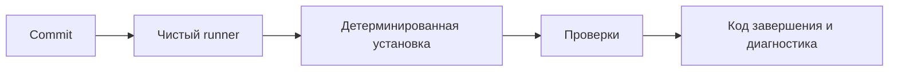

# Основы CI для автоматизации тестов

## Связь с предыдущей главой

Глава 238 завершила построение управляемого локального запуска. CI переносит тот же контракт в чистое окружение, где нельзя полагаться на состояние машины разработчика.

## Цель главы

Определить условия воспроизводимого тестового запуска в CI и научиться читать его результат по этапам и коду завершения.

## Главный вопрос

> Какие условия делают тестовый запуск воспроизводимым в чистой среде CI?

## Мотивация

Локально могут незаметно помогать ранее установленные зависимости, браузеры, переменные и оставшиеся файлы. Чистый runner выявляет такие скрытые предпосылки. Его задача не исправить тест, а повторить явно описанную процедуру и сохранить её результат.

## Теория

### Что такое CI и чем она не является

Непрерывная интеграция проверяет объединяемые изменения общей воспроизводимой командой.

Она отличается от непрерывной доставки и непрерывного развёртывания: CI формирует проверяемый сигнал, но сама по себе не доставляет и не развёртывает продукт.

| Практика | Что делает |
| --- | --- |
| непрерывная интеграция | проверяет изменение общей командой |
| непрерывная доставка | готовит изменение к выпуску |
| непрерывное развёртывание | выпускает автоматически |

Для инженера автоматизации различие практическое: задача CI — дать честный сигнал о состоянии изменения, а не «выкатить». Всё остальное строится поверх этого сигнала.

### Контракт запуска

Контракт запуска состоит из версии среды выполнения, файла фиксации версий, детерминированной установки, проверяемой конфигурации, команды тестов, ограничения времени и сохранённого кода завершения.

CI воспроизводит явный контракт запуска, а не состояние локальной машины.


```mermaid
flowchart LR
    C[Commit] --> R[Чистый runner]
    R --> I[Детерминированная установка]
    I --> V[Проверки]
    V --> E[Код завершения и диагностика]
```

Машина-исполнитель получает чистую файловую систему, извлекает отслеживаемое содержимое коммита без локальных неотслеживаемых файлов и использует кеш только тогда, когда сценарий сборки подключает его явно.

Последнее объясняет классическую ситуацию «локально работает, в CI падает»: локально в каталоге лежат файлы, которых нет в репозитории, — сгенерированный код, скачанные данные, забытый файл окружения. Чистый запуск дольше локального, зато обнаруживает скрытые зависимости.

### `npm ci` против обычной установки

`npm ci` устанавливает зависимости строго по файлу фиксации версий и сообщает о расхождении между ним и манифестом.

Разница с обычной установкой в том, что вторая вправе обновить файл фиксации версий, чтобы удовлетворить диапазоны версий. В CI это недопустимо: прогон перестаёт быть воспроизводимым, а причина падения может оказаться в версии зависимости, о которой никто не знал.

Кеш может ускорить установку, но не заменяет файл фиксации версий и не должен влиять на корректность. Промах кеша обязан оставаться корректным сценарием — то есть при пустом кеше конвейер просто выполняется дольше, но с тем же результатом. Кеш сокращает время, но усложняет диагностику.

### Код завершения — единственный надёжный сигнал

Ненулевой код завершения останавливает успешный путь.

Это то же правило, что в главе 167, но в CI оно решает исход. Вывод в журнале помогает расследовать; решение о состоянии конвейера принимается по коду завершения. Шаг, который «записал ошибку в журнал» и вернул ноль, делает красное зелёным.

Ограничение времени задачи ограничивает весь процесс, но не объясняет причину превышения времени. Задача, упавшая по времени, требует расследования: зависший тест, недоступный сервис и медленная установка выглядят одинаково.

### Зелёный и красный требуют одинаковой честности

Зелёный конвейер подтверждает только выполнение заданных проверок. Он не доказывает отсутствие всех дефектов — он доказывает, что то, что проверяли, прошло.

Красный результат тоже требует классификации: причиной может быть продукт, тест, конфигурация или инфраструктура. Это те же классы, что в главе 225, и перезапуск до зелёного заменяет классификацию видимостью успеха.

Механизмы стабильности из глав 232–238 нельзя заменить повторами в CI: повтор скрывает нестабильность, но не устраняет её причину и переносит стоимость на каждый следующий запуск.

### Что означает воспроизводимость для автотестов

Для автоматизации тестов воспроизводимость означает одинаковые команды тестов, проект, контракт окружения и правила работы с данными.

Практический список того, что должно совпадать между локальным запуском и CI:

- команда запуска и выбранный проект;
- версия Node.js и зависимостей из файла фиксации версий;
- имена и правила проверки переменных окружения из главы 218;
- стратегия уникальности тестовых данных из главы 215.

Браузеры и внешние сервисы готовятся явно — это тема следующей главы. Диагностика из глав 225–231 помогает объяснить падение: без сохранённых артефактов красный конвейер сообщает только факт.

### Кто отвечает за конвейер

Диагностические материалы задачи принадлежат конкретному запуску сценария сборки, а за поддержку конвейера отвечает команда проекта.

Второе часто упускают: конвейер — такой же код, как тесты, и он так же устаревает. Незакреплённые версии, отключённые проверки, накопившиеся `continue-on-error` превращают сигнал в декорацию.

## Внутренний механизм

Машина-исполнитель получает чистую файловую систему, извлекает отслеживаемое содержимое коммита без локальных неотслеживаемых файлов и использует кеш только тогда, когда сценарий сборки подключает его явно. Затем она устанавливает заявленные зависимости и последовательно запускает команды. Ненулевой код завершения останавливает успешный путь. Ограничение времени задачи ограничивает весь процесс, но не объясняет причину превышения времени. Диагностические материалы задачи принадлежат конкретному запуску сценария сборки, а за поддержку конвейера отвечает команда проекта.

### Чем машина сборки отличается от машины разработчика

| Что есть локально | Что в CI |
| --- | --- |
| неотслеживаемые файлы, `.env`, артефакты прошлых прогонов | только содержимое коммита |
| установленные браузеры и инструменты | то, что установит сценарий |
| свой часовой пояс и локаль | обычно UTC и `C`/`en_US` |
| свободные ресурсы | ядра и память делятся между задачами |

Каждая строка — отдельный класс падений «только в CI». Третья объясняет
расхождения в датах, четвёртая — истечения сроков ожидания у тестов, которые
локально проходят с запасом.

### Установка зависимостей и код завершения

```text
npm install  → вправе обновить зависимость по диапазону версий
npm ci       → ставит РОВНО то, что записано в файле фиксации
```

Воспроизводимость начинается здесь: при `npm install` в CI может собраться не то,
что проверяли локально, и падение будет невоспроизводимым по определению.

```text
команда завершилась с кодом 0     → шаг успешен, конвейер идёт дальше
команда завершилась с кодом ≠ 0   → шаг неуспешен, путь прерван
код потерян (например, в конвейере из команд) → красный прогон выглядит зелёным
```

Ограничение времени задачи при этом ограничивает весь процесс целиком и ничего
не объясняет: превышение одинаково выглядит и при медленном стенде, и при
незакрытом подключении, из-за которого процесс не завершается.

## Главная ментальная модель


```mermaid
flowchart LR
    C[Commit] --> R[Чистый runner]
    R --> I[Детерминированная установка]
    I --> V[Проверки]
    V --> E[Код завершения и диагностика]
```

CI воспроизводит явный контракт запуска, а не состояние локальной машины.

## Практический пример

```text
examples/03-automation-qa/chapter-239/01-ci-run-contract.ci.ts
```

Пример фиксирует чистую машину-исполнитель, версию среды выполнения, ограниченное время и этапы CI, а затем сохраняет первый ненулевой код завершения и имя упавшего этапа. Он показывает, почему конвейер нельзя помечать успешным после упавшей обязательной проверки.

## Automation QA

Для автоматизации тестов воспроизводимость означает одинаковые команды тестов, проект, контракт окружения и правила работы с данными. Браузеры и внешние сервисы готовятся явно. Диагностика из глав 225–231 помогает объяснить падение, а механизмы стабильности из глав 232–238 нельзя заменить повторами в CI.

## Компромиссы

Чистый запуск дольше локального, зато обнаруживает скрытые зависимости. Кеш сокращает время, но усложняет диагностику, поэтому промах кеша обязан оставаться корректным сценарием.

## Распространённые мифы

**Миф: CI разворачивает продукт.**
Она формирует сигнал о состоянии изменения. Доставка и развёртывание — отдельные практики.

**Миф: зелёный конвейер означает отсутствие дефектов.**
Он означает, что заданные проверки прошли. Непроверенное остаётся неизвестным.

**Миф: обычная установка зависимостей в CI эквивалентна `npm ci`.**
Она вправе обновить файл фиксации версий, и прогон перестаёт быть воспроизводимым.

**Миф: промах кеша — сбой конвейера.**
Это нормальный сценарий: дольше, но с тем же результатом. Кеш не влияет на корректность.

**Миф: повторы в CI решают проблему нестабильных тестов.**
Они скрывают её и переносят стоимость на каждый следующий запуск.

## Частые вопросы

**Почему локально проходит, а в CI падает?**
Частая причина — файлы, которых нет в репозитории: сгенерированный код, данные, файл окружения.

**Что делать при падении задачи по времени?**
Классифицировать: зависший тест, недоступный сервис и медленная установка выглядят одинаково.

**Почему решение принимается по коду завершения?**
Вывод помогает расследовать, но состояние конвейера определяет именно код: шаг, вернувший ноль, делает красное зелёным.

**Что должно совпадать между локальным запуском и CI?**
Команда и проект, версии из файла фиксации, контракт переменных окружения, правила уникальности данных.

**Кто поддерживает конвейер?**
Команда проекта. Это такой же код, и он так же устаревает.

## Проверьте себя

1. Чем CI отличается от непрерывной доставки и развёртывания?
2. Из каких частей состоит контракт запуска?
3. Почему в CI используют установку строго по файлу фиксации версий?
4. Что доказывает зелёный конвейер и чего не доказывает?
5. Почему повторы не заменяют работу над стабильностью?

### Ответы

1. Непрерывная интеграция — это регулярная сборка и проверка изменений. Доставка — готовность выпустить проверенную сборку. Развёртывание — автоматическая выкладка без ручного решения.
2. Как запустить, на каком окружении, с какими переменными и секретами, что считать результатом и какие артефакты сохранять.
3. Чтобы прогон воспроизводился: обычная установка может подтянуть новые версии зависимостей и изменить поведение тестов без изменений в коде.
4. Что проверки, включённые в него, прошли на этом окружении. Он не доказывает работоспособности того, что не покрыто, и не говорит о качестве самих проверок.
5. Повтор скрывает нестабильность и увеличивает время прогона. Причина остаётся, а доверие к результату падает.

## Распространённые ошибки

- Считать локальный успех гарантией CI — у машины сборки другие ресурсы, другой часовой пояс, чистое окружение и отсутствие ваших локальных файлов. Тест, опирающийся на что-то из этого, падает только там.

- Использовать `npm install` при авторитетном файле фиксации версий без причины — он вправе обновить зависимости, поэтому в CI соберётся не то, что проверяли локально. Воспроизводимую установку даёт `npm ci`.

- Игнорировать ненулевой код завершения — именно он отличает «прогон прошёл» от «прогон состоялся». Шаг, теряющий код выхода, превращает красный прогон в зелёный.

- Увеличивать ограничение времени вместо расследования причины — задача перестаёт падать, но продолжает занимать очередь, а причина (ожидание по таймеру, незакрытый ресурс) остаётся.

- Считать зелёный конвейер доказательством отсутствия дефектов — он говорит лишь о том, что прошли написанные проверки. Ценность равна их содержанию.

## Краткие итоги

- CI начинается с явного контракта чистого запуска.
- `npm ci` проверяет согласованность графа зависимостей с файлом фиксации версий.
- Код завершения сохраняет результат обязательной команды.
- Ограничение времени ограничивает работу, но не диагностирует причину.

## Практика

Практика встроена из соответствующего файла главы.

## Переход к следующей главе

Контракт определён. Глава 240 выразит его как сценарий сборки GitHub Actions для `push` и `pull_request`.
