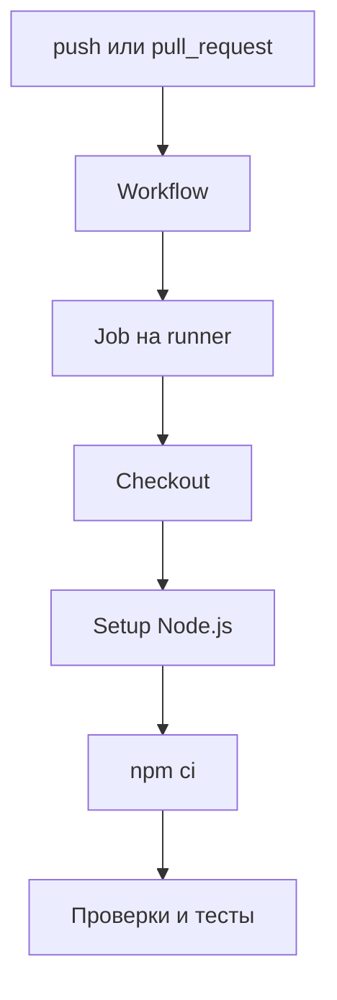

# GitHub Actions pipeline

## Связь с предыдущей главой

Глава 239 определила воспроизводимый CI-контракт. Теперь этот контракт нужно описать в структуре GitHub Actions.

## Цель главы

Построить безопасный workflow с явными событиями запуска, job, steps, минимальными permissions и обязательными командами проверки.

## Главный вопрос

> Как описать автоматический запуск Playwright Test для push и pull request?

## Мотивация

Список команд сам по себе не определяет, когда, где и с какими правами они выполняются. Workflow делает эти решения проверяемой частью репозитория.

## Теория

### Четыре уровня: событие, workflow, job, step

Workflow — YAML-документ, запускаемый событием. Job получает отдельный runner, а step выполняет action или shell-команду внутри этого job.

Событие запуска выбирает workflow, workflow создаёт jobs, job получает runner, а steps выполняют команды.



### События и их назначение

| Событие | Когда срабатывает | Зачем нужно |
| --- | --- | --- |
| `pull_request` | при изменении в PR | проверить изменение до merge |
| `push` | после попадания в ветку | повторить контракт для целевой ветки |
| `workflow_dispatch` | вручную | контролируемое расследование |

Pull request получает общий сигнал до merge, `push` повторяет контракт для целевой ветки, а `workflow_dispatch` помогает контролируемому ручному расследованию.

Повторение контракта на `push` не избыточно: изменение могло пройти проверку в PR, а после слияния столкнуться с другим изменением, слитым параллельно.

### Runner — это не worker

GitHub-hosted runner не является Playwright worker: runner предоставляет виртуальную машину для job, а Playwright уже внутри процесса распределяет тесты между workers.

Путаница здесь стоит дорого при настройке параллельности. Один runner может выполнять несколько Playwright workers; несколько runner'ов — это уже уровень matrix и sharding из главы 244. Увеличение числа jobs не заменяет настройку `workers`, и наоборот.

### Границы job: что разделяется, а что нет

Steps одного job разделяют рабочую директорию, но разные jobs выполняются в отдельных окружениях. Данные между jobs не появляются автоматически.

Отсюда практическое следствие: файл, созданный в одном job, не виден в другом, пока его явно не передали через artifacts — тема главы 243. Разделять pipeline на jobs ради «чистоты» без такой передачи — верный способ получить job, который не находит результатов предыдущего.

Один job проще читать и диагностировать. Независимые jobs могут выполняться параллельно, но повторяют подготовку окружения и требуют явной передачи artifacts.

### Минимальные разрешения

Для чтения исходников достаточно `permissions: contents: read`.

Правило наименьших привилегий здесь такое же, как для тестовой учётной записи базы из главы 207: workflow получает ровно те права, которые нужны для его работы. Права на запись в репозиторий, публикацию пакетов или развёртывание для прогона тестов не требуются — и их отсутствие превращает ошибку в отказ вместо изменения чего-то важного.

### Типовая последовательность шагов

Checkout получает commit, setup-node готовит Node.js, `npm ci` устанавливает зависимости из lockfile, затем запускаются статические проверки и тесты.

Порядок не случаен: дешёвые проверки идут раньше дорогих. Статическая проверка типов, падающая за секунды, не должна ждать двадцатиминутного прогона браузерных тестов.

Версии actions и Node.js закрепляются явно — это часть контракта запуска из главы 239: незакреплённая версия превращает воспроизводимый прогон в лотерею.

### Обязательная проверка не может быть необязательной

Ненулевой код завершения шага переводит job в состояние failed; `continue-on-error` нельзя использовать для обязательных проверок.

Это ровно тот механизм, которым сигнал превращают в декорацию. Шаг с `continue-on-error: true` выполняется, падает и не влияет на статус — pipeline зелёный, проверка не пройдена.

Допустимое применение узкое: необязательный вспомогательный шаг, результат которого действительно не влияет на решение о слиянии, — например, публикация дополнительной справочной информации.

### Команды CI и локальные команды

Команды должны совпадать с локальными командами настолько, насколько позволяют различия runner.

Расхождение здесь — источник «работает только в CI» и «работает только локально». Если в CI выполняется команда, которую разработчик не может запустить у себя, воспроизвести падение он не сможет.

Учебный fixture этого модуля устроен именно так: он использует существующие команды проекта, закреплённые версии actions, минимальные permissions и ограничение времени job. Файл не размещён в каталоге активных workflow, поэтому на GitHub не запускается, а отдельный валидатор проверяет его свойства — события запуска, права, timeout, разрешённые actions и отсутствие подавления ошибок обязательных команд.

## Внутренний механизм


Steps одного job разделяют рабочую директорию, но разные jobs выполняются в отдельных окружениях. Данные между jobs не появляются автоматически.

## Главная ментальная модель

Событие запуска выбирает workflow, workflow создаёт jobs, job получает runner, а steps выполняют команды.

## Практический пример

```text
examples/03-automation-qa/chapter-240/01-playwright-pipeline.workflow.yml
```

Это неактивный учебный fixture. Он использует `actions/checkout@v6`, `actions/setup-node@v6`, Node.js 22, `npm ci`, недорогую статическую проверку и существующую локальную команду Playwright. Файл не размещён в `.github/workflows`, поэтому не запускается на GitHub.

```text
examples/03-automation-qa/support/ci/validate-workflows.mjs
```

Валидатор модуля проверяет события запуска, минимальные permissions, timeout job, разрешённые actions, отсутствие опасных прав на запись, deployment и подавления ошибок обязательных команд.

## Automation QA

Pull request получает общий сигнал до merge, `push` повторяет контракт для целевой ветки, а `workflow_dispatch` помогает контролируемому ручному расследованию. Команды должны совпадать с локальными командами настолько, насколько позволяют различия runner.

## Компромиссы

Один job проще читать и диагностировать. Независимые jobs могут выполняться параллельно, но повторяют подготовку окружения и требуют явной передачи artifacts.

## Распространённые мифы

**Миф: runner и Playwright worker — одно и то же.**
Runner даёт виртуальную машину для job. Workers распределяют тесты внутри процесса Playwright.

**Миф: файлы автоматически доступны между jobs.**
Разные jobs выполняются в отдельных окружениях. Передача — только через artifacts.

**Миф: больше jobs означает быстрее прогон.**
Каждый job заново готовит окружение. Иногда один job с несколькими workers быстрее.

**Миф: `continue-on-error` — способ не блокировать команду.**
Для обязательной проверки это превращение сигнала в декорацию: шаг падает, pipeline зелёный.

**Миф: `push` после проверенного PR избыточен.**
После слияния изменение встречается с другими, слитыми параллельно.

## Частые вопросы

**Какие права нужны workflow для прогона тестов?**
Обычно только `contents: read`. Права на запись и развёртывание не требуются.

**В каком порядке размещать шаги?**
Дешёвые проверки раньше дорогих: статический анализ не должен ждать браузерных тестов.

**Почему job не находит файлы предыдущего job?**
Окружения разные. Нужна явная передача через artifacts.

**Зачем закреплять версии actions и Node.js?**
Это часть контракта запуска: незакреплённая версия делает прогон невоспроизводимым.

**Когда `continue-on-error` допустим?**
Для действительно необязательного шага, результат которого не влияет на решение о слиянии.

## Проверьте себя

1. Какие четыре уровня участвуют от события до выполнения команды?
2. Чем runner отличается от Playwright worker?
3. Что разделяют steps одного job и что не разделяют разные jobs?
4. Почему для прогона тестов достаточно `contents: read`?
5. Чем опасен `continue-on-error` на обязательной проверке?

## Распространённые ошибки

- Путать job и step.
- Путать runner и Playwright worker.
- Давать workflow права на запись без необходимости.
- Скрывать падение через `continue-on-error`.
- Запускать дорогие тесты до дешёвых статических проверок.

## Краткие итоги

- Событие запуска определяет, когда выполняется workflow.
- Job получает отдельный runner.
- Step запускает action или команду.
- Минимальных `contents: read` достаточно для проверки кода.

## Практика

Практика встроена из соответствующего файла главы.

## Переход к следующей главе

Workflow умеет подготовить Node.js, но browser automation требует отдельной установки браузеров и системных зависимостей. Это граница главы 241.
