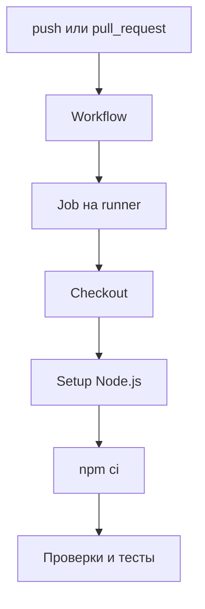

# GitHub Actions pipeline

## Связь с предыдущей главой

Глава 239 определила воспроизводимый CI-контракт. Теперь этот контракт нужно описать в структуре GitHub Actions.

## Цель главы

Построить безопасный workflow с явными событиями запуска, job, steps, минимальными permissions и обязательными командами проверки.

## Главный вопрос

> Как описать автоматический запуск Playwright Test для push и pull request?

## Мотивация

Список команд сам по себе не определяет, когда, где и с какими правами они выполняются. Workflow делает эти решения проверяемой частью репозитория.

## Теория

Workflow — YAML-документ, запускаемый событием. `pull_request` проверяет изменение до merge, `push` повторяет контракт после попадания изменения в ветку, а `workflow_dispatch` предоставляет контролируемый ручной запуск. Job получает отдельный runner, а step выполняет action или shell-команду внутри этого job. GitHub-hosted runner не является Playwright worker: runner предоставляет виртуальную машину для job, а Playwright уже внутри процесса распределяет тесты между workers.

Для чтения исходников достаточно `permissions: contents: read`. Checkout получает commit, setup-node готовит Node.js, `npm ci` устанавливает зависимости из lockfile, затем запускаются статические проверки и тесты. Ненулевой код завершения шага переводит job в состояние failed; `continue-on-error` нельзя использовать для обязательных проверок.

## Внутренний механизм



Steps одного job разделяют рабочую директорию, но разные jobs выполняются в отдельных окружениях. Данные между jobs не появляются автоматически.

## Главная ментальная модель

Событие запуска выбирает workflow, workflow создаёт jobs, job получает runner, а steps выполняют команды.

## Практический пример

```text
examples/03-automation-qa/chapter-240/01-playwright-pipeline.workflow.yml
```

Это неактивный учебный fixture. Он использует `actions/checkout@v6`, `actions/setup-node@v6`, Node.js 22, `npm ci`, недорогую статическую проверку и существующую локальную команду Playwright. Файл не размещён в `.github/workflows`, поэтому не запускается на GitHub.

```text
examples/03-automation-qa/support/ci/validate-workflows.mjs
```

Валидатор модуля проверяет события запуска, минимальные permissions, timeout job, разрешённые actions, отсутствие опасных прав на запись, deployment и подавления ошибок обязательных команд.

## Automation QA

Pull request получает общий сигнал до merge, `push` повторяет контракт для целевой ветки, а `workflow_dispatch` помогает контролируемому ручному расследованию. Команды должны совпадать с локальными командами настолько, насколько позволяют различия runner.

## Компромиссы

Один job проще читать и диагностировать. Независимые jobs могут выполняться параллельно, но повторяют подготовку окружения и требуют явной передачи artifacts.

## Распространённые ошибки

- Путать job и step.
- Путать runner и Playwright worker.
- Давать workflow права на запись без необходимости.
- Скрывать падение через `continue-on-error`.
- Запускать дорогие тесты до дешёвых статических проверок.

## Краткие итоги

- Событие запуска определяет, когда выполняется workflow.
- Job получает отдельный runner.
- Step запускает action или команду.
- Минимальных `contents: read` достаточно для проверки кода.

## Практика

Практика встроена из соответствующего файла главы.

## Переход к следующей главе

Workflow умеет подготовить Node.js, но browser automation требует отдельной установки браузеров и системных зависимостей. Это граница главы 241.
