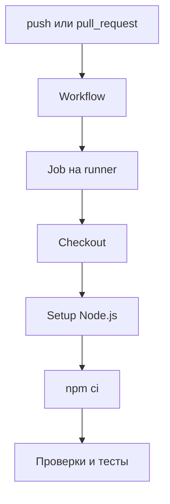

# Конвейер GitHub Actions

## Связь с предыдущей главой

Глава 239 определила воспроизводимый CI-контракт. Теперь этот контракт нужно описать в структуре GitHub Actions.

## Цель главы

Построить безопасный workflow с явными событиями запуска, job, steps, минимальными permissions и обязательными командами проверки.

## Главный вопрос

> Как описать автоматический запуск Playwright Test для отправки изменений и запроса на слияние?

## Мотивация

Список команд сам по себе не определяет, когда, где и с какими правами они выполняются. Workflow делает эти решения проверяемой частью репозитория.

## Теория

### Четыре уровня: событие, сценарий сборки, задача, шаг

Сценарий сборки — документ YAML, запускаемый событием. Задача получает отдельную машину-исполнитель, а шаг выполняет готовое действие или команду оболочки внутри этой задачи.

Событие запуска выбирает сценарий сборки, сценарий создаёт задачи, задача получает машину-исполнитель, а шаги выполняют команды.


```mermaid
flowchart TD
    E[push или pull_request] --> W[Workflow]
    W --> J[Job на runner]
    J --> S1[Checkout]
    S1 --> S2[Setup Node.js]
    S2 --> S3[npm ci]
    S3 --> S4[Проверки и тесты]
```

### События и их назначение

| Событие | Когда срабатывает | Зачем нужно |
| --- | --- | --- |
| `pull_request` | при изменении в запросе на слияние | проверить изменение до слияния |
| `push` | после попадания в ветку | повторить контракт для целевой ветки |
| `workflow_dispatch` | вручную | контролируемое расследование |

Запрос на слияние получает общий сигнал до слияния, `push` повторяет контракт для целевой ветки, а `workflow_dispatch` помогает контролируемому ручному расследованию.

Повторение контракта на `push` не избыточно: изменение могло пройти проверку в запросе на слияние, а после слияния столкнуться с другим изменением, слитым параллельно.

### Машина-исполнитель — это не рабочий процесс Playwright

Машина-исполнитель GitHub не является рабочим процессом Playwright: она предоставляет виртуальную машину для задачи, а Playwright уже внутри процесса распределяет тесты между рабочими процессами.

Путаница здесь стоит дорого при настройке параллельности. Одна машина-исполнитель может выполнять несколько рабочих процессов Playwright; несколько машин — это уже уровень матрицы и сегментирования из главы 244. Увеличение числа задач не заменяет настройку `workers`, и наоборот.

### Границы задачи: что разделяется, а что нет

Шаги одной задачи разделяют рабочую директорию, но разные задачи выполняются в отдельных окружениях. Данные между задачами не появляются автоматически.

Отсюда практическое следствие: файл, созданный в одной задаче, не виден в другой, пока его явно не передали через артефакты — тема главы 243. Разделять конвейер на задачи ради «чистоты» без такой передачи — верный способ получить задачу, которая не находит результатов предыдущей.

Одна задача проще читается и диагностируется. Независимые задачи могут выполняться параллельно, но повторяют подготовку окружения и требуют явной передачи артефактов.

### Минимальные разрешения

Для чтения исходников достаточно `permissions: contents: read`.

Правило наименьших привилегий здесь такое же, как для тестовой учётной записи базы из главы 207: сценарий сборки получает ровно те права, которые нужны для его работы. Права на запись в репозиторий, публикацию пакетов или развёртывание для прогона тестов не требуются — и их отсутствие превращает ошибку в отказ вместо изменения чего-то важного.

### Типовая последовательность шагов

Шаг получения кода извлекает коммит, `setup-node` готовит Node.js, `npm ci` устанавливает зависимости из файла фиксации версий, затем запускаются статические проверки и тесты.

Порядок не случаен: дешёвые проверки идут раньше дорогих. Статическая проверка типов, падающая за секунды, не должна ждать двадцатиминутного прогона браузерных тестов.

Версии готовых действий и Node.js закрепляются явно — это часть контракта запуска из главы 239: незакреплённая версия превращает воспроизводимый прогон в лотерею.

### Обязательная проверка не может быть необязательной

Ненулевой код завершения шага переводит задачу в неуспешное состояние; `continue-on-error` нельзя использовать для обязательных проверок.

Это ровно тот механизм, которым сигнал превращают в декорацию. Шаг с `continue-on-error: true` выполняется, падает и не влияет на состояние — конвейер зелёный, проверка не пройдена.

Допустимое применение узкое: необязательный вспомогательный шаг, результат которого действительно не влияет на решение о слиянии, — например, публикация дополнительной справочной информации.

### Команды CI и локальные команды

Команды должны совпадать с локальными командами настолько, насколько позволяют различия машины-исполнителя.

Расхождение здесь — источник «работает только в CI» и «работает только локально». Если в CI выполняется команда, которую разработчик не может запустить у себя, воспроизвести падение он не сможет.

Учебный образец этого модуля устроен именно так: он использует существующие команды проекта, закреплённые версии готовых действий, минимальные права и ограничение времени задачи. Файл не размещён в каталоге активных сценариев сборки, поэтому на GitHub не запускается, а отдельный проверяющий модуль контролирует его свойства — события запуска, права, ограничение времени, разрешённые действия и отсутствие подавления ошибок обязательных команд.

## Внутренний механизм


```mermaid
flowchart TD
    E[push или pull_request] --> W[Workflow]
    W --> J[Job на runner]
    J --> S1[Checkout]
    S1 --> S2[Setup Node.js]
    S2 --> S3[npm ci]
    S3 --> S4[Проверки и тесты]
```

Шаги одной задачи разделяют рабочую директорию, но разные задачи выполняются в отдельных окружениях. Данные между задачами не появляются автоматически.

### Что разделяют шаги, а что задачи

```text
задача A (своя машина)          задача B (другая машина)
  шаг 1: checkout      ┐          шаг 1: checkout
  шаг 2: npm ci        ├ общая    шаг 2: …
  шаг 3: тесты         ┘ директория
                                  ничего из задачи A здесь нет
```

Шаги одной задачи делят файловую систему и рабочую директорию — установленное на
шаге 2 доступно на шаге 3. Разные задачи не делят ничего: обмен между ними идёт
только через артефакты или кеш, объявленные явно.

Отсюда типичная ошибка разделения конвейера: тесты вынесли в отдельную задачу,
а установку зависимостей оставили в прежней — и задача с тестами начинается с
пустого каталога.

### Порядок шагов и права

| Решение | Почему так |
| --- | --- |
| дешёвые проверки раньше дорогих | ошибка компиляции найдётся за минуту, а не за двадцать |
| минимальные права сценария | тестам не нужно право записи в репозиторий |
| никакого `continue-on-error` на тестах | иначе задача зелёная при упавших тестах |
| артефакты сохраняются и при падении | иначе доказательства теряются ровно тогда, когда нужны |

Третья строка встречается чаще всего в виде «временно, чтобы не блокировать
команду» — и остаётся навсегда, превращая конвейер в декорацию.

## Главная ментальная модель

Событие запуска выбирает сценарий сборки, сценарий создаёт задачи, задача получает машину-исполнитель, а шаги выполняют команды.

## Практический пример

```text
examples/03-automation-qa/chapter-240/01-playwright-pipeline.workflow.yml
```

Это неактивный учебный образец. Он использует `actions/checkout@v6`, `actions/setup-node@v6`, Node.js 22, `npm ci`, недорогую статическую проверку и существующую локальную команду Playwright. Файл не размещён в `.github/workflows`, поэтому не запускается на GitHub.

```text
examples/03-automation-qa/support/ci/validate-workflows.mjs
```

Проверяющий модуль контролирует события запуска, минимальные права, ограничение времени задачи, разрешённые действия, отсутствие опасных прав на запись, развёртывание и подавление ошибок обязательных команд.

## Automation QA

Запрос на слияние получает общий сигнал до слияния, `push` повторяет контракт для целевой ветки, а `workflow_dispatch` помогает контролируемому ручному расследованию. Команды должны совпадать с локальными командами настолько, насколько позволяют различия машины-исполнителя.

## Компромиссы

Одна задача проще читается и диагностируется. Независимые задачи могут выполняться параллельно, но повторяют подготовку окружения и требуют явной передачи артефактов.

## Распространённые мифы

**Миф: машина-исполнитель и рабочий процесс Playwright — одно и то же.**
Машина-исполнитель даёт виртуальную машину для задачи. Рабочие процессы распределяют тесты внутри процесса Playwright.

**Миф: файлы автоматически доступны между задачами.**
Разные задачи выполняются в отдельных окружениях. Передача — только через артефакты.

**Миф: больше задач означает быстрее прогон.**
Каждая задача заново готовит окружение. Иногда одна задача с несколькими рабочими процессами быстрее.

**Миф: `continue-on-error` — способ не блокировать команду.**
Для обязательной проверки это превращение сигнала в декорацию: шаг падает, конвейер зелёный.

**Миф: `push` после проверенного запроса на слияние избыточен.**
После слияния изменение встречается с другими, слитыми параллельно.

## Частые вопросы

**Какие права нужны сценарию сборки для прогона тестов?**
Обычно только `contents: read`. Права на запись и развёртывание не требуются.

**В каком порядке размещать шаги?**
Дешёвые проверки раньше дорогих: статический анализ не должен ждать браузерных тестов.

**Почему задача не находит файлы предыдущей задачи?**
Окружения разные. Нужна явная передача через артефакты.

**Зачем закреплять версии готовых действий и Node.js?**
Это часть контракта запуска: незакреплённая версия делает прогон невоспроизводимым.

**Когда `continue-on-error` допустим?**
Для действительно необязательного шага, результат которого не влияет на решение о слиянии.

## Проверьте себя

1. Какие четыре уровня участвуют от события до выполнения команды?
2. Чем машина-исполнитель отличается от рабочего процесса Playwright?
3. Что разделяют шаги одной задачи и что не разделяют разные задачи?
4. Почему для прогона тестов достаточно `contents: read`?
5. Чем опасен `continue-on-error` на обязательной проверке?

### Ответы

1. Событие запускает рабочий процесс, тот содержит задания, задание выполняется на исполнителе и состоит из шагов, а шаг запускает команду.
2. Исполнитель — это машина, на которой выполняется задание. Рабочий процесс Playwright — это процесс внутри одного прогона, распределяющий тесты.
3. Шаги одного задания разделяют файловую систему и рабочий каталог. Разные задания не разделяют ничего: они выполняются на отдельных машинах, и обмен идёт только через артефакты.
4. Для прогона нужно лишь получить исходники. Права на запись открывают возможность изменить репозиторий, и при компрометации зависимости это становится опасным.
5. Задание помечается успешным, даже если тесты упали. Проверка перестаёт что-либо гарантировать, а в интерфейсе выглядит пройденной.

## Распространённые ошибки

- Путать задачу и шаг — задачи выполняются на отдельных машинах и могут идти параллельно, шаги внутри задачи — последовательно и в одном окружении. От этого зависит, что переживёт переход к следующему пункту.

- Путать машину-исполнитель и рабочий процесс Playwright — исполнитель это виртуальная машина сборки, процессы распараллеливают тесты внутри неё. Число процессов настраивают по ядрам исполнителя.

- Давать сценарию сборки права на запись без необходимости — сценарий с правом записи в репозиторий позволяет изменить код тому, кто сможет повлиять на сборку. Права выдают минимальные.

- Скрывать падение через `continue-on-error` — задача становится зелёной при упавших тестах, и прогон перестаёт быть сигналом.

- Запускать дорогие тесты до дешёвых статических проверок — ошибка компиляции обнаружится через двадцать минут вместо одной. Дешёвые проверки идут первыми.

## Краткие итоги

- Событие запуска определяет, когда выполняется сценарий сборки.
- Задача получает отдельную машину-исполнитель.
- Шаг запускает готовое действие или команду.
- Минимальных `contents: read` достаточно для проверки кода.

## Практика

Практика встроена из соответствующего файла главы.

## Переход к следующей главе

Сценарий сборки умеет подготовить Node.js, но управление браузером требует отдельной установки браузеров и системных зависимостей. Это граница главы 241.
