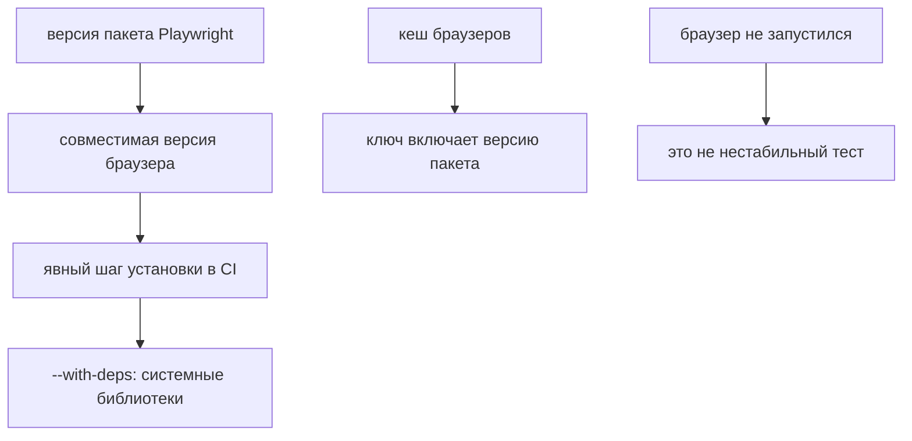

# Browsers и системные зависимости в CI

## Связь с предыдущей главой

Глава 240 создала job с Node.js и зависимостями проекта. Пакет Playwright установлен, но чистый Linux runner ещё не обязан содержать совместимый исполняемый файл браузера.

## Цель главы

Подготовить CI runner для автоматизации в браузере и отделить установку npm-пакета от установки браузера и системных библиотек.

## Главный вопрос

> Как подготовить runner для browser automation и избежать различий с локальным запуском?

## Мотивация

`npm ci` устанавливает `@playwright/test` и пакет Playwright, но исполняемый файл браузера устанавливается отдельно. Локальный cache может скрыть этот факт, а чистый runner завершит запуск до тестовой логики.

## Теория

### Браузер — отдельная зависимость

Установка пакетов и установка браузеров — разные шаги. `npm ci` кладёт на диск библиотеку Playwright, но не исполняемые файлы браузеров: они скачиваются отдельно и лежат вне `node_modules`.

Команда `npx playwright install --with-deps chromium` устанавливает браузер, соответствующий версии Playwright из lockfile, и необходимые системные зависимости Linux.

Ключевое слово — «соответствующий»: каждая версия Playwright работает со своей сборкой браузера. Обновление пакета без переустановки браузера даёт отказ запуска, а не тихую работу со старой версией.

### Что добавляет `--with-deps`

На чистом Linux-runner браузеру нужны системные библиотеки — шрифты, графика, звук, — которых в минимальном образе нет.

| Команда | Что делает |
| --- | --- |
| `npx playwright install chromium` | скачивает сборку браузера |
| `npx playwright install --with-deps chromium` | плюс ставит системные библиотеки |

Без системных зависимостей браузер скачан, но не запускается, и сообщение об ошибке говорит о недостающей библиотеке — не о тесте.

Указание конкретного браузера вместо установки всех трёх экономит заметное время и место: набору, работающему только в Chromium, незачем скачивать Firefox и WebKit.

### Headless ничего не отменяет

Headless mode меняет способ запуска, но не отменяет необходимость в исполняемом файле браузера и системных библиотеках.

Заблуждение распространённое: «headless — значит без графики, значит зависимости не нужны». На деле headless-режим — это тот же браузер, просто без вывода окна на экран. Движок, графическая подсистема и шрифты ему по-прежнему требуются.

### Cache браузеров и его ключ

Cache браузеров допустим как оптимизация, но ключ должен учитывать ОС, версию Playwright и lockfile.

Каждая часть ключа отвечает за свой класс ошибок:

- **ОС** — сборки браузера разные для разных систем;
- **версия Playwright** — несоответствие даёт отказ запуска;
- **lockfile** — фиксирует, какая именно версия установлена.

Ключ без версии Playwright — типичная причина загадочного падения после обновления пакета: кеш отдал старую сборку, а библиотека ждёт новую.

Промах cache обязан приводить к обычной корректной установке. Это то же требование, что в главе 239: кеш ускоряет, но не влияет на корректность.

### Сбой запуска браузера — не flaky test

Сбой запуска браузера до выполнения assertions является признаком проблемы инфраструктуры или конфигурации, а не доказательством flaky test.

Различать это просто по моменту отказа: если браузер не стартовал, тест не выполнил ни одного действия и ни одной проверки — проверять было нечего. Такой результат нельзя класть в статистику нестабильности и нельзя «лечить» повтором.

Это продолжение классификации из главы 225: отказ инфраструктуры и дефект продукта требуют разных владельцев и разных действий.

### Подготовка окружения — явный шаг

Браузеры и внешние сервисы готовятся явно, до запуска тестов.

Полезный порядок для job: установка зависимостей → установка браузеров → проверка готовности внешних сервисов → тесты. Проверка готовности стенда отдельным шагом даёт понятное сообщение «сервис недоступен» вместо двадцати упавших тестов с непонятными таймаутами.

Тот же принцип, что и с конфигурацией из главы 218: дорогие операции начинаются после того, как подтверждено, что для них всё готово.

Браузер — отдельная зависимость сборки:



## Внутренний механизм

После `npm ci` локальный Playwright CLI знает ожидаемую revision браузера. Команда установки получает именно её, затем команда тестов запускает браузер на runner. Несогласованные версии пакета и браузера приводят к инфраструктурному сбою до предметной проверки.

## Главная ментальная модель

Пакет Playwright определяет совместимый браузер; runner должен явно получить браузер и системные зависимости.

## Практический пример

```text
examples/03-automation-qa/chapter-241/01-browser-setup.workflow.yml
```

Fixture сначала выполняет `npm ci`, затем устанавливает Chromium с системными зависимостями и только после этого запускает проверку браузерного окружения. Он не предполагает наличия локального browser cache.

## Automation QA

Если тесты проходят локально, но браузер не стартует в CI, сначала сравнивают ОС, версию пакета, журналы установки и данные о запуске браузера. Retry теста не устанавливает отсутствующую библиотеку.

## Компромиссы

`--with-deps` увеличивает время подготовки, но делает Linux runner предсказуемее. Browser cache ускоряет повторные jobs, однако усложняет ключ cache и создаёт риск устаревших данных.

## Распространённые мифы

**Миф: `npm ci` устанавливает браузеры.**
Он ставит библиотеку. Исполняемые файлы браузеров скачиваются отдельной командой.

**Миф: в headless-режиме системные зависимости не нужны.**
Это тот же браузер без окна. Библиотеки и шрифты ему требуются.

**Миф: кеш браузеров можно привязать к одной ОС.**
Ключ должен учитывать ещё версию Playwright и lockfile, иначе кеш отдаст несовместимую сборку.

**Миф: отказ запуска браузера — нестабильный тест.**
Тест не выполнил ни одного действия. Это проблема инфраструктуры или конфигурации.

**Миф: проще поставить все браузеры сразу.**
Это время и место на каждом прогоне. Ставится тот, который используется.

## Частые вопросы

**Почему браузер не запускается на чистом runner?**
Скорее всего, не установлены системные библиотеки. Их добавляет `--with-deps`.

**Что произойдёт после обновления Playwright без переустановки браузера?**
Отказ запуска: каждая версия работает со своей сборкой.

**Что должно входить в ключ кеша браузеров?**
ОС, версия Playwright и lockfile.

**Можно ли считать отказ запуска браузера flaky-падением?**
Нет. Ни одна проверка не выполнялась, и повтор причину не устраняет.

**Где проверять готовность внешних сервисов?**
Отдельным шагом до тестов — иначе недоступность стенда выглядит как двадцать упавших тестов.

## Проверьте себя

1. Почему установка пакетов не даёт работающего браузера?
2. Что добавляет флаг `--with-deps` и зачем это на чистом runner?
3. Почему headless-режим не отменяет системные зависимости?
4. Из каких частей складывается корректный ключ кеша браузеров?
5. Как отличить отказ инфраструктуры от нестабильного теста?

## Распространённые ошибки

- Считать `npm ci` установкой браузеров.
- Полагаться на browser cache как на источник корректности.
- Путать headless execution с отсутствием системных зависимостей браузера.
- Классифицировать сбой запуска браузера как flaky test.

## Краткие итоги

- Установка npm-пакета и установка браузера — разные этапы.
- Версия браузера следует установленной версии Playwright.
- Cache остаётся необязательной оптимизацией.
- Сбой запуска браузера в CI требует инфраструктурной диагностики.

## Практика

Практика встроена из соответствующего файла главы.

## Переход к следующей главе

Runner технически готов к тестам. Глава 242 определит безопасную передачу environment configuration и credentials.
