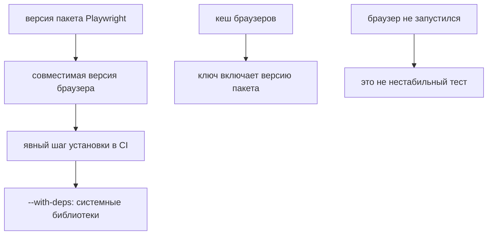

# Браузеры и системные зависимости в CI

## Связь с предыдущей главой

Глава 240 создала job с Node.js и зависимостями проекта. Пакет Playwright установлен, но чистый Linux runner ещё не обязан содержать совместимый исполняемый файл браузера.

## Цель главы

Подготовить CI runner для автоматизации в браузере и отделить установку npm-пакета от установки браузера и системных библиотек.

## Главный вопрос

> Как подготовить машину-исполнитель к управлению браузером и избежать различий с локальным запуском?

## Мотивация

`npm ci` устанавливает `@playwright/test` и пакет Playwright, но исполняемый файл браузера устанавливается отдельно. Локальный cache может скрыть этот факт, а чистый runner завершит запуск до тестовой логики.

## Теория

### Браузер — отдельная зависимость

Установка пакетов и установка браузеров — разные шаги. `npm ci` кладёт на диск библиотеку Playwright, но не исполняемые файлы браузеров: они скачиваются отдельно и лежат вне `node_modules`.

Команда `npx playwright install --with-deps chromium` устанавливает браузер, соответствующий версии Playwright из файла фиксации версий, и необходимые системные зависимости Linux.

Ключевое слово — «соответствующий»: каждая версия Playwright работает со своей сборкой браузера. Обновление пакета без переустановки браузера даёт отказ запуска, а не тихую работу со старой версией.

### Что добавляет `--with-deps`

На чистой машине с Linux браузеру нужны системные библиотеки — шрифты, графика, звук, — которых в минимальном образе нет.

| Команда | Что делает |
| --- | --- |
| `npx playwright install chromium` | скачивает сборку браузера |
| `npx playwright install --with-deps chromium` | плюс ставит системные библиотеки |

Без системных зависимостей браузер скачан, но не запускается, и сообщение об ошибке говорит о недостающей библиотеке — не о тесте.

Указание конкретного браузера вместо установки всех трёх экономит заметное время и место: набору, работающему только в Chromium, незачем скачивать Firefox и WebKit.

### Безоконный режим ничего не отменяет

Безоконный режим меняет способ запуска, но не отменяет необходимость в исполняемом файле браузера и системных библиотеках.

Заблуждение распространённое: «без окна — значит без графики, значит зависимости не нужны». На деле это тот же браузер, просто без вывода окна на экран. Движок, графическая подсистема и шрифты ему по-прежнему требуются.

### Кеш браузеров и его ключ

Кеш браузеров допустим как оптимизация, но ключ должен учитывать операционную систему, версию Playwright и файл фиксации версий.

Каждая часть ключа отвечает за свой класс ошибок:

- **ОС** — сборки браузера разные для разных систем;
- **версия Playwright** — несоответствие даёт отказ запуска;
- **файл фиксации версий** — фиксирует, какая именно версия установлена.

Ключ без версии Playwright — типичная причина загадочного падения после обновления пакета: кеш отдал старую сборку, а библиотека ждёт новую.

Промах кеша обязан приводить к обычной корректной установке. Это то же требование, что в главе 239: кеш ускоряет, но не влияет на корректность.

### Сбой запуска браузера — не нестабильный тест

Сбой запуска браузера до выполнения проверок является признаком проблемы инфраструктуры или конфигурации, а не доказательством нестабильности теста.

Различать это просто по моменту отказа: если браузер не стартовал, тест не выполнил ни одного действия и ни одной проверки — проверять было нечего. Такой результат нельзя класть в статистику нестабильности и нельзя «лечить» повтором.

Это продолжение классификации из главы 225: отказ инфраструктуры и дефект продукта требуют разных владельцев и разных действий.

### Подготовка окружения — явный шаг

Браузеры и внешние сервисы готовятся явно, до запуска тестов.

Полезный порядок для задачи: установка зависимостей → установка браузеров → проверка готовности внешних сервисов → тесты. Проверка готовности стенда отдельным шагом даёт понятное сообщение «сервис недоступен» вместо двадцати упавших тестов с непонятными истечениями времени.

Тот же принцип, что и с конфигурацией из главы 218: дорогие операции начинаются после того, как подтверждено, что для них всё готово.

Браузер — отдельная зависимость сборки:


```mermaid
flowchart TD
    A["версия пакета Playwright"] --> B["совместимая версия браузера"]
    B --> C["явный шаг установки в CI"]
    C --> D["--with-deps: системные библиотеки"]
    E["кеш браузеров"] --> F["ключ включает версию пакета"]
    G["браузер не запустился"] --> H["это не нестабильный тест"]
```

## Внутренний механизм

После `npm ci` локальный инструмент Playwright знает ожидаемую ревизию браузера. Команда установки получает именно её, затем команда тестов запускает браузер на машине-исполнителе. Несогласованные версии пакета и браузера приводят к инфраструктурному сбою до предметной проверки.

### Пакет и браузер ставятся разными командами

```text
npm ci                        → пакет @playwright/test нужной версии
                                он ЗНАЕТ, какая ревизия браузера ему нужна
npx playwright install        → загрузка исполняемых файлов браузеров
npx playwright install --with-deps
                              → браузеры + системные библиотеки
```

Первая команда браузеры не ставит. Вторая ставит именно ту ревизию, которую
ожидает установленный пакет, — поэтому обновление пакета без повторной установки
браузеров даёт отказ запуска с сообщением о недостающем исполняемом файле.

### Безоконный режим и системные зависимости — разные вещи

| Что означает | Что требуется |
| --- | --- |
| безоконный режим | не нужен графический сервер |
| работа браузера | нужны системные библиотеки (шрифты, графика, звук) |

Отсюда отказ вида «браузер закрылся сразу после запуска» на чистом образе Linux:
окно не нужно, а библиотеки — нужны. Их и добавляет `--with-deps`.

### Это отказ окружения, а не нестабильность теста

```text
браузер не запустился      → инфраструктура: правка теста ничего не изменит
тест упал на проверке      → поведение: разбираем сценарий
```

Различие видно по сообщению и по масштабу: отказ окружения роняет все тесты
задачи сразу и приходит до первой проверки. Кеш браузеров при этом ускоряет
установку, но сценарий обязан работать и при промахе кеша — иначе прогон
зависит от того, чего может не быть.

## Главная ментальная модель

Пакет Playwright определяет совместимый браузер; машина-исполнитель должна явно получить браузер и системные зависимости.

## Практический пример

```text
examples/03-automation-qa/chapter-241/01-browser-setup.workflow.yml
```

Учебный образец сначала выполняет `npm ci`, затем устанавливает Chromium с системными зависимостями и только после этого запускает проверку браузерного окружения. Он не предполагает наличия локального кеша браузеров.

## Automation QA

Если тесты проходят локально, но браузер не стартует в CI, сначала сравнивают операционную систему, версию пакета, журналы установки и данные о запуске браузера. Повтор теста не устанавливает отсутствующую библиотеку.

## Компромиссы

`--with-deps` увеличивает время подготовки, но делает машину с Linux предсказуемее. Кеш браузеров ускоряет повторные задачи, однако усложняет ключ кеша и создаёт риск устаревших данных.

## Распространённые мифы

**Миф: `npm ci` устанавливает браузеры.**
Он ставит библиотеку. Исполняемые файлы браузеров скачиваются отдельной командой.

**Миф: в безоконном режиме системные зависимости не нужны.**
Это тот же браузер без окна. Библиотеки и шрифты ему требуются.

**Миф: кеш браузеров можно привязать к одной ОС.**
Ключ должен учитывать ещё версию Playwright и файл фиксации версий, иначе кеш отдаст несовместимую сборку.

**Миф: отказ запуска браузера — нестабильный тест.**
Тест не выполнил ни одного действия. Это проблема инфраструктуры или конфигурации.

**Миф: проще поставить все браузеры сразу.**
Это время и место на каждом прогоне. Ставится тот, который используется.

## Частые вопросы

**Почему браузер не запускается на чистой машине-исполнителе?**
Скорее всего, не установлены системные библиотеки. Их добавляет `--with-deps`.

**Что произойдёт после обновления Playwright без переустановки браузера?**
Отказ запуска: каждая версия работает со своей сборкой.

**Что должно входить в ключ кеша браузеров?**
Операционная система, версия Playwright и файл фиксации версий.

**Можно ли считать отказ запуска браузера падением из-за нестабильности?**
Нет. Ни одна проверка не выполнялась, и повтор причину не устраняет.

**Где проверять готовность внешних сервисов?**
Отдельным шагом до тестов — иначе недоступность стенда выглядит как двадцать упавших тестов.

## Проверьте себя

1. Почему установка пакетов не даёт работающего браузера?
2. Что добавляет флаг `--with-deps` и зачем это на чистой машине-исполнителе?
3. Почему безоконный режим не отменяет системные зависимости?
4. Из каких частей складывается корректный ключ кеша браузеров?
5. Как отличить отказ инфраструктуры от нестабильного теста?

### Ответы

1. Пакет npm содержит код управления браузером, но не сам браузер. Его нужно скачать отдельной командой установки.
2. Установку системных библиотек, от которых зависит браузер. На чистой машине их нет, и браузер не запускается.
3. Отсутствие окна означает отсутствие вывода на экран, а не отсутствие графических библиотек. Браузеру по-прежнему нужны системные зависимости.
4. Операционная система исполнителя, версия Playwright и путь к каталогу браузеров. Без версии кеш отдаёт браузеры от старой версии.
5. Инфраструктурный отказ проявляется одинаково во всех тестах и на стадии запуска: браузер не стартует, зависимости не найдены. Нестабильный тест падает выборочно и в середине сценария.

## Распространённые ошибки

- Считать `npm ci` установкой браузеров — она ставит пакеты, а исполняемые файлы браузеров загружает отдельная команда установки. Без неё запуск падает с сообщением об отсутствующем браузере.

- Полагаться на кеш браузеров как на источник корректности — кеш ускоряет установку, но может быть пустым или устаревшим. Сценарий обязан работать и при промахе кеша.

- Путать безоконное выполнение с отсутствием системных зависимостей браузера — без графического окружения браузеру всё равно нужны системные библиотеки. Их ставит установка с флагом зависимостей.

- Классифицировать сбой запуска браузера как нестабильность теста — это отказ окружения, и правка теста его не устранит. Различие видно по сообщению: браузер не запустился, а не проверка не прошла.

## Краткие итоги

- Установка npm-пакета и установка браузера — разные этапы.
- Версия браузера следует установленной версии Playwright.
- Кеш остаётся необязательной оптимизацией.
- Сбой запуска браузера в CI требует инфраструктурной диагностики.

## Практика

Практика встроена из соответствующего файла главы.

## Переход к следующей главе

Машина-исполнитель технически готова к тестам. Глава 242 определит безопасную передачу конфигурации окружения и учётных данных.
