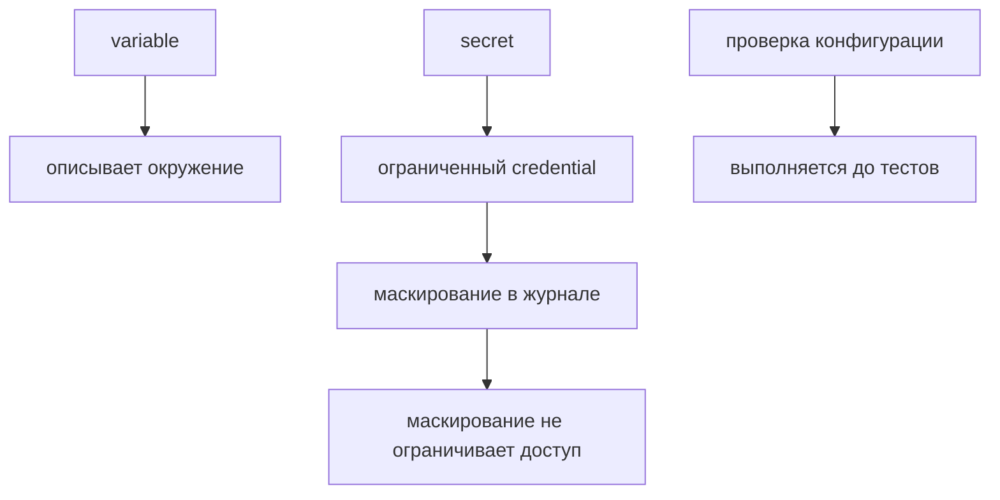

# Environments и secrets в CI

## Связь с предыдущей главой

Глава 241 подготовила runner для браузерных тестов. Для предметного запуска ему ещё нужны проверяемые настройки окружения и credentials, которые нельзя хранить в исходниках.

## Цель главы

Разделить variables и secrets, ограничить доступ к ним и проверить обязательную конфигурацию до запуска тестов.

## Главный вопрос

> Как безопасно передать environment configuration и credentials в pipeline?

## Мотивация

Записанный в исходниках token попадает в историю Git, а отсутствующая переменная часто обнаруживается только в середине теста. CI должен передавать значения через управляемый контекст и завершаться до тестов, если контракт неполон.

## Теория

### Variable и secret решают разные задачи

Variable хранит несекретную конфигурацию, например имя environment или базовый URL тестового стенда. Secret хранит credential и передаётся step как переменная окружения только на время выполнения.

| | Variable | Secret |
| --- | --- | --- |
| содержимое | имя окружения, адрес стенда | token, пароль, ключ |
| видимость | обычное значение в журнале | маскируется |
| хранение | конфигурация репозитория | хранилище секретов |

Разделение полезно и само по себе: значения, которые не являются секретами, не нужно прятать — их видимость помогает понять, против чего шёл запуск, ровно как безопасный контекст окружения из главы 229.

### Маскирование — не защита доступа

Masking уменьшает риск появления значения в журнале, но не заменяет управление доступом и не делает произвольную загрузку artifact безопасной.

Границы маскирования стоит понимать точно. Оно работает по точному совпадению строки в выводе — и не спасает, если значение попало в журнал изменённым: закодированным, разбитым на части, включённым в подпись запроса или в JSON внутри артефакта.

Отсюда и связь с главами 227–228: маскирование в журнале не защищает содержимое trace, скриншота или вложения. Данные, попадающие в артефакты, фильтруются до сохранения — на стороне теста.

### Где живут секреты и когда они недоступны

Секреты репозитория доступны в контексте репозитория. Environment secrets связаны с GitHub environment и могут требовать настроенных правил защиты.

Отдельно стоит случай, который ломает наивные pipeline: для pull request из fork secrets обычно не передаются. Workflow не должен считать их гарантированно доступными для непроверенного кода.

Логика здесь защитная: код в PR из fork написан кем угодно, и выдать ему доступ к учётным данным — значит выдать их автору PR. Практическое следствие для автоматизации: набор тестов, требующий секретов, не может быть единственной обязательной проверкой для внешних вкладов. Обычно проверки разделяют — статический анализ и тесты, не требующие доступа, выполняются всегда, а полный прогон против стенда запускается после проверки человеком.

### Минимальные разрешения токена

`GITHUB_TOKEN` получает только необходимые permissions. Для чтения исходников во время тестирования достаточно `contents: read`.

Это то же правило наименьших привилегий, что для тестовой учётной записи базы из главы 207 и для токенов из главы 191. Права выдаются под задачу: если workflow только проверяет код, права на запись ему не нужны, и их отсутствие превращает потенциальную ошибку в отказ.

Production credentials и права на deployment находятся за границей модуля — тестовый pipeline не должен иметь возможности что-либо выпустить.

### Как секрет попадает в тест

Передача идёт по цепочке: хранилище секретов → переменная окружения шага → загрузчик конфигурации → код теста.

Последние два звена описаны в главах 217 и 218, и именно там действуют правила: значение проверяется во время выполнения, отсутствие обязательного значения останавливает запуск, а в диагностику попадает маркер вместо содержимого.

Практический признак правильной цепочки: нигде в коде теста нет ни литерала секрета, ни значения по умолчанию для него. Умолчание для токена — способ незаметно запустить набор не там, где предполагалось.

### Что не должно попадать в репозиторий

Секреты не хранятся в репозитории — и это правило включает историю. Удалённый в следующем коммите токен остаётся в истории git и в кешах систем, которые её скопировали.

Поэтому реакция на попавший в репозиторий секрет одна: считать его скомпрометированным и отозвать, а не удалять файл. Это ровно то, о чём говорит глава 191, и в контексте CI риск выше — репозиторий и pipeline обычно доступны шире, чем боевые системы.

Настройка окружения и доступ к системам — разные вещи:



## Внутренний механизм

GitHub подставляет `$&#123;&#123; vars.NAME &#125;&#125;` и `$&#123;&#123; secrets.NAME &#125;&#125;` до запуска shell step. Step получает значения через `env`, затем проверка runtime-конфигурации проверяет наличие и формат без печати содержимого. Ненулевой код завершения прекращает запуск до обращения к тестируемой системе.

## Главная ментальная модель

Variable описывает окружение, secret предоставляет ограниченный credential, а проверка подтверждает контракт до теста.

## Практический пример

```text
examples/03-automation-qa/chapter-242/01-environment-and-secrets.workflow.yml
```

Fixture использует environment `qa-preview`, который может быть защищён настроенными в репозитории правилами, а также `vars.API_BASE_URL`, `secrets.API_TOKEN`, минимальные permissions и shell-проверку без вывода значений. Secret доступен только шагу проверки, а строки из одних пробелов считаются отсутствующими. Это статический пример: реальные secrets не создаются.

## Automation QA

API- и UI-тесты получают одинаково названные значения, но не отвечают за способ их хранения. Загрузчик конфигурации из глав 216–218 остаётся границей приложения и должен выдавать безопасную ошибку без значения secret.

## Компромиссы

Защита environment повышает безопасность, но может добавить ручное подтверждение и время ожидания. Repository secret проще, однако имеет более широкую область применения.

## Распространённые мифы

**Миф: маскирование делает журнал безопасным.**
Оно работает по точному совпадению. Закодированное или разбитое значение пройдёт мимо.

**Миф: маскирование распространяется на артефакты.**
Trace, скриншоты и вложения фильтруются на стороне теста до сохранения.

**Миф: секреты доступны любому запуску.**
Для pull request из fork они обычно не передаются: иначе доступ получил бы автор PR.

**Миф: удалить секрет из репозитория достаточно.**
Он остаётся в истории. Попавший в репозиторий секрет считается скомпрометированным и отзывается.

**Миф: значение по умолчанию для токена удобно для локального запуска.**
Оно позволяет незаметно запустить набор не там, где предполагалось.

## Частые вопросы

**Что класть в variable, а что в secret?**
Имя окружения и адрес стенда — variable; учётные данные — secret.

**Почему workflow для внешнего PR не видит секретов?**
Код в нём написан кем угодно. Доступ к учётным данным получил бы автор PR.

**Как тогда проверять внешние вклады?**
Разделять проверки: статический анализ и тесты без доступа — всегда, полный прогон — после проверки человеком.

**Какие права нужны токену для тестов?**
Обычно `contents: read`. Права на запись и развёртывание — за границей задачи.

**Где заканчивается ответственность CI за секрет?**
На передаче его в переменную окружения. Дальше действуют правила загрузчика из главы 218.

## Проверьте себя

1. Чем variable отличается от secret и почему несекретные значения не прячут?
2. В каких случаях маскирование не срабатывает?
3. Почему секреты не передаются в pull request из fork?
4. Как устроена цепочка передачи секрета до кода теста?
5. Что делать с секретом, попавшим в репозиторий?

## Распространённые ошибки

- Печатать secret для диагностики.
- Считать masking управлением доступом.
- Ожидать secrets в pull request из fork.
- Передавать production credential учебному workflow.
- Давать `contents: write` для test job.

## Краткие итоги

- Variables и secrets имеют разные контракты.
- Environment может ограничивать доступ, если в репозитории настроены соответствующие правила защиты.
- Проверка runtime-конфигурации выполняется до тестов.
- Минимальные permissions уменьшают последствия ошибки.

## Практика

Практика встроена из соответствующего файла главы.

## Переход к следующей главе

После завершения job runner исчезает. Глава 243 покажет, какие диагностические результаты нужно сохранить как artifacts.
