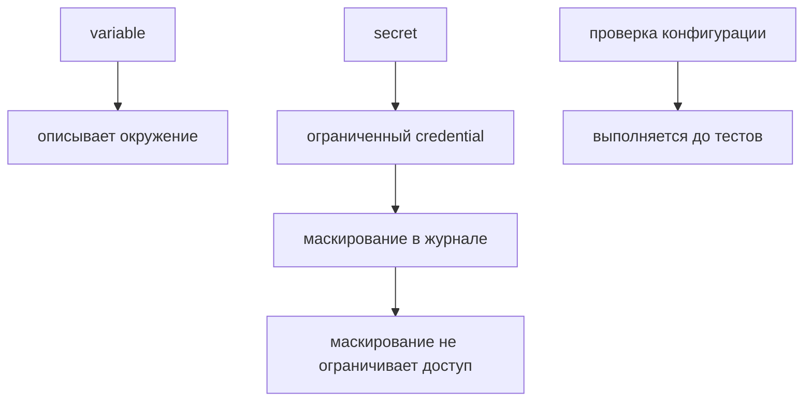

# Окружения и секреты в CI

## Связь с предыдущей главой

Глава 241 подготовила runner для браузерных тестов. Для предметного запуска ему ещё нужны проверяемые настройки окружения и credentials, которые нельзя хранить в исходниках.

## Цель главы

Разделить variables и secrets, ограничить доступ к ним и проверить обязательную конфигурацию до запуска тестов.

## Главный вопрос

> Как безопасно передать конфигурацию окружения и учётные данные в конвейер?

## Мотивация

Записанный в исходниках token попадает в историю Git, а отсутствующая переменная часто обнаруживается только в середине теста. CI должен передавать значения через управляемый контекст и завершаться до тестов, если контракт неполон.

## Теория

### Переменная и секрет решают разные задачи

Переменная хранит несекретную конфигурацию, например имя окружения или базовый адрес тестового стенда. Секрет хранит учётные данные и передаётся шагу как переменная окружения только на время выполнения.

| | Variable | Secret |
| --- | --- | --- |
| содержимое | имя окружения, адрес стенда | токен, пароль, ключ |
| видимость | обычное значение в журнале | маскируется |
| хранение | конфигурация репозитория | хранилище секретов |

Разделение полезно и само по себе: значения, которые не являются секретами, не нужно прятать — их видимость помогает понять, против чего шёл запуск, ровно как безопасный контекст окружения из главы 229.

### Маскирование — не защита доступа

Маскирование уменьшает риск появления значения в журнале, но не заменяет управление доступом и не делает произвольную загрузку артефакта безопасной.

Границы маскирования стоит понимать точно. Оно работает по точному совпадению строки в выводе — и не спасает, если значение попало в журнал изменённым: закодированным, разбитым на части, включённым в подпись запроса или в JSON внутри артефакта.

Отсюда и связь с главами 227–228: маскирование в журнале не защищает содержимое трассировки, снимка экрана или вложения. Данные, попадающие в артефакты, фильтруются до сохранения — на стороне теста.

### Где живут секреты и когда они недоступны

Секреты репозитория доступны в контексте репозитория. Секреты окружения связаны с окружением GitHub и могут требовать настроенных правил защиты.

Отдельно стоит случай, который ломает наивные конвейеры: для запроса на слияние из форка секреты обычно не передаются. Сценарий сборки не должен считать их гарантированно доступными для непроверенного кода.

Логика здесь защитная: код в запросе из форка написан кем угодно, и выдать ему доступ к учётным данным — значит выдать их автору запроса. Практическое следствие для автоматизации: набор тестов, требующий секретов, не может быть единственной обязательной проверкой для внешних вкладов. Обычно проверки разделяют — статический анализ и тесты, не требующие доступа, выполняются всегда, а полный прогон против стенда запускается после проверки человеком.

### Минимальные разрешения токена

`GITHUB_TOKEN` получает только необходимые права. Для чтения исходников во время тестирования достаточно `contents: read`.

Это то же правило наименьших привилегий, что для тестовой учётной записи базы из главы 207 и для токенов из главы 191. Права выдаются под задачу: если сценарий сборки только проверяет код, права на запись ему не нужны, и их отсутствие превращает потенциальную ошибку в отказ.

Учётные данные промышленной среды и права на развёртывание находятся за границей модуля — тестовый конвейер не должен иметь возможности что-либо выпустить.

### Как секрет попадает в тест

Передача идёт по цепочке: хранилище секретов → переменная окружения шага → загрузчик конфигурации → код теста.

Последние два звена описаны в главах 217 и 218, и именно там действуют правила: значение проверяется во время выполнения, отсутствие обязательного значения останавливает запуск, а в диагностику попадает маркер вместо содержимого.

Практический признак правильной цепочки: нигде в коде теста нет ни литерала секрета, ни значения по умолчанию для него. Умолчание для токена — способ незаметно запустить набор не там, где предполагалось.

### Что не должно попадать в репозиторий

Секреты не хранятся в репозитории — и это правило включает историю. Удалённый в следующем коммите токен остаётся в истории git и в кешах систем, которые её скопировали.

Поэтому реакция на попавший в репозиторий секрет одна: считать его скомпрометированным и отозвать, а не удалять файл. Это ровно то, о чём говорит глава 191, и в контексте CI риск выше — репозиторий и конвейер обычно доступны шире, чем боевые системы.

Настройка окружения и доступ к системам — разные вещи:


```mermaid
flowchart TD
    A["variable"] --> B["описывает окружение"]
    C["secret"] --> D["ограниченный credential"]
    D --> E["маскирование в журнале"]
    E --> F["маскирование не ограничивает доступ"]
    G["проверка конфигурации"] --> H["выполняется до тестов"]
```

## Внутренний механизм

GitHub подставляет `$&#123;&#123; vars.NAME &#125;&#125;` и `$&#123;&#123; secrets.NAME &#125;&#125;` до запуска шага оболочки. Шаг получает значения через `env`, затем проверка конфигурации во время выполнения контролирует наличие и формат без печати содержимого. Ненулевой код завершения прекращает запуск до обращения к тестируемой системе.

### Подстановка происходит до запуска команды

```text
сценарий сборки:  env: TOKEN: ${{ secrets.API_TOKEN }}
                          │ платформа подставляет значение
                          ▼
шаг оболочки:     процесс получает переменную окружения TOKEN
                          │
                          ▼
проверка конфигурации: наличие и формат, БЕЗ печати значения
```

Секрет попадает в процесс как обычная переменная окружения — дальше с ним
работает тот же загрузчик конфигурации, что и локально. Проверка выполняется до
первого обращения к стенду, и при ошибке прогон прекращается с ненулевым кодом.

### Чего маскирование не делает

| Случай | Маскируется |
| --- | --- |
| точное значение секрета в выводе | да, заменяется звёздочками |
| значение, собранное из частей | нет |
| закодированное или обрезанное значение | нет |
| секрет, попавший в артефакт или вложение | нет |

Маскирование — последняя страховка, а не управление доступом. Поэтому проверяют
наличие переменной, а не печатают её значение «для диагностики».

### Что доступно, а что нет

```text
обычный прогон ветки          → переменные и секреты доступны
запрос на слияние из форка    → секреты НЕ передаются
```

Иначе любой участник получал бы доступ к ним, прислав изменение. Прогоны для
форков планируют без секретов — например, только статические проверки и тесты,
не требующие стенда.

## Главная ментальная модель

Переменная описывает окружение, секрет предоставляет ограниченные учётные данные, а проверка подтверждает контракт до теста.

## Практический пример

```text
examples/03-automation-qa/chapter-242/01-environment-and-secrets.workflow.yml
```

Учебный образец использует окружение `qa-preview`, которое может быть защищено настроенными в репозитории правилами, а также `vars.API_BASE_URL`, `secrets.API_TOKEN`, минимальные права и проверку оболочкой без вывода значений. Секрет доступен только шагу проверки, а строки из одних пробелов считаются отсутствующими. Это статический пример: реальные секреты не создаются.

## Automation QA

Тесты API и интерфейса получают одинаково названные значения, но не отвечают за способ их хранения. Загрузчик конфигурации из глав 216–218 остаётся границей приложения и должен выдавать безопасную ошибку без значения секрета.

## Компромиссы

Защита окружения повышает безопасность, но может добавить ручное подтверждение и время ожидания. Секрет репозитория проще, однако имеет более широкую область применения.

## Распространённые мифы

**Миф: маскирование делает журнал безопасным.**
Оно работает по точному совпадению. Закодированное или разбитое значение пройдёт мимо.

**Миф: маскирование распространяется на артефакты.**
Трассировка, снимки экрана и вложения фильтруются на стороне теста до сохранения.

**Миф: секреты доступны любому запуску.**
Для запроса на слияние из форка они обычно не передаются: иначе доступ получил бы автор запроса.

**Миф: удалить секрет из репозитория достаточно.**
Он остаётся в истории. Попавший в репозиторий секрет считается скомпрометированным и отзывается.

**Миф: значение по умолчанию для токена удобно для локального запуска.**
Оно позволяет незаметно запустить набор не там, где предполагалось.

## Частые вопросы

**Что класть в переменную, а что в секрет?**
Имя окружения и адрес стенда — в переменную; учётные данные — в секрет.

**Почему сценарий сборки для внешнего запроса не видит секретов?**
Код в нём написан кем угодно. Доступ к учётным данным получил бы автор запроса.

**Как тогда проверять внешние вклады?**
Разделять проверки: статический анализ и тесты без доступа — всегда, полный прогон — после проверки человеком.

**Какие права нужны токену для тестов?**
Обычно `contents: read`. Права на запись и развёртывание — за границей задачи.

**Где заканчивается ответственность CI за секрет?**
На передаче его в переменную окружения. Дальше действуют правила загрузчика из главы 218.

## Проверьте себя

1. Чем переменная отличается от секрета и почему несекретные значения не прячут?
2. В каких случаях маскирование не срабатывает?
3. Почему секреты не передаются в запросе на слияние из форка?
4. Как устроена цепочка передачи секрета до кода теста?
5. Что делать с секретом, попавшим в репозиторий?

### Ответы

1. Переменная видна в журналах и настройках, секрет скрыт и маскируется. Несекретные значения не прячут потому, что скрытый адрес стенда усложняет разбор падения, ничего не защищая.
2. Когда значение преобразовано: закодировано, разбито на части, выведено посимвольно или попало в артефакт — снимок экрана, трассировку, файл.
3. Такой запрос содержит код, который вы не контролируете. Доступ к секретам дал бы возможность их выгрузить любому автору запроса.
4. Секрет хранится в настройках, подставляется шагу как переменная окружения, оттуда читается кодом загрузки конфигурации и передаётся клиенту. В тесте он не хранится и не логируется.
5. Считать его скомпрометированным: отозвать и выпустить новый. Удаление из истории не помогает — копии уже могли разойтись.

## Распространённые ошибки

- Печатать секрет для диагностики — журнал сборки доступен шире, чем стенд, и остаётся в истории прогонов. Проверяют наличие переменной, а не её значение.

- Считать маскирование управлением доступом — замена значения звёздочками работает только для точного совпадения в выводе. Секрет, собранный по частям или закодированный, пройдёт в журнал открытым.

- Ожидать секреты в запросе на слияние из форка — платформа их не передаёт, иначе любой участник получал бы доступ к ним. Такие прогоны планируют без секретов.

- Передавать учётные данные промышленной среды учебному сценарию сборки — цена ошибки становится необратимой, а выигрыша нет: учебный прогон работает со стендом.

- Давать `contents: write` задаче с тестами — тестам не нужно менять репозиторий. Лишнее право превращает влияние на сборку во влияние на код.

## Краткие итоги

- Переменные и секреты имеют разные контракты.
- Окружение может ограничивать доступ, если в репозитории настроены соответствующие правила защиты.
- Проверка конфигурации во время выполнения выполняется до тестов.
- Минимальные права уменьшают последствия ошибки.

## Практика

Практика встроена из соответствующего файла главы.

## Переход к следующей главе

После завершения задачи машина-исполнитель исчезает. Глава 243 покажет, какие диагностические результаты нужно сохранить как артефакты.
