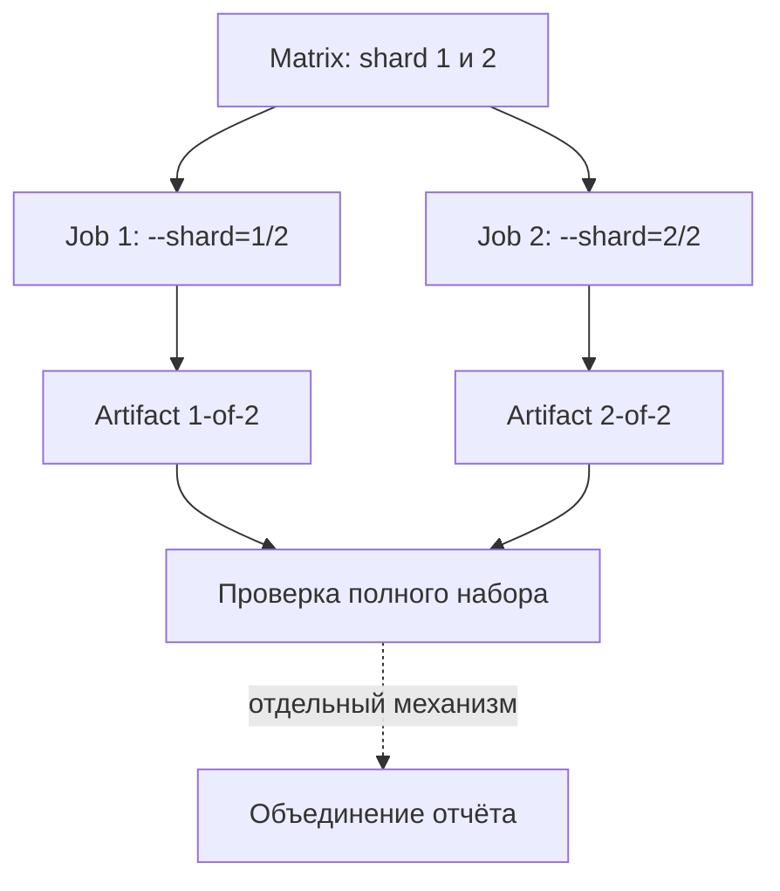

# CI jobs, sharding и диагностика запусков

## Связь с предыдущей главой

Глава 243 определила принадлежность artifacts одного job. При распределённом запуске каждый job должен получить собственную часть набора и уникальное имя результата.

## Цель главы

Масштабировать CI через небольшую matrix, сохранить утверждённую семантику sharding и диагностировать различия между локальным запуском, pull request и запуском по расписанию.

## Главный вопрос

> Как масштабировать pipeline и расследовать различия между pull-request, scheduled и локальным запуском?

## Мотивация

Длинный набор тестов можно разделить, но без явного идентификатора два jobs создадут конфликт artifacts, а пропуск shard останется незаметным. Масштабирование должно сохранять полное покрытие и видимость каждого сбоя.

## Теория

Matrix расширяет описание job в несколько самостоятельных jobs. Sharding делит выбранный набор тестов между ними. Matrix не равна Playwright projects, workers, repeat или retry: это внешний уровень GitHub Actions, а shard остаётся сегментом Playwright с нумерацией от единицы.

`strategy.fail-fast: false` позволяет остальным matrix jobs завершить диагностику после падения одного сегмента. Каждый job использует `--shard=X/Y`, а имя artifact включает `X-of-Y`. Все shards вместе должны покрывать выбранный набор без дубликатов и пропусков. Объединение результатов является отдельным шагом и должно соответствовать формату reporter; простое скачивание файлов не создаёт корректный отчёт.

Запуск для pull request проверяет изменение до merge, запуск по расписанию помогает выявить зависимость от времени и внешнего состояния, а локальный запуск помогает воспроизведению. Различие контекста — диагностический признак, а не автоматический диагноз дефекта продукта.

## Внутренний механизм



## Главная ментальная модель

Matrix создаёт jobs, sharding распределяет тесты, идентификатор artifact сохраняет принадлежность результата, а диагностика сравнивает контексты.

## Практический пример

```text
examples/03-automation-qa/chapter-244/01-sharded-diagnostics.workflow.yml
```

Fixture создаёт ровно два jobs, запускает четыре теста главы 237 сегментами `1/2` и `2/2`, сохраняет разные artifacts и не скрывает падение. Локальная проверка подтверждает покрытие `2 + 2 = 4` без дубликатов и пропусков.

## Automation QA

Если падение происходит только в CI, сравнивают событие запуска, commit, environment, shard, project, данные worker и внешние зависимости. Повтор запуска может дать дополнительный сигнал, но не заменяет классификацию из главы 232.

## Компромиссы

Sharding уменьшает общее время ожидания, но увеличивает суммарное время вычислений и стоимость подготовки окружений. Большая matrix быстро увеличивает стоимость и сложность объединения отчёта.

## Распространённые ошибки

- Путать matrix и shard.
- Начинать shard index с нуля.
- Использовать одинаковые имена artifacts.
- Останавливать все jobs до сбора диагностических материалов без осознанной причины.
- Считать падение только в CI дефектом продукта без расследования.

## Краткие итоги

- Matrix создаёт отдельные jobs.
- Shards независимо покрывают части одного выбранного набора тестов.
- Идентификатор artifact предотвращает конфликты имён.
- Объединение результатов и публикация отчёта остаются отдельными механизмами.

## Практика

Практика встроена из соответствующего файла главы.

## Переход к следующей главе

Локальное выполнение и CI теперь образуют единый диагностируемый контур. Глава 245 начнёт интеграцию UI, API, gRPC, database и общей инфраструктуры без добавления новых базовых тем.
