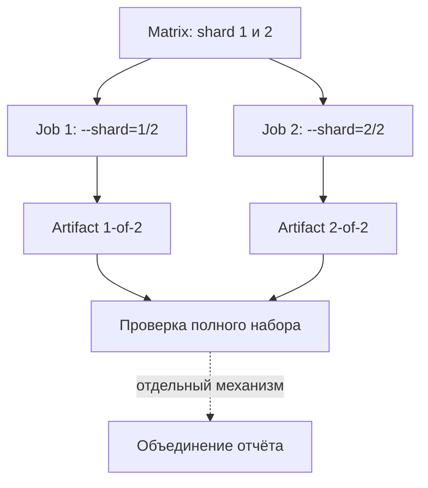

# CI jobs, sharding и диагностика запусков

## Связь с предыдущей главой

Глава 243 определила принадлежность artifacts одного job. При распределённом запуске каждый job должен получить собственную часть набора и уникальное имя результата.

## Цель главы

Масштабировать CI через небольшую matrix, сохранить утверждённую семантику sharding и диагностировать различия между локальным запуском, pull request и запуском по расписанию.

## Главный вопрос

> Как масштабировать pipeline и расследовать различия между pull-request, scheduled и локальным запуском?

## Мотивация

Длинный набор тестов можно разделить, но без явного идентификатора два jobs создадут конфликт artifacts, а пропуск shard останется незаметным. Масштабирование должно сохранять полное покрытие и видимость каждого сбоя.

## Теория

### Matrix и sharding — разные механизмы

Matrix расширяет описание job в несколько самостоятельных jobs. Sharding делит выбранный набор тестов между ними.

Matrix отвечает на вопрос «сколько независимых окружений запустить», sharding — «как распределить между ними тесты». По отдельности каждый бесполезен: matrix без sharding запустит один и тот же набор целиком несколько раз, sharding без matrix оставит сегменты без исполнителей.

Matrix не равна Playwright projects, workers, repeat или retry: это внешний уровень GitHub Actions, а shard остаётся сегментом Playwright с нумерацией от единицы.

| Уровень | Что делит | Где настраивается |
| --- | --- | --- |
| matrix | jobs и runner'ы | GitHub Actions |
| shard | тесты между jobs | параметр Playwright |
| workers | тесты внутри процесса | конфигурация Playwright |
| projects | варианты выполнения | конфигурация Playwright |

Смешение этих уровней даёт характерную ошибку настройки: увеличили число jobs, а время прогона не изменилось, потому что внутри каждого по-прежнему один worker.

### Полнота и отсутствие дубликатов

Каждый job использует `--shard=X/Y`. Все shards вместе должны покрывать выбранный набор без дубликатов и пропусков.

Отсюда практическое требование: число сегментов в команде и число jobs в matrix должны совпадать. Несовпадение даёт тихий пропуск — часть тестов не выполнится ни в одном сегменте, а прогон будет зелёным.

Это тот же класс ошибки, что «зелёный pipeline не означает отсутствия дефектов» из главы 239: непроверенное остаётся неизвестным, и здесь оно ещё и невидимо.

### Падение одного сегмента не должно гасить остальные

`strategy.fail-fast: false` позволяет остальным matrix jobs завершить диагностику после падения одного сегмента.

Поведение по умолчанию — остановить всё при первом падении — экономит машинное время и портит расследование: вы узнаёте про один упавший тест и не узнаёте, упали ли другие сегменты по той же причине.

Для тестового pipeline честная картина обычно важнее сэкономленных минут: при массовом сбое стенда полезно видеть, что упали все сегменты, а не один.

### Объединение результатов

Объединение результатов является отдельным шагом и должно соответствовать формату reporter; простое скачивание файлов не создаёт корректный отчёт.

Это продолжение различия из главы 243: артефакты — это файлы, отчёт — построенное представление. Каждый сегмент производит свою часть результатов, и собрать из них один отчёт может только инструмент, понимающий формат.

Имя artifact включает `X-of-Y` — без этого сегменты конфликтуют за одно имя, и объединять становится нечего.

### Контекст запуска как диагностический признак

Запуск для pull request проверяет изменение до merge, запуск по расписанию помогает выявить зависимость от времени и внешнего состояния, а локальный запуск помогает воспроизведению.

Расписание ловит особый класс дефектов: тесты, зависящие от даты, от накопленных данных, от состояния внешнего сервиса. В PR такой набор проходит, а ночью падает — и это ценный сигнал, а не помеха.

Различие контекста — диагностический признак, а не автоматический диагноз дефекта продукта. Тест, падающий только по расписанию, может указывать и на зависимость от времени, и на деградацию стенда, и на данные, накопленные предыдущими прогонами. Классификация из главы 225 применяется здесь так же.

### Что даёт и чего стоит распараллеливание

Sharding сокращает время прогона, но умножает подготовку: каждый job заново ставит зависимости, браузеры и проверяет готовность стенда.

Отсюда точка разумности: если подготовка занимает пять минут, а тесты — шесть, деление на восемь сегментов почти не ускорит прогон, зато увеличит нагрузку на стенд в восемь раз.

И отдельное напоминание из главы 215: параллельный запуск многократно усиливает требования к изоляции данных. Сегменты работают одновременно против одного стенда, и уникальные пространства имён здесь не рекомендация, а условие работоспособности.

## Внутренний механизм



## Главная ментальная модель

Matrix создаёт jobs, sharding распределяет тесты, идентификатор artifact сохраняет принадлежность результата, а диагностика сравнивает контексты.

## Практический пример

```text
examples/03-automation-qa/chapter-244/01-sharded-diagnostics.workflow.yml
```

Fixture создаёт ровно два jobs, запускает четыре теста главы 237 сегментами `1/2` и `2/2`, сохраняет разные artifacts и не скрывает падение. Локальная проверка подтверждает покрытие `2 + 2 = 4` без дубликатов и пропусков.

## Automation QA

Если падение происходит только в CI, сравнивают событие запуска, commit, environment, shard, project, данные worker и внешние зависимости. Повтор запуска может дать дополнительный сигнал, но не заменяет классификацию из главы 232.

## Компромиссы

Sharding уменьшает общее время ожидания, но увеличивает суммарное время вычислений и стоимость подготовки окружений. Большая matrix быстро увеличивает стоимость и сложность объединения отчёта.

## Распространённые мифы

**Миф: matrix — это то же самое, что workers.**
Matrix создаёт независимые jobs, workers распределяют тесты внутри процесса. Это разные уровни.

**Миф: увеличение числа jobs всегда ускоряет прогон.**
Каждый job заново готовит окружение. При короткой фазе тестов выигрыша может не быть.

**Миф: несовпадение числа сегментов и jobs заметно.**
Часть тестов просто не выполнится, а прогон останется зелёным.

**Миф: `fail-fast` по умолчанию полезен для тестов.**
Он скрывает, упали ли остальные сегменты по той же причине.

**Миф: скачав артефакты всех сегментов, получаешь общий отчёт.**
Объединение — отдельный шаг, зависящий от формата reporter.

## Частые вопросы

**Сколько сегментов выбирать?**
Столько, чтобы время тестов заметно превышало время подготовки job и нагрузка на стенд оставалась приемлемой.

**Почему прогон не ускорился после добавления jobs?**
Вероятно, внутри каждого job по-прежнему один worker: уровни параллельности разные.

**Зачем запускать набор по расписанию?**
Чтобы ловить зависимость от времени, накопленных данных и состояния внешних сервисов.

**Как связать артефакты сегментов?**
Включать номер сегмента в имя: иначе jobs конфликтуют за одно имя.

**Что обязательно перед включением sharding?**
Изоляция тестовых данных: сегменты работают одновременно против одного стенда.

## Проверьте себя

1. Чем matrix отличается от sharding и почему по отдельности они бесполезны?
2. Какие четыре уровня параллельности существуют и где настраивается каждый?
3. Что произойдёт при несовпадении числа сегментов и jobs?
4. Зачем отключать `fail-fast` в тестовом pipeline?
5. Когда деление на сегменты перестаёт ускорять прогон?

## Распространённые ошибки

- Путать matrix и shard.
- Начинать shard index с нуля.
- Использовать одинаковые имена artifacts.
- Останавливать все jobs до сбора диагностических материалов без осознанной причины.
- Считать падение только в CI дефектом продукта без расследования.

## Краткие итоги

- Matrix создаёт отдельные jobs.
- Shards независимо покрывают части одного выбранного набора тестов.
- Идентификатор artifact предотвращает конфликты имён.
- Объединение результатов и публикация отчёта остаются отдельными механизмами.

## Практика

Практика встроена из соответствующего файла главы.

## Переход к следующей главе

Локальное выполнение и CI теперь образуют единый диагностируемый контур. Глава 245 начнёт интеграцию UI, API, gRPC, database и общей инфраструктуры без добавления новых базовых тем.
