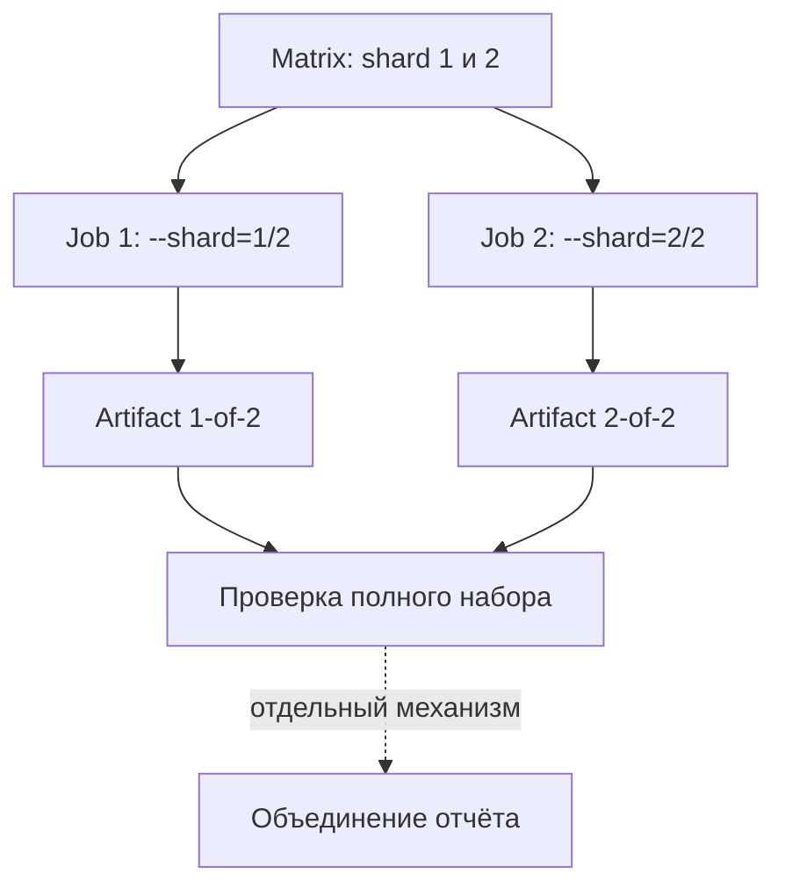

# Задачи CI, сегментирование и диагностика запусков

## Связь с предыдущей главой

Глава 243 определила принадлежность artifacts одного job. При распределённом запуске каждый job должен получить собственную часть набора и уникальное имя результата.

## Цель главы

Масштабировать CI через небольшую matrix, сохранить утверждённую семантику sharding и диагностировать различия между локальным запуском, pull request и запуском по расписанию.

## Главный вопрос

> Как масштабировать конвейер и расследовать различия между запуском по запросу на слияние, по расписанию и локальным?

## Мотивация

Длинный набор тестов можно разделить, но без явного идентификатора два jobs создадут конфликт artifacts, а пропуск shard останется незаметным. Масштабирование должно сохранять полное покрытие и видимость каждого сбоя.

## Теория

### Матрица и сегментирование — разные механизмы

Матрица расширяет описание задачи в несколько самостоятельных задач. Сегментирование делит выбранный набор тестов между ними.

Матрица отвечает на вопрос «сколько независимых окружений запустить», сегментирование — «как распределить между ними тесты». По отдельности каждый бесполезен: матрица без сегментирования запустит один и тот же набор целиком несколько раз, сегментирование без матрицы оставит сегменты без исполнителей.

Матрица не равна проектам, рабочим процессам, повторным прогонам или повторам Playwright: это внешний уровень GitHub Actions, а сегмент остаётся сегментом Playwright с нумерацией от единицы.

| Уровень | Что делит | Где настраивается |
| --- | --- | --- |
| матрица | задачи и машины-исполнители | GitHub Actions |
| сегмент | тесты между задачами | параметр Playwright |
| рабочие процессы | тесты внутри процесса | конфигурация Playwright |
| проекты | варианты выполнения | конфигурация Playwright |

Смешение этих уровней даёт характерную ошибку настройки: увеличили число задач, а время прогона не изменилось, потому что внутри каждой по-прежнему один рабочий процесс.

### Полнота и отсутствие дубликатов

Каждая задача использует `--shard=X/Y`. Все сегменты вместе должны покрывать выбранный набор без дубликатов и пропусков.

Отсюда практическое требование: число сегментов в команде и число задач в матрице должны совпадать. Несовпадение даёт тихий пропуск — часть тестов не выполнится ни в одном сегменте, а прогон будет зелёным.

Это тот же класс ошибки, что «зелёный конвейер не означает отсутствия дефектов» из главы 239: непроверенное остаётся неизвестным, и здесь оно ещё и невидимо.

### Падение одного сегмента не должно гасить остальные

`strategy.fail-fast: false` позволяет остальным задачам матрицы завершить диагностику после падения одного сегмента.

Поведение по умолчанию — остановить всё при первом падении — экономит машинное время и портит расследование: вы узнаёте про один упавший тест и не узнаёте, упали ли другие сегменты по той же причине.

Для тестового конвейера честная картина обычно важнее сэкономленных минут: при массовом сбое стенда полезно видеть, что упали все сегменты, а не один.

### Объединение результатов

Объединение результатов является отдельным шагом и должно соответствовать формату средства отчёта; простое скачивание файлов не создаёт корректный отчёт.

Это продолжение различия из главы 243: артефакты — это файлы, отчёт — построенное представление. Каждый сегмент производит свою часть результатов, и собрать из них один отчёт может только инструмент, понимающий формат.

Имя артефакта включает `X-of-Y` — без этого сегменты конфликтуют за одно имя, и объединять становится нечего.

### Контекст запуска как диагностический признак

Запуск по запросу на слияние проверяет изменение до слияния, запуск по расписанию помогает выявить зависимость от времени и внешнего состояния, а локальный запуск помогает воспроизведению.

Расписание ловит особый класс дефектов: тесты, зависящие от даты, от накопленных данных, от состояния внешнего сервиса. В запросе на слияние такой набор проходит, а ночью падает — и это ценный сигнал, а не помеха.

Различие контекста — диагностический признак, а не автоматический диагноз дефекта продукта. Тест, падающий только по расписанию, может указывать и на зависимость от времени, и на деградацию стенда, и на данные, накопленные предыдущими прогонами. Классификация из главы 225 применяется здесь так же.

### Что даёт и чего стоит распараллеливание

Сегментирование сокращает время прогона, но умножает подготовку: каждая задача заново ставит зависимости, браузеры и проверяет готовность стенда.

Отсюда точка разумности: если подготовка занимает пять минут, а тесты — шесть, деление на восемь сегментов почти не ускорит прогон, зато увеличит нагрузку на стенд в восемь раз.

И отдельное напоминание из главы 215: параллельный запуск многократно усиливает требования к изоляции данных. Сегменты работают одновременно против одного стенда, и уникальные пространства имён здесь не рекомендация, а условие работоспособности.

## Внутренний механизм


```mermaid
flowchart TD
    M[Matrix: shard 1 и 2] --> J1[Job 1: --shard=1/2]
    M --> J2[Job 2: --shard=2/2]
    J1 --> A1[Artifact 1-of-2]
    J2 --> A2[Artifact 2-of-2]
    A1 --> C[Проверка полного набора]
    A2 --> C
    C -. отдельный механизм .-> R[Объединение отчёта]
```

### Матрица и сегменты — разные оси

```text
матрица:   одна задача × набор параметров  → chromium, firefox; local, preview
сегменты:  один набор тестов ÷ N машин     → --shard=1/2, --shard=2/2
вместе:    2 браузера × 2 сегмента = 4 задачи
```

Матрица размножает задачу по параметрам, сегмент делит между машинами один и тот
же набор. Комбинируются они свободно, но настраиваются отдельно: номер сегмента
считается с единицы и передаётся программе тестов, а параметры матрицы
подставляет платформа.

### Диагностика распределённого прогона

| Вопрос | Чем отвечают |
| --- | --- |
| все ли тесты выполнились | сумма результатов всех сегментов |
| прогон успешен | **все** сегменты успешны, а не большинство |
| где упало | имя задачи: проект, браузер, сегмент |
| что именно случилось | артефакты этой задачи, названные её именем |

Вторая строка требует внимания в сценарии: потерянный код завершения одной
задачи делает красный прогон зелёным.

Быстрый останов остальных задач экономит машинное время, но лишает расследование
данных с других сегментов — поэтому его включают осознанно, а не по умолчанию.

Падение, случившееся только в CI, при этом не является дефектом продукта по
умолчанию: сначала проверяют, не зависит ли тест от параллелизма, часового пояса
или ресурсов машины.

## Главная ментальная модель

Матрица создаёт задачи, сегментирование распределяет тесты, идентификатор артефакта сохраняет принадлежность результата, а диагностика сравнивает контексты.

## Практический пример

```text
examples/03-automation-qa/chapter-244/01-sharded-diagnostics.workflow.yml
```

Учебный образец создаёт ровно две задачи, запускает четыре теста главы 237 сегментами `1/2` и `2/2`, сохраняет разные артефакты и не скрывает падение. Локальная проверка подтверждает покрытие `2 + 2 = 4` без дубликатов и пропусков.

## Automation QA

Если падение происходит только в CI, сравнивают событие запуска, коммит, окружение, сегмент, проект, данные рабочего процесса и внешние зависимости. Повтор запуска может дать дополнительный сигнал, но не заменяет классификацию из главы 232.

## Компромиссы

Сегментирование уменьшает общее время ожидания, но увеличивает суммарное время вычислений и стоимость подготовки окружений. Большая матрица быстро увеличивает стоимость и сложность объединения отчёта.

## Распространённые мифы

**Миф: матрица — это то же самое, что рабочие процессы.**
Матрица создаёт независимые задачи, рабочие процессы распределяют тесты внутри процесса. Это разные уровни.

**Миф: увеличение числа задач всегда ускоряет прогон.**
Каждая задача заново готовит окружение. При короткой фазе тестов выигрыша может не быть.

**Миф: несовпадение числа сегментов и задач заметно.**
Часть тестов просто не выполнится, а прогон останется зелёным.

**Миф: `fail-fast` по умолчанию полезен для тестов.**
Он скрывает, упали ли остальные сегменты по той же причине.

**Миф: скачав артефакты всех сегментов, получаешь общий отчёт.**
Объединение — отдельный шаг, зависящий от формата средства отчёта.

## Частые вопросы

**Сколько сегментов выбирать?**
Столько, чтобы время тестов заметно превышало время подготовки задачи и нагрузка на стенд оставалась приемлемой.

**Почему прогон не ускорился после добавления задач?**
Вероятно, внутри каждой задачи по-прежнему один рабочий процесс: уровни параллельности разные.

**Зачем запускать набор по расписанию?**
Чтобы ловить зависимость от времени, накопленных данных и состояния внешних сервисов.

**Как связать артефакты сегментов?**
Включать номер сегмента в имя: иначе задачи конфликтуют за одно имя.

**Что обязательно перед включением сегментирования?**
Изоляция тестовых данных: сегменты работают одновременно против одного стенда.

## Проверьте себя

1. Чем матрица отличается от сегментирования и почему по отдельности они бесполезны?
2. Какие четыре уровня параллельности существуют и где настраивается каждый?
3. Что произойдёт при несовпадении числа сегментов и задач?
4. Зачем отключать `fail-fast` в тестовом конвейере?
5. Когда деление на сегменты перестаёт ускорять прогон?

### Ответы

1. Матрица размножает задания, разбиение делит тесты между прогонами. Матрица без разбиения даст одинаковые полные прогоны, а разбиение без матрицы негде выполнять параллельно.
2. Задания CI, рабочие процессы Playwright внутри прогона, параллельность внутри файла и проекты. Первое настраивается в CI, остальные — в конфигурации Playwright.
3. Часть тестов не будет запущена вовсе или прогоны продублируются. Номер сегмента должен браться из той же матрицы, что задаёт задания.
4. Иначе первое упавшее задание отменит остальные, и картина прогона останется неполной: неизвестно, упало ли что-то ещё.
5. Когда время подготовки задания — установка зависимостей и браузеров — сравнимо со временем самих тестов в сегменте.

## Распространённые ошибки

- Путать матрицу и сегмент — матрица размножает задачу по параметрам (браузер, версия, окружение), сегмент делит один и тот же набор между машинами. Их комбинируют, но настраивают по-разному.

- Начинать нумерацию сегментов с нуля — параметр шардинга задаётся как «номер из общего числа» и считается с единицы. Нулевой номер даёт ошибку конфигурации, а не пустой сегмент.

- Использовать одинаковые имена артефактов — задачи перезаписывают результаты друг друга, и в итоге остаются материалы одной из них.

- Останавливать все задачи до сбора диагностических материалов без осознанной причины — быстрый останов экономит время машин, но лишает расследования данных с остальных сегментов.

- Считать падение только в CI дефектом продукта без расследования — окружение CI отличается ресурсами, параллельностью и часовым поясом. Сначала проверяют, не зависит ли тест от этих отличий.

## Краткие итоги

- Матрица создаёт отдельные задачи.
- Сегменты независимо покрывают части одного выбранного набора тестов.
- Идентификатор артефакта предотвращает конфликты имён.
- Объединение результатов и публикация отчёта остаются отдельными механизмами.

## Практика

Практика встроена из соответствующего файла главы.

## Переход к следующей главе

Локальное выполнение и CI теперь образуют единый диагностируемый контур. Глава 245 начнёт интеграцию интерфейса, API, gRPC, базы данных и общей инфраструктуры без добавления новых базовых тем.
