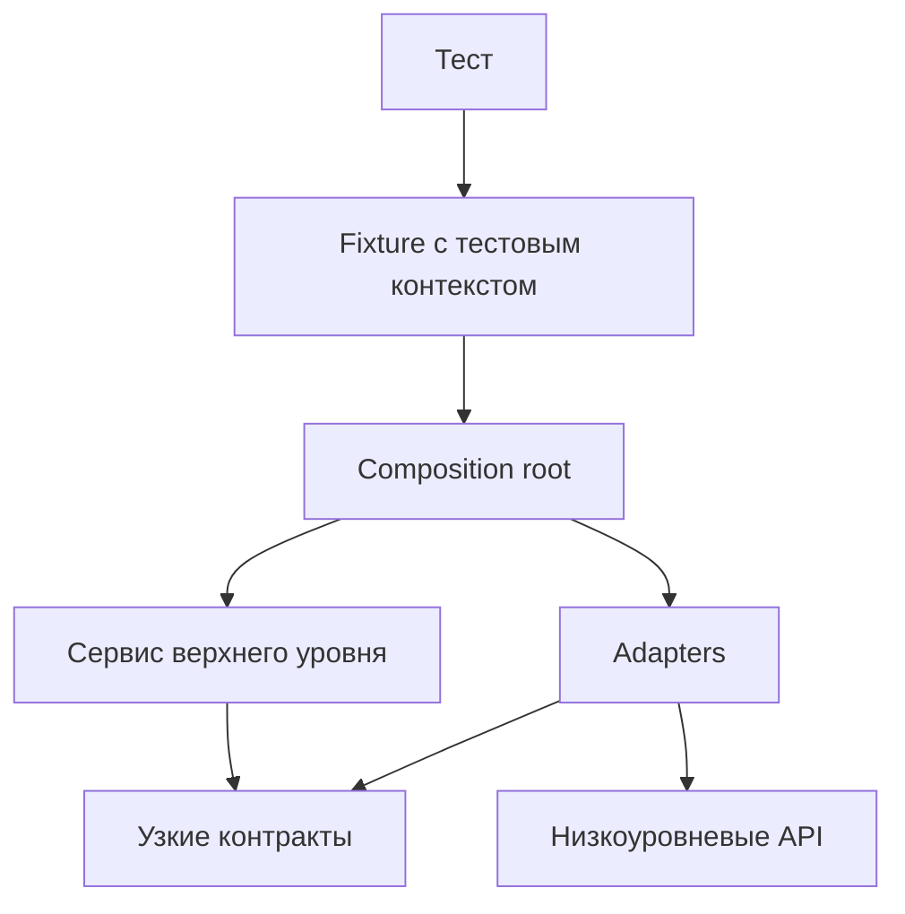

# Интеграция слоёв и dependency flow

## Связь с предыдущей главой

Глава 244 завершила эксплуатационный контур framework в CI. Теперь отдельные слои UI, API, gRPC, database и общей инфраструктуры нужно собрать так, чтобы каждый сохранил свою ответственность.

## Цель главы

Определить владельцев слоёв, разрешённое направление зависимостей и место, где реализации соединяются в рабочий тестовый контекст.

## Главный вопрос

> Как UI, API, gRPC, database и общая инфраструктура взаимодействуют без нарушения границ?

## Мотивация

Наличие Page Objects, clients и repositories ещё не создаёт архитектуру. Если низкоуровневый client импортирует fixture, а database helper знает о UI, изменение одного слоя распространяется по всему проекту и создаёт циклические зависимости.

## Теория

Каждый слой публикует узкий API своей ответственности. Тест описывает проверяемый сценарий. Сервис верхнего уровня координирует только необходимые операции. Adapters связывают требуемый сценарием контракт с конкретным transport. Composition root знает реализации и строит граф зависимостей, но сами реализации не знают о composition root.

В исходном коде зависимость направлена от потребителя к контракту, который ему нужен. Тест зависит от тестового контекста, fixture — от composition root, а сервис верхнего уровня и adapters — от узких контрактов. Низкоуровневый код не импортирует tests, fixtures или сценарии.

Направление вызова во время выполнения может отличаться от направления imports: тест вызывает adapter, а ответ возвращается обратно тесту. Это не меняет того, кто от кого зависит в исходном коде. Cross-layer test оправдан только тогда, когда проверяемое поведение действительно пересекает границы; обычную API-проверку не нужно искусственно проводить через UI и database.

Контракт описывает только требуемое поведение. Например, `get()` может сообщать об отсутствии ошибкой, а `find()` — возвращать `null`, если отсутствие является ожидаемым результатом. Adapter не должен превращать неожиданную инфраструктурную ошибку в `null`. `readonly` защищает контракт на этапе проверки типов, но неизменяемость во время выполнения требует отдельного механизма, например `Object.freeze()`.

## Внутренний механизм



Стрелки показывают зависимости исходного кода, а не последовательность runtime-вызовов. Composition root создаёт низкоуровневые adapters, передаёт их сервису и возвращает тесту только нужный контекст. Такое соединение делает зависимости видимыми и предотвращает обратные imports.

## Главная ментальная модель

Слои не ищут друг друга. Один корень композиции собирает граф сверху, а каждый узел получает только необходимые зависимости.

## Практический пример

```text
examples/03-automation-qa/chapter-245/01-layer-dependency-flow.integration.ts
```

Тест использует контракты API, gRPC и database из контекста, не создавая transports внутри сценария. Состояние локальных adapters принадлежит одному composition root: это учебная реализация границ, а не имитация production database.

```text
examples/03-automation-qa/support/integration/validate-dependency-graph.mjs
```

Validator проверяет только объявленный набор файлов: ожидаемые и лишние файлы, локальные imports, циклы и запрещённое направление. Он учитывает обычные, type-only, side-effect и dynamic imports, используемые модулем, но не доказывает корректность runtime-поведения или всей архитектуры. Проверка на основе регулярного выражения намеренно ограничена фактическим синтаксисом этого примера.

## Automation QA

UI Page Object отвечает за пользовательское взаимодействие, API и gRPC clients — за transports, repository — за факты из database, diagnostics — за доказательства. Тест решает, какие из них нужны конкретному сценарию, но не переносит их обязанности друг в друга. Assertions остаются в тесте, а diagnostic layer не управляет бизнес-сценарием.

## Компромиссы

Явная композиция добавляет несколько вызовов constructor и factory, зато граф зависимостей можно прочитать, а реализацию — заменить локальным fake. Не каждой зависимости нужен отдельный adapter: абстракция оправдана, когда защищает реальную инфраструктурную границу, а не когда только увеличивает число файлов.

## Распространённые ошибки

- Импортировать fixture из API client.
- Создавать глобальный изменяемый service container.
- Проверять каждый сценарий через все доступные слои.
- Делать diagnostics владельцем domain policy.
- Скрывать construction в service locator.

## Краткие итоги

- Слой владеет одной технической ответственностью.
- Composition root соединяет реализации в одном видимом месте.
- Направление зависимостей не допускает обратных imports.
- Cross-layer orchestration используется только для реального межслойного поведения.

## Практика

Практика встроена из соответствующего файла главы.

## Переход к следующей главе

Направление зависимостей определено. Глава 246 покажет, как проверенная конфигурация превращается в clients, pages и resources через composition fixtures.
