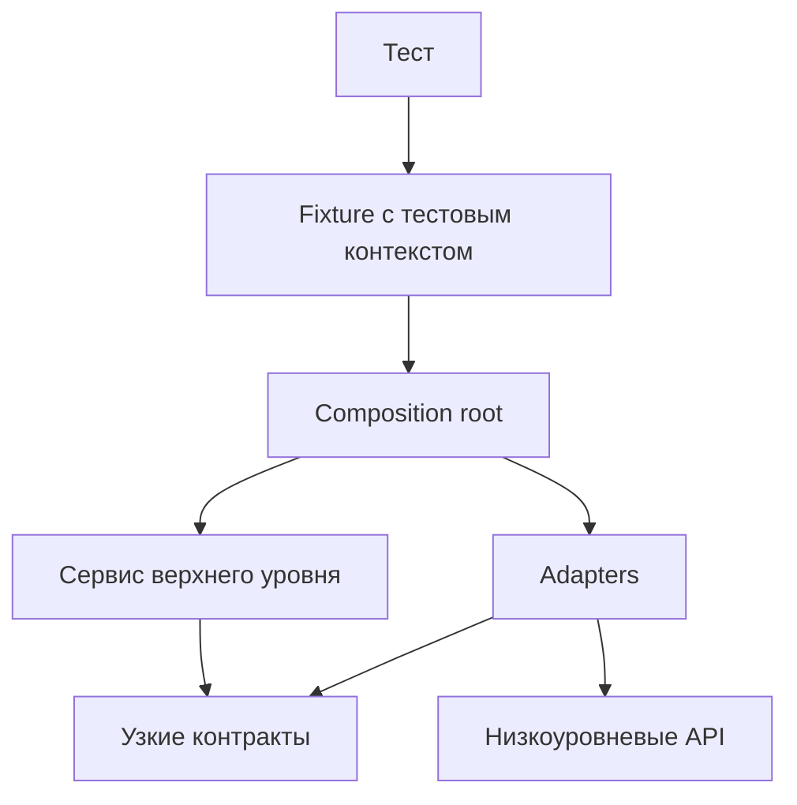

# Интеграция слоёв и dependency flow

## Связь с предыдущей главой

Глава 244 завершила эксплуатационный контур framework в CI. Теперь отдельные слои UI, API, gRPC, database и общей инфраструктуры нужно собрать так, чтобы каждый сохранил свою ответственность.

## Цель главы

Определить владельцев слоёв, разрешённое направление зависимостей и место, где реализации соединяются в рабочий тестовый контекст.

## Главный вопрос

> Как UI, API, gRPC, database и общая инфраструктура взаимодействуют без нарушения границ?

## Мотивация

Наличие Page Objects, clients и repositories ещё не создаёт архитектуру. Если низкоуровневый client импортирует fixture, а database helper знает о UI, изменение одного слоя распространяется по всему проекту и создаёт циклические зависимости.

## Теория

### Каждый слой публикует узкий API

Каждый слой публикует узкий API своей ответственности:

| Слой | За что отвечает |
| --- | --- |
| тест | описывает проверяемый сценарий |
| сервис верхнего уровня | координирует только необходимые операции |
| adapters | связывают требуемый контракт с конкретным transport |
| composition root | знает реализации и строит граф зависимостей |

Сами реализации при этом не знают о composition root — знание идёт только в одну сторону. Слои не ищут друг друга: один корень композиции собирает граф сверху, а каждый узел получает только необходимые зависимости.



### Зависимость идёт от потребителя к контракту

В исходном коде зависимость направлена от потребителя к контракту, который ему нужен. Тест зависит от тестового контекста, fixture — от composition root, а сервис верхнего уровня и adapters — от узких контрактов.

Обратное направление запрещено: низкоуровневый код не импортирует tests, fixtures или сценарии. Обратный import — самый заметный сигнал нарушенной архитектуры, и его можно обнаружить механически: в этом модуле граф проверяет отдельный валидатор, который ищет лишние файлы, локальные imports, циклы и запрещённое направление.

Стоит помнить и о границах такой проверки: валидатор разбирает синтаксис конкретного примера и не доказывает корректность runtime-поведения или архитектуры в целом.

### Imports и вызовы — разные направления

Направление вызова во время выполнения может отличаться от направления imports: тест вызывает adapter, а ответ возвращается обратно тесту. Это не меняет того, кто от кого зависит в исходном коде.

Различие практическое. На диаграмме стрелки показывают зависимости исходного кода, а не последовательность runtime-вызовов. Попытка читать такую схему как схему вызовов приводит к выводу «раз ответ идёт наверх, значит adapter зависит от теста» — и к обратному import, который ломает возможность заменить реализацию.

### Контракт описывает поведение, а не удобство

Контракт описывает только требуемое поведение. Разница видна на паре методов:

- `get()` может сообщать об отсутствии ошибкой — когда отсутствие является нарушением ожидания;
- `find()` возвращает `null`, если отсутствие является ожидаемым результатом.

Оба варианта законны, но выбирается тот, который соответствует смыслу операции, а не тот, который короче в вызывающем коде.

Жёсткое ограничение одно: adapter не должен превращать неожиданную инфраструктурную ошибку в `null`. Иначе недоступная база и «записи нет» становятся неразличимы — та же ошибка, что глушение `ServiceError` в главе 200 и безликий `boolean` в главе 210.

### Неизменяемость контракта на двух уровнях

`readonly` защищает контракт на этапе проверки типов, но неизменяемость во время выполнения требует отдельного механизма, например `Object.freeze()`.

Это повторение правила из главы 218, и здесь оно важно для общих объектов контекста: контекст, который один тест «слегка поправил», влияет на всех потребителей, а `readonly` этого не остановит.

### Композиция в тестовом фреймворке

UI Page Object отвечает за пользовательское взаимодействие, API и gRPC clients — за transports, repository — за факты из database, diagnostics — за доказательства.

Тест решает, какие из них нужны конкретному сценарию, но не переносит их обязанности друг в друга. Два правила, которые нарушаются чаще всего: assertions остаются в тесте, а diagnostic layer не управляет бизнес-сценарием.

Composition root создаёт низкоуровневые adapters, передаёт их сервису и возвращает тесту только нужный контекст. Такое соединение делает зависимости видимыми и предотвращает обратные imports.

### Когда межслойный тест оправдан

Cross-layer test оправдан только тогда, когда проверяемое поведение действительно пересекает границы; обычную API-проверку не нужно искусственно проводить через UI и database.

Признак искусственности простой: если удаление одного из слоёв из сценария не меняет того, что проверяется, этот слой в тесте лишний.

Явная композиция добавляет несколько вызовов constructor и factory, зато граф зависимостей можно прочитать, а реализацию — заменить локальным fake. Не каждой зависимости нужен отдельный adapter: абстракция оправдана, когда защищает реальную инфраструктурную границу, а не когда только увеличивает число файлов.

## Внутренний механизм


Стрелки показывают зависимости исходного кода, а не последовательность runtime-вызовов. Composition root создаёт низкоуровневые adapters, передаёт их сервису и возвращает тесту только нужный контекст. Такое соединение делает зависимости видимыми и предотвращает обратные imports.

## Главная ментальная модель

Слои не ищут друг друга. Один корень композиции собирает граф сверху, а каждый узел получает только необходимые зависимости.

## Практический пример

```text
examples/03-automation-qa/chapter-245/01-layer-dependency-flow.integration.ts
```

Тест использует контракты API, gRPC и database из контекста, не создавая transports внутри сценария. Состояние локальных adapters принадлежит одному composition root: это учебная реализация границ, а не имитация production database.

```text
examples/03-automation-qa/support/integration/validate-dependency-graph.mjs
```

Validator проверяет только объявленный набор файлов: ожидаемые и лишние файлы, локальные imports, циклы и запрещённое направление. Он учитывает обычные, type-only, side-effect и dynamic imports, используемые модулем, но не доказывает корректность runtime-поведения или всей архитектуры. Проверка на основе регулярного выражения намеренно ограничена фактическим синтаксисом этого примера.

## Automation QA

UI Page Object отвечает за пользовательское взаимодействие, API и gRPC clients — за transports, repository — за факты из database, diagnostics — за доказательства. Тест решает, какие из них нужны конкретному сценарию, но не переносит их обязанности друг в друга. Assertions остаются в тесте, а diagnostic layer не управляет бизнес-сценарием.

## Компромиссы

Явная композиция добавляет несколько вызовов constructor и factory, зато граф зависимостей можно прочитать, а реализацию — заменить локальным fake. Не каждой зависимости нужен отдельный adapter: абстракция оправдана, когда защищает реальную инфраструктурную границу, а не когда только увеличивает число файлов.

## Распространённые мифы

**Миф: стрелки на схеме слоёв показывают вызовы.**
Они показывают зависимости исходного кода. Ответ возвращается наверх, но зависимость от этого не меняется.

**Миф: adapter может вернуть `null` при любой неудаче.**
Тогда недоступная инфраструктура и отсутствие записи становятся неразличимы.

**Миф: `readonly` защищает общий контекст во время выполнения.**
Он действует при компиляции. Неизменяемость требует `Object.freeze()`.

**Миф: чем больше adapters, тем лучше архитектура.**
Абстракция оправдана реальной инфраструктурной границей, а не числом файлов.

**Миф: межслойный тест надёжнее обычного.**
Он дороже и хуже локализуется. Лишний слой в сценарии, ничего не меняющий в проверке, — признак искусственности.

## Частые вопросы

**Как понять, что направление зависимостей нарушено?**
По обратным imports: низкоуровневый код не должен знать о тестах и фикстурах. Это проверяется механически.

**Когда `get()`, а когда `find()`?**
`get()` — если отсутствие нарушает ожидание; `find()` — если отсутствие нормальный результат.

**Кто создаёт транспорты?**
Composition root. Тест получает готовый контекст и не создаёт clients внутри сценария.

**Где должны быть проверки?**
В тесте. Adapters и diagnostics сообщают факты, но не решают исход сценария.

**Как проверить, что слой в тесте нужен?**
Убрать его мысленно: если проверяемое утверждение не изменилось, слой лишний.

## Проверьте себя

1. Почему направление imports может не совпадать с направлением вызовов?
2. Что запрещено импортировать низкоуровневому коду и как это обнаружить?
3. Чем `get()` отличается от `find()` по контракту?
4. Почему adapter не должен превращать инфраструктурную ошибку в `null`?
5. Как отличить оправданный межслойный тест от искусственного?

## Распространённые ошибки

- Импортировать fixture из API client.
- Создавать глобальный изменяемый service container.
- Проверять каждый сценарий через все доступные слои.
- Делать diagnostics владельцем domain policy.
- Скрывать construction в service locator.

## Краткие итоги

- Слой владеет одной технической ответственностью.
- Composition root соединяет реализации в одном видимом месте.
- Направление зависимостей не допускает обратных imports.
- Cross-layer orchestration используется только для реального межслойного поведения.

## Практика

Практика встроена из соответствующего файла главы.

## Переход к следующей главе

Направление зависимостей определено. Глава 246 покажет, как проверенная конфигурация превращается в clients, pages и resources через composition fixtures.
