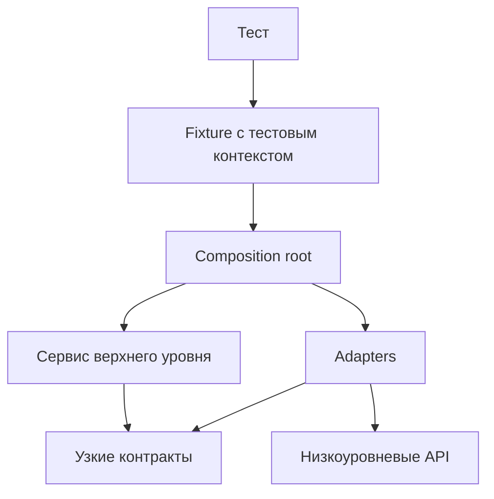

# Интеграция слоёв и поток зависимостей

## Связь с предыдущей главой

Глава 244 завершила эксплуатационный контур framework в CI. Теперь отдельные слои UI, API, gRPC, database и общей инфраструктуры нужно собрать так, чтобы каждый сохранил свою ответственность.

## Цель главы

Определить владельцев слоёв, разрешённое направление зависимостей и место, где реализации соединяются в рабочий тестовый контекст.

## Главный вопрос

> Как интерфейс, API, gRPC, база данных и общая инфраструктура взаимодействуют без нарушения границ?

## Мотивация

Наличие Page Objects, clients и repositories ещё не создаёт архитектуру. Если низкоуровневый client импортирует fixture, а database helper знает о UI, изменение одного слоя распространяется по всему проекту и создаёт циклические зависимости.

## Теория

### Каждый слой публикует узкий API

Каждый слой публикует узкий API своей ответственности:

| Слой | За что отвечает |
| --- | --- |
| тест | описывает проверяемый сценарий |
| сервис верхнего уровня | координирует только необходимые операции |
| адаптеры | связывают требуемый контракт с конкретным транспортом |
| Composition Root | знает реализации и строит граф зависимостей |

Сами реализации при этом не знают о Composition Root — знание идёт только в одну сторону. Слои не ищут друг друга: один корень композиции собирает граф сверху, а каждый узел получает только необходимые зависимости.


```mermaid
flowchart TD
    T[Тест] --> F[Fixture с тестовым контекстом]
    F --> R[Composition root]
    R --> S[Сервис верхнего уровня]
    R --> A[Adapters]
    S --> C[Узкие контракты]
    A --> C
    A --> I[Низкоуровневые API]
```

### Зависимость идёт от потребителя к контракту

В исходном коде зависимость направлена от потребителя к контракту, который ему нужен. Тест зависит от тестового контекста, фикстура — от Composition Root, а сервис верхнего уровня и адаптеры — от узких контрактов.

Обратное направление запрещено: низкоуровневый код не импортирует тесты, фикстуры или сценарии. Обратный импорт — самый заметный сигнал нарушенной архитектуры, и его можно обнаружить механически: в этом модуле граф проверяет отдельный проверяющий модуль, который ищет лишние файлы, локальные импорты, циклы и запрещённое направление.

Стоит помнить и о границах такой проверки: проверяющий модуль разбирает синтаксис конкретного примера и не доказывает корректность поведения во время выполнения или архитектуры в целом.

### Импорты и вызовы — разные направления

Направление вызова во время выполнения может отличаться от направления импортов: тест вызывает адаптер, а ответ возвращается обратно тесту. Это не меняет того, кто от кого зависит в исходном коде.

Различие практическое. На диаграмме стрелки показывают зависимости исходного кода, а не последовательность вызовов во время выполнения. Попытка читать такую схему как схему вызовов приводит к выводу «раз ответ идёт наверх, значит адаптер зависит от теста» — и к обратному импорту, который ломает возможность заменить реализацию.

### Контракт описывает поведение, а не удобство

Контракт описывает только требуемое поведение. Разница видна на паре методов:

- `get()` может сообщать об отсутствии ошибкой — когда отсутствие является нарушением ожидания;
- `find()` возвращает `null`, если отсутствие является ожидаемым результатом.

Оба варианта законны, но выбирается тот, который соответствует смыслу операции, а не тот, который короче в вызывающем коде.

Жёсткое ограничение одно: адаптер не должен превращать неожиданную инфраструктурную ошибку в `null`. Иначе недоступная база и «записи нет» становятся неразличимы — та же ошибка, что глушение `ServiceError` в главе 200 и безликое логическое значение в главе 210.

### Неизменяемость контракта на двух уровнях

`readonly` защищает контракт на этапе проверки типов, но неизменяемость во время выполнения требует отдельного механизма, например `Object.freeze()`.

Это повторение правила из главы 218, и здесь оно важно для общих объектов контекста: контекст, который один тест «слегка поправил», влияет на всех потребителей, а `readonly` этого не остановит.

### Композиция в тестовом фреймворке

Объект страницы отвечает за пользовательское взаимодействие, клиенты API и gRPC — за транспорт, репозиторий — за факты из базы данных, диагностика — за доказательства.

Тест решает, какие из них нужны конкретному сценарию, но не переносит их обязанности друг в друга. Два правила, которые нарушаются чаще всего: проверки остаются в тесте, а слой диагностики не управляет бизнес-сценарием.

Composition Root создаёт низкоуровневые адаптеры, передаёт их сервису и возвращает тесту только нужный контекст. Такое соединение делает зависимости видимыми и предотвращает обратные импорты.

### Когда межслойный тест оправдан

Межслойный тест оправдан только тогда, когда проверяемое поведение действительно пересекает границы; обычную проверку API не нужно искусственно проводить через интерфейс и базу данных.

Признак искусственности простой: если удаление одного из слоёв из сценария не меняет того, что проверяется, этот слой в тесте лишний.

Явная композиция добавляет несколько вызовов конструктора и фабрики, зато граф зависимостей можно прочитать, а реализацию — заменить локальной заглушкой. Не каждой зависимости нужен отдельный адаптер: абстракция оправдана, когда защищает реальную инфраструктурную границу, а не когда только увеличивает число файлов.

## Внутренний механизм


```mermaid
flowchart TD
    T[Тест] --> F[Fixture с тестовым контекстом]
    F --> R[Composition root]
    R --> S[Сервис верхнего уровня]
    R --> A[Adapters]
    S --> C[Узкие контракты]
    A --> C
    A --> I[Низкоуровневые API]
```

Стрелки показывают зависимости исходного кода, а не последовательность вызовов во время выполнения. Composition Root создаёт низкоуровневые адаптеры, передаёт их сервису и возвращает тесту только нужный контекст. Такое соединение делает зависимости видимыми и предотвращает обратные импорты.

### Направление зависимостей и направление вызовов не совпадают

```text
зависимости (импорты):   тест → фикстура → Composition Root → сервис → адаптер
вызовы (во время работы): тест → сервис → адаптер → низкоуровневый API
```

Стрелки на схеме показывают первое. Composition Root существует затем, чтобы
сервис не знал, как создаются его адаптеры: он получает готовые контракты и не
импортирует ни конфигурацию, ни клиентов.

Именно это правило нарушает импорт фикстуры из клиента API — зависимость идёт
вверх, инфраструктура начинает зависеть от раннера, и клиент перестаёт работать
вне тестов.

### Что даёт направленность при расследовании

```text
упал тест
  → какие фикстуры он запросил
    → что каждая подготовила
      → какой сервис получил
        → какой адаптер обратился наружу
```

Цепочка конечна и не имеет циклов, поэтому вопрос «кто владеет этим состоянием»
всегда имеет один ответ. Цикл — в графе фикстур или в импортах модулей — ломает
ровно это свойство.

| Приём | Видны ли зависимости |
| --- | --- |
| фикстуры и Composition Root | да, в сигнатурах |
| Service Locator | нет, обнаруживаются на запуске |
| глобальный изменяемый контейнер | нет, и зависят от порядка тестов |

## Главная ментальная модель

Слои не ищут друг друга. Один корень композиции собирает граф сверху, а каждый узел получает только необходимые зависимости.

## Практический пример

```text
examples/03-automation-qa/chapter-245/01-layer-dependency-flow.integration.ts
```

Тест использует контракты API, gRPC и базы данных из контекста, не создавая транспорт внутри сценария. Состояние локальных адаптеров принадлежит одному Composition Root: это учебная реализация границ, а не имитация промышленной базы данных.

```text
examples/03-automation-qa/support/integration/validate-dependency-graph.mjs
```

Проверяющий модуль контролирует только объявленный набор файлов: ожидаемые и лишние файлы, локальные импорты, циклы и запрещённое направление. Он учитывает обычные импорты, импорты только типов, импорты ради побочного эффекта и динамические импорты, используемые модулем, но не доказывает корректность поведения во время выполнения или всей архитектуры. Проверка на основе регулярного выражения намеренно ограничена фактическим синтаксисом этого примера.

## Automation QA

Объект страницы отвечает за пользовательское взаимодействие, клиенты API и gRPC — за транспорт, репозиторий — за факты из базы данных, диагностика — за доказательства. Тест решает, какие из них нужны конкретному сценарию, но не переносит их обязанности друг в друга. Проверки остаются в тесте, а слой диагностики не управляет бизнес-сценарием.

## Компромиссы

Явная композиция добавляет несколько вызовов конструктора и фабрики, зато граф зависимостей можно прочитать, а реализацию — заменить локальной заглушкой. Не каждой зависимости нужен отдельный адаптер: абстракция оправдана, когда защищает реальную инфраструктурную границу, а не когда только увеличивает число файлов.

## Распространённые мифы

**Миф: стрелки на схеме слоёв показывают вызовы.**
Они показывают зависимости исходного кода. Ответ возвращается наверх, но зависимость от этого не меняется.

**Миф: адаптер может вернуть `null` при любой неудаче.**
Тогда недоступная инфраструктура и отсутствие записи становятся неразличимы.

**Миф: `readonly` защищает общий контекст во время выполнения.**
Он действует при компиляции. Неизменяемость требует `Object.freeze()`.

**Миф: чем больше адаптеров, тем лучше архитектура.**
Абстракция оправдана реальной инфраструктурной границей, а не числом файлов.

**Миф: межслойный тест надёжнее обычного.**
Он дороже и хуже локализуется. Лишний слой в сценарии, ничего не меняющий в проверке, — признак искусственности.

## Частые вопросы

**Как понять, что направление зависимостей нарушено?**
По обратным импортам: низкоуровневый код не должен знать о тестах и фикстурах. Это проверяется механически.

**Когда `get()`, а когда `find()`?**
`get()` — если отсутствие нарушает ожидание; `find()` — если отсутствие нормальный результат.

**Кто создаёт транспорты?**
Composition Root. Тест получает готовый контекст и не создаёт клиентов внутри сценария.

**Где должны быть проверки?**
В тесте. Адаптеры и диагностика сообщают факты, но не решают исход сценария.

**Как проверить, что слой в тесте нужен?**
Убрать его мысленно: если проверяемое утверждение не изменилось, слой лишний.

## Проверьте себя

1. Почему направление импортов может не совпадать с направлением вызовов?
2. Что запрещено импортировать низкоуровневому коду и как это обнаружить?
3. Чем `get()` отличается от `find()` по контракту?
4. Почему адаптер не должен превращать инфраструктурную ошибку в `null`?
5. Как отличить оправданный межслойный тест от искусственного?

### Ответы

1. Вызов может идти вниз через переданную зависимость, объявленную выше: интерфейс принадлежит верхнему слою, а реализация — нижнему. Импорт при этом направлен от реализации к интерфейсу.
2. Импортировать код теста, страницы и фикстуры. Обнаруживается правилом линтера о запрещённых путях импорта или проверкой графа зависимостей.
3. `get()` обещает вернуть сущность и считает её отсутствие ошибкой. `find()` допускает отсутствие и возвращает пустой результат.
4. Тест перестаёт отличать «данных нет» от «обращение не удалось». Первое — нормальный результат, второе — сбой, и реагировать на них нужно по-разному.
5. Оправданный проверяет согласованность, которую не видит ни один слой по отдельности: что созданное через API видно в интерфейсе и записано в базе. Искусственный просто повторяет проверку одного слоя средствами другого.

## Распространённые ошибки

- Импортировать фикстуру из клиента API — зависимость начинает идти вверх, от инфраструктуры к раннеру. Клиент перестаёт работать вне тестов, а граф импортов замыкается.

- Создавать глобальный изменяемый контейнер зависимостей — состояние становится общим для процесса, и результат теста начинает зависеть от порядка запуска.

- Проверять каждый сценарий через все доступные слои — прогон растёт, а ценность нет: одно поведение проверяется трижды. Слой выбирают по тому, что именно утверждается.

- Делать диагностику владельцем правил предметной области — журналы и вложения описывают ход прогона, а решения о данных принимают слои. Иначе отключение диагностики меняет поведение тестов.

- Скрывать сборку зависимостей за Service Locator — по коду теста больше нельзя понять, что ему нужно, а забытая зависимость обнаруживается только на запуске. Фикстуры делают граф явным.

## Краткие итоги

- Слой владеет одной технической ответственностью.
- Composition Root соединяет реализации в одном видимом месте.
- Направление зависимостей не допускает обратных импортов.
- Межслойное управление используется только для реального межслойного поведения.

## Практика

Практика встроена из соответствующего файла главы.

## Переход к следующей главе

Направление зависимостей определено. Глава 246 покажет, как проверенная конфигурация превращается в клиентов, объекты страниц и ресурсы через фикстуры композиции.
