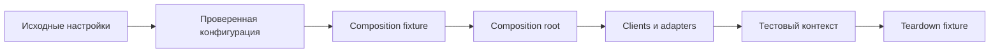

# Composition fixtures и configuration flow

## Связь с предыдущей главой

Глава 245 определила направление зависимостей. Теперь граф нужно создавать для конкретного запуска и корректно завершать в соответствии с областями жизни ресурсов.

## Цель главы

Построить тестовый контекст из проверенной конфигурации через явный граф fixtures и назначить каждому ресурсу область жизни и владельца cleanup.

## Главный вопрос

> Как configuration превращается в управляемые clients, pages и test resources?

## Мотивация

Если каждый helper самостоятельно читает `process.env`, проект получает разные значения по умолчанию, поздние ошибки и невозможность детерминированной подмены. Если один глобальный client разделяется всеми tests, изменяемое состояние начинает пересекать workers.

## Теория

Исходные значения environment читаются один раз на границе конфигурации. Loader отклоняет отсутствующие, пустые и состоящие только из пробелов обязательные значения, а также проверяет URL, enum и положительное целое число. Результатом становится проверенная неизменяемая конфигурация; secret остаётся значением с ограниченной областью использования и не попадает в logs или attachments. Composition fixture получает config и строит clients через composition root.

Test-scoped fixture подходит для изменяемого контекста и ресурсов, принадлежащих тесту. Worker-scoped fixture допустим для дорогого ресурса, который безопасно разделять внутри одного worker, но не должен хранить состояние отдельного теста. Option fixture передаёт входные настройки и сам не владеет lifecycle ресурса. Выбор scope определяется владением и изоляцией, а не только стоимостью setup.

## Внутренний механизм



Playwright разрешает fixtures по графу зависимостей, а не по визуальному порядку полей. `use()` отделяет setup от teardown; teardown выполняется и после успешного теста, и после его падения. Ошибка setup возникает до передачи контекста тесту и отличается от ошибки внутри теста.

Если тест упал, а teardown завершился успешно, исходная assertion error должна остаться неизменной. Если cleanup тоже упал, обе ошибки можно сохранить в `AggregateError`, поместив исходную ошибку первой. Для различения отсутствия ошибки и редкого `throw undefined` нужен отдельный признак, а не проверка `error !== undefined`.

## Главная ментальная модель

Config описывает запуск, composition root строит зависимости, а fixture ограничивает их область жизни и гарантирует teardown.

## Практический пример

```text
examples/03-automation-qa/chapter-246/01-composition-fixture.integration.ts
```

Option fixture передаёт исходные значения, frozen loader создаёт неизменяемый config, а test-scoped fixture строит контекст framework. Secret не прикладывается к report и не печатается.

## Automation QA

Разные Playwright projects могут передать настройки local или preview, сохранив один порядок сборки зависимостей. Browser `page` остаётся built-in fixture, а API, gRPC и repository adapters получают только необходимые проверенные значения.

## Компромиссы

Test scope обеспечивает лучшую изоляцию, но чаще создаёт clients. Worker scope экономит setup, однако требует проверки безопасного совместного использования, очистки и отсутствия изменяемого состояния, принадлежащего тесту.

## Распространённые ошибки

- Читать `process.env` внутри каждого client.
- Передавать весь environment object всем слоям.
- Делать изменяемые test data worker-scoped.
- Выполнять network request при импорте модуля.
- Терять initialization failure в fallback defaults.

## Краткие итоги

- Config проверяется один раз на явной границе.
- Composition fixture делает сборку зависимостей и scope видимыми.
- Test и worker scope выбираются по владению состоянием.
- Teardown является частью fixture contract.

## Практика

Практика встроена из соответствующего файла главы.

## Переход к следующей главе

Контекст собран. Глава 247 проследит одну test entity от создания до безопасного cleanup через несколько слоёв.
