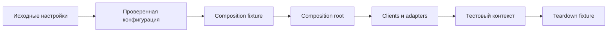

# Composition fixtures и configuration flow

## Связь с предыдущей главой

Глава 245 определила направление зависимостей. Теперь граф нужно создавать для конкретного запуска и корректно завершать в соответствии с областями жизни ресурсов.

## Цель главы

Построить тестовый контекст из проверенной конфигурации через явный граф fixtures и назначить каждому ресурсу область жизни и владельца cleanup.

## Главный вопрос

> Как configuration превращается в управляемые clients, pages и test resources?

## Мотивация

Если каждый helper самостоятельно читает `process.env`, проект получает разные значения по умолчанию, поздние ошибки и невозможность детерминированной подмены. Если один глобальный client разделяется всеми tests, изменяемое состояние начинает пересекать workers.

## Теория

### Поток от настроек к контексту

Config описывает запуск, composition root строит зависимости, а fixture ограничивает их область жизни и гарантирует teardown.



Исходные значения environment читаются один раз на границе конфигурации. Loader отклоняет отсутствующие, пустые и состоящие только из пробелов обязательные значения, а также проверяет URL, enum и положительное целое число.

Результатом становится проверенная неизменяемая конфигурация. Secret остаётся значением с ограниченной областью использования и не попадает в logs или attachments — то же правило, что в главах 217 и 243.

### Фикстуры разрешаются по графу, а не по порядку

Playwright разрешает fixtures по графу зависимостей, а не по визуальному порядку полей.

Проверено на фикстурах, объявленных в обратном порядке — зависимая выше своей зависимости:

```text
setup конфиг → setup клиент → setup контекст
        тело теста
teardown контекст → teardown клиент → teardown конфиг
```

Порядок setup определился зависимостями, а teardown прошёл в обратном направлении — как и стек очистки из главы 221. Переставлять объявления ради «правильного порядка» не нужно и бесполезно.

### `use()` разделяет setup и teardown

`use()` отделяет setup от teardown; teardown выполняется и после успешного теста, и после его падения.

Проверено: упавшее тело теста не помешало пройти всем трём teardown по цепочке. Это и делает fixture надёжным местом для освобождения ресурсов — в отличие от последней строки тела теста.

Ошибка setup возникает до передачи контекста тесту и отличается от ошибки внутри теста. Проверено отдельно: при падении фикстуры тело теста не выполняется вовсе — ни одной строки. Для расследования это важный признак: если в журнале нет ни одного события сценария, искать нужно в подготовке.

### Выбор scope определяется владением

| Scope | Для чего | Ограничение |
| --- | --- | --- |
| test-scoped | изменяемый контекст и ресурсы теста | создаётся чаще |
| worker-scoped | дорогой ресурс, безопасный для совместного использования | не хранит состояние отдельного теста |
| option | входные настройки | не владеет lifecycle ресурса |

Выбор scope определяется владением и изоляцией, а не только стоимостью setup. Test scope обеспечивает лучшую изоляцию, но чаще создаёт clients. Worker scope экономит setup, однако требует проверки безопасного совместного использования, очистки и отсутствия изменяемого состояния, принадлежащего тесту.

Практический признак ошибки: если worker-scoped ресурс хранит идентификатор созданной тестом сущности — scope выбран неверно.

### Сохранение ошибок при падении teardown

Если тест упал, а teardown завершился успешно, исходная assertion error должна остаться неизменной.

Если cleanup тоже упал, обе ошибки можно сохранить в `AggregateError`, поместив исходную ошибку первой. Порядок сохраняется: в поле `errors` первая позиция остаётся за ошибкой сценария, и отчёт показывает именно её как причину падения.

Отдельная тонкость: для различения отсутствия ошибки и редкого `throw undefined` нужен отдельный признак, а не проверка `error !== undefined`. Проверено — оба случая дают `undefined`, и различить их можно только флагом «исключение было».

### Один порядок сборки для разных запусков

Разные Playwright projects могут передать настройки local или preview, сохранив один порядок сборки зависимостей.

Это и есть практическая польза схемы: меняются входные значения, а граф остаётся тем же. Browser `page` остаётся built-in fixture, а API, gRPC и repository adapters получают только необходимые проверенные значения — каждый ровно то, что ему нужно, и ничего сверх.

## Внутренний механизм


Playwright разрешает fixtures по графу зависимостей, а не по визуальному порядку полей. `use()` отделяет setup от teardown; teardown выполняется и после успешного теста, и после его падения. Ошибка setup возникает до передачи контекста тесту и отличается от ошибки внутри теста.

Если тест упал, а teardown завершился успешно, исходная assertion error должна остаться неизменной. Если cleanup тоже упал, обе ошибки можно сохранить в `AggregateError`, поместив исходную ошибку первой. Для различения отсутствия ошибки и редкого `throw undefined` нужен отдельный признак, а не проверка `error !== undefined`.

## Главная ментальная модель

Config описывает запуск, composition root строит зависимости, а fixture ограничивает их область жизни и гарантирует teardown.

## Практический пример

```text
examples/03-automation-qa/chapter-246/01-composition-fixture.integration.ts
```

Option fixture передаёт исходные значения, frozen loader создаёт неизменяемый config, а test-scoped fixture строит контекст framework. Secret не прикладывается к report и не печатается.

## Automation QA

Разные Playwright projects могут передать настройки local или preview, сохранив один порядок сборки зависимостей. Browser `page` остаётся built-in fixture, а API, gRPC и repository adapters получают только необходимые проверенные значения.

## Компромиссы

Test scope обеспечивает лучшую изоляцию, но чаще создаёт clients. Worker scope экономит setup, однако требует проверки безопасного совместного использования, очистки и отсутствия изменяемого состояния, принадлежащего тесту.

## Распространённые мифы

**Миф: фикстуры выполняются в порядке объявления.**
Порядок определяется графом зависимостей, а teardown идёт в обратном направлении.

**Миф: при падении теста teardown может не выполниться.**
Он выполняется и после успеха, и после падения — это его основное свойство.

**Миф: ошибка фикстуры — то же, что ошибка теста.**
При падении setup тело теста не выполняется вовсе: в журнале не будет ни одного события сценария.

**Миф: worker scope — просто более дешёвый вариант.**
Он требует безопасного совместного использования и запрещает хранить состояние отдельного теста.

**Миф: `error !== undefined` отличает наличие ошибки от её отсутствия.**
`throw undefined` даёт тот же результат. Нужен отдельный признак.

## Частые вопросы

**Нужно ли переставлять объявления фикстур?**
Нет. Порядок определяется зависимостями, а не расположением в коде.

**Как понять, что упала подготовка, а не сценарий?**
В журнале нет ни одного события тела теста: оно не выполнялось.

**Какой scope выбрать для клиента API?**
Test scope при изменяемом состоянии и необходимости изоляции; worker scope — для дорогого и безопасного к разделению ресурса.

**Где должна быть исходная ошибка при падении и теста, и очистки?**
Первой в `AggregateError`: именно она объясняет падение.

**Куда не должен попадать secret?**
В журналы и вложения. Он остаётся значением с ограниченной областью использования.

## Проверьте себя

1. В каком порядке выполняются setup и teardown цепочки фикстур?
2. Что происходит с телом теста при ошибке в setup фикстуры?
3. Чем определяется выбор scope и какой признак указывает на ошибку?
4. Какая ошибка должна быть первой в `AggregateError` и почему?
5. Почему `error !== undefined` не отличает отсутствие ошибки от `throw undefined`?

## Распространённые ошибки

- Читать `process.env` внутри каждого client.
- Передавать весь environment object всем слоям.
- Делать изменяемые test data worker-scoped.
- Выполнять network request при импорте модуля.
- Терять initialization failure в fallback defaults.

## Краткие итоги

- Config проверяется один раз на явной границе.
- Composition fixture делает сборку зависимостей и scope видимыми.
- Test и worker scope выбираются по владению состоянием.
- Teardown является частью fixture contract.

## Практика

Практика встроена из соответствующего файла главы.

## Переход к следующей главе

Контекст собран. Глава 247 проследит одну test entity от создания до безопасного cleanup через несколько слоёв.
