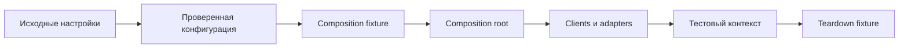

# Фикстуры композиции и поток конфигурации

## Связь с предыдущей главой

Глава 245 определила направление зависимостей. Теперь граф нужно создавать для конкретного запуска и корректно завершать в соответствии с областями жизни ресурсов.

## Цель главы

Построить тестовый контекст из проверенной конфигурации через явный граф fixtures и назначить каждому ресурсу область жизни и владельца cleanup.

## Главный вопрос

> Как конфигурация превращается в управляемые клиенты, объекты страниц и ресурсы теста?

## Мотивация

Если каждый helper самостоятельно читает `process.env`, проект получает разные значения по умолчанию, поздние ошибки и невозможность детерминированной подмены. Если один глобальный client разделяется всеми tests, изменяемое состояние начинает пересекать workers.

## Теория

### Поток от настроек к контексту

Конфигурация описывает запуск, Composition Root строит зависимости, а фикстура ограничивает их область жизни и гарантирует освобождение.


```mermaid
flowchart LR
    E[Исходные настройки] --> V[Проверенная конфигурация]
    V --> F[Composition fixture]
    F --> R[Composition root]
    R --> C[Clients и adapters]
    C --> T[Тестовый контекст]
    T --> X[Teardown fixture]
```

Исходные значения окружения читаются один раз на границе конфигурации. Загрузчик отклоняет отсутствующие, пустые и состоящие только из пробелов обязательные значения, а также проверяет адрес, перечисление и положительное целое число.

Результатом становится проверенная неизменяемая конфигурация. Секрет остаётся значением с ограниченной областью использования и не попадает в журналы или вложения — то же правило, что в главах 217 и 243.

### Фикстуры разрешаются по графу, а не по порядку

Playwright разрешает фикстуры по графу зависимостей, а не по визуальному порядку полей.

Проверено на фикстурах, объявленных в обратном порядке — зависимая выше своей зависимости:

```text
setup конфиг → setup клиент → setup контекст
        тело теста
teardown контекст → teardown клиент → teardown конфиг
```

Порядок подготовки определился зависимостями, а освобождение прошло в обратном направлении — как и стек очистки из главы 221. Переставлять объявления ради «правильного порядка» не нужно и бесполезно.

### `use()` разделяет подготовку и освобождение

`use()` отделяет подготовку от освобождения; освобождение выполняется и после успешного теста, и после его падения.

Проверено: упавшее тело теста не помешало пройти всем трём освобождениям по цепочке. Это и делает фикстуру надёжным местом для освобождения ресурсов — в отличие от последней строки тела теста.

Ошибка подготовки возникает до передачи контекста тесту и отличается от ошибки внутри теста. Проверено отдельно: при падении фикстуры тело теста не выполняется вовсе — ни одной строки. Для расследования это важный признак: если в журнале нет ни одного события сценария, искать нужно в подготовке.

### Выбор области определяется владением

| Область | Для чего | Ограничение |
| --- | --- | --- |
| в пределах теста | изменяемый контекст и ресурсы теста | создаётся чаще |
| в пределах рабочего процесса | дорогой ресурс, безопасный для совместного использования | не хранит состояние отдельного теста |
| параметр | входные настройки | не владеет жизненным циклом ресурса |

Выбор области определяется владением и изоляцией, а не только стоимостью подготовки. Область теста обеспечивает лучшую изоляцию, но чаще создаёт клиентов. Область рабочего процесса экономит подготовку, однако требует проверки безопасного совместного использования, очистки и отсутствия изменяемого состояния, принадлежащего тесту.

Практический признак ошибки: если ресурс области рабочего процесса хранит идентификатор созданной тестом сущности — область выбрана неверно.

### Сохранение ошибок при падении освобождения

Если тест упал, а освобождение завершилось успешно, исходная ошибка проверки должна остаться неизменной.

Если очистка тоже упала, обе ошибки можно сохранить в `AggregateError`, поместив исходную ошибку первой. Порядок сохраняется: в поле `errors` первая позиция остаётся за ошибкой сценария, и отчёт показывает именно её как причину падения.

Отдельная тонкость: для различения отсутствия ошибки и редкого `throw undefined` нужен отдельный признак, а не проверка `error !== undefined`. Проверено — оба случая дают `undefined`, и различить их можно только флагом «исключение было».

### Один порядок сборки для разных запусков

Разные проекты Playwright могут передать настройки локального или предварительного стенда, сохранив один порядок сборки зависимостей.

Это и есть практическая польза схемы: меняются входные значения, а граф остаётся тем же. Браузерная `page` остаётся встроенной фикстурой, а адаптеры API, gRPC и репозитория получают только необходимые проверенные значения — каждый ровно то, что ему нужно, и ничего сверх.

## Внутренний механизм


```mermaid
flowchart LR
    E[Исходные настройки] --> V[Проверенная конфигурация]
    V --> F[Composition fixture]
    F --> R[Composition root]
    R --> C[Clients и adapters]
    C --> T[Тестовый контекст]
    T --> X[Teardown fixture]
```

Playwright разрешает фикстуры по графу зависимостей, а не по визуальному порядку полей. `use()` отделяет подготовку от освобождения; освобождение выполняется и после успешного теста, и после его падения. Ошибка подготовки возникает до передачи контекста тесту и отличается от ошибки внутри теста.

Если тест упал, а освобождение завершилось успешно, исходная ошибка проверки должна остаться неизменной. Если очистка тоже упала, обе ошибки можно сохранить в `AggregateError`, поместив исходную ошибку первой. Для различения отсутствия ошибки и редкого `throw undefined` нужен отдельный признак, а не проверка `error !== undefined`.

## Главная ментальная модель

Конфигурация описывает запуск, Composition Root строит зависимости, а фикстура ограничивает их область жизни и гарантирует освобождение.

## Практический пример

```text
examples/03-automation-qa/chapter-246/01-composition-fixture.integration.ts
```

Фикстура-параметр передаёт исходные значения, замораживающий загрузчик создаёт неизменяемую конфигурацию, а фикстура в пределах теста строит контекст фреймворка. Секрет не прикладывается к отчёту и не печатается.

## Automation QA

Разные проекты Playwright могут передать настройки локального или предварительного стенда, сохранив один порядок сборки зависимостей. Браузерная `page` остаётся встроенной фикстурой, а адаптеры API, gRPC и репозитория получают только необходимые проверенные значения.

## Компромиссы

Область теста обеспечивает лучшую изоляцию, но чаще создаёт клиентов. Область рабочего процесса экономит подготовку, однако требует проверки безопасного совместного использования, очистки и отсутствия изменяемого состояния, принадлежащего тесту.

## Распространённые мифы

**Миф: фикстуры выполняются в порядке объявления.**
Порядок определяется графом зависимостей, а освобождение идёт в обратном направлении.

**Миф: при падении теста освобождение может не выполниться.**
Он выполняется и после успеха, и после падения — это его основное свойство.

**Миф: ошибка фикстуры — то же, что ошибка теста.**
При падении подготовки тело теста не выполняется вовсе: в журнале не будет ни одного события сценария.

**Миф: область рабочего процесса — просто более дешёвый вариант.**
Он требует безопасного совместного использования и запрещает хранить состояние отдельного теста.

**Миф: `error !== undefined` отличает наличие ошибки от её отсутствия.**
`throw undefined` даёт тот же результат. Нужен отдельный признак.

## Частые вопросы

**Нужно ли переставлять объявления фикстур?**
Нет. Порядок определяется зависимостями, а не расположением в коде.

**Как понять, что упала подготовка, а не сценарий?**
В журнале нет ни одного события тела теста: оно не выполнялось.

**Какую область выбрать для клиента API?**
Область теста при изменяемом состоянии и необходимости изоляции; область рабочего процесса — для дорогого и безопасного к разделению ресурса.

**Где должна быть исходная ошибка при падении и теста, и очистки?**
Первой в `AggregateError`: именно она объясняет падение.

**Куда не должен попадать секрет?**
В журналы и вложения. Он остаётся значением с ограниченной областью использования.

## Проверьте себя

1. В каком порядке выполняются подготовка и освобождение цепочки фикстур?
2. Что происходит с телом теста при ошибке в подготовке фикстуры?
3. Чем определяется выбор области и какой признак указывает на ошибку?
4. Какая ошибка должна быть первой в `AggregateError` и почему?
5. Почему `error !== undefined` не отличает отсутствие ошибки от `throw undefined`?

### Ответы

1. Подготовка — от зависимостей к зависимым, в порядке графа. Завершение — в обратном порядке.
2. Тело теста не выполняется, тест помечается упавшим. Завершение уже созданных фикстур при этом выполняется.
3. Выбор определяется тем, чем владеет фикстура: данные теста — область теста, дорогие общие соединения — область процесса. Ошибку выдаёт состояние конкретного теста, оказавшееся в области процесса.
4. Исходная ошибка сценария: остальные — ошибки завершения, и они вторичны. Иначе настоящая причина теряется среди сообщений очистки.
5. Значение `undefined` можно бросить: тогда ошибка была, а проверка её не заметит. Различают это отдельным флагом или конструкцией с `try/catch`.

## Распространённые ошибки

- Читать `process.env` внутри каждого клиента — окружение расползается по коду, и проверить конфигурацию одним местом становится нельзя. Значения читают один раз, на границе.

- Передавать весь объект окружения всем слоям — каждый слой получает доступ ко всему, включая секреты, которые ему не нужны. Передают ровно те значения, которые слой использует.

- Делать изменяемые тестовые данные принадлежащими рабочему процессу — фикстура процесса создаётся один раз, поэтому данные делят все тесты процесса и порядок запуска начинает влиять на результат.

- Выполнять сетевой запрос при импорте модуля — импорт выполняется при загрузке файла, до всякой изоляции, и падение выглядит как ошибка сборки, а не как проблема стенда.

- Терять ошибку инициализации в запасных значениях по умолчанию — неверная конфигурация молча заменяется на локальный адрес, и тесты проходят не на том окружении.

## Краткие итоги

- Конфигурация проверяется один раз на явной границе.
- Фикстура композиции делает сборку зависимостей и область видимыми.
- Область теста и область рабочего процесса выбираются по владению состоянием.
- Освобождение является частью контракта фикстуры.

## Практика

Практика встроена из соответствующего файла главы.

## Переход к следующей главе

Контекст собран. Глава 247 проследит одну тестовую сущность от создания до безопасной очистки через несколько слоёв.
